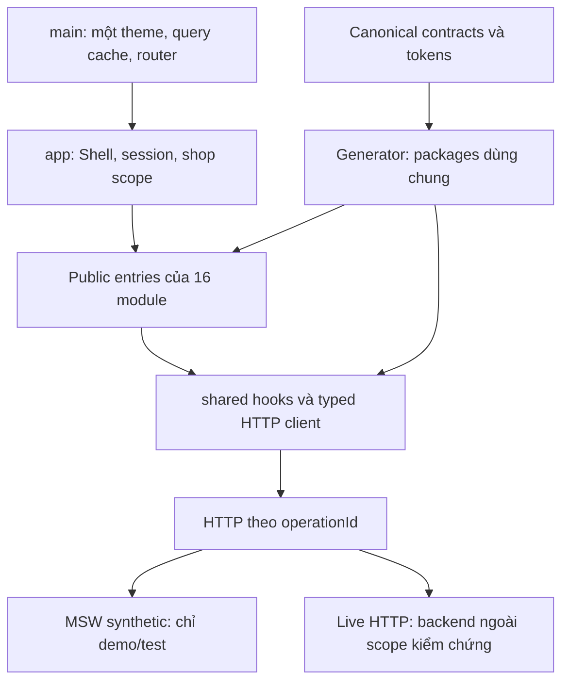

# Đánh giá kiến trúc React Frontend bằng bằng chứng — 02/10/2026

## 1. Kết luận và con số có thể kiểm lại

**Tỷ lệ gate Frontend đã đủ bằng chứng đạt: 6/9 = 66,7%. Chưa đủ điều kiện đề nghị Production-Ready / Enterprise-Grade Frontend theo quy tắc của chính dự án.**

Con số này có nghĩa cụ thể: trong 9 gate FE-G01–FE-G09 áp dụng, 6 gate có evidence đạt trong phạm vi đã định nghĩa; FE-G04 còn lỗi chức năng đã tái hiện, FE-G05 thiếu kiểm thủ công, FE-G09 thiếu owner acceptance. Không chấm điểm cảm tính từng thư mục hoặc gán điểm một phần cho gate chưa đóng.

Đây là **tỷ lệ gate được kiểm chứng**, không phải “66,7% code đã viết”, “66,7% mọi hành vi đều đúng” hoặc thang chứng nhận React phổ quát. Kit không định nghĩa trọng số phần trăm riêng cho 9 gate; phép đếm trong audit dùng mỗi gate một đơn vị, công khai tử số/mẫu số. Điều kiện đề nghị nghiệm thu vẫn là **đủ tất cả gate bắt buộc**, không đạt một ngưỡng trung bình như 80% hay 90%.

Ledger FE001–FE028 vẫn ghi 28/28 task, 140/140 checkpoint, 100%, không STALE/BLOCKED. Đó là tiến độ checklist theo evidence đã ghi; nó không thay được đánh giá gate hiện tại khi có trigger lỗi mới. Audit này không sửa ledger hoặc cộng/trừ checkpoint.

**Cơ sở kiến trúc đã đo:** 62 file TS/TSX, 16 module, 54/54 route được mapping, một QueryClient/Router/theme, 410 imports được checker xét và không báo vi phạm/cycle; full TypeScript/lint đạt. Đồng thời, browser probes mới tái hiện 5 P1 và 1 P2. Cấu trúc thư mục đúng và code compile được vẫn có thể chứa lỗi ownership của cursor, timezone và pagination.

Kết quả số và nguồn máy đọc được: [readiness.json](frontend-architecture-audit-20261002/readiness.json). Chi tiết source: [structure.json](frontend-architecture-audit-20261002/structure.json).

## 2. Phạm vi và phương pháp

| Thành phần | Phạm vi thực tế |
|---|---|
| Source | React/TypeScript tại `apps/web`, packages contracts/tokens, scripts, tests và cấu hình Frontend |
| Revision | `main`, HEAD `e68cb65e61c5c1aab2ae169dd8033df305df8872`; source runtime không thay đổi trong audit |
| Fingerprint | SHA256 aggregate của 163 input files: `3b64c934f8a06cd4bb322227b28022632448e5772abe7c4fa59072c5f1e49f46` |
| Môi trường | Windows, Node v24.19.0, npm 11.17.0, TypeScript 5.9.2; browser Chromium 153.0.8010.12 |
| Nghiệm thu | `FRONTEND_WITH_SYNTHETIC_MOCK_API`; React app thật với MSW ở demo/test |
| Ngoài phép đo | Backend/DB/provider thật, server authorization, staging/hosting/deployment, tải hệ thống bán hàng thật |

Đọc AGENTS/AI_RULES nguyên bản, scope/context, REPORT, kiến trúc/API/coding standards và kế hoạch Frontend. Chuẩn gate lấy từ [FRONTEND_PLAN_GUIDE.md](../botsales-kit/execution/FRONTEND_PLAN_GUIDE.md); tiêu chí claim lấy từ [AI_RULES.md](../AI_RULES.md). Không dùng prototype HTML làm source nghiệm thu.

Đo AST trên toàn bộ 62 file TS/TSX, đọc đường import và cơ chế runtime trọng yếu. Chạy full verify, cold install/build, dependency audit, schema và E2E. Kiểm riêng 6 trigger UI đã phát hiện. So hash source trước/sau; 28 file trong evidence FE025 cũ cũng còn trùng source hiện tại.

Các suites có thể ghi lại metrics/evidence, nên chạy trên bản sao riêng:

- **Bản sao kiểm thử:** 2.447 tracked files theo bytes hiện hành, dùng junction tới dependency đã cài; không gọi đây là cold install. Log/test outputs nằm ở bản sao và được xuất về thư mục audit mới.
- **Bản sao cold:** cùng fingerprint, không có `node_modules` trước `npm ci`; cài mới rồi setup, build production/demo. Lockfile sau cài trùng SHA256 của workspace gốc.
- **Browser probes:** chạy source React hiện tại, dữ liệu tổng hợp chỉ trong bộ nhớ tab; output mới riêng, giữ evidence audit trước.

Snapshot có danh sách từng input/hash: [snapshot.json](frontend-architecture-audit-20261002/snapshot.json), [snapshot-cold.json](frontend-architecture-audit-20261002/snapshot-cold.json). Đối chiếu source/lock/artifacts: [freshness-and-artifacts.json](frontend-architecture-audit-20261002/freshness-and-artifacts.json).

## 3. Cách tính 66,7% và từng gate

```text
PASS đầy đủ trong phạm vi = FE-G01, FE-G02, FE-G03, FE-G06, FE-G07, FE-G08
Chưa đóng                = FE-G04, FE-G05, FE-G09
Tỷ lệ gate đã đạt         = 6 / 9 × 100 = 66,666...% ≈ 66,7%
Điều kiện đề nghị claim   = tất cả 9 gate bắt buộc có bằng chứng đạt
```

Các gate có thể dùng chung tests nhưng vẫn là các điều kiện riêng của kế hoạch. Không cộng số test vào tử số gate; không loại phần chưa kiểm khỏi mẫu số. Backend không thuộc 9 gate Frontend nên không bị trừ điểm vì dự án chưa có Backend.

| Gate | Kết luận audit | Cơ sở cụ thể |
|---|---|---|
| **FE-G01 — Môi trường tái lập** | **ĐẠT** | Cold `npm ci` exit 0, setup và hai build exit 0; lockfile giữ nguyên. [cold install](frontend-architecture-audit-20261002/cold-install.log), [cold builds](frontend-architecture-audit-20261002/cold-build.log) |
| **FE-G02 — Code/kiến trúc** | **ĐẠT** | Generator 11 outputs; type/lint/source/boundaries đạt; 62 files, 410 imports, 0 issues, negative fixtures 8/8. [verify](frontend-architecture-audit-20261002/verify-after-setup.log), [boundaries](frontend-architecture-audit-20261002/boundaries.json) |
| **FE-G03 — Contract/mocks** | **ĐẠT trong scope** | Domain/MSW 88/88, unit 71/71, captured JSON Schema 356/356; có typed client, runtime validation và negative cases. [verify](frontend-architecture-audit-20261002/verify-after-setup.log), [schema](frontend-architecture-audit-20261002/mock-schema-check.json) |
| **FE-G04 — Phủ chức năng** | **CHƯA ĐẠT** | Mapping/suites mạnh nhưng 5 P1 mới vẫn tái hiện; trigger nhiều trang/nhiều collection chưa được suite hiện hành bắt đúng. Full E2E lượt mới còn một failed case do dependency cache. [probes](frontend-architecture-audit-20261002/browser-probes.json), [full E2E](frontend-architecture-audit-20261002/e2e.log) |
| **FE-G05 — UI/UX/a11y** | **CHƯA XÁC MINH ĐỦ** | Auto axe/keyboard/reflow có kết quả đạt; screen-reader, browser zoom thật và contrast đầy đủ còn mở. Shared/component PASS không thay kiểm composition từng workflow. [known gaps](../docs/KNOWN_GAPS.md), [E2E](frontend-architecture-audit-20261002/e2e.log) |
| **FE-G06 — An toàn Frontend** | **ĐẠT trong scope tests đã quy định** | Các browser cases XSS text/upload và shop-scope/unknown-command đã chạy đạt; dependency audit 0/478. Không phải exhaustive security scan hoặc chứng minh server authorization. [E2E](frontend-architecture-audit-20261002/e2e.log), [audit](frontend-architecture-audit-20261002/audit.log) |
| **FE-G07 — Hiệu năng Frontend** | **ĐẠT theo budget local hiện có** | Initial demo 446.928 gzip bytes <512.000; largest 185.429 <204.800; 1.004 customers được phân trang, 20 dòng + header, sẵn sàng sau 342 ms ở lần đo local này. [bundle metrics](frontend-architecture-audit-20261002/demo-preview-metrics.json), [dataset metrics](frontend-architecture-audit-20261002/large-dataset-metrics.json) |
| **FE-G08 — Artifact** | **ĐẠT local** | Hai builds cold đạt; production 32 files, demo 37; production mock isolation và live-mode no-fallback cases đạt. CI remote chưa chạy; kế hoạch cho phép clean local tương đương. [artifacts](frontend-architecture-audit-20261002/freshness-and-artifacts.json), [E2E](frontend-architecture-audit-20261002/e2e.log) |
| **FE-G09 — UAT/bàn giao** | **CHƯA XÁC MINH ĐỦ** | Bốn journey mock chạy đạt, nhưng owner chưa xác nhận UAT và các P1 mới chưa được đóng. Không lấy AI self-review hoặc test auto làm chữ ký owner. [E2E](frontend-architecture-audit-20261002/e2e.log), [known gaps](../docs/KNOWN_GAPS.md) |

Phạm vi “ĐẠT” của FE-G06/G07/G08 giữ đúng định nghĩa Frontend/local của kế hoạch. Không mở rộng sang mọi browser/thiết bị, hạ tầng thật hoặc tính đúng đắn của mọi nghiệp vụ. Hai phần chưa xác minh của FE-G05/G09 vẫn không có điểm một phần.

## 4. Cấu trúc dự án thực tế

```text
BotSalesAI_Frontend/
├─ apps/web/
│  ├─ src/main.tsx                  Bootstrap + providers + chọn mock/live
│  ├─ src/app/                      Router, Shell, session, SSE, recovery, i18n
│  ├─ src/modules/                  16 vùng nghiệp vụ, 23 file TS/TSX
│  ├─ src/shared/api/               Typed HTTP client, schema, hooks, intents
│  ├─ src/shared/model/             Scope/auth, formatting, filters, downloads
│  ├─ src/shared/ui/                MUI theme, tables/forms/states/dialogs
│  ├─ src/mocks/                    Synthetic service/handlers/database
│  ├─ tests/                        Unit/component tests
│  └─ vite.config.ts                Build mode, aliases, chunking, mock isolation
├─ packages/contracts/src/          API types/operations/schemas/routes sinh từ kit
├─ packages/design-tokens/src/      Tokens + bridge output từ kit
├─ botsales-kit/contracts + design/ Nguồn canonical
├─ tests/                          Browser, role/state/security/journeys/artifacts
├─ scripts/                        Generator, boundaries, source/domain checks
├─ docs/                           Scope/context, route/feature/state mappings
└─ .github/workflows/frontend.yml   Workflow có trong source; remote run chưa chứng minh
```

| Vùng source | File TS/TSX | Dòng vật lý | Trách nhiệm |
|---|---:|---:|---|
| `app` | 9 | 579 | Composition, session/shop lifecycle, routing và recovery |
| `modules` | 23 | 3.559 | UI + state/query/actions theo nghiệp vụ |
| `shared` | 15 | 1.067 | Cơ chế chung, không import ngược module/app/mocks |
| `mocks` | 13 | 2.206 | Service và transport giả lập; loại khỏi production |
| `main.tsx` + `vite-env.d.ts` | 2 | 48 | Entry và compile-time environment |
| **Tổng** | **62** | **7.459** | Không cộng JSON/CSS/generated packages hoặc tests vào số dòng này |

“Dòng” là số dòng vật lý đọc được, gồm comment/blank theo cách đếm script. Nhiều JSX bị dồn dòng, vì vậy số dòng không đại diện độ phức tạp hoặc tỷ lệ hoàn chỉnh.

16 module: bot, catalog, customers, dashboard, finance, fulfillment, inbox, integrations, inventory, knowledge, notifications, operations, orders, procurement, reports, workspace.



MSW intercept cùng đường HTTP mà UI dùng, không phải component tự chọn fixture. Đổi transport không đòi viết lại các màn hình. Sơ đồ thể hiện kiến trúc source, không chứng minh live Backend đã được tích hợp.

## 5. Đánh giá từng phần kiến trúc

### 5.1. Một nền tảng React thống nhất — đã xác minh

[main.tsx](../apps/web/src/main.tsx) tạo đúng một `QueryClient`, render một QueryClientProvider, ThemeProvider và RouterProvider. [router.tsx](../apps/web/src/app/router.tsx) có một `createBrowserRouter`; [theme.ts](../apps/web/src/shared/ui/theme.ts) có một `createTheme` từ canonical tokens. AST đếm được 52 lazy declarations cho 54 route; một số route dùng chung page hoặc wrapper nên không đồng nhất số lazy với số route.

Installed versions khớp nhóm được kiểm: React/ReactDOM 19.1.1, MUI 7.3.1, TanStack Query 5.85.5, Router 7.18.4, TS 5.9.2, Vite 7.3.6. Lock inventory của từng package này chỉ có một version; không thấy stack UI/cache/router thứ hai trong nền tảng đã đọc. Đây là xác minh phiên bản đang có, không là đề nghị nâng thư viện.

### 5.2. Module boundaries — đạt ranh giới đã khai báo

[Boundary checker](../scripts/check-boundaries.mjs) resolve aliases/relative/type-only/dynamic imports và kiểm cycles. Lượt mới xét 410 imports/62 files, 0 issues; negative fixtures 8/8 chứng minh checker bắt các trường hợp cố ý vi phạm. App ghép public entries; module không import module khác, shared không import ngược app/modules/mocks.

**Tỷ lệ import thỏa luật đã kiểm: 410/410 = 100%.** Nó chỉ nói về graph/rules đã khai báo, không phải tất cả business coupling đã được loại bỏ hoặc chất lượng toàn kiến trúc là 100%.

### 5.3. API contract và type safety — có nền tảng thực

[client.ts](../apps/web/src/shared/api/client.ts) dùng OperationId/RequestOf/ResponseOf từ generated contracts, phân GET/mutation, version/header/body/query và AbortSignal. URL tạo từ operations catalog; runtime schema validator coi payload bên ngoài là untrusted. Generator mới xác nhận 11 outputs, 283 schemas, 210 operations, 54 routes.

AST tìm một lời gọi `fetch` ở shared HTTP client, không có fetch trực tiếp trong module JSX. Full typecheck/lint đạt; AST của 62 file không có AnyKeyword/`as any` hoặc `@ts-ignore/@ts-nocheck`. `strict` và `noUncheckedIndexedAccess` bật; `skipLibCheck` vẫn bật nên không nói rằng declarations mọi thư viện đã được typecheck đầy đủ.

Source checker ghi 227 API literal references; đây không phải 227 operation độc lập hoặc 227 browser tests. 210 MSW handlers được đăng ký cũng không có nghĩa từng handler đều được browser kiểm đủ negative states.

### 5.4. Ownership của state — nền tảng có, composition còn lỗi

[hooks.ts](../apps/web/src/shared/api/hooks.ts) đưa principal/shop/permissionVersion/operation/path/query vào query key. [SessionProvider](../apps/web/src/app/SessionProvider.tsx) và [Shell](../apps/web/src/app/Shell.tsx) cancel/remove scoped queries khi lifecycle đổi; client có epoch chống nhận response cũ. Browser case đổi shop trong delayed request đã đạt.

Query quản lý server state; Router giữ filters/cursor; local state giữ UI. Có RHF/Zod, nhưng chỉ 4 call sites `useForm`; nhiều form vẫn dùng local state và validation riêng. Không nhận toàn bộ forms đã thống nhất chỉ vì dependency có RHF.

**Gap thực:** [useListQuery](../apps/web/src/shared/model/filters.ts) đọc một cursor URL chung. Reconciliation có nhiều collections; Inbox có list/detail cùng hiện. Component đang dùng cùng tham số cho owner khác nhau nên cursor collection A bị gửi cho B. Query key đầy đủ không sửa được việc truyền sai query. Cần sửa semantics ở màn hình/helper sử dụng, không thay Query hoặc Router.

### 5.5. Command, version và recovery — đã có cơ chế và tests

Client có credentials/CSRF/request ID/If-Match/idempotency key, timeout và scoped cancellation. `useCommand` chặn in-flight/unknown intent, phân accepted/running/succeeded/failed, đối chiếu `getCommand` và invalidate snapshots; mutation mặc định không retry. [CommandRecovery](../apps/web/src/app/CommandRecovery.tsx) giữ metadata chưa rõ và không tự gửi lại mutation.

Tests inventory/journal/Inbox/export đã chạy các case 412/validation/unknown và giữ draft. [ScopeEvents](../apps/web/src/app/ScopeEvents.tsx) đóng EventSource khi scope đổi, kiểm shop/event ID/sequence và invalidate snapshot thay áp delta tiền/kho trong client. Cơ chế này phù hợp ranh giới Frontend; không chứng minh transaction/idempotency của Backend thật.

### 5.6. Design system, forms và i18n — không đủ chứng minh toàn UI

Theme lấy tokens, có focus/reduced-motion/forced-colors; shared QueryState/Empty/dialog/table và error recovery có tests. Browser axe chạy 54 route; test auto thành công không thay screen-reader/zoom/contrast thủ công.

[i18n.ts](../apps/web/src/app/i18n.ts) chỉ hỗ trợ `vi`; AST có 4 call sites `useTranslation`, nhiều chuỗi module còn inline. Không có yêu cầu thêm tiếng Anh; cần nhất quán copy/validation trong phạm vi UI hiện có. Category lookup và Channels empty cho thấy shared components tồn tại nhưng route composition vẫn thiếu.

### 5.7. Build và tách mock — đã đo trên artifact

[vite.config.ts](../apps/web/vite.config.ts) định nghĩa `__MOCK__` theo demo mode, chặn bật mocks trong production, bỏ mock worker khỏi live output; entry chỉ dynamic import mocks trong nhánh demo. Production có bước gỡ worker demo còn đăng ký để tránh intercept live.

Cold production/demo build đạt; artifact lần này 32/37 files. Browser production isolation kiểm không có worker và các marker MSW/fixtures; live-mode unavailable API không fallback mock đã đạt. Không đánh đồng production bundle build được với ứng dụng đã vận hành bằng Backend thật.

### 5.8. Bảo trì bên trong module — cần cải thiện có mục tiêu

16 module chỉ có 23 file TS/TSX; nhiều query/form/actions/JSX cùng `index.tsx`. Ba function JSX lớn nhất đo theo ký tự source: OrderDetailPage 12.540, ShipmentsPage 12.344, ConversationPanel 11.348; toàn source có 15 dòng dài hơn 1.500 ký tự.

Đây là số đo độ tập trung source, không là thang điểm chất lượng. Cần tách trách nhiệm ở vùng đang sửa để đọc/test dễ hơn. Không có căn cứ yêu cầu mỗi module phải đủ thư mục api/model/ui trống, thêm Redux/state stack hoặc viết lại thành framework mới.

## 6. Khoảng trống có bằng chứng và tác động nghiệm thu

Browser probes mới đủ 6 reproductions, Chromium 153, React demo/MSW; [kết quả chi tiết](frontend-architecture-audit-20261002/browser-probes.json). `reproduced=true` nghĩa là xác nhận vấn đề, không phải acceptance PASS.

| Ưu tiên | Vấn đề thực tế | Tác động kiến trúc/UI | Backlog đã lập |
|---|---|---|---|
| P1 | Reconciliation: bank page 2 → COD gửi cursor bank, trả 422 | Ownership của URL/query giữa collections chưa đúng | UI001 |
| P1 | Inbox: trang tin nhắn tiếp gửi cursor message cho conversations | List/detail cần cursor riêng; test Back hiện có không kiểm trigger messages >100 | UI002 |
| P1 | Shop UTC nhưng cashflow timestamp hiển thị Asia/Vientiane | Formatting default không phản ánh shop/report context | UI003 |
| P1 | 25 evaluations, API trả 20 + hasMore nhưng không có next/load more | Pagination contract chưa được UI ghép đầy đủ | UI004 |
| P1 | 105 categories, select chỉ có 100 mục đầu | Lookup lựa chọn toàn collection chưa có paging/selected-value lifecycle | UI005–UI006 |
| P2 | Channels 200/data=[] chỉ render vùng trống | Empty success của route chưa được ghép với shared state | UI008 |

41 `dateTime` call sites có 14 dùng default timezone; 22 literal `limit:100` là điểm review, không tự biến thành 14/22 bug. Preview có nhãn giới hạn hoặc messages đã có Pager được xét khác lookup bắt buộc chọn cả collection.

**Khoảng trống công cụ mới:** [check-source.mjs](../scripts/check-source.mjs) dùng `file.includes('/modules/')` cho guard màu literal. Trên Windows, path của module chứa `\`, predicate đo được false. Vì vậy không lấy source-check PASS để chứng minh branch đó được chạy. Scan riêng 23 module files với path đã xác định không tìm thấy hex color literal; đây là gap detector, chưa là bằng chứng UI đang vi phạm palette. Nên normalize path và có negative fixture trong nhiệm vụ sửa tooling riêng.

**Khoảng trống tài liệu:** một số context/gaps ghi “54 routes × 7 roles, 432 cells”. JSON thực có 8 states: 432 là 54×8; role checks là 51×7=357. Các đoạn metrics cũ cũng có số khác phiên đo mới. Cần đồng bộ nguồn summary trong bước bàn giao, không lấy câu prose sai trục làm chứng cứ phần trăm.

Các việc liên quan đã có trong [kế hoạch bổ sung](../docs/FRONTEND_UI_IMPROVEMENT_PLAN.md); file này chưa bắt đầu triển khai hoặc sửa trạng thái backlog.

## 7. Số đo coverage và performance — đọc đúng mẫu số

| Chỉ số | Số đo | Điều nó chứng minh / giới hạn |
|---|---|---|
| Canonical route mapping | 54/54 = 100% | Có component tương ứng; không chứng minh mọi action/subquery/multi-page flow |
| Import constraints | 410/410 = 100% | Đạt graph/rules checker hiện có, có negative fixtures; không là tỷ lệ kiến trúc tổng thể |
| Unit/component suite | 71/71 = 100% | Cases đã viết và chạy đạt sau setup; không là code coverage phần trăm |
| Domain/MSW suite | 88/88 = 100% | 75 simulator + 13 network cases; không kiểm Backend thật |
| Schema samples | 356/356 = 100% | Captured simulator request/response/rows hợp schema; không là toàn miền input hoặc toàn giao dịch |
| Full E2E mới | 146/147, exit 1 | Không ghi full PASS; một empty test gặp 504 dependency cache |
| Empty case rerun riêng | 1/1 test; 9/9 routes, exit 0 | Đạt trên cold copy có dependencies riêng; không đổi kết quả full run lịch sử |
| Shop route-role checks | 357/357 = 100% | Read access của 51 shop routes × 7 roles; không kiểm mọi action/field/tenant object |
| Route-state cells trong matrix | 432 = 54×8 | 163 route-specific + 204 shared UI + 65 N/A; roles là trục khác |
| State cells có evidence riêng theo route | 163/367 áp dụng = 44,4% | Độ trực tiếp của evidence composition; 204 ô còn lại có shared evidence. Không phải 44,4% UI đúng |
| Feature mapping | 64 feature IDs, 65 feature-route rows | Có linked interaction cases; không chứng minh mọi biến thể của feature |
| First demo JS gzip | 446.928 bytes ≈436,5 KiB | Dưới local budget 500 KiB; đo route overview ở Chromium local |
| Largest demo JS chunk gzip | 185.429 bytes ≈181,1 KiB | Dưới local budget 200 KiB; vẫn có Vite warning >500 kB minified |
| Large customer dataset | 1.004 total, 20 data rows + 1 header | API paging thay render toàn collection |
| First customer page ready | 342 ms, một lần chạy local | Không là median/p95, điện thoại yếu/slow network hoặc SLO Backend |

Ma trận coverage là hồ sơ của các tests cụ thể; trường “0 NOT_TESTED” có thể cùng tồn tại với bug route composition khi một ô chỉ dựa shared test. Không dùng 100% test pass, file coverage hoặc completed tasks làm tỷ lệ Production-Ready.

## 8. Kết quả mới, thất bại và điều kiện tái lập

- `npm run verify` sau setup **PASS**, gồm generator/source/boundaries/lint/typecheck, domain 88/88, unit 71/71 và production build. [Log](frontend-architecture-audit-20261002/verify-after-setup.log).
- Cold `npm ci` + setup + production/demo builds **PASS**; lock không đổi. Có warning pending lifecycle scripts của esbuild/msw trong npm; không cấp quyền bypass, các build/setup thực vẫn đạt. [Log](frontend-architecture-audit-20261002/cold-build.log).
- `npm audit --json`: **0 vulnerabilities / 478 dependencies** trong metadata. Cold install báo 426 packages thêm/428 audited; đó là tập package thực cài trên platform, không cùng mẫu số metadata audit. [Audit](frontend-architecture-audit-20261002/audit.log).
- Python schema validation **356/356 PASS**. Python hệ thống thiếu `jsonschema`; cài dependency audit vào `.audit-python` của bản sao, không vào project/global environment. Log lưu jsonschema 4.26.0 và dependencies dùng. [Schema log](frontend-architecture-audit-20261002/schema-with-dependencies.log).
- Full `npm run test:e2e`: **146 PASS, 1 FAIL**, 8,9 phút Playwright; giữ exit 1. Case empty không thấy controls vì 6 dependency requests trả **504 Outdated Optimize Dep** khi bootstrap. Bản sao dùng chung `node_modules/.vite` qua junction; probe đồng thời ở root khác tạo điều kiện cache thay đổi. Trace xác nhận lỗi dependency; quy kết cơ chế tranh cache là chẩn đoán phù hợp cách chạy, không biến thành bug empty state sản phẩm. [Trace diagnostic](frontend-architecture-audit-20261002/empty-test-trace-diagnostic.json), [full trace](frontend-architecture-audit-20261002/empty-test-trace.zip).
- Chạy đúng case empty trên cold copy có dependencies riêng: **1/1 PASS, 9/9 routes**. Không tăng timeout/skip/assertion hoặc sửa app/test source. [Focused log](frontend-architecture-audit-20261002/cold-empty-regression.log). Không cộng rerun vào full run rồi ghi 147/147 PASS.
- Lần verify đầu trước setup thiếu generated MSW worker: 70/71, browser startup timeout; setup rồi verify đạt 71/71. Giữ [initial log](frontend-architecture-audit-20261002/verify.log) và [diagnostic](frontend-architecture-audit-20261002/snapshot-browser-diagnostic.json). Không gọi lỗi prerequisite này là regression React.
- Lượt probes đầu tái hiện 4 case rồi timeout ở Inbox; chỉ chạy lại hai case còn thiếu, lượt kết thúc đủ 6, không có error. Giữ report partial ban đầu; không dùng timeout làm bằng chứng lỗi mới. [Final probes](frontend-architecture-audit-20261002/browser-probes.json).

Các giới hạn còn nguyên: chưa chạy remote CI, chưa manual screen-reader/browser zoom/contrast toàn phạm vi, chưa mobile CPU/network hoặc browser khác theo matrix mở rộng, chưa owner UAT. Không tự ghi chấp thuận hoặc N/A để đóng gate.

## 9. Việc cần làm để tăng tỷ lệ gate có bằng chứng

1. **Đóng FE-G04:** UI001–UI009 theo kế hoạch; sửa 5 P1, empty và lookup/state liên quan; thêm regression đúng trigger và kiểm trên diff cuối. Full E2E tiếp theo dùng môi trường/caches độc lập. Nếu gate này đạt hoàn toàn, phép đếm sẽ là 7/9; đây là điều kiện tương lai, chưa phải kết quả.
2. **Đóng FE-G05:** UI010–UI012 và phần responsive đã chọn; kiểm keyboard/workflow, screen-reader, browser zoom thật, contrast, draft/focus. Nếu đủ evidence và vẫn giữ các gate khác hợp lệ, tỷ lệ 8/9.
3. **Đóng FE-G09:** UI023–UI024, UAT artifact cuối có quyết định chủ sản phẩm thật, known gaps/handoff cập nhật và gate checks không stale. Khi đủ cả 9/9 mới được đề nghị claim Frontend theo scope mock.
4. **Cải thiện bảo trì/tooling:** normalize path checker và negative fixture; tách component theo trách nhiệm tại vùng sửa, chuẩn hóa copy/date helpers và đo chunk graph theo nhu cầu. Những việc này không tự có điểm gate nếu chưa kiểm tiêu chí cụ thể.

Không cần dựng Backend, thay React stack, thêm state framework hoặc viết lại 16 module để đóng các khoảng trống đã đo. Cần sửa có mục tiêu và thêm bằng chứng ở đúng composition/flow đang lỗi.

## 10. Những thay đổi của audit này

Chỉ thêm báo cáo này và tools/log/JSON/ảnh audit trong `evidence/frontend-architecture-audit-20261002/`. Source ứng dụng, manifests/lockfile, contracts/tokens/generated files, kế hoạch bổ sung và ledger FE/toàn sản phẩm được giữ nguyên. Source fingerprint trước/sau không có khác biệt; các đầu ra verification của bản sao được xuất về evidence mới, không ghi đè hồ sơ FE cũ.

Không triển khai UI001–UI024, không ghi owner acceptance, commit/push/merge/deploy hoặc gọi provider thật. Hai bản sao tạm vẫn được giữ: cơ chế duyệt tự động từ chối lệnh xóa với lý do `blocked by policy`; không thử vượt chặn qua công cụ khác. Paths trong snapshot/log mô tả môi trường kiểm tra, không phải thư mục tiếp tục phát triển. Báo cáo và evidence cần dùng đã được xuất đầy đủ vào workspace.
