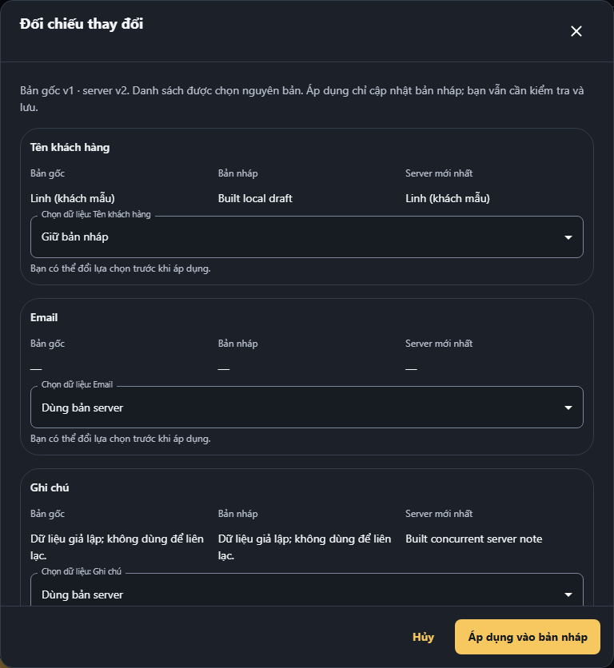

# Hoàn thiện Frontend F01–F09 — 08/10/2026

Trạng thái: **READY_FOR_ACCEPTANCE_LOCAL_SCOPE**. Phạm vi: React/TypeScript + HTTP MSW tổng hợp. HEAD 53c0ba8f413b1f1e0fa16a747ed27f728b861dd6 cộng working tree đã băm; đây là kết quả kỹ thuật local của kế hoạch đã chốt.

## Kết quả sửa source

| Finding | Thay đổi đã kiểm chứng |
|---|---|
| F04 — P1 | Command bảo vệ request/wait/poll theo unmount, shop, quyền và logout; không trả success cho scope cũ; giữ idempotency key/command ID cho outcome chưa rõ, có StrictMode regression. |
| F01 — P1 | Baseline/version của nháp; đối chiếu bản gốc/nháp/server theo trường, bắt chọn xung đột hai bên; không tự ghi hoặc retry bằng version mới. Redaction không hiện/gửi lại. |
| F02/F03 — P1 | Product/images, category, order, supplier, notification PUT và privacy đều giữ nháp khi refetch; danh sách chọn nguyên khối; success chỉ làm sạch phần đã gửi. |
| F05 — P1 | Composer cho nhập/đổi loại khi pending, khóa gửi thêm; chỉ xóa đúng revision đã gửi; lỗi/unknown giữ nháp. |
| F06 — P1 | Guard toàn đơn mới, dòng thêm/xóa và ảnh; route/shop/logout/reload; canceled reload giữ MSW, save sạch không cảnh báo sai. |
| F07 — P2 | Footer callback requestClose/busy chung với icon/Escape/backdrop; inline order close đã chuyển shared dialog; mặc định khóa content pending, consumer giữ late edits mới cho nhập tiếp. |
| F08 — P2 | Notes 4.000 code point, 4.001 lỗi tiếng Việt tại trường trước HTTP ở create/update; privacy kiểm giới hạn cùng contract. ASCII/emoji có regression; các giới hạn nhập/bộ đếm cùng pattern ở 14 module và ConfirmDialog dùng Unicode code point, giữ nguyên ngưỡng số hiện có. |
| F09 — P2 | Inbox event đã biết chỉ invalidate Inbox/read-model liên quan; duplicate/out-of-order bỏ; gap/reconnect/resync/malformed/unknown full resync, revoke riêng. |

**9/9 finding hoàn tất trong kế hoạch**, gồm lỗi cùng nguyên nhân đã xác nhận. [Rà 16 module/24 file](ANALOGOUS_PATTERNS.md), [inventory AST](patterns-current.json), [shared catalog 22 components + 6 compositions](shared-api-current.json). Không lấy số file/test làm phần trăm UI tuân thủ toàn hệ thống.

Nhóm bàn giao: **P0** baseline/môi trường, gate source cuối và canonical FE 140 checkpoint; **P1** F04 lifecycle rồi F01–F03 đối chiếu/editor, F05 composer, F06 draft guard; **P2** F07 dialog, F08 validation Unicode và F09 SSE. Ghi chú này theo thứ tự đã chốt; không gom thay đổi có sẵn vào commit mới.

## Kiểm chứng source cuối

Full browser: **554/554**, 277 Chromium + 277 Firefox, một lượt đầy đủ. Unit **173/173**; domain/network **88/88**; shared contracts **38/38**; layout fixtures **82/82**, source 79 file/0 finding/1 exception; evidence validator **11/11**; source-map **16/16**; built-demo **6/6**. Generator 11 outputs/283 schemas/210 operations/54 routes. Cold build 10/10 stages; production/demo lặp byte-identical.

| Cổng | Kết quả thực | Bằng chứng |
|---|---|---|
| generate | PASS, exit 0, source drift 0 | [log](runs/corrections-1791444892502-39420/generate.log) |
| verify | PASS, exit 0, source drift 0 | [log](runs/corrections-1791446078968-78560/verify.log) |
| e2e | PASS, exit 0, source drift 0 | [log](runs/corrections-1791441445991-24436/e2e.log) |
| unit | PASS, exit 0, source drift 0 | [log](runs/corrections-1791441191868-26044/unit.log) |
| contracts | PASS, exit 0, source drift 0 | [log](runs/corrections-1791441191994-24324/contracts.log) |
| layout | PASS, exit 0, source drift 0 | [log](runs/corrections-1791441192183-45608/layout.log) |
| evidence-validator | PASS, exit 0, source drift 0 | [log](runs/corrections-1791441192383-49108/evidence-validator.log) |
| source-maps | PASS, exit 0, source drift 0 | [log](runs/corrections-1791441192559-16080/source-maps.log) |
| built-demo | PASS, exit 0, source drift 0 | [log](runs/corrections-1791444650847-70468/built-demo.log) |

Native UI mới: [Chrome browser zoom 200%](actual-browser-zoom-200-current-corrections-native-20261008-final.json), [Firefox text-only 200%](native-text-only-200-current-corrections-native-20261008-final.json), cùng keyboard/axe/reflow và title/close overlap assertions. W30 năm case native mỗi method: [browser zoom](../frontend-ui-improvements/UI028/W30/actual-browser-zoom-200-current-corrections-w30-final-20261008.json), [text-only](../frontend-ui-improvements/UI028/W30/native-text-only-200-current-corrections-w30-final-20261008.json); source hash và từng scenario được kiểm lại trước checkpoint. Không dùng CSS transform thay native zoom.

[UAT hiện hành](uat-matrix-corrections-20261008.json): 54 routes, 64 features, 65 feature-route rows, 22 journeys, 432 state cells; 357 private route-role cases/7 roles/51 routes mỗi engine. Shared-tested, route-specific-tested và N/A có lý do được phân biệt; canonical gaps vẫn giữ.

[Đối chiếu trên artifact đã build](built-comparison-review-current.json) cũng đạt riêng ở Chromium và Firefox: nháp giữ khi server đổi; áp dụng không gửi HTTP; lần lưu gửi PATCH tên với If-Match v2 và giữ ghi chú server. Có screenshot và hash artifact. Quan sát bổ sung này không cộng vào 554 full cases hoặc 6 built-suite cases.

[Bảo toàn evidence khi verify cuối](final-verify-preservation.json): artifact domain đang được canonical receipt tham chiếu giữ nguyên byte; output mới 75 simulator + 13 network và raw log được lưu riêng. Exit thực và source drift vẫn quyết định PASS/FAIL.

## Tracker, baseline và bàn giao

FE snapshot khi ghi tài liệu: **140/140**, stale 0, blocked 0. Canonical checkpoint và generated reports được tái xác minh bằng receipt/log/hash; thay đổi docs cuối được kiểm lại trong lượt chốt cuối trước khi bàn giao. Full-product plan/ledger/T tasks giữ read-only; không đổi mẫu số 140.

[Contract/owner ghi trước source edit](REPORT-before-final-handoff.md) được giữ như lịch sử. Baseline [106 inputs](baseline.json) và các bản sao trước sửa được giữ; [timestamp first source mutation](implementation-provenance.json) lấy từ actual tool call. R1–R7/R9 REPRODUCED là probe lịch sử. Các full run thất bại/bị dừng để sửa assertion/source giữ lịch sử; không cộng targeted retest để gọi chúng PASS. Giữ 92 thay đổi tracked có sẵn; không reset/clean/bulk-stage hoặc commit ngoài phạm vi.

[Môi trường/npm thật](environment-current.json), [wrapper diagnosis](wrapper-diagnosis-current.json): cùng pinned CLI/source, PATH kế thừa 14.828 ký tự fail resolve tsc; PATH hữu hạn 173 ký tự pass. Compiler có thật; không thay execution policy, dependency, schema hoặc tokens.

[Cold artifact manifest](clean-artifacts-corrections-20261008.json): production tree **e0efe4b3c6650bf9bfe162b916479f988787b8d3dac53e2de5515301dcc760a5**, demo tree **62f800205d0ffec62448038ceca9ded64c7589699574cbe98d54eb563d9931c2**. Production không gồm MSW worker/fixtures đã kiểm; demo có nhãn dữ liệu mô phỏng. Bản demo dùng artifact dist-demo; [hướng dẫn nghiệm thu](ACCEPTANCE_GUIDE.md) có 9 ca thực tế.

## Giới hạn quan sát

[FE-G01..09](quality-gate-matrix-corrections-20261008.json) giữ rubric **7/9**, tách khỏi 9/9 finding: screen-reader speech/broad human conformance NOT_RUN; owner acceptance PENDING. Hosted CI/branch protection NOT_RUN. Backend/provider thật, database, staging và production runtime ngoài phạm vi. [Claim review](production-claim-review-corrections-20261008.json) không tự chứng nhận production hoặc WCAG. UI: local technical evidence PASS; architecture: scoped owners/boundaries PRESERVED với shared fixes; review do Codex tự kiểm, không giả peer review.
