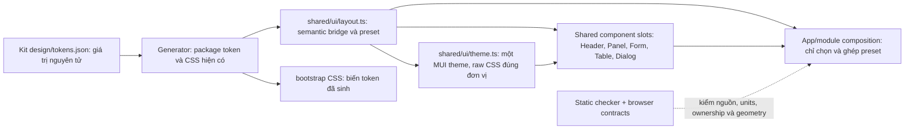
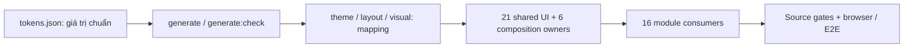

# Kế hoạch hoàn thiện UI và kiến trúc React Frontend, theo dõi tiến độ

**CURRENT PHASE — READY_FOR_ACCEPTANCE_LOCAL_SCOPE Shared consolidation (09/10/2026):** [report](../evidence/frontend-shared-consolidation-20261009/REPORT.md), [ca nghiệm thu](../evidence/frontend-shared-consolidation-20261009/ACCEPTANCE_GUIDE.md). Thứ tự/trạng thái duy nhất tại §16.6; local mock và giới hạn nghiệm thu riêng.

**Mã kế hoạch:** FE-UI-FOLLOWUP-20261002 · **Phiên bản:** 16.0 · **Lập / cập nhật ngày:** 09/10/2026.

**Mục tiêu đã chốt 04/10/2026:** hoàn thiện UI và kiến trúc React **Frontend-only**, kiểm chứng bằng mock API tổng hợp; AI tự sửa, kiểm thử, tái xác minh và chuẩn bị bàn giao. Người dùng chỉ nghiệm thu cuối. Chính sách scope/tự thực hiện: [FRONTEND_SCOPE.md](FRONTEND_SCOPE.md). Mục 12 ghi audit toàn bộ tài liệu, mâu thuẫn trước sửa và xử lý từng điểm; bản đối chiếu từng nhóm tài liệu là [audit kế hoạch/tài liệu Frontend](FRONTEND_PLAN_DOCUMENT_AUDIT_2026-10-04.md).

**Nguồn điều hành UI:** [§16](#steel-plan) giữ dependency/trạng thái rollout, CURRENT/TARGET contract nằm trong [shared catalog](../apps/web/src/shared/ui/README.md), còn quy định duy nhất là [standard v1.28 §0](FRONTEND_SPACING_STANDARD.md#unified-workflow), SPC-001–075. S01–S02 là audit/specification; S03–S08 có closeout scoped trong §16.6. v15.0 và các mục 8.x–15.x là snapshot lịch sử; không lấy `next` cũ hoặc số liệu lịch sử thay bằng chứng mới.

## Lịch sử phiên bản và closeout

Các đoạn phiên bản bên dưới ghi **HISTORICAL_SNAPSHOT** theo thời điểm triển khai. Trạng thái hiện hành chỉ ở §16.6; không dùng TODO/next/counts trong journal để điều hành checkout mới.

Phiên bản 8.0 bổ sung UI028 theo yêu cầu phân tích sâu và xây quy định spacing đồng bộ ngày 05/10/2026. Baseline UI001–UI027 giữ nguyên DONE 135/135 checkpoint; UI028 đã có C01 baseline và C02 specification, chưa chuyển đổi source hoặc kiểm chứng theo quy định mới. Nguồn quy định: [FRONTEND_SPACING_STANDARD.md](FRONTEND_SPACING_STANDARD.md); bằng chứng: [spacing audit](../evidence/frontend-spacing-audit-20261005/REPORT.md). Tracker FE độc lập và phải đọc status sau thay đổi tài liệu; không ghi tăng ledger hoặc readiness vì thêm quy định. Phạm vi vẫn Frontend-only với mock API; không giả Narrator, hosted CI hoặc owner acceptance.

Phiên bản 8.1 cụ thể hóa yêu cầu triển khai thành **36 bước UI028.W01–W36** ở §14.4–14.10: một bridge semantic shared, quy tắc không viết spacing literal tại consumer, migration đủ 16 module/54 route, checker ngăn khai báo rải rác và hồ sơ kiểm chứng. Đây là chi tiết trong cùng UI028, không phải 36 task mới hoặc một ledger khác. Tiến độ giữ 2/5; 36 bước triển khai/kiểm chứng/bàn giao đều TODO trong lượt lập kế hoạch.

Phiên bản 8.3 ghi nhận W03/W04 đã dựng checker, nối strict gate vào `verify`, cập nhật bằng chứng migration debt và bổ sung SPC-041: contract bố cục phải có trước khi viết UI. Ánh xạ vào W hiện có, không thêm task hoặc tăng checkpoint. Gate hoạt động nhưng hiện `FAIL` vì 505 source findings còn phải migrate; không nhận fixtures hoặc policy là toàn UI đã tuân thủ.

Phiên bản 8.4 ghi nhận W05 đã chuẩn hóa theme/global CSS qua semantic bridge và generated spacing variables, có render evidence desktop/mobile/form. W05 xóa 2 finding owner-scope; strict source scan hiện vẫn `FAIL` với 503 finding giao W06–W25. UI028 giữ 2/5 checkpoint; W01–W05 là bước con, không cộng checkpoint hoặc sửa FE ledger.

Phiên bản 8.5 ghi nhận W06 đã chuẩn hóa PageHeader/Panel/Stat/Stats, khóa API Panel bằng `bodyMode`/semantic gap/geometry type đóng và chuyển Panel spacing caller sang role. SPC-042 quy định component shared không nhận generic style spacing; checker geometry fixture đạt 9/9. Strict debt giảm 503→473, toàn bộ `UNKNOWN_STYLE_SOURCE` đã hết; 473 spacing literal còn giao W07–W25. UI028 vẫn 2/5 và không tăng FE/UI checkpoint; W01–W06 DONE, W07 đang chạy.

Phiên bản 8.6 ghi nhận W07 đã chuyển Toolbar/DataTable/Pager/CopyableCode/LookupLoadMore/DetailLine sang semantic spacing roles và xác minh component/browser. Strict debt giảm 473→461, `UNKNOWN_STYLE_SOURCE=0`; 13 finding trong shared UI còn thuộc W08. Full verify đạt tới production build và 9/9 layout fixtures nhưng strict gate vẫn FAIL đúng vì 461 finding của W08–W25. UI028 giữ 2/5 checkpoint; W01–W07 DONE, W08 đang chạy.

Phiên bản 8.7 bổ sung SPC-043/044 cho mọi lần thiết kế UI về sau: typography/palette/elevation/focus tiếp tục dùng token và theme canonical; baseline phải được chụp trước source edit, có provenance/hash và không bị ghi đè. Tại snapshot v8.7, baseline W08 đã được chụp lại khi runtime trở về đúng source trước W08 rồi source được phục hồi theo SHA-256; checker giảm 461→448 nhưng strict vẫn FAIL. Đây là acceptance policy gắn vào workflow hiện tại, không tạo tracker/checkpoint mới hoặc thay đổi UI028.

Phiên bản 8.8 ghi W08 DONE sau khi chuyển Empty/QueryState/Notice/Dialog sang semantic roles, xác minh lại empty scenario R30 bằng API mock và render ở 390×844/1280×900; dialog cũng đạt ở hai viewport. Vitest 88/88, Playwright trạng thái/dialog 13/13, route-empty 11/11, layout fixtures 9/9, typecheck/lint/source/boundaries/domain/generator/build đều PASS. Empty baseline trước code không có nên giữ `BASELINE_NOT_CAPTURED` và after-state là `DIAGNOSTIC_ONLY`; không gọi là paired comparison. Strict gate toàn app vẫn FAIL 448 spacing literals ở W09–W25, không suppress; UI028 vẫn 2/5, C03 tiếp tục.

Phiên bản 8.9 ghi W09 DONE và SPC-045 đã được áp dụng bằng baseline/layout report có provenance. Shell/header/banner/main/footer/fallback và demo tools dùng semantic roles; Chromium đo overview/imports/workspaces ở 390×844 và 1280×900, không tràn ngang/page error; 3/3 shell tests và R13 error composition 1/1 PASS. Generator, source, boundary, typecheck, lint, layout fixtures, production build và demo build PASS. Strict app giảm 448→396 `SPACING_LITERAL`, 0 finding mới ở các file được đổi và 0 UNKNOWN; debt còn lại giao W10–W25 nên toàn cục vẫn FAIL. W01–W09 DONE; W10 là bước tiếp theo; UI028 giữ nguyên 2/5 checkpoint và không thay FE/full-product ledger. [W09 verification](../evidence/frontend-ui-improvements/UI028/W09/verify-w09-current-20261005.json), [log](../evidence/frontend-ui-improvements/UI028/W09/verify-w09-current-20261005.log), [SPC-045 comparison](../evidence/frontend-ui-improvements/UI028/W09/layout-report-delta-v3-current-20261005.json).

Phiên bản 9.0 ghi W10 DONE: `catalog/index.tsx` và `imports.tsx` dùng role chung cho form/table/dialog/inset; R09–R14 được chụp trước/sau ở 390×844/1280×900, R14 dùng dry-run CSV tổng hợp và không commit. Catalog CRUD/import/security đạt 13/13 Chromium; route/layout mới đạt 1/1 trên đủ 6 route × 2 viewport; Vitest, typecheck, lint, source/boundary/generator, production build và demo build PASS. SPC-045 ghi 396→375 `SPACING_LITERAL`, xóa hết 21 finding trong 2 file, 0 mới/0 UNKNOWN. Strict toàn source vẫn FAIL 375 finding giao W11–W25; không suppress. W01–W10 DONE; W11 orders là bước tiếp theo; UI028 vẫn 2/5, FE/full-product ledgers không đổi. [W10 verification](../evidence/frontend-ui-improvements/UI028/W10/verify-w10-current-20261005.json), [log](../evidence/frontend-ui-improvements/UI028/W10/verify-w10-current-20261005.log), [paired capture](../evidence/frontend-ui-improvements/UI028/W10/render-after-source-edit-current-20261005.json), [SPC-045 delta](../evidence/frontend-ui-improvements/UI028/W10/layout-report-delta-current-20261005.json).

Phiên bản 9.1 ghi W11 Orders DONE cho R17/R18/R19/R43: Chromium 153 paired capture 18/18 state×viewport observations; route-layout regression 2/2 trên 320/390/768/1280/1440 px; FE012 behavior regression 11/11. Orders owner giảm 25→0 spacing findings, toàn app 375→350; không có finding mới hoặc page error, 0 unknown. Generate/source/boundary/lint/type/domain/Vitest/production build/demo build đạt; full `npm.cmd run verify` vẫn exit 1 đúng tại strict gate vì 350 finding còn giao W12–W25. W01–W11 DONE; W12 Inventory kế tiếp; UI028 vẫn 2/5, FE/full-product ledgers không đổi. [W11 verification](../evidence/frontend-ui-improvements/UI028/W11/verify-w11-current-20261005.json), [baseline](../evidence/frontend-ui-improvements/UI028/W11/render-before-source-edit-stable-current-20261005.json), [after render](../evidence/frontend-ui-improvements/UI028/W11/render-after-source-edit-current-20261005.json), [SPC-045 delta](../evidence/frontend-ui-improvements/UI028/W11/layout-report-delta-current-20261005.json).

Phiên bản 9.2 bổ sung SPC-046 để phòng tái phạm cho typography, palette, radius, elevation, focus và breakpoint: các vai trò thị giác phải quy về theme/token; không thêm literal cục bộ trong consumer. Bằng chứng hiện hành cho thấy `test:layout` chỉ kiểm spacing, nên không ghi nhận kiểm tự động cho các thuộc tính còn lại. UI028.W26–W27 nay phải kiểm kê, triển khai checker AST/style-aware cùng positive/negative fixtures và nối gate đó vào `verify`; cho đến khi gate được chạy thật, mỗi diff UI cần `VISUAL_SOURCE_REVIEW` đối chiếu theme/token. Không thêm checkpoint, task, tracker hoặc thay đổi trạng thái W01–W11 do cập nhật quy định.

Phiên bản 9.3 ghi W12 Inventory DONE: R15/R16 filters, notices và adjustment form chuyển sang spacing roles; 4 finding Inventory được xử lý, module còn 0, toàn source giảm 350→346 và không phát sinh finding mới. Paired Chromium capture có 6 state×viewport observations, 0 page error/overflow; route-layout và filter/adjustment regressions đạt 2/2 ở Chromium và 2/2 ở Firefox. Generator/source/boundary/lint/type/domain/Vitest/production build và layout fixtures đạt; `npm run verify` vẫn exit 1 tại strict toàn source do 346 spacing finding còn giao W13–W25. SPC-046 source review ghi nhận không có visual literal mới, đồng thời giữ hai `fontWeight` cũ 650/750 là legacy debt; visual-token checker chưa có. W01–W12 DONE, W13 Procurement kế tiếp; UI028 giữ 2/5 và FE/full-product ledger không đổi. [W12 verification](../evidence/frontend-ui-improvements/UI028/W12/verify-w12-current-20261005.json), [pre-code contract](../evidence/frontend-ui-improvements/UI028/W12/design-contract-pre-code-current-20261005.md), [paired render delta](../evidence/frontend-ui-improvements/UI028/W12/layout-report-delta-current-20261005.json), [visual source review](../evidence/frontend-ui-improvements/UI028/W12/visual-source-review-current-20261005.md).

Phiên bản 9.4 ghi W13 Procurement DONE cho R44–R47: supplier/replenishment/purchase/receipt chuyển sang layout roles hiện có; toàn bộ 36 finding trong module được xử lý, tổng source giảm 346→310, không thêm finding hoặc unknown. Paired Chromium capture có 22 state×viewport observations tại 390×844/1280×900; không lỗi trang, request ghi, tràn ngang hay dialog ngoài viewport. Responsive regressions đạt 2/2 ở Chromium và 2/2 Firefox trên 320/390/768/1280/1440 px; FE014 + FE022 procurement journey đạt 8/8; source-map đạt 95 assertions. Generate/source/boundary/lint/type/domain/Vitest/production build đạt; `npm run verify` exit 1 ở strict scan cuối do 310 finding của module khác còn giao W14–W25. SPC-046 review ghi không thêm visual literal; visual-token checker vẫn chưa có. W01–W13 DONE, W14 tiếp theo; UI028 giữ 2/5, FE/full-product ledgers không đổi. [W13 verification](../evidence/frontend-ui-improvements/UI028/W13/verify-w13-current-20261005.json), [pre-code contract](../evidence/frontend-ui-improvements/UI028/W13/design-contract-pre-code-current-20261005.md), [paired render delta](../evidence/frontend-ui-improvements/UI028/W13/layout-report-delta-v2-current-20261005.json), [visual source review](../evidence/frontend-ui-improvements/UI028/W13/visual-source-review-current-20261005.md).

Phiên bản 9.5 bổ sung SPC-047: hành vi UI phải truy được về route manifest, OpenAPI, UX contract và mock flow hiện có; không suy diễn route/quyền/action/API từ ảnh, prototype hoặc UI cũ. Nếu task Frontend cần năng lực chưa có contract, ghi `FRONTEND_ONLY_GAP`, không dựng Backend hay success giả. Thêm CODE-025 vào coding standard và đưa SPC-001–047 vào điểm khởi động để quy định được gặp ở cả lúc nhận task lẫn trước đóng việc. Thay đổi này chỉ bổ sung governance: không đổi trạng thái W14–W36, checkpoint UI/FE hoặc full-product tracker.

Phiên bản 9.6 ghi UI028.W14 Fulfillment DONE sau khi thay 17 spacing finding trong R41/R42 bằng semantic roles; module còn 0, tổng source giảm 310→293 và 0 finding mới. Generator/source/boundary/lint/typecheck/domain/Vitest/production build và 9/9 layout fixtures đạt; R41/R42 targeted Playwright đạt 18/18 trên Chromium/Firefox. `npm.cmd run verify` chạy tới strict gate cuối rồi exit 1 đúng vì 293 finding thuộc W15–W25. UI028 vẫn 2/5 checkpoint; W01–W14 DONE, W15 tiếp theo. Policy SPC-047/CODE-025 không tạo task/checkpoint mới. [W14 verification](../evidence/frontend-ui-improvements/UI028/W14/verify-w14-current-20261005.json), [design contract](../evidence/frontend-ui-improvements/UI028/W14/design-contract-pre-spacing-current-20261005.md), [paired render delta](../evidence/frontend-ui-improvements/UI028/W14/layout-delta-current-20261005.json), [visual source review](../evidence/frontend-ui-improvements/UI028/W14/visual-source-review-current-20261005.md).

Phiên bản 9.7 ghi UI028.W15 Finance DONE trên R20/R21/R22/R48/R49/R50: 27 spacing findings trong owner được chuyển sang semantic roles, tổng source giảm 293→266, không thêm finding và không đổi identity/count ngoài Finance. Paired capture đạt 26 trạng thái trước + 26 sau trên 390×844/1280×900; page errors và capture write requests bằng 0. Layout regressions qua 320/390/768/1280/1440; targeted Finance + UI011/UI012/UI013 + FE022 đạt 66/66 (Chromium 33/33, Firefox 33/33). Generator 11/283/210/54, source 66/220/54 + 3/3 checker tests, boundaries 446 imports/10 negative fixtures, lint/typecheck/domain 88/88/Vitest 88/88, production build 2056 modules và layout fixtures 9/9 đạt. Full `npm.cmd run verify` exit 1 tại strict gate cuối vì còn 266 finding ở module W16–W25. UI028 giữ 2/5; W01–W15 DONE, W16 Customers kế tiếp. [W15 verification](../evidence/frontend-ui-improvements/UI028/W15/verify-w15-current-20261005.json), [pre-code contract](../evidence/frontend-ui-improvements/UI028/W15/design-contract-pre-spacing-current-20261005.md), [paired delta](../evidence/frontend-ui-improvements/UI028/W15/layout-delta-current-20261005.json), [visual source review](../evidence/frontend-ui-improvements/UI028/W15/visual-source-review-current-20261005.md). Synthetic/local Frontend only; không tuyên bố Backend/provider, hosted CI, staging, production hoặc owner acceptance.

Phiên bản 9.8 mở W16 Customers sau khi ghi contract route R07/R08/R54 và chụp 12 baseline observations trước sửa ở 390×844/1280×900; source lúc nhận việc đã có staged changes. Checker hiện ghi nhận delta sơ bộ 15→0 finding tại Customers, toàn source 266→251 và không thay đổi finding ngoài owner. Layout route/dialog mới đạt 4/4 Chromium/Firefox; regression suite, visual review và `verify` cuối còn đang chạy nên W16 vẫn `IN_PROGRESS`, không cộng vào 15/36 DONE. [W16 contract](../evidence/frontend-ui-improvements/UI028/W16/design-contract-pre-spacing-current-20261005.md), [baseline](../evidence/frontend-ui-improvements/UI028/W16/render-before-spacing-current-20261005.json), [checker delta sơ bộ](../evidence/frontend-ui-improvements/UI028/W16/layout-delta-current-20261005.json), [layout tests](../evidence/frontend-ui-improvements/UI028/W16/ui-customers-layout-e2e-current-20261005.log). Không đổi 2/5 checkpoint UI hoặc FE/full-product ledger.

Phiên bản 9.9 ghi W16 Customers DONE: R07/R08/R54 xóa 15→0 owner spacing findings, tổng source 266→251, không thêm finding và không đổi identity/count ngoài Customers. Paired capture 12+12 tại 390×844/1280×900 không có page error hoặc write request; responsive/dialog layout đạt 4/4 Chromium/Firefox và customer/state/permission/keyboard regression đạt 68/68 (34 mỗi engine). Generator 11/283/210/54, source 66/220/54 + 3/3, boundaries 447 imports/10 fixtures, lint, typecheck, domain 88/88, Vitest 88/88, production build 2056 modules và layout fixtures 9/9 đều đạt. Full `npm.cmd run verify` vẫn exit 1 đúng ở strict gate cuối vì còn 251 finding giao W17–W25; không nới rule. W01–W16 DONE, W17 Knowledge tiếp theo; UI028 giữ 2/5 checkpoint, FE/full-product ledger không đổi. [W16 verification](../evidence/frontend-ui-improvements/UI028/W16/verify-w16-current-20261005.json), [pre-spacing contract](../evidence/frontend-ui-improvements/UI028/W16/design-contract-pre-spacing-current-20261005.md), [paired delta](../evidence/frontend-ui-improvements/UI028/W16/layout-delta-current-20261005.json), [targeted regression](../evidence/frontend-ui-improvements/UI028/W16/targeted-customers-regression-current-20261005.log) và [visual review](../evidence/frontend-ui-improvements/UI028/W16/visual-source-review-current-20261005.md). Synthetic/local Frontend only; không tuyên bố Backend/provider, hosted CI, staging, production hoặc owner acceptance.

Phiên bản 10.0 ghi W17 Knowledge DONE trên R23/R24/R25: 19→0 finding trong owner, tổng source 251→232, 0 finding thêm và 0 thay đổi ngoài Knowledge. Paired render có 12+12 observations tại 390×844/1280×900, không lỗi trang/ghi dữ liệu trong capture; layout/behavior Playwright đạt 24/24 trên Chromium và Firefox, FE017 source map 4/4. Generator 11/283/210/54, source 66/220/54 + 3/3, boundaries 448 imports/10 fixtures, lint/typecheck, domain/network 88/88, Vitest 88/88, production build 2056 modules và layout fixtures 9/9 đạt. Verify đầy đủ được chạy qua locked npm CLI với PATH giới hạn và exit 1 chỉ ở strict layout scan cuối vì còn 232 finding giao W18–W25; không nới gate. W01–W17 DONE, W18 Bot tiếp theo; UI028 giữ 2/5 checkpoint, FE/full-product ledger không đổi. Xem [W17 verification](../evidence/frontend-ui-improvements/UI028/W17/verify-w17-current-20261006.json), [pre-spacing contract](../evidence/frontend-ui-improvements/UI028/W17/design-contract-pre-spacing-current-20261006.md), [paired delta](../evidence/frontend-ui-improvements/UI028/W17/layout-delta-current-20261006.json), [targeted browser run](../evidence/frontend-ui-improvements/UI028/W17/knowledge-targeted-e2e-current-20261006.log) và [visual source review](../evidence/frontend-ui-improvements/UI028/W17/visual-source-review-current-20261006.md). Synthetic/local Frontend only; không tuyên bố Backend/provider, hosted CI, staging, production, screen-reader hoặc owner acceptance.

Phiên bản 10.1 mở W18 Bot sau khi lưu contract/baseline trước sửa cho R26/R27/R28/R51; working source vốn đã có staged và unstaged changes nên SHA `c7336421…34aa57c` được ghi làm baseline. Capture trước sửa gồm 18 observations tại 390×844/1280×900, 0 page error/overflow; hai POST chỉ là kết quả sandbox tổng hợp R27, không gọi provider hay gửi khách. Layout scan ghi 25 finding trong Bot, tổng 232; FE018 contract-source-map baseline đạt 2/2. W18 đang `IN_PROGRESS`, chưa chuyển code; không thay tracker/checkpoint hoặc file generated. [W18 pre-code contract](../evidence/frontend-ui-improvements/UI028/W18/design-contract-pre-spacing-current-20261006.md), [baseline](../evidence/frontend-ui-improvements/UI028/W18/render-before-spacing-current-20261006.json), [layout baseline](../evidence/frontend-ui-improvements/UI028/W18/layout-before-spacing-current-20261006.json). Synthetic/local Frontend only; không claim external provider effect hoặc contract route/action mới.

Phiên bản 10.4 ghi W20 Notifications DONE: owner spacing 25→0, toàn source 194→169; paired capture 8+8, targeted E2E 26/26 Chromium/Firefox, không finding mới hoặc ngoài owner. Full local verify đạt các gate đến strict scan cuối, exit 1 vì 169 finding giao W21–W25. W21 Operations đã có contract/hash/6 pre-code captures và 30 owner findings; chưa sửa source. UI028 giữ 2/5 checkpoint; FE/full-product ledger và generated plan không đổi. [W20 verification](../evidence/frontend-ui-improvements/UI028/W20/verify-w20-current-20261006.json), [delta](../evidence/frontend-ui-improvements/UI028/W20/layout-delta-current-20261006.json), [W21 pre-code contract](../evidence/frontend-ui-improvements/UI028/W21/design-contract-pre-spacing-current-20261006.md) và [baseline](../evidence/frontend-ui-improvements/UI028/W21/render-before-spacing-current-20261006.json). Synthetic/local Frontend only; global strict spacing chưa PASS; không claim OS Push/Telegram/provider, Backend, hosted CI, staging, production, screen-reader hoặc owner acceptance.

Phiên bản 10.5 bổ sung SPC-048: mọi UI mới/chỉnh cấu trúc phải đối chiếu một màn đã migrate cùng profile; khác biệt phải có căn cứ nghiệp vụ/responsive và dùng shared role/variant, không tùy biến riêng theo route. Thêm mẫu evidence expected/observed vào chuẩn spacing và ánh xạ vào §14.11, AGENTS, CODE-026, FRONTEND_SCOPE và PROJECT_CONTEXT. Đây là cập nhật quy định; không thêm task/checkpoint, không đổi UI028/FE/full-product status và không tự nhận gate UI mới đã tự động hóa.

Phiên bản 10.7 ghi W22 Workspace DONE: xóa 37→0 owner findings, strict debt 139→102; paired captures 16+16 và targeted E2E 26/26 Chromium/Firefox. Ordered verify-equivalent commands đạt generator 11/283/210/54, source 66/220/54 + 3/3, boundaries 453 imports/10 fixtures, lint/typecheck, domain/network 88/88, Vitest 88/88, production build 2056 modules và layout fixtures 9/9; strict scan cuối exit 1 đúng vì còn 102 finding W23–W25. `npm.cmd run verify` không qua nested npm launcher trên máy này; từng lệnh trong cùng thứ tự được chạy trực tiếp bằng bundled Node và log riêng. SPC-048 được tăng cường bằng profile baseline table, route-reference proof và W22 correction: R17 là collection đơn hàng, R20 là cashflow summary; R03 dùng semantic auth/form profile, R34 đối chiếu R38 table profile. UI028 giữ 2/5; FE/full-product tracker và generated `IMPLEMENTATION_PLAN.md` không đổi. [W22 verification](../evidence/frontend-ui-improvements/UI028/W22/verify-w22-current-20261006.json), [profile review](../evidence/frontend-ui-improvements/UI028/W22/visual-source-review-current-20261006.md), [layout delta](../evidence/frontend-ui-improvements/UI028/W22/layout-delta-current-20261006.json), [ordered checks](../evidence/frontend-ui-improvements/UI028/W22/direct-verify-current-20261006.log).

Phiên bản 10.8 ghi W23 Dashboard DONE: 36→0 owner findings, strict source debt102→66; 4+4 paired local Chromium captures cho owner/viewer tại390×844/1280×900; dashboard layout/permission/CTA focus đạt6/6 trên Chromium/Firefox. Generator11/283/210/54, source66/220/54 + fixtures3/3, boundaries454 imports/10 fixtures, lint/typecheck, domain/network88/88, Vitest88/88, production/demo build và layout fixtures9/9 đạt. `npm.cmd run test:layout` chạy được bằng PATH giới hạn và exit1 đúng tại strict scan với66 finding W24/W25. UI028 vẫn2/5; W01–W23 là breakdown DONE, C03 tiếp tục IN_PROGRESS; FE/full-product tracker và generated `IMPLEMENTATION_PLAN.md` không đổi. [W23 verification](../evidence/frontend-ui-improvements/UI028/W23/verify-w23-current-20261006.json), [visual/source review](../evidence/frontend-ui-improvements/UI028/W23/visual-source-review-current-20261006.md), [delta](../evidence/frontend-ui-improvements/UI028/W23/layout-delta-current-20261006.json). Synthetic/local Frontend only; không nhận backend/provider, hosted CI, staging, production, screen-reader hoặc owner acceptance.

**Phân loại lịch sử:** phần 1–15 lưu backlog kỹ thuật và các lần migration/review theo ngày của mỗi mục. Từ “current/hiện hành/next” trong một snapshot chỉ có nghĩa tại ngày đó. Status rollout trên source hiện tại chỉ ở [§16.6](#ui-rollout-status); kết quả chạy mới chỉ ở evidence report.

## 1. Đọc nhanh tình trạng và việc tiếp theo

| Chỉ số | HISTORICAL_SNAPSHOT — technical handoff UI028, 06/10/2026; không phải status/evidence hiện hành |
|---|---|
| Phạm vi triển khai | Frontend React/TS + mock HTTP/tests/tooling; không Backend/DB/worker/staging |
| Task UI kỹ thuật | **UI001–UI028: 28/28 hoàn tất kỹ thuật**; UI028 C01–C05 `DONE 5/5`, W01–W36 `DONE 36/36`; nghiệm thu cuối vẫn thuộc người dùng |
| Checkpoint UI | **140/140 hoàn tất kỹ thuật**; gồm 135 checkpoint UI001–UI027 và 5 checkpoint UI028; không đại diện owner acceptance |
| Công việc AI trong hai kế hoạch | UI028 C03–C05 theo §14; FE001–FE028 đọc/tái xác minh bằng tracker chuẩn theo dependency bị ảnh hưởng |
| BLOCKED / STALE / next | UI028 không có dependency chờ Backend/owner/hosted; `progress.mjs status` là nguồn quyết định BLOCKED/STALE/next của FE |
| Tracker FE hiệu lực | **140/140 VERIFIED**, `stale=[]`, `blocked=[]`, `next=[]`; cấu trúc canonical hợp lệ: 28 task/140 checkpoint. Nguồn là `node ../botsales-kit/scripts/progress.mjs status` và `validate`; Frontend-only synthetic mock, không phải xác nhận Backend hoặc production. |
| Runtime evidence tại snapshot | W26 strict spacing và visual-token scans 68 file/0 finding; W28 54 route/216 observations trên Chromium/Firefox; W29 18 reflow case/7 profile; W30 text/spacing stress 10/10, Chromium zoom 5/5 và Firefox native text-only resize 5/5; W31 regression 148/148; W32 route matrix 216/216; W36 ordered verify 13/13 và current built-demo E2E 484/484 PASS. Xem W26–W36 ở §14.4–14.10. |
| Kiến trúc/static | 68 source files trong visual audit; 54 routes; 475 import edges/0 issue/cycle; 10/10 negative fixtures; generator 11 outputs/283 schemas/210 operations/54 routes |
| Quyết định đã chốt | UI020 desktop matrix S06; UI021 accepted review S38, strict scanner vẫn exit1/13; FE017 knowledge.publish + lifecycle |
| Mốc bàn giao | SPC-001–063 có hiệu lực; SPC-059 yêu cầu control có hành vi/feedback trung thực; SPC-060 khóa profile và spacing owner trước JSX/CSS. Strict spacing/visual-token gates 68 file/0 finding; W28–W36 route, reflow, zoom, regression, build và E2E đạt theo evidence liên kết. UI028 technical handoff hoàn tất; FE-G05 human/Narrator review `NOT_RUN`, FE-G09 chờ nghiệm thu người dùng. |
| Readiness theo rubric 9 gate | **7/9 đạt**; FE-G05 còn Narrator/human review `NOT_RUN`, FE-G09 chờ nghiệm thu. Không suy thành % code/architecture. |
| Artifact fingerprint | Demo Frontend synthetic-MSW tại snapshot: SHA-256 và danh sách file được lưu trong [UI028 W36 final freeze](../evidence/frontend-ui-improvements/UI028/W36/final-freeze-current-20261006.json); chỉ là local build artifact, không phải production deployment. |
| Security/build baseline | Frontend security audit và production build evidence ở FE024/UI028; W36 verify hiện hành 13/13 và built-demo regression 484/484 PASS. UI027 bundle comparison (738.39→328.33 kB raw, ngưỡng 500 kB giữ nguyên) là mốc lịch sử hiệu năng, không thay số liệu W36. |
| Đối chiếu toàn bộ tài liệu | [Audit kế hoạch/tài liệu](FRONTEND_PLAN_DOCUMENT_AUDIT_2026-10-04.md) và inventory/hash toàn corpus ở thư mục evidence; mọi snapshot có ngày cũ được phân loại riêng |

**Trạng thái UI migration trước policy rollout:** UI001–UI028 có technical handoff; UI checkpoints 140/140, UI028 C01–C05 `DONE 5/5` và W01–W36 `DONE 36/36` theo snapshot evidence được liên kết. Các số FE/UI này là tracker riêng, không phải S01–S20. Giới hạn giữ nguyên: W08 Empty thiếu paired pre-code baseline nên `DIAGNOSTIC_ONLY`; FE-G05 human/Narrator review `NOT_RUN`; FE-G09 chờ nghiệm thu người dùng. Kết quả thuộc Frontend local với synthetic MSW. Trạng thái rollout quy định hiện hành nằm tại đầu tài liệu và §16.6.

Các log run cũ FAIL/interrupted, strict scanner exit 1, warnings và giới hạn speech/hosted được giữ đúng. Các số 100% trong snapshot UI001–UI027 là tiến độ checkpoint ở phạm vi/ngày cũ; snapshot backlog trước rollout là 27/28 task và 137/140 checkpoint; trạng thái hiện hành chỉ ở §16.6 và CLI canonical, không phải phần trăm chất lượng kiến trúc hoặc 9/9 gate. Đọc [mục 12.8](#128-audit-tài-liệu-và-bàn-giao-cuối--04102026) cho lịch sử và §14 cho phạm vi spacing mới.

## 2. Nguồn, phạm vi và nguyên tắc giữ kiến trúc

- Baseline source: branch `main`, HEAD `e68cb65e61c5c1aab2ae169dd8033df305df8872`. Trước thực hiện phải đối chiếu lại revision và thay đổi đang có.
- Cơ sở giao việc: [báo cáo phân tích UI ngày 02/10](../evidence/FRONTEND_UI_REAUDIT_2026-10-02.md), gồm 5 P1 và 1 P2 có browser reproduction; các đề xuất còn lại có mức xác minh riêng.
- Cơ sở kiến trúc: [báo cáo audit kiến trúc ngày 02/10](../evidence/FRONTEND_ARCHITECTURE_READINESS_2026-10-02.md), [readiness.json](../evidence/frontend-architecture-audit-20261002/readiness.json), [structure.json](../evidence/frontend-architecture-audit-20261002/structure.json) và [đối chiếu source/artifact](../evidence/frontend-architecture-audit-20261002/freshness-and-artifacts.json). Không dùng điểm từ tên thư mục hoặc số dòng thay cho bằng chứng hành vi.
- Kế hoạch Frontend chuẩn: [frontend-plan.json](../../botsales-kit/execution/frontend-plan.json); ledger chuẩn: [frontend-progress.json](../../botsales-kit/execution/frontend-progress.json); [hướng dẫn tracker](../../botsales-kit/execution/FRONTEND_PLAN_GUIDE.md). [IMPLEMENTATION_PLAN.md](../../botsales-kit/IMPLEMENTATION_PLAN.md) là đầu ra sinh, không sửa tay để cập nhật backlog này.
- Nguồn UI/API: [OpenAPI](../../botsales-kit/contracts/openapi.json), [route manifest](../../botsales-kit/contracts/route-manifest.json), [design tokens](../../botsales-kit/design/tokens.json). Không bịa operation, trường dữ liệu hoặc khả năng tìm kiếm mà contract chưa cấp.
- Áp dụng [AI_RULES.md](../AI_RULES.md), [Frontend scope](FRONTEND_SCOPE.md), [Project context](PROJECT_CONTEXT.md), [kiến trúc](../../botsales-kit/docs/02_ARCHITECTURE.md), [API/realtime](../../botsales-kit/docs/06_API_AND_REALTIME.md), [coding standards](../../botsales-kit/docs/18_CODING_STANDARDS.md).
- Sửa React/TS tại `apps/web` và test/mock/cấu hình Frontend liên quan. Một MUI, Query, Router; không import trực tiếp giữa các module; không port prototype HTML hoặc dựng generic CRUD engine.
- MSW chỉ trong demo/test. Production artifact phải build được và không chứa mock/seed/fallback. Provider thật, Backend, DB, staging và deployment không phải điều kiện của backlog Frontend này.
- Không sửa tay `packages/*/src/generated*`; giữ các tracker toàn sản phẩm `execution/plan.json`, `progress.json`, `tasks/T*.md` chỉ đọc. Không thay lockfile hoặc nâng thư viện để giải quyết vấn đề không liên quan.
- Giữ ngoại lệ FE017 đã được chấp nhận: `knowledge.publish` + lifecycle trong UI mock. Không tự thêm `Knowledge.allowedActions`.

**Nguồn trạng thái cho các ID UI001–UI028 là bảng trong file này.** Giữ nguyên kết quả UI001–UI027; UI027 được chọn từ [mục tối ưu sau nghiệm thu của audit ngày 04/10](FRONTEND_PLAN_DOCUMENT_AUDIT_2026-10-04.md#7-những-việc-có-thể-tối-ưu-tiếp), UI028 là yêu cầu spacing mới ngày 05/10. Quy định dùng spacing có một nguồn [FRONTEND_SPACING_STANDARD.md](FRONTEND_SPACING_STANDARD.md), token nguyên tử vẫn canonical trong kit. Không đổi hồi tố ID/checkpoint FE chuẩn. Không tạo JSON chép tay cùng vai trò. Nếu sau này chính thức đưa backlog vào kế hoạch FE chuẩn, phải ghi quyết định chuyển nguồn, ánh xạ ID và ngừng cập nhật bảng phụ; không duy trì hai ledger cho cùng một việc.

### 2.1. Readiness theo bằng chứng hiện hành

[REPORT.md](../evidence/REPORT.md) là nguồn kết quả gate; FE-G01/02/03/04/06/07/08 có scoped evidence, FE-G05 manual và FE-G09 owner chưa đủ. Theo rubric không tính partial: **7/9 = 77,8%**. Lượt điều chỉnh quy trình không tự nâng điểm hoặc chuyển missing thành N/A. Chỉ đề nghị nhãn Production-Ready/Enterprise-Grade khi đủ evidence/ngoại lệ được chấp nhận đúng phạm vi.

Mốc tự động hoàn tất và mốc người dùng nghiệm thu được tách ở §9.2. FE-G05 có browser coverage tự động, speech NOT_RUN phải công khai; FE-G09 có technical UAT và final owner decision riêng. Thiếu hai bằng chứng này không làm AI chờ giữa chừng khi xây gói reviewable, nhưng cũng không phải PASS của hai gate.

### 2.2. Hiện trạng kiến trúc và artifact có căn cứ

S39 đọc 65 TS/TSX files, 16 modules/24 module files, 54 routes; 220 API reference sites; boundary 429 edges/0 issue/cycle và 8/8 negative fixtures. Một QueryClient, Router và MUI theme. Generator 11 outputs/283 schemas/210 operations/54 routes; không phải % kiến trúc tổng thể.

S39 verify có lint/typecheck, domain/MSW 88/88, Vitest 85/85 và production build. S40 đạt 388/388 Chromium153/Firefox155; S08 Chrome154 đạt 194/194; từng engine bao gồm route-role 357/357, empty 11/11, errors 51/51 và bốn journeys. [S08 fingerprint](../evidence/frontend-ui-improvements/UI024/S08-current-worktree-and-artifact-fingerprint.json) định danh 161 input, 32 production và 37 demo files. Logs không thay owner acceptance hoặc live Backend proof.

Advisory production raw chunk còn 738.45 kB/186.93 kB gzip theo S39; byte budgets local và profile emulated UI019 phải được giữ đúng environment. Strict UI021 S36 còn exit1/13 với [S37 crosswalk](../evidence/frontend-ui-improvements/UI021/S37-current-source-crosswalk-20261004.md) và [S38 accepted review](../evidence/frontend-ui-improvements/UI021/S38-requester-review-acceptance-20261004.md). Scope desktop theo [UI020/S06](../evidence/frontend-ui-improvements/UI020/S06-requester-approved-browser-scope-20261004.md); không hỏi lại matrix.

Độ mới runtime được kiểm hash; nếu input đổi sau log thì chạy lại gate ảnh hưởng. Documentation-only không yêu cầu lặp suites runtime đã có cùng input và không nhận suite chưa chạy là PASS.

### 2.3. Quy trình bắt buộc: sửa và nghiệm thu UI + kiến trúc trong cùng một ID

AI thực hiện từng UI ID theo thứ tự ưu tiên ở mục 4 và phải xử lý **hai trục trong cùng một hạng mục/lượt sửa**: (1) kết quả người dùng nhìn thấy và (2) ownership/invariant/ranh giới kiến trúc bị tác động. Một phiếu chỉ được đóng khi cả hai trục có kết quả và bằng chứng riêng. Không chia một lỗi thành hai task trùng nhau: cùng ID phải ghi UI trigger/expected/observed và architecture owner/invariant/expected/observed riêng, rồi kiểm chứng cả hai. Nếu kiến trúc được giữ nguyên, ghi `PRESERVED` hoặc `N/A` với căn cứ cụ thể; không tạo refactor chỉ để có thay đổi ở cả hai trục. Những yêu cầu dưới đây áp dụng theo phạm vi diff, không bắt mọi thay đổi copy chạy lại toàn bộ suites.

**Ràng buộc bắt buộc cho mọi AI sửa source:** trong cùng lượt xử lý một ID, phải vừa giải quyết/kiểm UI vừa cập nhật hoặc chứng minh giữ nguyên đúng kiến trúc liên quan (state/data/permission/component/module owner); chạy regression phù hợp cho cả hai trục; ghi verdict `UI:` và `ARCH:` riêng. Một lượt đổi UI nhưng để phân tích owner/invariant “làm sau” chưa hoàn tất; một lượt chỉ refactor nhưng không bảo vệ journey UI cũng chưa hoàn tất. Nếu một trục không cần đổi code, ghi `PRESERVED`/`N/A` cùng bằng chứng thay vì tạo refactor giả.

**Mẫu evidence bắt buộc cho từng ID:** UI ghi route/role/data/viewport/state, expected → observed và verdict; ARCH ghi owner/invariant, boundary bị tác động, expected → observed và verdict; cùng liệt kê file/diff, regression/gate đã chạy, artifact/fingerprint và giới hạn. ARCH: PRESERVED phải nêu invariant đã kiểm và vì sao ownership/contract/module boundary vẫn đúng. Với UI chỉ đổi cách trình bày, vẫn đánh giá component/token/state ownership; không tạo refactor giả. Nếu chỉ kiến trúc đổi mà UI behavior giữ nguyên, ghi UI: PRESERVED và bằng chứng không đổi hành vi. Không gộp verdict hai trục thành một kết luận chung.

Quy trình cho mỗi ID:

1. **Chụp baseline trước sửa:** xác nhận đúng route, role, dữ liệu, viewport/state và lỗi UI; đọc operation/schema/token thật, query/cache key, owner của state/permission/event và invariant liên quan. Phân loại `REPRODUCED`, `NOT_REPRODUCED` hoặc `PROPOSAL`; không chuyển đề xuất thành bug.
2. **Sửa cặp UI + kiến trúc:** cập nhật hành vi UI và đúng ranh giới state/data/permission/component tương ứng trong cùng diff. Giữ nguyên contract/generated source; nếu chỉ một trục thay đổi vì trục kia đúng sẵn, nêu `ARCH: PRESERVED` hoặc `UI: PRESERVED` cùng chứng cứ.
3. **Kiểm đúng bản sửa:** chạy regression mục tiêu cho hai trục (DOM/keyboard/request/cache/scope theo defect), sau đó chạy gate tổng hợp bị ảnh hưởng và build/e2e phù hợp. Ghi lệnh, revision/fingerprint, kết quả và giới hạn; không suy PASS từ mã nguồn, screenshot hoặc test chưa chạy.
4. **Cập nhật nghiệm thu:** ghi UI và ARCH riêng tại checkpoint của chính ID; chỉ đổi trạng thái khi evidence mới nhất khớp source cuối. Owner acceptance chỉ ở mốc cuối; manual/hosted chưa có ghi NOT_RUN/giới hạn, tiếp tục công việc tự động và chuẩn bị hồ sơ theo FRONTEND_SCOPE.md. Không ghi evidence chưa có là PASS.

1. **Ownership của state:** pagination thuộc collection/operation cụ thể; filter/tab/search/conversation/shop đổi phải reset hoặc khôi phục đúng chủ thể. UI state không được đẩy lẫn vào server cache; URL state có semantics Back/refresh rõ.
2. **Data access:** dùng typed operations và [shared hooks](../apps/web/src/shared/api/hooks.ts), [client](../apps/web/src/shared/api/client.ts); query keys bao gồm identity/scope và params liên quan. Giữ AbortSignal, scope epoch, retry policy, CSRF/If-Match/idempotency theo client hiện có.
3. **Session/quyền:** giữ [SessionProvider](../apps/web/src/app/SessionProvider.tsx) và route/action guards; query tùy quyền không phát request trái quyền. Sau đổi shop/logout/permission version, không hiện lại response/cache của scope trước; không dùng dữ liệu demo để fallback live.
4. **Command/realtime:** giữ [CommandRecovery](../apps/web/src/app/CommandRecovery.tsx) cho accepted/unknown; không tự gửi lại mutation không rõ kết quả. [ScopeEvents](../apps/web/src/app/ScopeEvents.tsx) giữ dedup, sequence/shop guard, cleanup và invalidate/refetch; không tự cộng delta tiền/tồn kho từ event.
5. **Component/UI:** MUI/tokens/shared states/dialog/pager hiện có; tách component/hook cục bộ khi có nhiều trách nhiệm khiến cursor/query/focus khó kiểm. Không thêm generic engine, hard-code màu, đánh đổi keyboard/label/focus hoặc thay toàn bộ form stack.
6. **Contract và fixtures:** đọc schema thật trước thêm filter/search/lookup; mock tổng hợp phải cùng semantics API, không nới schema để test xanh. Fixture nhiều trang có identity khác nhau, seed/clock rõ và coverage selected item ngoài trang đầu.
7. **Build/bằng chứng:** production/demo isolation được giữ; tests kiểm hành vi và request thực có nguy cơ lỗi. Positive/negative cases phải bắt được trigger; không chỉ assert source chứa tên helper hoặc số nút. Evidence phải nhận diện diff/artifact đang kiểm.

Nếu sửa UI cần một refactor nhỏ để đạt các yêu cầu trên, thực hiện trong cùng ID và ghi file/trách nhiệm trước–sau. Không đợi UI016 mới tách ownership cần thiết cho UI001/UI002. Ngược lại, formatting/refactor toàn repo hoặc mở rộng browser/CI chưa chọn vẫn là TU, không âm thầm biến thành điều kiện mới.

### 2.4. Ma trận nghiệm thu UI + kiến trúc cho từng phiếu

Đọc hàng tương ứng **cùng phiếu chi tiết ở mục 5–7**. Cột gate là phạm vi bị ảnh hưởng cần đối chiếu, không khẳng định đóng một phiếu sẽ đóng toàn gate.

| ID | Kết quả UI / kiểm chứng mục tiêu | Yêu cầu kiến trúc cùng lần sửa | Gate cần đối chiếu |
|---|---|---|---|
| UI001 | Đối soát và dialog truy cập đúng các trang/collection | Cursor bank/COD/cases/debts và lookup có ownership riêng; query key/reset/filter/Back đúng; không dùng chung cursor giữa operations | G02, G03, G04, G06 |
| UI002 | List hội thoại và messages phân trang độc lập, giữ draft/context | Tách list/message cursor và conversation identity; giữ shop/principal keys, SSE/refetch lifecycle và command recovery | G02, G04, G05, G06 |
| UI003 | Instant/date-only khớp timezone được ghi trên UI | Timezone lấy từ shop/report context; helper phân biệt instant với ngày thuần; cache/report params và đổi shop không giữ zone cũ | G02, G03, G04 |
| UI004 | Đến được evaluation cuối collection | Reuse Pager + typed list operation; cursor trong query key, reset filter, route detail/Back đúng; không fetch toàn bộ thay pagination | G02, G03, G04, G07 |
| UI005 | Chọn/giữ category ngoài 100 mục đầu khi create/edit | Reuse paged lookup; giữ selected identity độc lập với trang options; search chỉ khi contract cho phép; mutation payload đúng ID | G02, G03, G04, G05 |
| UI006 | Lookup cần đầy đủ không mất options cuối | Inventory operation/call-site có semantics rõ; lookup key/lifecycle khác list bảng; accumulation có dedup và reset scope; preview giới hạn được ghi đúng | G02, G03, G04, G06 |
| UI007 | Query phụ có loading/error/403/retry riêng | Mỗi panel/lookup có query owner/state rõ, enabled theo quyền và dependency; không coi lỗi là empty hoặc chặn parent đang thành công | G02, G04, G05, G06 |
| UI008 | Channels/card lists có empty state và CTA đúng quyền | Reuse shared states + tokens; empty khác loading/error; action guard và semantic structure/focus giữ đúng | G02, G04, G05 |
| UI009 | Trigger lỗi thật có regression nhiều trang/composition | Test typed request/identity/scope trên fixture hợp lệ; harness UI026; không sửa fixture/timing để né lỗi; checks cấu trúc UI025 đạt | G02, G03, G04, G06 |
| UI010 | Draft/save feedback/focus return không mất ngữ cảnh | Draft theo entity/scope, clear khi cần; mutation lifecycle accepted/unknown giữ recovery; dialog focus owner rõ, không lưu PII tùy tiện | G02, G04, G05, G06 |
| UI011 | Ngày mặc định/time input đúng shop và kỳ báo cáo | Reuse date semantics đã đối chiếu UI003; không biến timestamp thành date-only; range query/reset và browser timezone độc lập | G02, G03, G04 |
| UI012 | Browser/keyboard/zoom/contrast/semantic coverage và hồ sơ speech limits | Tự chạy ma trận kỹ thuật trên source cuối; speech chưa quan sát được ghi NOT_RUN, không dùng DOM thay speech hoặc chờ người kiểm giữa chừng | G05 |
| UI013 | Pager/Back/deep link khôi phục tab/filter đã chọn | URL serialization/reset và opaque cursor nhất quán; không giữ lịch sử cursor qua collection/shop; không thêm router/state library | G02, G04, G05 |
| UI014 | Nhãn và CTA giúp role hiện hành thao tác đúng | Permission từ nguồn chuẩn; label theo API, không n+1 fetch vô hạn hoặc bịa tên; route guard vẫn hoạt động | G03, G04, G05, G06 |
| UI015 | Mobile/composer/bảng/demo controls dùng được | Reuse responsive MUI/shared layout; lifecycle/focus không remount làm mất draft; demo-only code được loại khỏi production | G02, G05, G08 |
| UI016 | Phần source đã chọn dễ đọc và dễ sửa | Tách theo responsibility trong module; giữ entry/routes/query keys/API, không cross-module imports/cycle; refactor có kiểm hành vi liên quan | G02, G04 |
| UI017 | Copy/validation tiếng Việt nhất quán | Reuse i18n hiện có và namespaces hợp lý; không fork dictionaries/state components, không lộ raw keys/implementation vào UI | G02, G05 |
| UI018 | Helpers cùng semantics được gộp khi có lợi | Một helper thuần dùng chung cho cùng nghĩa; giữ inclusive/exclusive/date-only/instant khác nhau và UTC bounds đã kiểm | G02, G03, G04 |
| UI019 | Có phép đo/tối ưu trong budget, đúng thiết bị chọn | Đo chunk graph/render/request trước khi đổi code; giữ lazy route/query cache; không thêm virtualization/dependency khi chưa có bottleneck | G02, G07, G08 |
| UI020 | Support matrix đã chọn có case/result thật | Capability detection/lifecycle đúng browser; PWA/demo worker tách live; không thêm mobile stack hoặc fallback giả khả năng provider | G05, G08 |
| UI021 | Findings của auditor được đối chiếu React source | Mapping source/action/RouterLink đúng; adapter có fixture nếu sửa; giữ issue/false-positive/unknown và lịch sử exit thật | G02, G05 |
| UI022 | Workflow/local clean checks có thể tái lập | Workflow cài đủ project browser; local replay và source/artifact hashes có bằng chứng; hosted NOT_RUN không chặn bàn giao local | G01, G02, G08 |
| UI023 | AI-UAT kỹ thuật và hồ sơ người dùng nghiệm thu cuối | Chạy browser UAT cho bốn journey và cạnh cursor/scope/unknown/timezone; traceability route→operation→case→result→artifact; không ghi thay owner acceptance | G04, G05, G09 |
| UI024 | Gate matrix/artifact/handoff cuối có evidence hiện hành | Giữ generated/canonical ownership, demo/live isolation; fingerprint, gates, limits và kết quả tracker có nguồn; bàn giao `READY_FOR_ACCEPTANCE` | G01–G09 |
| UI025 | Checker nhận ra vi phạm token trên Windows và POSIX | Normalize path, fixture vi phạm thật FAIL và code hợp lệ PASS; kiểm CLI/report exit, không whitelist để xanh; không sửa generated | G02, G05 |
| UI026 | Không tái diễn dependency 504 do dùng chung cache trong setup chọn | Mỗi root kiểm thử sở hữu dependencies/cache hoặc chạy tuần tự có chứng minh; cold install thật, worker/schema prerequisites và fingerprint rõ | G01, G04, G08 |

Quy ước `Gxx` trong ma trận là `FE-Gxx`. Tiêu chí có điều kiện như mobile thật, DST hoặc remote CI chỉ áp dụng khi đã chốt scope tương ứng; N/A phải có lý do và nguồn, không dùng để bỏ acceptance bắt buộc.

### 2.5. Quy tắc bắt buộc: giao UI và kiến trúc theo cặp trong cùng một ID

Mỗi ID được thực hiện như **một gói thay đổi có hai trục nghiệm thu**: (1) người dùng nhìn thấy và hoàn thành được luồng UI đã chọn; (2) code React/TypeScript có ownership, contract, state/data flow và ranh giới module phù hợp với nguyên nhân của luồng đó. Hai trục ở cùng ID, cùng phạm vi diff và cùng hồ sơ evidence; không đóng UI trước rồi để kiến trúc thành “việc tối ưu sau”, cũng không tính refactor không làm thay đổi hoặc bảo vệ luồng UI là hoàn thành mục tiêu UI.

- **Trục UI — kết quả sản phẩm:** ghi route/trigger, trạng thái trước và sau, nội dung/hành động mong đợi, quyền liên quan và các trạng thái cần thiết (loading, empty, error/retry, success, responsive/keyboard khi trong scope). Chọn kiểm chứng đúng loại kết quả: browser interaction và request trace cho hành vi; axe/keyboard/manual evidence cho accessibility; copy assertions cho nội dung.
- **Trục kiến trúc — nguyên nhân và invariant:** ghi module/component sở hữu trách nhiệm, nguồn chuẩn route/API/permission/tokens, ownership của URL/query/cache/form/draft/cursor, lifecycle mutation hoặc async request và dependency/boundary bị ảnh hưởng. Chỉ đổi các phần kiến trúc có liên hệ nhân quả với UI; giữ một MUI/Query/Router, không import module khác, không sửa generated source và không đưa MSW vào production.
- **Một ID, một thứ tự thực hiện:** C01 chốt bằng chứng UI và giả thuyết/nguyên nhân kiến trúc; C02 cập nhật UI và trách nhiệm code liên quan trong cùng lượt; C03 kiểm riêng hành vi UI lẫn invariant kiến trúc; C04 chạy hồi quy/gates bị ảnh hưởng trên diff đó; C05 bàn giao cả hai kết quả và giới hạn. Có thể chia code thành nhiều commit/file khi cần, nhưng không tách thành hai task độc lập hoặc dùng evidence của baseline cũ để thay evidence cho diff mới.
- **Trường hợp không cần refactor:** với đổi copy, audit, UAT, accessibility hoặc CI mà không có lý do cấu trúc cần sửa, không tạo refactor hình thức. Trục kiến trúc phải được đánh giá là `PRESERVED` hoặc `N/A` kèm lý do, file/contract/boundary đã kiểm và bằng chứng không có ownership/dependency regression; `N/A` chỉ miễn thay đổi source, không miễn đánh giá kiến trúc.
- **Quy tắc đóng:** ghi hai kết quả rõ ràng (`UI: PASS/…` và `ARCH: PASS/PRESERVED/N/A/…`) trong evidence cùng ID. `DONE` chỉ khi UI đạt và kiến trúc đạt hoặc được xác nhận giữ nguyên có căn cứ; nếu một trục chưa đạt/chưa chạy thì ID vẫn `IN_PROGRESS`/`VERIFYING` hoặc `PARTIAL`, không lấy trung bình hai trục. Với mục thuần kiểm chứng như UI022–UI024, trục UI là journey/artifact được kiểm và trục kiến trúc là traceability/boundary/artifact ownership được xác nhận, không ép sửa source.

Mẫu tối thiểu cho C01 và C05: `UI trigger → route/state → expected/observed`; `ARCH root cause → module/owner → invariant before/after`; `UI evidence`; `ARCH evidence`; `checks/revision/limits`. Ma trận ở mục 2.4 là acceptance theo ID; mỗi phiếu phải nêu rõ cặp kết quả thực tế này trước khi đánh dấu checkpoint.

## 3. Cách cập nhật tiến độ

### 3.1. Trạng thái công việc

| Trạng thái | Khi nào sử dụng |
|---|---|
| `TODO` | Chưa nhận và chưa thực hiện; mô tả kế hoạch hoặc reproduction cũ chưa là kết quả sửa |
| `IN_PROGRESS` | Đã nhận việc, ghi owner/ngày bắt đầu/phạm vi diff và đang thực hiện |
| `VERIFYING` | Đã có kết quả sửa, đang chạy checks/đối chiếu bằng chứng; AI tiếp tục xử lý |
| `READY_FOR_ACCEPTANCE` | Việc AI và hồ sơ reviewable hoàn tất; chỉ chờ người dùng nghiệm thu cuối, không đồng nghĩa gate manual/owner PASS |
| `DONE` | Đủ C01–C05, cả kết quả UI và yêu cầu kiến trúc của phiếu đạt, evidence đúng bản sửa và không còn blocker của mục |
| `BLOCKED` | Có điều kiện cụ thể chặn mục; ghi nguyên nhân, bằng chứng, người giải quyết và việc có thể tiếp tục |
| `REOPENED` | Mục từng DONE nhưng tái hiện lỗi hoặc bằng chứng không còn áp dụng sau thay đổi liên quan |
| `DEFERRED` | Chỉ dùng cho mục tối ưu chưa chọn làm; ghi lý do. Không tính như DONE |

Không dùng `BLOCKED` để chờ owner/manual/hosted CI, chưa bắt đầu hoặc dự án không có Backend. BLOCKED trong enum là khả năng ghi sự cố thật, không phải trạng thái task hiện tại; không xóa lịch sử để che lỗi. Nếu test không chạy được vì môi trường, ghi chưa xác minh và điều kiện cần khắc phục; không chuyển thành PASS.

### 3.2. Năm checkpoint của mỗi mục

| Checkpoint | Nội dung cần có trước khi đánh dấu hoàn tất |
|---|---|
| **C01 — Tiếp nhận** | Owner/ngày/revision/diff/phạm vi file; tái hiện trigger; nguồn API/route; ghi riêng expected UI và nguyên nhân/invariant kiến trúc, gates bị ảnh hưởng theo mục 2.4 |
| **C02 — Thực hiện** | Diff sửa hoặc hồ sơ manual/UAT thực tế; xử lý UI và trách nhiệm kiến trúc liên quan trong cùng ID; ghi module/ownership trước–sau hoặc căn cứ `PRESERVED/N/A`, không mở rộng phạm vi âm thầm |
| **C03 — Kiểm chứng mục tiêu** | Ghi hai kết quả riêng `UI` và `ARCH`: case UI cùng invariant kiến trúc đã chạy theo ảnh hưởng; expected/observed, command/thao tác, môi trường/log/ảnh/request identity; negative case có ý nghĩa khi sửa checker hoặc data flow |
| **C04 — Kiểm hồi quy** | Checks bị ảnh hưởng đạt trên đúng diff cho cả hai trục; boundaries/type/generation, permission/shop scope/mutation/build khi liên quan; review ghi rõ tự review hay người review thật; không dùng full run lỗi cache làm PASS |
| **C05 — Đóng và bàn giao** | Evidence UI + kiến trúc, trạng thái từng trục, kết quả/giới hạn/ngày đóng; trạng thái gate bị ảnh hưởng và tài liệu đồng bộ; owner xác nhận khi mục yêu cầu, không tăng ledger FE từ DONE phụ |

Ở mỗi phiếu, thêm một dòng checklist khi nhận việc: `C01 [ ] · C02 [ ] · C03 [ ] · C04 [ ] · C05 [ ]`; với C03/C05 ghi thêm `UI: … · ARCH: …`. Bảng tổng ghi số đã hoàn tất, ví dụ `3/5`, và phải khớp với evidence trong nhật ký. Không mặc định C01 xong chỉ vì phiếu đã được soạn.

**Cách tính:** tiến độ bắt buộc = số mục bắt buộc `DONE` / 16; tối ưu = số mục tối ưu `DONE` / 10; toàn backlog = số mục `DONE` / 26; tổng checkpoint / 130. Checkpoint dùng để thấy việc đang đi đến đâu, không dùng thay tiêu chí nghiệm thu. `REOPENED`, `BLOCKED`, `DEFERRED` không có điểm DONE. Không bỏ mục bắt buộc khỏi mẫu số để tăng phần trăm; thay scope cần quyết định được ghi lại. Tỷ lệ gate được tính riêng ở mục 2.1, không lấy trung bình với các tỷ lệ này.

### 3.3. Cập nhật sau mỗi phiên

1. Sửa dòng đúng ID trong bảng: owner, trạng thái, số checkpoint; ghi ngày và evidence trong nhật ký ở mục 10.
2. Cập nhật tổng ở mục 1 theo số đếm thật, rồi ghi việc kế tiếp và blocker còn mở. Với gate bị ảnh hưởng, ghi đã kiểm lại/chưa kiểm lại và evidence; chưa có đánh giá gate đầy đủ thì giữ số baseline cùng nhãn/ngày, không gọi đó là readiness của bản mới.
3. Nếu có code đổi sau log đã PASS, đối chiếu lại phạm vi ảnh hưởng; chạy lại checks cần thiết hoặc đánh dấu bằng chứng cũ không còn hiện hành. Không dùng log baseline để đóng diff mới.
4. Không ghi checkpoint FE chuẩn chỉ từ việc UI tương ứng DONE. Việc cập nhật FE chuẩn phải đáp ứng nguyên acceptance của task đó và quy trình tracker; không ghi tay vào ledger hoặc đầu ra sinh.

## 4. Lộ trình và bảng giao việc

**Bắt buộc (BC):** sửa lỗi đã chứng minh, hoàn tất nghiệm thu Frontend còn mở hoặc khắc phục khoảng trống kiểm chứng UI025–UI026 trong đợt này. **Tối ưu (TU):** đề xuất giúp dễ dùng/dễ sửa hoặc mở rộng môi trường; không tự nâng thành điều kiện bắt buộc ngoài support matrix đã chấp nhận. Nếu kiểm chứng phát hiện lỗi chặn luồng trong mục TU, ghi phát hiện mới và quyết định đưa phần sửa vào phạm vi bắt buộc.

| Đợt | Phạm vi | Điều kiện kết thúc |
|---|---|---|
| 0 — Làm tin cậy công cụ kiểm chứng | UI026 → UI025 | **UI026/UI025 DONE**: cache theo checkout/server-run, concurrent servers không 504, empty routes 9/9; checker Windows/POSIX negative/positive fixtures đều có hiệu lực |
| A — Sửa 5 P1 đã tái hiện | UI001–UI005 | Các trigger cũ không còn lỗi, có regression vượt một trang; không tạo lỗi scope/quyền mới |
| B — Hoàn thiện trạng thái và dữ liệu | UI006–UI011 | Lookup toàn collection khi cần, subquery state rõ, empty/long-data/draft/time input đạt case đã chốt |
| C — Tối ưu được chọn | UI013–UI022 | Thực hiện theo nhu cầu/đo đạc; các mục chưa chọn vẫn TODO hoặc DEFERRED có lý do |
| D — Hồ sơ nghiệm thu và bàn giao | UI012 technical coverage → UI023 technical UAT → UI024 handoff | AI hoàn tất coverage/results/artifact/gate/limits, tạo gói READY_FOR_ACCEPTANCE; người dùng xác nhận một lần cuối theo §9.2 |

Mặc định đi 0 → A → B → D; mục C có thể làm trước D khi đã chọn. UI025 và UI026 không phụ thuộc nhau về kỹ thuật; thứ tự trên giúp kiểm có môi trường ổn định trước. Có thể tiếp tục đọc source/tái hiện P1 trong workspace đã ổn định khi công việc tooling chưa xong; UI009 và gate cuối phải có kết quả tooling đủ. Không đặt deadline giả hoặc suy thời gian từ số checkpoint. Khi nhận từng mục, ghi dự kiến và ngày thực tế vào nhật ký sau khi đã biết phạm vi diff. Mục dùng chung file, đặc biệt finance, formatting, Pager và Shell, thực hiện tuần tự với một writer. Không chạy các Vite server thuộc root khác nhau cùng cache/dependencies ghi được.

| ID | Ưu tiên | Loại | Việc cần làm | Phụ thuộc | Trạng thái | C | Owner |
|---|---|---|---|---|---|---|---|
| UI001 | P1 | BC | Cursor riêng cho đối soát và lookup dialog | — | DONE | 5/5 | Codex |
| UI002 | P1 | BC | Cursor danh sách hội thoại / tin nhắn độc lập | — | DONE | 5/5 | Codex |
| UI003 | P1 | BC | Hiển thị timestamp theo múi giờ shop/report | — | DONE | 5/5 | Codex |
| UI004 | P1 | BC | Phân trang danh sách evaluations | — | DONE | 5/5 | Codex |
| UI005 | P1 | BC | Chọn category ngoài 100 mục đầu | — | DONE | 5/5 | Codex |
| UI006 | P1 | BC | Rà và hoàn thiện lookup cần toàn collection | UI001, UI005 | DONE | 5/5 | Codex |
| UI007 | P1 | BC | Loading/error/permission riêng cho query phụ | UI006 | DONE | 5/5 | Codex |
| UI008 | P2 | BC | Empty state Channels và card lists liên quan | — | DONE | 5/5 | Codex |
| UI009 | P1 | BC | Regression dữ liệu lớn / nhiều collection / state | UI001–UI008, UI025, UI026 | DONE | 5/5 | Codex |
| UI010 | P2 | BC | Draft, phản hồi sau save và focus return | UI002, UI007 | DONE | 5/5 | Codex |
| UI011 | P2 | BC | Ngày mặc định và nhập thời gian đúng ngữ cảnh | UI003 | DONE | 5/5 | Codex |
| UI012 | P1 | BC | Accessibility tự động và hồ sơ giới hạn FE-G05 | UI001–UI011 (đã DONE) | DONE | 5/5 | C04 kỹ thuật PASS, C05 hồ sơ PASS; [S47](../evidence/frontend-ui-improvements/UI012/S47-technical-accessibility-acceptance-20261004.md). Axe/E2E 54 route; keyboard 18/18; contrast 2.158/2.158; actual 400% zoom 17/17; target shape 54 route; text-flow 325 items/0 unresolved. Narrator/human review NOT_RUN nên FE-G05 vẫn partial. |
| UI013 | P2 | TU | Phân trang quay lại, tab/filter trong URL | UI001, UI002, UI004 | DONE | 5/5 | Codex · C01–C05 đã đạt; S12 acceptance |
| UI014 | P2 | TU | Nhãn tên/mã, microcopy và CTA theo quyền | UI006, UI007 | DONE | 5/5 | Codex · C01–C05 đạt; dashboard CTA, ID copy feedback, unknown/empty label; UI014/S06 acceptance |
| UI015 | P2 | TU | Mobile Inbox/bảng và thu gọn demo controls | UI002, UI010 | DONE | 5/5 | C01–C05 PASS; Android Chrome AVD keyboard probe UI015/S07; không phải handset |
| UI016 | P2 | TU | Readability và tách component theo trách nhiệm | UI001–UI011 | DONE | 5/5 | C01–C05 PASS; AST panel -15,7%, 0 long lines, FE016/verify/full E2E 187/187; UI016/S06 |
| UI017 | P2 | TU | Chuẩn hóa copy/validation tiếng Việt theo module | UI007, UI008, UI014 | DONE | 5/5 | C01–C05 PASS; namespace/field ownership cùng copy; targeted 22/22, verify PASS, full rebuilt-demo E2E 187/187; S01–S06 |
| UI018 | P2 | TU | Gộp date helpers cùng semantics | UI003, UI011 | DONE | 5/5 | C01–C05 PASS; shared start boundary, DST gap/skipped-day cases; Finance half-open and Reports inclusive end retained; 15 unit / 22 targeted browser / 85 full Vitest; [S01–S06](../evidence/frontend-ui-improvements/UI018/S01-date-helper-inventory.md) |
| UI019 | P2 | TU | Đo bundle và tương tác trên thiết bị mục tiêu | UI009; sau diff tối ưu được chọn | DONE | 5/5 | NO_CHANGE theo byte budgets; latency risk được ghi |
| UI020 | P2 | TU | Mở rộng browser/PWA UI theo support matrix | UI012; chốt môi trường cần hỗ trợ | DONE | 5/5 | C01–C05 PASS; requester-approved S06 scope; installed Chrome 154.0.8037.92 194/194, Playwright Chromium 153.0.8010.12 194/194, Firefox 155.0 194/194; see [S09 acceptance](../evidence/frontend-ui-improvements/UI020/S09-acceptance-20261004.json). Edge/Safari/physical mobile best effort; PWA install/push out of scope. |
| UI021 | P2 | TU | Đối chiếu design auditor với React source hiện hành | UI001–UI011; sau diff UI được chọn | DONE | 5/5 | C01–C03/C05 PASS; C04 closed by requester-accepted review exception in S38 after S36 strict report (13 findings/exit 1) and S37 current-source crosswalk. Tool remains non-passing; no suppression or root artifact edit. |
| UI022 | P2 | TU | Workflow và tái lập checks Frontend local | UI009 (đã DONE); môi trường local | DONE | 5/5 | Workflow cài Chromium + Firefox; YAML parse, project/install parity, browser dry-run, S39 verify và S40 multi-engine E2E PASS. [S27](../evidence/frontend-ui-improvements/UI022/S27-workflow-browser-parity-20261004.md); hosted CI giữ NOT_RUN. |
| UI023 | P1 | BC | UAT kỹ thuật tự động và hồ sơ nghiệm thu cuối | UI fixes/evidence đã có; không chờ owner/manual/hosted | DONE | 5/5 | 146/146 test qua Chromium/Firefox; bốn journey và cross-cuts có expected/observed trong [S02 matrix](../evidence/frontend-ui-improvements/UI023/S02-technical-uat-matrix-20261004.md). Đây là technical UAT, không ghi thay owner. |
| UI024 | P1 | BC | Artifact, gate matrix và bàn giao reviewable | Kết quả UAT kỹ thuật UI023; checks đúng artifact | DONE | 5/5 | Fingerprint S45, gate matrix, stale FE tracker và mọi giới hạn được giữ trong [S09 handoff](../evidence/frontend-ui-improvements/UI024/S09-final-local-handoff-20261004.md). Trạng thái bàn giao `READY_FOR_ACCEPTANCE`; FE-G09 chưa được nhận là accepted. |
| UI025 | P2 | BC | Guard token/màu nhận đúng path Windows/POSIX | — | DONE | 5/5 | Codex |
| UI026 | P2 | BC | Cô lập Vite cache/dependencies và prerequisites test | — | DONE | 5/5 | Codex |
| UI027 | P1 | TU | Giảm chunk production bằng vendor/schema splitting có đo lường | UI019, UI026 | DONE | 5/5 | Codex |
| UI028 | P1 | TU | Quy định và chuẩn hóa spacing/whitespace toàn Frontend, kiểm cùng ownership kiến trúc | Shared tokens/components và UI001–UI027 đã có; không dependency ngoài scope | DONE | 5/5 | Technical handoff C01–C05 và W01–W36 tại §14; current revalidation theo §16.6, không đại diện owner acceptance |

Các mục TU chỉ có phụ thuộc TU khác khi cả hai đã được chọn thực hiện. Ví dụ không chọn UI014 thì UI017 tự đối chiếu copy cần sửa; không bắt buộc hoàn thành cả backlog tối ưu để nghiệm thu BC. UI027 và UI028 là phạm vi mới theo yêu cầu ngày 05/10/2026; các mục tối ưu khác ở §7 không tự được đưa thành điều kiện bắt buộc. Lượt UI028 hiện tại hoàn thành phân tích/quy định, chưa nhận source đã chuẩn hóa là DONE.

## 5. Phiếu chi tiết — sửa và hoàn thiện bắt buộc

Các phiếu ở mục 5–7 có thêm acceptance kiến trúc trong ma trận 2.4. Khi nhận việc, ghi checklist C01–C05 và hai nhóm kết quả vào evidence của chính ID; không đóng phiếu chỉ từ screenshot UI hoặc chỉ từ typecheck PASS.

### UI025 — Checker token/màu đúng đường dẫn Windows và POSIX

**P2 · BC · FE004 / FE006 · FE-G02 / FE-G05 · DONE, 5/5 · 02/10/2026.**

- **Hiện trạng đã đo:** check-source.mjs dò /modules/ bằng includes trên đường dẫn native. Windows trả backslash nên nhánh kiểm hex literal trong module không chạy. Audit không tìm thấy literal hex trong 23 file module; đây là lỗ hổng guard, không phải bằng chứng UI đang vi phạm palette.
- **Đã sửa:** [source-policy.mjs](../scripts/source-policy.mjs) lấy đường dẫn tương đối từ root, chuẩn hóa separator Windows/POSIX rồi nhận diện đúng apps/web/src/modules/. [check-source.mjs](../scripts/check-source.mjs) dùng policy này, vẫn giữ kiểm operation IDs, permissions, route mapping, type suppression, manifest/tokens; thêm --root để chạy CLI thật trên workspace fixture độc lập.
- **Negative fixture:** [source-checker.test.mjs](../tests/source-checker.test.mjs) tạo một module TSX hợp lệ có literal màu #FF0000, chạy CLI thật trên Windows và xác nhận exit 1 cùng issue Literal color outside source tokens trỏ đúng file.
- **Positive fixtures:** module dùng theme/token trả exit 0; màu hex trong app-level apps/web/src/app không bị áp nhầm rule module. Bộ test kiểm cả path Windows backslash, drive path dùng slash, POSIX path, report JSON và mã thoát process.
- **Độ phủ trong luồng chuẩn:** thêm 3 Node tests vào npm run test:source; npm run verify gọi script này trước các gates khác. Fixture tạm nằm dưới thư mục riêng của os.tmpdir(), kiểm ownership/path trước khi dọn đúng fixture.
- **Kết quả source hiện hành:** 62 file TS/TSX, 227 operation calls, 54 routes, 0 issue. npm run verify PASS: generator 11 outputs, fixtures 3/3, boundaries 8/8, lint/typecheck, domain 88/88, unit 71/71 và production build.
- **Giới hạn:** fixture path Windows/POSIX và CLI thật đã chạy trên host Windows; chưa có Linux/remote CI run. Full E2E audit gần nhất còn 146/147 FAIL; UI025 không đóng FE-G04. Build vẫn báo chunk >500 KB như baseline.
- **Evidence đóng:** [acceptance report](../evidence/frontend-ui-improvements/UI025/S07-acceptance.json), [fixture/source CLI log](../evidence/frontend-ui-improvements/UI025/S01-source-checker-tests.log), [full verify](../evidence/frontend-ui-improvements/UI025/S06-verify.log), [current source-check report](../evidence/source-check.json).

### UI026 — Môi trường kiểm thử cô lập, không dùng chung cache ghi được

**P2 · BC · FE026 · FE-G01 / FE-G04 / FE-G08 · DONE, 5/5 · 02/10/2026.**

- **Hiện trạng:** full run audit [e2e.json](../evidence/frontend-architecture-audit-20261002/e2e.json) exit 1, 146/147; empty-composition lỗi mở demo controls khi 6 requests Vite dependencies trả 504. [Cold targeted retry](../evidence/frontend-architecture-audit-20261002/cold-empty-regression.json) đạt 1/1 test, 9/9 routes. Nhiều root dùng junction chung `node_modules` có nguy cơ ghi chung `.vite`; chưa coi retry này là full-suite PASS.
- **Đã triển khai:** [cache path helper](../scripts/vite-cache.mjs) tạo thư mục theo hash checkout + vai trò server + run ID bên ngoài workspace. [Vite config](../apps/web/vite.config.ts) dùng cache riêng cho Vite khởi chạy trực tiếp; [Playwright config](../playwright.config.ts) tách server nền của suite theo lượt chạy; [demo-server helper](../tests/session/demo-server.mjs) chuyển cache path tách biệt vào child process. Vite server chạy tuần tự trong suite tái sử dụng profile theo một lượt; bài kiểm đồng thời cấp hai profile riêng.
- **Phạm vi đã giữ:** không đổi test assertions cũ hoặc source nghiệp vụ; không chạy lại `npm ci`, vì checkout đã có `node_modules` riêng tại realpath chính nó. Browser worker đã tồn tại, doctor pass. Lockfile không đổi. Không xóa các bản sao audit cũ/cache tạm.
- **Khảo sát trước sửa:** ghi realpath của root/node_modules/cacheDir, các server/port/PID thuộc phiên kiểm, mode/artifact/fingerprint và command thực. Dừng/đổi lịch chỉ process thuộc nhiệm vụ và có thể nhận diện; không đóng server đang dùng của người dùng vì đoán port.
- **Điều kiện môi trường cần đối chiếu:** Node/npm theo `engines`/lock, `npm.cmd run setup` cho worker demo; browser Playwright phải có riêng vì `setup` không cài browser. Production/demo artifact đúng config. JSON Schema cần Python + `jsonschema` trong environment riêng; thiếu dependency phải ghi chưa kiểm thay vì PASS. Không sửa dependency toàn máy hoặc lockfile để che lỗi setup.
- **Case nghiệm thu đạt:** [parallel-cache + empty-state run](../evidence/frontend-ui-improvements/UI026/S10-targeted-final.log) PASS 2/2; hai Vite demo servers tải React đồng thời, có cache path khác nhau, không có 504 optimized dependency; sau đó composition rỗng đạt **9/9 route**. Chạy lại độc lập ở [S07](../evidence/frontend-ui-improvements/UI026/S07-targeted-harness-repeat.log) cũng đạt 2/2 và 9/9. Cache path ngoài workspace, checkout thật có root hash riêng.
- **Case regression sau sửa chức năng:** UI009 dùng setup đã chứng minh; UI024 chạy full suite trên diff/artifact cuối. Không bắt chạy full suite trước rồi lặp lại nguyên suite khi chưa sửa UI001–UI005; targeted harness evidence đủ đóng UI026 nhưng không đủ đóng FE-G04.
- **Nghiệm thu:** đạt; không tăng timeout/retry, không bỏ route hay sửa assertion để che 504. [Production](../evidence/frontend-ui-improvements/UI026/S08-production-build.log) và [demo build](../evidence/frontend-ui-improvements/UI026/S09-demo-build.log) đều PASS; production không chứa worker, demo có worker. Cả hai cảnh báo chunk >500 KB của baseline vẫn xuất hiện.
- **Evidence đóng:** [acceptance report](../evidence/frontend-ui-improvements/UI026/S11-acceptance.json) ghi lock SHA256, cache paths, run IDs, checks, changed-source hashes và giới hạn. Targeted logs S07/S10 giữ cả kết quả repeat. [Doctor](../evidence/frontend-ui-improvements/UI026/S01-doctor-pathfixed.log), [generation](../evidence/frontend-ui-improvements/UI026/S02-generate-check-pathfixed.log), [typecheck](../evidence/frontend-ui-improvements/UI026/S03-typecheck-pathfixed.log), [lint](../evidence/frontend-ui-improvements/UI026/S04-lint-pathfixed.log), [boundaries](../evidence/frontend-ui-improvements/UI026/S05-boundaries-pathfixed.log) đều PASS. Cold-install không được claim; cleanup temp/bản sao cũ chưa thực hiện.

### UI001 — Cursor đối soát độc lập

**P1 · BC · FE015 / FE023 / FE027 · Route R49 · DONE, 5/5 · Owner: Codex · Hoàn tất 02/10/2026.**

**Checklist:** C01 [x] · C02 [x] · C03 [x] · C04 [x] · C05 [x] · [C01 baseline](../evidence/frontend-ui-improvements/UI001/S01-baseline.json) · [acceptance C01–C05](../evidence/frontend-ui-improvements/UI001/S02-acceptance.json).

- **Hiện trạng:** [ReconciliationPage](../apps/web/src/modules/finance/index.tsx) dùng chung cursor URL cho bank/COD/cases/debts. Probe 25 bank + 1 COD: trang 2 bank → COD trả 422 `INVALID_CURSOR`; retry giữ cursor sai.
- **Thực hiện:** [useListQuery](../apps/web/src/shared/model/filters.ts) và [Pager](../apps/web/src/shared/ui/components.tsx) nhận tên cursor riêng của collection, đồng thời chuyển giá trị sang API field `cursor`. Finance dùng `bankCursor`, `codCursor`, `caseCursor`. COD dialog có query bank paged riêng; case dialog tải giao dịch bằng ID và công nợ bằng query paged độc lập. Chỉ lưu tab vào URL khi semantics Back/refresh được xác định rõ.
- **Nghiệm thu:** bank page 2 → COD → cases → Back không gửi cursor bank cho collection khác; regression ghi request cursor theo operation, giữ 0 response 422. COD dialog tải và khớp transaction ở trang bank kế tiếp; case dialog truy vấn transaction detail theo ID và lấy debt choices độc lập khi bank table đang ở trang 2. Route không có search/filter controls nên reset-filter không áp dụng; không thêm query field ngoài contract. Lookup dùng `QueryState`, mutation giữ `ErrorNotice` và permission guard hiện có.
- **Kiểm chứng:** [regression FE015](../tests/fe015.spec.ts) trên React + MSW đạt 10/10; UI001 riêng 1/1. Thao tác COD trả 202; GET detail theo transaction ID thành công; debt dương hợp lệ, khoản debt về 0 sau settlement bị loại; Back xóa `bankCursor`; không có 422 cursor. [`npm run verify`](../evidence/frontend-ui-improvements/UI001/S05-verify-current.log) đạt: generation 11/283/210/54, source 62 files/227 calls/54 routes, boundary 410 imports/8 negative fixtures, lint/typecheck, domain 88/88, Vitest 71/71 và production build.
- **Evidence đầu vào:** [reproduction result](../evidence/frontend-ui-reaudit-20261002/browser-probes.json). **Evidence đóng:** [acceptance C01–C05](../evidence/frontend-ui-improvements/UI001/S02-acceptance.json), [C01 baseline](../evidence/frontend-ui-improvements/UI001/S01-baseline.json), [FE015 log](../evidence/frontend-ui-improvements/UI001/S04-fe015-current.log), [verify log](../evidence/frontend-ui-improvements/UI001/S05-verify-current.log), [Playwright report and screenshots](../evidence/frontend-ui-improvements/UI001/S03-playwright-report/index.html).
- **Giới hạn còn lại:** bằng chứng API là frontend mock. Debt fixture có hai khoản nên chưa kiểm debt page 2. Nếu giao dịch của case nằm ngoài trang ngân hàng hiện chọn, hàng trong bảng case có thể hiện resource ID nội bộ; mở dialog vẫn resolve external transaction ID qua `getBankTransaction`. Full E2E 147/147 trong `evidence/REPORT.md` có trước UI001; full `fe015.spec.ts` 10/10 và `npm run verify` đạt trên diff UI001, nhưng chưa có full E2E mới để tính readiness score tổng. FE-G05 thủ công và FE-G09 owner UAT còn mở.

### UI002 — Cursor Inbox độc lập

**P1 · BC · FE007 / FE016 / FE023 / FE027 · Routes R05–R06 · DONE, 5/5.**

**Checklist:** C01 [x] · C02 [x] · C03 [x] · C04 [x] · C05 [x] · [acceptance C01–C05](../evidence/frontend-ui-improvements/UI002/S02-acceptance.json) · [baseline trước sửa](../evidence/frontend-ui-improvements/UI002/S01-baseline.json).

- **Baseline đã tái hiện:** [Inbox module](../apps/web/src/modules/inbox/index.tsx) chuyển list cursor sang `listCursor` ở detail nhưng list query vẫn chỉ đọc `cursor`; trên 45 hội thoại, mở item ở trang 2 làm list quay về trang 1 và mất row đang chọn. Probe độc lập [INBOX_SHARED_CURSOR](../evidence/frontend-ui-reaudit-20261002/browser-probes.json) ghi message cursor `audit-message-100` bị gửi nhầm sang `listConversations`, trả 422 `INVALID_CURSOR`.
- **Sửa UI và architecture cùng mục:** `InboxPage` chọn cursor danh sách theo route (`cursor` ở root, `listCursor` ở detail); `detailHref` giữ list page hiện tại và xóa message cursor cũ khi đổi conversation. `Pager`/`Toolbar` chỉ đọc/xóa key được truyền; message Pager giữ key `cursor`. API vẫn nhận trường canonical `cursor`; không thêm field/endpoint vào OpenAPI. Shop/user/permission query scope, command recovery và SSE invalidation hiện hữu được giữ nguyên.
- **Kiểm chứng mục tiêu:** 6/6 UI002 Playwright cases PASS với 45 conversations/105 messages. Cover desktop hai Pager, mobile paging + draft + dirty guard/Back, filter chỉ xóa list cursor, deep link/refresh, lỗi list/messages 503 riêng từng panel, đổi conversation/shop, send + invalidate/resync giữ hai cursor và đúng một POST. Request manifests và hai screenshot ở [Playwright report](../evidence/frontend-ui-improvements/UI002/S03-playwright-report/index.html); [log targeted](../evidence/frontend-ui-improvements/UI002/S04-targeted.log).
- **Regression và build:** [toàn bộ `fe016.spec.ts`](../evidence/frontend-ui-improvements/UI002/S05-fe016-current.log) đạt 20/20; [`npm run verify`](../evidence/frontend-ui-improvements/UI002/S06-verify-current.log) exit 0 với generate/source/boundaries/lint/typecheck/domain 88/88/Vitest 71/71/production build; [`npm run test:e2e`](../evidence/frontend-ui-improvements/UI002/S07-full-e2e-current.log) đạt 155/155 Chromium trên built React demo artifact.
- **Giới hạn:** toàn bộ API/SSE là mock tổng hợp, không chứng minh backend/provider/persistence/staging. Production build còn advisory chunk 730,77 kB raw / 184,43 kB gzip. FE-G05 vẫn chờ browser zoom thật, screen reader và contrast review; FE-G09 vẫn chờ product-owner acceptance.

### UI003 — Timestamp theo timezone shop/report

**P1 · BC · FE015 / FE021 / FE023 · CODE-010 · DONE, 5/5 · Owner: Codex.**

- **C01 — baseline PASS:** trước khi sửa, đổi shop-demo sang UTC bằng màn hình Thiết lập shop. API trả timezone UTC nhưng `Từ`/`Đến` hiển thị 07:00 và snapshot 14:00Z hiển thị 21:00. Lý do được tái hiện trong [baseline JSON](../evidence/frontend-ui-improvements/UI003/S01-baseline.json), [log](../evidence/frontend-ui-improvements/UI003/S01-baseline.log) và [trace](../evidence/frontend-ui-improvements/UI003/S01-baseline-trace.zip). Lần thử đầu dùng reload và reset dữ liệu mock trong bộ nhớ; được lưu riêng là harness finding, không tính lỗi sản phẩm.
- **Kiểm kê 14 timestamp call site theo contract:** các trường dưới đây đều instant kiểu `DateTime`; timezone trình bày lấy từ `shop.timezone` hiện hành.

| Module | Trường hiển thị | DTO/schema | Số call site |
|---|---|---|---:|
| Bot | `BotConfig.publishedAt`, `BotRevision.updatedAt` | `BotConfig`, `BotRevision` | 2 |
| Imports | `Job.updatedAt` | `Job` | 1 |
| Finance | `Cashflow.from/to/asOf`, `FinanceEntry.occurredAt` (list/detail), `ProfitLoss.asOf`, `DebtItem.dueAt` | `Cashflow`, `FinanceEntry`, `ProfitLoss`, `DebtItem` | 7 |
| Integrations | `Channel.lastWebhookAt/policyVerifiedAt`, `AIConnection.lastCheckedAt` | `Channel`, `AIConnection` | 3 |
| Knowledge | `Knowledge.publishedAt` | `Knowledge` | 1 |
| **Tổng** | **Không còn call site dùng timezone mặc định** | **OpenAPI giữ nguyên** | **14** |

- **C02 — UI + kiến trúc PASS:** helper [format.ts](../apps/web/src/shared/model/format.ts) không còn mặc định Asia/Vientiane; tham số timezone bắt buộc khiến TypeScript chặn caller thiếu ngữ cảnh. 14 call site ở năm module truyền timezone shop rõ ràng. Instant UTC chỉ đổi lúc trình bày; query/API không đổi. Không thay contract, cache scope, quyền hoặc ranh giới module.
- **C03 — semantics PASS:** unit suites đạt 15/15. Cùng instant `2026-09-29T20:30:00Z`: UTC `20:30 29/9/26`, Asia/Vientiane `03:30 30/9/26`, America/Los_Angeles `13:30 29/9/26`. Report helper kiểm boundary date-only theo UTC/Vientiane và mốc DST `America/New_York`; ngày đã chọn giữ nguyên, chỉ chuyển thành instant tại boundary.
- **C04 — browser/regression PASS:** [UI003 test](../tests/fe015.spec.ts) đạt 1/1 khi browser pin `America/Los_Angeles`; shop-demo UTC hiển thị UTC, chuyển sang shop-second dùng Asia/Vientiane. Với cùng ngày `2026-09-01`–`2026-10-01`, request UTC là `2026-09-01T00:00Z`–`2026-10-01T00:00Z`, request Vientiane là `2026-08-31T17:00Z`–`2026-09-30T17:00Z`. Full E2E trên React demo build đạt 156/156, gồm role matrix 357/357, empty states 9/9 và route error composition 51/51.
- **C05 — evidence/gates PASS:** [verify log](../evidence/frontend-ui-improvements/UI003/S04-verify-current.log), [full E2E log](../evidence/frontend-ui-improvements/UI003/S05-full-e2e-current.log), [acceptance](../evidence/frontend-ui-improvements/UI003/S06-acceptance.json). Verify: generation 11 outputs/283 schemas/210 operations/54 routes, source/boundaries/lint/typecheck, domain/MSW 88/88, Vitest 72/72, production build. `test:e2e` kiểm built demo + production artifact; status không xác nhận backend/staging.
- **Đo artifact mới:** initial route 446.979 byte gzip; chunk lớn nhất 185.440 byte gzip; 1.004 dòng synthetic, page API 20 dòng, ready 330 ms. Cả budget local 500 KiB / 200 KiB gzip đạt; production build vẫn báo advisory chunk 730,75 kB raw. FE-G07 là phép đo Chromium local, không phải SLO thiết bị thật.
- **Giới hạn:** tracker FE vẫn `2/140 VERIFIED` (1,33%), `28/28 STALE`; không chỉnh tracker chuẩn. FE-G05 cần zoom thật/screen-reader/contrast và FE-G09 cần owner acceptance. Readiness dựa ma trận hiện tại là 7/9 trong scope frontend mock, chưa đủ gắn nhãn Production-Ready/Enterprise-Grade.

### UI004 — Phân trang evaluations

**P1 · BC · FE018 / FE023 / FE027 · Route R28 · DONE, 5/5 checkpoint.**

- **C01 — baseline PASS:** trước fix, 25 evaluation tổng hợp cho GET `/api/v2/shops/shop-demo/bot/evaluations?limit=20` trả 20 item, `page.total=25`, `hasMore=true`, `nextCursor=evaluation-10016`; DOM chỉ có 20 dòng và không render control phân trang. Bản ghi cũ nhất `evaluation-10001` không thể được mở từ UI. Baseline có JSON, log và ảnh trong [UI004/S01](../evidence/frontend-ui-improvements/UI004/S01-baseline.json), [log](../evidence/frontend-ui-improvements/UI004/S01-baseline.log), [ảnh](../evidence/frontend-ui-improvements/UI004/S01-baseline-first-page.png). Một lần harness gọi API trước khi MSW sẵn sàng được giữ riêng tại `S00-harness-api-not-ready.log`, không tính là lỗi sản phẩm.
- **C02 — UI + kiến trúc PASS:** [EvaluationsPage](../apps/web/src/modules/bot/index.tsx) dùng shared [Pager](../apps/web/src/shared/ui/components.tsx) với `list.data.page`; list vẫn qua typed `listEvaluations`, `useApi` và query key có scope + params. Cursor opaque được đọc từ URL bởi `useListQuery`; `Toolbar` sẵn có xóa cursor khi thay search. Không tải toàn bộ collection, không thêm thư viện, không sửa contract/generated output hoặc ranh giới module. Detail là dialog cùng route nên cursor không bị mất; browser history đổi trang được kiểm trực tiếp.
- **C03 — paging/identity PASS:** browser tạo và đọc 25 record qua MSW: pages `20 + 5`, `total=25`, next disabled ở trang cuối; cả ID cũ nhất và toàn bộ thứ tự record đều khớp phản hồi API. Dataset 105 cho pages `20 + 20 + 20 + 20 + 20 + 5`; **105/105 ID duy nhất** được nhìn thấy, cuối collection truy cập được, `hasMore=false`/`nextCursor=null` kết thúc phân trang. Cursor requests là `evaluation-10256`, `evaluation-10196`, `evaluation-10136`, `evaluation-10076`, `evaluation-10016`. Search từ trang sau xóa cursor trước đó; Back/Forward khôi phục trang tương ứng.
- **C04 — lỗi/retry + regression PASS:** API mock trả 503 kéo dài cho page tiếp theo; URL còn đúng cursor lỗi, bảng không tạo dữ liệu giả và QueryState đưa ra retry. Đổi mock về bình thường rồi retry gửi lại cùng cursor, nhận 200 và tiếp tục hết collection. [Hai UI004 browser cases](../tests/fe018.spec.ts) đạt targeted 2/2; cả hai cũng đạt trong full suite.
- **C05 — source/build/evidence PASS:** [`npm run verify`](../evidence/frontend-ui-improvements/UI004/S03-verify-current.log) exit 0: generator 11/283/210/54, source checker 62 files/227 operation refs, boundary 410 imports và 8/8 fixtures, lint/typecheck, domain/MSW 88/88, Vitest 72/72, production build. [`npm run test:e2e`](../evidence/frontend-ui-improvements/UI004/S04-full-e2e-current.log) exit 0: **158/158 Chromium** trên demo build; role matrix 357/357, empty composition 9/9, route-error composition 51/51; production artifact không chứa MSW worker/runtime. [UI004 acceptance và hashes](../evidence/frontend-ui-improvements/UI004/S05-acceptance.json).
- **Ảnh sau fix:** [trang cuối của 25 dòng](../evidence/frontend-ui-improvements/UI004/S02-final-list-25.png) và [trang cuối của 105 dòng](../evidence/frontend-ui-improvements/UI004/S03-final-list-105.png).
- **Giới hạn:** tất cả request/data trong lần nghiệm thu là synthetic MSW trong app Frontend; không xác minh backend hoặc staging. FE-G05 vẫn cần zoom/screen-reader/contrast thủ công, FE-G09 vẫn cần product owner acceptance. Gate evidence tổng vẫn `7/9 = 77,8%`; không dùng tiến độ backlog này làm phần trăm hoàn thiện code hoặc chứng nhận Production-Ready/Enterprise-Grade. Build còn advisory chunk 730,75 kB raw / 184,43 kB gzip.

### UI005 — Lookup category đầy đủ

**P1 · BC · FE010 / FE023.S03 / FE027 · Product create/edit · DONE, 5/5 checkpoint.**

- **C01 — baseline PASS:** trước sửa, `ProductEditorPage` chỉ tải `listCategories(limit:100)`; MSW có **105 danh mục** nhưng select chỉ có 100, không thể chọn `cat-2` ở trang cuối. Bằng chứng expected/observed, request và ảnh: [S01 baseline JSON](../evidence/frontend-ui-improvements/UI005/S01-baseline.json), [log](../evidence/frontend-ui-improvements/UI005/S01-baseline.log), [ảnh](../evidence/frontend-ui-improvements/UI005/S01-baseline-create-select.png).
- **C02 — UI + ownership kiến trúc PASS:** editor dùng typed [usePagedApi](../apps/web/src/shared/api/hooks.ts) với page 20, cursor do hook sở hữu, server search `q` (đã có trong OpenAPI), debounce 250 ms và [LookupLoadMore](../apps/web/src/shared/ui/components.tsx). ID category đang chọn được giữ ngoài page/search hiện hành và hydrate có điều kiện bằng `getCategory`; lỗi lookup không xóa draft, không che lỗi bằng việc disable form. Không sửa contract, generated output, API client, ranh giới module hoặc dependency. `ProductsPage` có filter category riêng vẫn thuộc inventory UI006.
- **C03 — identity/payload/responsive PASS:** browser acceptance nạp **105/105** category; tạo sản phẩm chọn danh mục cuối `cat-2`, payload giữ đúng ID. Khi sửa sản phẩm có `cat-0` ngoài trang đầu, `getCategory` khôi phục label và payload giữ `cat-0`; đổi search không làm mất selected identity. UI hiển thị ổn ở desktop và viewport 390 px; ảnh: [create cuối danh sách](../evidence/frontend-ui-improvements/UI005/S02-create-selected-last-category.png), [edit desktop](../evidence/frontend-ui-improvements/UI005/S03-edit-selected-outside-first-page.png), [edit mobile](../evidence/frontend-ui-improvements/UI005/S03-edit-mobile.png).
- **C04 — subquery lỗi và retry PASS:** delayed next-page hiển thị loading; page kế tiếp trả 403 vẫn giữ category đã tải, giá trị chọn và product query thành công; retry gửi lại cursor rồi trả 200. [Acceptance JSON](../evidence/frontend-ui-improvements/UI005/S03-acceptance.json), [request trace](../evidence/frontend-ui-improvements/UI005/S03-request-trace.json), [ảnh 403](../evidence/frontend-ui-improvements/UI005/S04-edit-lookup-403-preserves-product.png). Regression thông báo lỗi route đạt 51/51 tại [S07](../evidence/frontend-ui-improvements/UI005/S07-route-error-regression.log).
- **C05 — source/build/evidence PASS:** [`npm run verify`](../evidence/frontend-ui-improvements/UI005/S08-verify-final.log) exit 0: generation 11/283/210/54; source checker 62 files/227 operation refs; boundaries 411 imports, issue 0, fixtures 8/8; lint/typecheck; domain/MSW 88/88; Vitest 72/72; production build. [`npm run test:e2e`](../evidence/frontend-ui-improvements/UI005/S09-full-e2e-final.log) exit 0: **159/159 Chromium** trên built demo, role matrix 357/357, empty-state 9/9, route-error 51/51; kiểm tra production artifact không chứa MSW runtime đạt.
- **Giới hạn:** dữ liệu/request là synthetic MSW và xác nhận source + built React frontend cục bộ; không xác nhận Backend, provider thật, staging hoặc production. Chunk production còn advisory 730,75 kB raw / 184,42 kB gzip. Ma trận gate giữ `7/9 = 77,8%`; FE-G05 cần zoom/screen reader/contrast thủ công, FE-G09 cần product owner acceptance. Không gắn nhãn Production-Ready / Enterprise-Grade.

### UI006 — Rà lookup cần truy cập toàn collection

**P1 · BC · FE009 / FE013 / FE014 / FE019 / FE020 / FE023.S03 · DONE, 5/5 checkpoint.**

- **C01 — source inventory/final accounting PASS:** [S01](../evidence/frontend-ui-improvements/UI006/S01-source-inventory.md) ghi baseline 21 call-site và fingerprint source/OpenAPI. Phân loại: 12 choice/related-resource lookup, 3 collection table, 1 message-history page vốn đã có cursor, 5 bounded preview. Sau sửa, [S05](../evidence/frontend-ui-improvements/UI006/S05-source-inventory-final.md) quét lại chỉ còn 6 `limit:100` calls có chủ đích: message page và 5 preview có nhãn phạm vi/CTA; 15 required lookup/table sites không còn phụ thuộc page đầu 100. Contract `q` chỉ dùng cho categories/customers/members/orders/products/stock/messages; không bịa search cho supplier/offer/PO/rule/device/shipment.
- **C02 — identity + search + lỗi query PASS:** shipment và return order selector, privacy customer picker, work-item assignment, recipient picker giữ cursor; q chỉ gắn vào operations hỗ trợ; selected/deep-link IDs được hydrate hoặc giữ nhãn qua `getOrder`/`getCustomer`/`getMember`. Bài browser C02 nạp deep-link order, trả 403 cho search, xác nhận ID còn nguyên và đúng một lỗi có retry; retry trả 200 mà không làm mất selection. Dọn alert trùng ở return selector.
- **C03 — procurement choices/query ownership PASS:** supplier, offer, product variant và purchase-order lookup tải tiếp theo cursor; lọc offers chỉ trên dữ liệu đã nạp và nói rõ khi collection chưa đủ. Bảng suppliers, offers, rules, suggestions, purchase orders dùng cursor độc lập theo query parameter; thiết bị cũng phân trang. Eligibility/empty không kết luận từ record chưa tải.
- **C04 — paged tables + truthful previews PASS:** product category filter cùng supplier-offer/reorder-rule/device lists phân trang; product/category state giữ selected ID. Inbox/knowledge/customer profile ghi giới hạn 100 records hoặc 10 orders, mở route collection đầy đủ. Message history giữ page 100 theo cursor riêng UI002. Bỏ alert thiết bị bị lặp khi query lỗi, giữ một action retry gắn với đúng query.
- **C05 — browser acceptance + gates PASS:** [S12](../evidence/frontend-ui-improvements/UI006/S12-targeted-acceptance.log) chạy 3/3 test: synthetic 150 suppliers/offers/orders, đi tới records cuối và xác minh exact supplier/offer payload; CTA/preview bounds; selected deep-link giữ qua 403 và retry. [S13](../evidence/frontend-ui-improvements/UI006/S13-verify-final.log) `npm run verify` exit 0: generator 11/283/210/54, source 62 files/220 operation calls, boundaries 411 imports + fixtures 8/8, lint/typecheck, domain 88/88, Vitest 72/72, production build. [S14](../evidence/frontend-ui-improvements/UI006/S14-full-e2e-final.log) `npm run test:e2e` exit 0: **162/162 Chromium** trên built demo; UI006 3/3, role 357/357, empty 9/9, route-error 51/51, production artifact không có MSW. Fingerprint 12 source/test inputs và tóm tắt acceptance ở [S15](../evidence/frontend-ui-improvements/UI006/S15-acceptance.json).
- **Giới hạn:** test fixtures là synthetic MSW và kiểm source/built React Frontend cục bộ. Không khẳng định Backend, provider thật, staging, production, FE-G05 kiểm accessibility thủ công hoặc FE-G09 chủ sản phẩm đã nghiệm thu. Production bundle còn cảnh báo chunk 730,75 kB raw / 184,43 kB gzip; đó là advisory của chunk riêng, trong khi phép đo FE025 local đạt budget initial-route/largest-gzip đã ghi ở gate table.
- **Nghiệm thu:** offer filter đúng supplier/contract; selected identity sống qua cursor/search/403; lỗi phụ không biến thành empty hay duplicate alert; previews nêu rõ sample và có CTA. Client-side filter không được gọi là server search.

### UI007 — State riêng cho query phụ

**P1 · BC · FE009 / FE014 / FE018 / FE019 / FE023 · DONE, 5/5; hoàn tất 02/10/2026, owner Codex.**

- **Hiện trạng source đã inventory:** [UI007/S01](../evidence/frontend-ui-improvements/UI007/S01-source-inventory.md) khóa route R08, contract operations, source locations và SHA256 baseline. Đã xác nhận lỗi gộp empty/error/permission ở recent orders và retry/error gộp giữa supplier/offer. Các panel shipments và service cases đã có query state riêng cùng giới hạn preview; không thuộc diff trừ khi test phát hiện lỗi mới.
- **Thực hiện:** lập inventory subquery của màn đã sửa; loading, empty success, error và permission có UI riêng; retry chỉ đúng query khi phù hợp. Giữ primary content/draft nếu lỗi dữ liệu phụ không chặn toàn flow.
- **Nghiệm thu:** primary query 200, riêng lookup/history/provider query lần lượt delay/500/403/empty; người dùng nhận biết đúng tình trạng, không submit dữ liệu chưa đủ; customer recent orders/shipments ghi rõ giới hạn và link xem đầy đủ theo API hiện có.
- **Kiểm chứng:** targeted state browser tests; fault injection theo operation, không bật lỗi toàn API rồi coi như đã kiểm từng query phụ.
- **Evidence đóng:** bảng query/state/action với request trace; không bịa liên kết lọc mà route/operation chưa hỗ trợ.

**Checklist:** C01 [x] · C02 [x] · C03 [x] · C04 [x] · C05 [x] · [acceptance + SHA256](../evidence/frontend-ui-improvements/UI007/S08-acceptance.json).
**C01 PASS:** inventory source/contract/route/permissions, state defects và fingerprints baseline ở [S01](../evidence/frontend-ui-improvements/UI007/S01-source-inventory.md). **C02 PASS:** `CustomerPage` phân biệt permission/loading/error/empty/retry; lỗi đơn không biến shipments thành empty; procurement tách supplier/offer/detail/budget query states, tránh gọi selected detail dư thừa, chỉ truy vấn budget khi mở auto-send và chặn submit khi chưa xác minh. Delay/failure injection giới hạn theo operation trong MSW test service. **C03 PASS:** [S03](../evidence/frontend-ui-improvements/UI007/S03-targeted-acceptance.log) 5/5 kiểm delay, 503+retry chỉ `listOrders`, 403 không retry, success-empty khác lỗi, lỗi supplier/offer độc lập, và budget 403 chặn lưu. [S02](../evidence/frontend-ui-improvements/UI007/S02-test-debug-notes.md) giữ hai lượt test setup/assertion thất bại và giải thích nguyên nhân; không tính chúng là PASS. **C04 PASS:** [S04](../evidence/frontend-ui-improvements/UI007/S04-verify-final.log) `npm run verify` exit 0: generation 11/283/210/54, source checker 62 files/220 operations, boundaries 411 imports + 8/8 negative fixtures, lint/typecheck, domain/MSW 88/88, Vitest 72/72 và production build; advisory chunk 730.75 kB raw / 184.42 kB gzip được giữ làm ghi chú tối ưu, không phải lỗi verify. **C05 PASS:** [S07](../evidence/frontend-ui-improvements/UI007/S07-full-e2e-final.log) `npm run test:e2e` exit 0, 167/167 Chromium; route-role 357/357, empty 9/9, route-error 51/51, UI007 5/5 và production artifact mock-isolation. Lần full E2E đầu 166/167 chỉ do expectation FE014 cũ; giữ [S05](../evidence/frontend-ui-improvements/UI007/S05-full-e2e-initial-attempt.log), cập nhật test expectation cho explicit empty state, targeted FE014 pass 1/1 tại [S06](../evidence/frontend-ui-improvements/UI007/S06-fe014-budget-empty-regression.log), sau đó full run S07 đạt.

### UI008 — Empty state Channels và card lists

**P2 · BC · FE019 / FE023 / FE025 · Route R29/R30 và card lists tích hợp liên quan · DONE, 5/5; nhận việc và đóng 02/10/2026, owner Codex.**

- **C01 PASS — source/contract/permission inventory và browser baseline:** [UI008/S01](../evidence/frontend-ui-improvements/UI008/S01-source-inventory.md) ghi R29 `listChannels` và R30 `listAIConnections`, source ownership, token/shared component, role boundaries và test coverage. Browser built-demo xác nhận HTTP 200/data=[] nhưng card container không có empty message/status ở cả [R29](../evidence/frontend-ui-improvements/UI008/S01-R29-empty-before.png) và [R30](../evidence/frontend-ui-improvements/UI008/S01-R30-empty-before.png); [log](../evidence/frontend-ui-improvements/UI008/S01-baseline-browser.log) ghi rõ hai reproduction pass theo mục tiêu baseline.
- **C02 PASS — UI + kiến trúc:** R29 Channels và R30 AI connections dùng shared `Empty` có `role=status`/polite live announcement; thành công với mảng rỗng có hướng dẫn riêng. CTA quản lý chỉ hiện trong empty state khi role có `integrations.manage`, không trùng nút header; role `bot_admin` chỉ đọc vẫn thấy empty message nhưng không thấy CTA. QueryState tiếp tục sở hữu pending/error/403/retry; lỗi không bị biến thành empty. Không thay contract, token, route manifest, generated output hay module boundary.
- **C03 PASS — route acceptance:** [7 browser tests](../tests/ui008-integration-empty.spec.ts) kiểm R29/R30 empty success, read-only permission, loading delay, 403 không retry và 503 retry cùng query/recovery. [Route empty composition](../tests/states/route-empty-composition.spec.ts) đạt 11/11 route; assert status semantic và không nhân đôi CTA trên route thật.
- **C04 PASS — verify:** [`npm run verify`](../evidence/frontend-ui-improvements/UI008/S04-verify-final.log) exit 0: generation 11/283/210/54; source scan 62 files/220 operation refs; boundaries 411 imports/8 negative fixtures; lint/typecheck; domain/MSW 88/88; Vitest 72/72; production build. Advisory largest chunk 730.75 kB raw / 184.43 kB gzip.
- **C05 PASS — hồi quy/evidence:** [`npm run test:e2e`](../evidence/frontend-ui-improvements/UI008/S05-full-e2e-final.log) đạt 174/174 trên built demo Chromium; role matrix 357/357, empty 11/11, route errors 51/51, production artifact mock-isolation PASS. [S01](../evidence/frontend-ui-improvements/UI008/S01-source-inventory.md) và [S02](../evidence/frontend-ui-improvements/UI008/S02-test-debug-notes.md) giữ baseline/debug; [S03](../evidence/frontend-ui-improvements/UI008/S03-targeted-acceptance.log), [S04](../evidence/frontend-ui-improvements/UI008/S04-verify-final.log), [S05](../evidence/frontend-ui-improvements/UI008/S05-full-e2e-final.log), screenshots sau sửa và [S06 acceptance/fingerprints](../evidence/frontend-ui-improvements/UI008/S06-acceptance.json) là evidence đóng.
- **Đo FE025 cùng artifact:** initial route 447,015 gzip bytes; largest chunk 185,440 gzip bytes; 1.004 synthetic customers, page limit 20, first-page ready 362 ms trên Chromium Windows 1280×720. Đây là local built-demo measurement, không phải thiết bị thật hoặc production SLO.
- **Giới hạn:** API/data là synthetic MSW; `bot_admin` permission case không thay thế server authorization. FE-G05 vẫn thiếu kiểm zoom/screen-reader/contrast thủ công; FE-G09 vẫn thiếu product-owner acceptance. Readiness evidence giữ 7/9; chưa kết luận Backend/staging/production hoặc Production-Ready/Enterprise-Grade.

**Checklist:** C01 [x] · C02 [x] · C03 [x] · C04 [x] · C05 [x] · [C01 inventory](../evidence/frontend-ui-improvements/UI008/S01-source-inventory.md) · [acceptance + fingerprints](../evidence/frontend-ui-improvements/UI008/S06-acceptance.json).

### UI009 — Regression đúng dữ liệu và composition

**P1 · BC · FE008 / FE022 / FE023 / FE024 / FE027 · DONE, 5/5; nhận việc 02/10/2026, đóng 03/10/2026, owner Codex.**

- **C01 PASS — inventory:** [UI009/S01](../evidence/frontend-ui-improvements/UI009/S01-regression-inventory.md) ánh xạ 26 test gắn trực tiếp UI001–UI008, dataset 25/105/150, 4 vertical slices, 5 FE023 state tests, route empty/error và role matrix; ghi test owner, identity/request assertions và khoảng trống race đang delay khi đổi shop.
- **C02 PASS — UI + kiến trúc:** thêm [`ui009-scope-regression.spec.ts`](../tests/ui009-scope-regression.spec.ts) để mở hồ sơ `c1` trên `shop-demo`, giữ `listOrders` pending, chuyển sang `b-c1` trên `shop-second` rồi xác nhận request và nội dung profile đúng shop/customer. Source hiện có scope epoch, abort query khi đổi shop và query key chứa user/shop/permission; test khóa hành vi này bằng browser, không cần đổi React source. Không sửa OpenAPI, fixtures hoặc token.
- **C03 PASS — targeted:** regression mới đạt `1/1`; bộ liên quan UI009 + UI007 + FE016 + FE023 + route empty/error đạt `33/33` trong [S03](../evidence/frontend-ui-improvements/UI009/S03-targeted-regression.log). Bằng chứng assert request identity/params; kết quả hiển thị `b-DH-1001`, không có `DH-DEMO-PAID-01` ở shop mới. Hai lượt test-debug chưa đạt và nguyên nhân đo được lưu trong [S02](../evidence/frontend-ui-improvements/UI009/S02-test-debug-notes.md).
- **C04 PASS — verify/regression:** [S04](../evidence/frontend-ui-improvements/UI009/S04-verify-final.log) `npm run verify` đạt: generator 11/283/210/54, source 62 files/220 operation refs, boundaries 411 imports/8 negative fixtures, lint/typecheck, domain/MSW 88/88, Vitest 72/72, production build. [S05](../evidence/frontend-ui-improvements/UI009/S05-full-e2e-final.log) full E2E **175/175** trên built demo; role matrix 357/357, empty 11/11, route errors 51/51, production artifact mock isolation PASS.
- **C05 PASS — đóng/bàn giao:** [S06 acceptance](../evidence/frontend-ui-improvements/UI009/S06-acceptance.json) giữ scope, expected/observed, data, hashes và limits. Không cập nhật FE tracker hoặc product-wide ledger; kết quả chỉ là Frontend + synthetic MSW, không suy Backend.
- **Cùng phần kiến trúc:** dùng môi trường đã đạt UI026 và checker đã đạt UI025; mỗi regression cursor/lookup phải assert operation/query params/record identity, kiểm reset scope và delayed response khi liên quan. Case của UI010/UI011 được thêm ngay trong các phiếu đó và chạy lại cùng regression ở UI024; không đóng UI009 bằng tests chỉ mount route.
- **Dữ liệu:** evaluations 25/105; categories 105; conversations >40/messages >100; bank 25 + COD 1; supplier/offer/order 150; hai shop/zone khác nhau. Bổ sung tên khách/SKU dài, nhiều variants/revisions/devices và form PO/receipt/journal >100 dòng khi contract cho phép.
- **Nghiệm thu:** không mất selected value/draft/focus khi add/remove dòng; không trùng/mất record giữa pages; lỗi từng subquery và quyền thiếu không thành success; đổi shop/late response không rò context. Trường hợp không hỗ trợ 100+ dòng phải chỉ rõ giới hạn contract và kiểm đúng giới hạn, không sửa API tùy ý.
- **Kiểm chứng:** suite module, [fe023 state](../tests/states/fe023.spec.ts), [role matrix](../tests/route-role-matrix.spec.ts), [security](../tests/security.spec.ts) và [vertical flows](../tests/vertical-slices/fe022-flows.spec.ts) theo phần ảnh hưởng.
- **Evidence đóng:** map route/feature/state → test ID → result/log → dataset. Phân biệt route-specific với shared-component coverage; không nhân toàn bộ Cartesian product hoặc đổi coverage thành phần trăm chất lượng.

**Checklist:** C01 [x] · C02 [x] · C03 [x] · C04 [x] · C05 [x] · [S01 inventory](../evidence/frontend-ui-improvements/UI009/S01-regression-inventory.md) · [S06 acceptance + fingerprints](../evidence/frontend-ui-improvements/UI009/S06-acceptance.json).

### UI010 — Draft, save feedback và focus

**P2 · BC · FE007 / FE012 / FE016 / FE023 / FE025 · DONE, 5/5; nhận việc và đóng 03/10/2026; owner Codex.**

- **C01 PASS — inventory:** [S01](../evidence/frontend-ui-improvements/UI010/S01-dialog-draft-inventory.md) rà 20 `ConfirmDialog` call sites trong 14 module cùng test FE011.AC05, FE016.S03 và FE023.S04. Trước sửa chưa có regression xác nhận lý do bị bỏ không tồn tại khi mở lại; focus return chỉ được chứng minh cho dialog đơn, không có nested dirty-discard case.
- **C02 PASS — UI + kiến trúc:** browser repro ở [S02](../evidence/frontend-ui-improvements/UI010/S02-reproduction-notes.md) cho thấy `ConfirmDialog` vẫn mounted khi `open=false`, giữ lý do đã bỏ trong local state; `EditDialog.discardChanges()` đóng dialog cha và cảnh báo con cùng lượt nên mất return focus. `ConfirmDialog` giờ clear lý do khi đóng; warning lồng nhau kết thúc transition trước khi đóng dialog cha. Ownership vẫn cục bộ trong shared component; không đổi operation, contract, modules hoặc permission. Regression khóa đồng thời UI state, thứ tự focus và không gửi POST khi Cancel/discard.
- **C03 PASS — targeted:** regression UI010 + FE011 focus return + FE016 412 giữ lý do + FE023 dirty form/discard + FE023 successful-save feedback đạt **5/5** trong [S03](../evidence/frontend-ui-improvements/UI010/S03-targeted-regression.log). UI010 case khẳng định reason rỗng ở lần mở lại, focus trở về nút `Tiếp quản`, và số POST `/takeover` bằng 0.
- **C04 PASS — verify/E2E:** [S04](../evidence/frontend-ui-improvements/UI010/S04-verify-final.log) `npm run verify` đạt: generator 11/283/210/54, source 62 files/220 operation refs, boundary 411 imports/8 negative fixtures, lint/typecheck, domain/MSW 88/88, Vitest 72/72, production build. [S05](../evidence/frontend-ui-improvements/UI010/S05-full-e2e-final.log) full rebuilt-demo E2E **176/176**; role matrix 357/357, empty 11/11, route error 51/51, production artifact mock isolation PASS.
- **C05 PASS — đóng/bàn giao:** [S06 acceptance/fingerprints](../evidence/frontend-ui-improvements/UI010/S06-acceptance.json) giữ source hashes, logs, metrics, limits và các bước tái lập. `git diff --check` không báo whitespace error cho diff UI010. Không sửa tracker FE/product, contracts, route manifest, design tokens hoặc generated outputs.
- **Đo FE025 cùng artifact:** initial route gzip 447,030 bytes; largest chunk 185,450 bytes; 1.004 synthetic customers, page limit 20, first-page ready 335 ms trên Chromium 153 Windows 1280×720. Local built-demo measurement, không phải thiết bị thật hoặc production SLO.
- **Giới hạn:** API/dữ liệu là synthetic MSW; FE-G05 còn zoom thật/screen-reader/contrast thủ công; FE-G09 còn product-owner acceptance. Readiness theo bằng chứng giữ **7/9**; không suy Backend/staging/production hoặc đề nghị Production-Ready/Enterprise-Grade.

**Checklist:** C01 [x] · C02 [x] · C03 [x] · C04 [x] · C05 [x] · [S01 inventory](../evidence/frontend-ui-improvements/UI010/S01-dialog-draft-inventory.md) · [S06 acceptance + fingerprints](../evidence/frontend-ui-improvements/UI010/S06-acceptance.json).

### UI011 — Ngày mặc định và nhập thời gian

**P2 · BC · FE013 / FE015 / FE021 / FE023 · DONE, 5/5; nhận việc/đóng 03/10/2026; owner Codex.**

- **Hiện trạng source:** report range, journal date và shipment `datetime-local` dùng không nhất quán UTC/shop/browser. Finance-entry initializer nhìn cũ nhưng create handler thay ISO hiện thời trước khi mở; không sửa false positive.
- **Sửa cùng kiến trúc:** helper shared phân biệt calendar date với instant; report tháng trước và journal default lấy ngày theo shop timezone; shipment local wall time được resolve trong timezone shop và gửi ISO. DST gap bị từ chối, fall-back lặp giờ dùng instant sớm hơn đã kiểm thử; mutation, route, contract và API boundary giữ nguyên.
- **Nghiệm thu:** tại `2026-09-30T17:30Z`, Asia/Vientiane là `2026-10-01`: report range mặc định `2026-09-01` đến trước `2026-10-01`, journal effectiveDate `2026-10-01`; browser America/Los_Angeles nhập shop-local `2026-10-01T12:00` gửi `2026-10-01T05:00:00.000Z`. Date-only giữ `YYYY-MM-DD`; không thay historical seeds.
- **C01 PASS — inventory:** [S01](../evidence/frontend-ui-improvements/UI011/S01-date-time-inventory.md) đối chiếu OpenAPI `date-time` với `date`, source và tests; xác định ba mismatch thật, loại finance-entry false positive dựa trên lifecycle source.
- **C02 PASS — regression trước sửa:** ba Playwright cases cố định clock/shop timezone và browser America/Los_Angeles tái hiện report month boundary, journal default và shipment instant; log baseline S02 giữ observed/expected.
- **C03 PASS — source + unit:** [format helpers](../apps/web/src/shared/model/format.ts), finance và fulfillment gọi đúng shop timezone; 4/4 timezone unit tests PASS, gồm invalid date, DST gap và repeated local time. FE015 fixture tests chọn rõ ngày của period seed thay vì dựa trên default ngày chạy; FE013 source-map assertion kiểm `occurredAtInstant` theo contract.
- **C04 PASS — gates:** [S04 verify](../evidence/frontend-ui-improvements/UI011/S04-verify-final.log) đạt generate:check 11/283/210/54, source 62 files/220 operations, boundaries 411 imports + 8/8, domain/MSW 88/88, Vitest 76/76, lint/typecheck/build. [S05 full E2E](../evidence/frontend-ui-improvements/UI011/S05-full-e2e-final.log) đạt 179/179; role 357/357, empty 11/11, error 51/51, production mock-isolation PASS. Lượt đầu 176/179 do ba fixture FE015 dựa ngầm vào ngày cũ; lần đầu được giữ tại [S05 pre-fixture-fix](../evidence/frontend-ui-improvements/UI011/S05-full-e2e-pre-fixture-fix.log), sửa fixture và rerun full pass.
- **C05 PASS — evidence/limits:** [S06 acceptance + fingerprints](../evidence/frontend-ui-improvements/UI011/S06-acceptance.json) giữ source/log hashes, FE025 metrics và giới hạn. Local demo: initial route 447,576 gzip bytes; largest demo chunk 186,000 gzip bytes; 1,004 khách tổng hợp, page 20, first page 354 ms. Production advisory chunk 732.24 kB raw /185.01 kB gzip. Readiness vẫn 7/9; FE-G05 manual và FE-G09 owner acceptance chưa đóng.

**Checklist:** C01 [x] · C02 [x] · C03 [x] · C04 [x] · C05 [x] · [S01 inventory](../evidence/frontend-ui-improvements/UI011/S01-date-time-inventory.md) · [S06 acceptance](../evidence/frontend-ui-improvements/UI011/S06-acceptance.json).

### UI012 — Accessibility tự động và hồ sơ giới hạn FE-G05

**P1 · BC · DONE 5/5; C01–C05 PASS cho coverage kỹ thuật và hồ sơ.** Quyết định 04/10 không yêu cầu người kiểm screen reader giữa chừng. Kết quả/gaps lịch sử được giữ trong nhật ký §11 và before-documents.json; speech chưa chạy không được gọi là PASS.

AI tự thực hiện C04:

1. Đối chiếu S02 interaction matrix với routes/specs và source cuối: skip/nav, dialog/menu/select, file selection/discard, error summary/422, live states, table scroll và chart alternative; ghi phần dùng chung và composition riêng.
2. Kiểm browser keyboard/name/role/state/focus/error association, giữ draft, disabled/permission và return focus. Chạy regression mục tiêu theo gap thật; không tạo test chỉ khớp mã nguồn hoặc chụp DOM rồi gọi speech PASS.
3. Đối chiếu zoom thật và text-flow S42/S46, contrast S41, targets S44, 54-route visual tour S25 và các fix R18/R06/R53/R23. S42 đo Chrome Tabs API ở 100/200/400%, S46 kiểm current source; với source không đổi dùng scoped hashes/evidence; với thay đổi mới chạy lại phần bị tác động.
4. Review ảnh/state có thể quan sát trong browser sau animation, ghi coverage hữu hạn và issue thật. Tự sửa defect + ARCH owner/invariant trong cùng ID; không ép refactor hoặc thêm accessibility overlay.
5. Lập acceptance technical report và limitations: Narrator/speech transcript **NOT_RUN**, human conformance review chưa có. Manual proof không là prerequisite để AI hoàn tất browser coverage/handoff; không bỏ giới hạn hoặc công bố WCAG conformance toàn diện.

**Điều kiện C04 kỹ thuật:** matrix browser/semantic/keyboard/zoom/contrast/visual có kết quả truy vết trên đúng source, các defect mandatory đã xử lý, giới hạn manual được công khai theo scope mới. C04 chỉ đổi sau hồ sơ đối chiếu thực tế, không từ thay câu chữ kế hoạch. FE-G05 manual vẫn chưa PASS nếu thiếu speech/ngoại lệ nghiệm thu thật.

**Kết quả C04 hiện hành:** S40 multi-engine 388/388, keyboard 18/18 ở [S41](../evidence/frontend-ui-improvements/UI012/S41-keyboard-chromium-firefox-20261004.log), contrast 54 route/2.158 text samples/0 failures ở [S41 report](../evidence/frontend-ui-improvements/UI012/S41-route-contrast-current-20261004.json), browser zoom 400% 17/17 ở [S42](../evidence/frontend-ui-improvements/UI012/S42-actual-browser-tab-zoom-20261004.json), target geometry 358/358 tại 320px và 383/383 tại 390px ở [S44](../evidence/frontend-ui-improvements/UI012/S44-target-shape-spacing-audit-current-20261004.json), và text-flow 325 elements/0 unresolved ở [S46](../evidence/frontend-ui-improvements/UI012/S46-zoom-text-clipping-20261004.json). [S47 acceptance](../evidence/frontend-ui-improvements/UI012/S47-technical-accessibility-acceptance-20261004.md) giải thích `semanticTextClipAssertionStatus=REVIEW`: các clip sample hiện có nằm trong bảng scroll ngang có tên/focus, reachable; không khẳng định mọi cell luôn hiện cùng lúc.

**Giới hạn:** Narrator/speech transcript **NOT_RUN**, human conformance review chưa có. Không yêu cầu người dùng thao tác Narrator giữa chừng hoặc lấy accessibility tree thay transcript. UI012 C04 PASS cho matrix kỹ thuật của kế hoạch này; FE-G05 thủ công vẫn partial và chưa có claim WCAG conformance toàn diện.

## 6. Phiếu chi tiết — tối ưu và mở rộng kiểm chứng

### UI013 — URL state, tab và bộ lọc có thể khôi phục

**P2 · TU · FE004 / FE015 / FE021 · DONE, 5/5; nhận và đóng 03/10/2026; owner Codex.**

- **C01 PASS — inventory và trigger:** [S01](../evidence/frontend-ui-improvements/UI013/S01-url-state-inventory.md) đối chiếu route manifest, `Pager`, `Toolbar`, finance/reports routes và test hiện hành. Pager đã dùng opaque cursor theo collection, còn reconciliation tab, finance date range, report type/date chỉ nằm trong component state nên refresh/copy URL không khôi phục được.
- **C02 PASS — sửa UI cùng ownership:** reconciliation dùng `tab=cod|cases`, tab bank là mặc định và bỏ param; tab chuyển replace lịch sử hiện tại để không làm hỏng browser Back của cursor paging. Finance Cashflow/Profit-Loss dùng `fromDate`/`toDate`, shop-local `[from,to)` và xóa generic `cursor` khi sửa range. Reports dùng `reportType`/`fromDate`/`toDate`; default từ report snapshot và timezone shop, default/malformed state được normalize bằng replace còn thay đổi người dùng giữ browser history. Date-only invalid calendar values fallback an toàn; job cursor và collection cursors giữ ownership riêng. URL setters commit đồng bộ để các lần nhập nhanh không ghi đè query params mới hơn. Theme disabled-contained button cũng được sửa theo token sau khi axe current routes phát hiện contrast thấp.
- **C03 PASS — targeted regression:** [S09](../evidence/frontend-ui-improvements/UI013/S09-targeted-final.log) đạt 7/7: 3 UI013 deep link/refresh/malformed cases, FE015 rapid shop-timezone range updates, UI001 reconciliation cursor/dialog regression và FE021 ambiguous/stale export giữ date state. Existing cursor evidence tiếp tục cover opaque nextCursor, Back/Forward, filter reset, deep link và collection isolation. Không thêm operation, DTO/query field, router hay state library.
- **C04 PASS — gates trên diff:** [S10 `npm run verify`](../evidence/frontend-ui-improvements/UI013/S10-verify.log): generate 11/283/210/54; source 62 files/220 operation calls/54 routes; boundary 412 imports và negative fixtures 8/8; lint/typecheck; domain/MSW 88/88; Vitest 77/77; production build. [S11 full rebuilt-demo E2E](../evidence/frontend-ui-improvements/UI013/S11-full-e2e-final.log) đạt 186/186 trong 10,9 phút; axe 55 snapshots/0 violations/0 page errors, route-role 357/357, empty 11/11, route error 51/51, keyboard regressions 4/4, production artifact không có MSW.
- **C05 PASS — acceptance/provenance:** [S12](../evidence/frontend-ui-improvements/UI013/S12-acceptance.json) ghi source/log fingerprints, current HEAD và working-tree limitation. FE-G02/03/04/06/08 được kiểm qua verify/full E2E; FE-G05 tự động được kiểm nhưng manual zoom/screen-reader/interaction-state review vẫn mở; FE-G09 owner acceptance vẫn mở. Full run đầu 182/186 và targeted runs thất bại được giữ làm chẩn đoán; S11 là kết quả cuối trên diff đã sửa. Không sửa frontend/product ledger, OpenAPI, route manifest, design tokens hoặc generated outputs.
- **Artifact/local measurement:** initial demo route 447.764 gzip bytes, chunk lớn nhất 186.187 gzip bytes, 1.004 khách tổng hợp, page 20, trang đầu sẵn sàng 355 ms trên Chromium 153 Windows 1280×720. Đây là số đo local, không phải thiết bị thật hoặc production SLO. Production advisory hiện 732.85 kB raw / 185.21 kB gzip.
- **Giới hạn:** full plan tiến độ sau UI013 là BC 13/16, TU 1/10, tổng 14/26 và 74/130 checkpoints; các tỷ lệ không phải readiness. Readiness theo 9 gate giữ 7/9; FE-G05 manual và FE-G09 product-owner acceptance chưa xong.

**Checklist:** C01 [x] · C02 [x] · C03 [x] · C04 [x] · C05 [x] · [S01 inventory](../evidence/frontend-ui-improvements/UI013/S01-url-state-inventory.md) · [S12 acceptance + fingerprints](../evidence/frontend-ui-improvements/UI013/S12-acceptance.json).

### UI014 — Nhãn, thuật ngữ và CTA theo quyền

**P2 · TU · FE009–FE021 / FE024 · DONE, 5/5; hoàn tất 03/10/2026.**

- **C01–C02 PASS:** inventory permission/label và cặp UI + ownership đã ghi tại [S01](../evidence/frontend-ui-improvements/UI014/S01-permission-label-inventory.md). Dashboard CTA, tên/mã theo contract, copy command ID và trạng thái thiếu/không biết dữ liệu được xử lý; không bịa tên hoặc operation, không nới quyền.
- **C03 PASS:** browser regressions [S03](../evidence/frontend-ui-improvements/UI014/S03-targeted-regressions.log) kiểm permission và nội dung; full run [S05](../evidence/frontend-ui-improvements/UI014/S05-full-e2e.log) đi qua route/state/role hiện hành.
- **C04–C05 PASS:** [S04 verify](../evidence/frontend-ui-improvements/UI014/S04-verify.log) và [S06 acceptance](../evidence/frontend-ui-improvements/UI014/S06-acceptance.json) lưu gate, fingerprints, giới hạn và acceptance. Scope là React frontend với synthetic MSW; không chứng minh server authorization hay provider thật.
- **UI + ARCH:** `UI: PASS` cho labels/CTA/mã và permission cases; `ARCH: PRESERVED` cho contract, route guards, module ownership và API payload.

### UI015 — Mobile và demo controls

**P2 · TU · FE007 / FE016 / FE025 / FE026 · DONE, 5/5; C04 kiểm trên Chrome Android emulator.**

- **C01 — inventory:** đối chiếu route R05/R06, quyền `conversations.read`/`conversations.reply`/`conversations.assign`, source `InboxPage`/conversation composer/context/`DataTable`, shell/header/mock controls và test hiện có. Ghi rõ test viewport nào đã chạy và test nào chưa tạo bàn phím mềm thật.
- **C02 — sửa cùng lúc UI + nguyên nhân:** chỉ đổi source React/TS. Giảm mật độ mobile của role/fault/dataset controls bằng disclosure có `aria-expanded`/`aria-controls`, nút cao tối thiểu 44 px, keyboard Enter/Tab; giữ badge “Dữ liệu mô phỏng” và cảnh báo synthetic luôn hiện. Desktop tiếp tục hiển thị controls. Không đặt composer sticky hoặc chuyển bảng thành card nếu chưa có quan sát chứng minh cần; giữ scroll vùng bảng có tên/focus.
- **C03 — regression:** browser kiểm demo badge luôn hiện, disclosure mặc định đóng ở màn hình hẹp và keyboard mở/đóng được, focus Tab tới select đầu, Back/draft/cursor Inbox không mất, context vẫn truy cập, không tràn ngang ở 320/390/768/1280 CSS px. Chỉ tính viewport/browser automation, không gọi đó là mobile-device keyboard.
- **C04 — quan sát thiết bị:** ghi model thiết bị hoặc emulator, OS/browser/version, viewport, hướng màn hình, bàn phím native/soft keyboard, field được focus, vị trí composer/send trước/sau khi bàn phím mở và kết quả context/Back. Nếu không có thiết bị/browser mở được bàn phím native, để PARTIAL với limitation cụ thể; không suy từ chiều cao viewport hoặc screenshot tĩnh.
- **C05 — hồ sơ:** lưu inventory, test log, `verify`, full rebuilt-demo E2E/artifact isolation, mobile-browser evidence và SHA-256. C05 PASS khi toàn bộ hồ sơ phản ánh đúng phạm vi; không cập nhật ledger FE hoặc tracker sản phẩm theo bộ bằng chứng tổng hợp này.
- **Trạng thái hiện tại:** C01–C05 PASS, UI015 DONE 5/5. [S07](../evidence/frontend-ui-improvements/UI015/S07-android-soft-keyboard-probe-20261003.json) điều khiển Chrome 152 trên Pixel 10 Pro XL AVD Android 17/API 37 ở portrait 448×864 CSS px. `dumpsys input_method` xác nhận soft keyboard mở; visual viewport cao 552,3 px; composer (y=412–452) và nút Gửi (y=480,5–524,5) đều nằm trong viewport, document width 448/448. Android Back đóng keyboard, giữ draft và route; 8/8 assertions đạt, 0 page errors. Context/permission vẫn theo C03 regression; không gửi reply. Đây là Android emulator, không phải handset. Current verify and full E2E UI021/S08 đạt 190/190; UI012/S20 188/188 là snapshot trước đó. FE-G05 vẫn CHƯA XÁC MINH đầy đủ vì screen-reader speech/transcript và human review còn mở.
- **Ranh giới:** không chuyển toàn bộ bảng thành cards/thêm mobile stack hoặc đoán lỗi bàn phím; cập nhật layout Inbox chỉ khi có reproduction. Device/emulator evidence phải được gắn đúng tên môi trường và không gộp với browser viewport run.

### UI016 — Readability và component boundaries

**P2 · TU · FE004 / FE006 / module bị sửa · DONE, 5/5; 03/10/2026.**

- **C01 — đo và chọn phạm vi:** PASS. AST baseline inventory đo được 18 source lines >1.500 chars và sáu components lớn nhất từ 11.540–15.255 chars. [S01](../evidence/frontend-ui-improvements/UI016/S01-readability-inventory.md) ghi method + exact sizes; `ConversationPanel` 11.348 chars được chọn do chứa message rendering, composer/send state và context assignment trong một component có test FE016.
- **C02 — sửa UI + responsibility cùng lượt:** PASS. Tách composer state/commands, context query/assignment state và message row rendering thành subcomponents trong cùng Inbox module. Giữ public `InboxPage`, component/data contract, permission boundaries và local source preview. Không thêm generic abstraction/dependency hoặc chuyển query ownership ra module khác. Số đo trước/sau nằm trong [S02](../evidence/frontend-ui-improvements/UI016/S02-component-refactor.md).
- **C03 — regressions:** PASS. [S03](../evidence/frontend-ui-improvements/UI016/S03-targeted-regressions.log) chạy 21/21 FE016 browser cases; [S05](../evidence/frontend-ui-improvements/UI016/S05-full-e2e-current.log) chạy 187/187 rebuilt-demo cases. Kiểm tra cursor/draft/Back, message paging, composer send/internal note/error, role visibility/context links/assignment, feedback/preview.
- **C04 — architecture/build gates:** PASS trên working diff: `npm run generate:check`, source/boundaries, lint, typecheck, domain/MSW, Vitest và production build. Không sửa generated source hoặc API/route/token contracts. Full rebuilt-demo run xác nhận production artifact không có mock worker/runtime.
- **C05 — acceptance:** PASS. So component/span/source map trước–sau; source-map assertions giữ canonical operations/permissions nhưng đọc entry và component file; route/query/permission behavior browser suite pass; [S06](../evidence/frontend-ui-improvements/UI016/S06-acceptance.json) lưu hashes. Không dùng giảm số dòng làm KPI chất lượng.
- **Quan hệ UI + architecture:** phần tách component diễn ra cùng lượt với code readability để state owner gần đúng UI region; không tính lại công việc đã hoàn thành ở UI001–UI015 và không refactor toàn bộ 16 module.

### UI017 — Copy và validation tiếng Việt

**P2 · TU · R07/R08 customer record / DONE, 5/5; hoàn tất 03/10/2026.**

- **C01 — inventory và phạm vi:** PASS. [S01](../evidence/frontend-ui-improvements/UI017/S01-copy-namespace-inventory.md) đo app i18n common dictionary 32 keys, không có module resource; chỉ shared components đang dùng `useTranslation`. Chọn customer list/create/detail/edit vì hai route R07/R08 chia sẻ schema và bốn label lặp; FE009 có validation/stale-version/redaction browser cases. Chỉ scope record forms và customer detail; không dịch toàn app hoặc ServiceCasesPage.
- **C02 — cùng lúc hoàn thiện UI copy + kiến trúc:** PASS. Tạo resource `customers.*` tiếng Việt dưới `app/locales/vi`, đăng ký một lần trong app i18n; 44 customer keys được thêm vào required-key coverage. Bốn field definition dùng chung create/detail, schema nhận validation copy có field cụ thể; module boundaries, API payload/version, permissions, redaction và query owners giữ nguyên. Before/after copy, file ownership và giới hạn ghi tại [S02](../evidence/frontend-ui-improvements/UI017/S02-copy-namespace-implementation.md).
- **C03 — trải nghiệm:** PASS trên Chromium targeted suite 22/22: create/edit/validation/stale version/redaction; draft dialog; empty/error/403/preview copy và behavior; viewport 320 CSS px không tràn ngang. Không raw i18n key; support-cases preview tiếp tục nói rõ API filtering chưa có.
- **C04 — kiểm chứng:** PASS. `npm run verify` PASS: generator 11/283/210/54; source 64 files/220 API refs/54 routes; boundaries 426 imports, negative fixtures 8/8; lint/typecheck; domain/MSW 88/88; Vitest 80/80; production build 736.68 kB raw/186.36 kB gzip advisory. Full rebuilt-demo E2E 187/187; route-role 357/357, empty 11/11, route-error 51/51, axe 55 snapshots/0 violations, production artifact không có mock runtime. S05 metrics: initial 449,309 gzip bytes; chunk lớn nhất 187,472 gzip bytes; 1.004 khách/page 20/ready 360 ms ở Chromium 153, 1280×720. Đây là kiểm thử và đo local trên synthetic MSW.
- **C05 — acceptance:** PASS. [S01–S06](../evidence/frontend-ui-improvements/UI017/S06-acceptance.json) lưu inventory, cặp UI/architecture, targeted/verify/full E2E, copy map, phạm vi/giới hạn và fingerprints. `docs/PROJECT_CONTEXT.md`, `docs/KNOWN_GAPS.md`, `evidence/REPORT.md` đồng bộ; frontend/product ledgers không đổi.
- **Quan hệ UI + architecture:** `UI: PASS` trên customer record flow; `ARCH: PASS` cho namespace ownership và shared field/schema responsibility. Không tạo dictionary fork trong từng component, không import resource từ module khác, không thêm English locale/extra library. Không nhận full localization, backend/provider/staging, manual accessibility hoặc owner acceptance.

### UI018 — Date helpers cùng semantics

**P2 · TU · FE004 / FE015 / FE021 · DONE, 5/5.**

- **C01 — inventory/decision:** [S01](../evidence/frontend-ui-improvements/UI018/S01-date-helper-inventory.md). Finance's date inputs use shop-local midnight for a half-open `[from,to)` query. Report export includes the selected end date and sends its `23:59:59.999` local instant. Their duplicated start-boundary loops agree for UTC, Vientiane and the tested New York DST day, but diverge on a São Paulo skipped-midnight date: the current report start falls on the previous local date. `ExportRequest` defines both bounds as `DateTime`, but does not define interval inclusion. Existing UI and FE015/FE021 tests are the source evidence for preserving each flow.
- **C01 — inventory/decision:** PASS. [S01](../evidence/frontend-ui-improvements/UI018/S01-date-helper-inventory.md) records canonical `DateTime` limits, Finance half-open and Reports inclusive semantics, owners, baseline tests and the São Paulo midnight-gap discrepancy.
- **C02 — implement UI + architecture together:** PASS. A date-only start-boundary helper now lives in `shared/model/format.ts`. Finance delegates both half-open query bounds; Reports delegates only start while retaining its inclusive `23:59:59.999` end adapter. Gap midnight resolves to the first instant in the requested day; malformed dates, invalid zones and a whole skipped date are rejected. Existing wall-time/shipment policies remain intact. [S02](../evidence/frontend-ui-improvements/UI018/S02-shared-date-boundary.md) records the ownership map and invariant.
- **C03 — target verification:** PASS. Focused timezone/report unit tests 15/15; full Vitest 85/85. FE015/FE021/UI011 selected browser files 22/22, then the exact FE015 half-open and FE021 inclusive-export browser cases reran 2/2 on the final source. [S03](../evidence/frontend-ui-improvements/UI018/S03-targeted-regressions.log).
- **C04 — regression gates:** PASS on current source: `generate:check` 11/283/210/54; source 64 files/220 operations/54 routes; boundaries 427 imports, negative fixtures 8/8; source-checker tests 3/3; lint/typecheck; domain/MSW 88/88; Vitest 85/85; production Vite build. Chunk advisory 737.92 kB raw/186.81 kB gzip remains. Checks are recorded in [S04](../evidence/frontend-ui-improvements/UI018/S04-frontend-checks.log). Full rebuilt-demo E2E was not rerun; selected current Vite demo browser cases are in S03. No backend, staging or production runtime claim.
- **C05 — close:** PASS. [S06 acceptance](../evidence/frontend-ui-improvements/UI018/S06-acceptance.json) stores the UI/ARCH result, current source/test/evidence hashes, checks and limits. Generated/contracts/routes/tokens and FE/product ledgers were not edited.
- **Acceptance pair:** `UI: PASS` — date-only range inputs still submit the established UTC bounds and user-selected dates. `ARCH: PASS` — Finance and Reports share only their equal local-day-start responsibility; separate inclusive/exclusive adapters and wall-time conversion remain owners of their own policies.

### UI019 — Bundle và phép đo thiết bị mục tiêu

**P2 · TU · FE025 / FE026 · DONE, 5/5; nhận và đóng 03/10/2026; owner Codex.**

- **Baseline ngày 02/10:** cold production build có chunk lớn nhất 730.75 kB minified / 184.41 kB gzip theo Vite. [Metric demo mới](../evidence/frontend-architecture-audit-20261002/demo-preview-metrics.json): initial JS 446.928 bytes gzip, largest chunk 185.429 bytes gzip. [Dataset metric mới](../evidence/frontend-architecture-audit-20261002/large-dataset-metrics.json): 1.004 customers, 20 dòng + header, trang đầu sẵn sàng 342 ms ở một lần đo Chromium local. Số 343 ms trong evidence FE025 cũ là lịch sử; production/demo và latency phải ghi đúng artifact/phương pháp, không ghép thành một phép đo.
- **Thực hiện:** xác định dependency graph/chunk entry, đo lại đúng production/demo artifact; chỉ split/lazy khi có nguyên nhân. Chốt thiết bị, CPU/network, dataset và thao tác cần đo; ghi render/navigation/responsiveness/memory theo phương pháp tái lập.
- **Nghiệm thu:** so cùng mode/thiết bị/phương pháp giữa artifact trước–sau có fingerprint riêng; không vượt budget local hiện hành 500 KiB initial / 200 KiB largest gzip nếu còn áp dụng; không tăng warning limit để gọi là tối ưu. 342 ms local một mẫu không trở thành SLO điện thoại/backend.
- **Kiểm chứng:** log build và browser metrics có repeat count/median hoặc phân bố phù hợp; không thêm virtualization/cache mới khi chưa đo bottleneck. Nếu không có bottleneck cần sửa, hoàn tất hồ sơ đo và kết luận có bằng chứng trong phạm vi đã chọn.
- **C01 PASS — inventory UI + kiến trúc:** [S01](../evidence/frontend-ui-improvements/UI019/S01-bundle-device-inventory.md) đo static production entry/preload theo đúng artifact; entry 737.924 byte raw, Vite gzip 186,81 kB; 3 initial JS tổng 319.362 byte theo Node gzip level 9; 26 JS assets, 52 router lazy import sites. Current largest gzip và initial JS còn dưới local budgets 200/500 KiB; raw Vite warning vẫn giữ nguyên. Browser performance evidence gần nhất là một sample 342 ms trên Chrome desktop, không đủ để kết luận mobile/percentile. UI: PASS vì load baseline có số liệu; ARCH: PASS vì static shared dependencies và lazy route boundaries đã được ánh xạ. Chưa sửa source.
- **C02 PASS — profile lặp:** fixed demo artifact UI018, Chromium 153/1280×720, new context + cache disabled, CPU 4×, RTT 150 ms, 1.6/0.75 Mbit/s, gzip static server; one warm-up + five samples. Route-ready median 3,887 ms (3,865.5–3,976.2); customer-page median 659.3 ms (637.5–862.3), 21 rows, HTTP 200; JS transfer 446,252 bytes. Production/demo metrics are separate. Full data/script: [S02 log](../evidence/frontend-ui-improvements/UI019/S02-performance-repeat.log), [runner](../evidence/frontend-ui-improvements/UI019/S02-repeat-profile.mjs).
- **C03 PASS — NO_CHANGE có giới hạn:** current byte budgets đạt: production entry 186.81 kB gzip; demo largest chunk 187.95 kB gzip và initial script transfer 446,252 bytes. Route-ready 3.887 s trong profile mô phỏng là UX risk được giữ lại; không có time target hoặc real-device/module attribution để chọn split. `UI: PASS` trong profile local; `ARCH: PRESERVED`. Không thay source/warning budget. [S03](../evidence/frontend-ui-improvements/UI019/S03-no-change-decision.md).
- **C04 PASS — regression gates:** production + demo Vite builds; current five-run browser profile; production artifact isolation scan. Reused unchanged-source gates from UI018 S04: generator 11/283/210/54, source 64/220/54, boundaries 427 imports + 8/8 fixtures, source-checker 3/3, lint/typecheck, domain/MSW 88/88 and Vitest 85/85. Monolithic `npm run verify` and full rebuilt-demo E2E were not rerun. [S04](../evidence/frontend-ui-improvements/UI019/S04-build-and-regression-checks.log).
- **C05 PASS — acceptance:** [S06](../evidence/frontend-ui-improvements/UI019/S06-acceptance.json) stores paired verdicts, limits, commands, metrics and SHA-256 fingerprints; no FE or product ledger changed.
- **Acceptance pair:** `UI: PASS` trong profile demo/Chromium được ghi; route-ready median 3.887 s vẫn là UX risk chưa có target SLA. `ARCH: PRESERVED / NO_CHANGE` — giữ lazy routes/shared chunks, không bịa một split không có attribution.

### UI020 — Browser và PWA UI

**P2 · TU · FE019 / FE025 / FE026 · DONE, C01–C05 PASS, 5/5; closed 04/10/2026.

- **C01 PASS — browser/PWA inventory:** [S01](../evidence/frontend-ui-improvements/UI020/S01-browser-pwa-inventory.md) confirms the original Playwright config had one `chromium` / Desktop Chrome project; viewport variants alone were Chromium-only. [S03 refresh](../evidence/frontend-ui-improvements/UI020/S03-current-browser-host-inventory-20261004.md) measured this Windows host: Chrome executable `154.0.8037.92` versus uninstall registry `154.0.8037.95`, Firefox `157.0` installed at inventory time, and no Edge browser executable at the standard paths checked (WebView2 runtime is separate). The manifest is standalone with one SVG `any` icon; push worker is separate from demo MSW and requires secure-context capability checks. FE019 synthetic PWA cases do not request OS permission. The S03 inventory was followed by the requester-approved matrix and test runs recorded below. `UI: PASS`, `ARCH: PRESERVED`.
- **C02 PASS — requester-approved support decision:** người yêu cầu hiện tại đã duyệt phạm vi desktop-first trong [S06](../evidence/frontend-ui-improvements/UI020/S06-requester-approved-browser-scope-20261004.md): Google Chrome desktop major ≥154 và Firefox ≥155 là supported; Edge/Safari/physical mobile best effort; PWA install và OS push out of scope. Ghi đúng nguồn là requester trong phiên, không gán chức danh product owner chưa xác minh. S06 nêu fallback và phân biệt engine Playwright với browser vendor; C02 không tuyên bố hỗ trợ mọi môi trường.
- **C03 PASS — supported desktop browser regression:** rebuilt-demo full suite passed 194/194 in actual installed Google Chrome 154.0.8037.92, plus 194/194 on Playwright-managed Chromium 153.0.8010.12 and Firefox 155.0. The complete multi-engine result is 388/388 in [UI012/S40](../evidence/frontend-ui-improvements/UI012/S40-full-e2e-20261004.log); installed Chrome full run is [S08](../evidence/frontend-ui-improvements/UI020/S08-google-chrome-full-e2e-20261004.log). [S05 direct smoke](../evidence/frontend-ui-improvements/UI020/S05-desktop-chrome-smoke-20261004.log) also verifies deep-link, refresh and unsaved local edit behavior on host Chrome. All runs use synthetic MSW.
- **C04 PASS — full frontend regression gates:** [S39 `npm.cmd run verify`](../evidence/frontend-ui-improvements/UI012/S39-current-frontend-verify-20261004.log) and [S40 cross-engine E2E](../evidence/frontend-ui-improvements/UI012/S40-full-e2e-20261004.log) exit 0; [S08 installed Chrome E2E](../evidence/frontend-ui-improvements/UI020/S08-google-chrome-full-e2e-20261004.log) exits 0. Route-role 357/357, empty 11/11 and error composition 51/51 pass in the cross-engine run. No hosted-CI result is inferred.
- **C05 PASS — acceptance and provenance:** [S09 acceptance](../evidence/frontend-ui-improvements/UI020/S09-acceptance-20261004.json) records browser/runner versions, commands, outcomes and SHA-256 for the approved matrix, config and logs. [S06](../evidence/frontend-ui-improvements/UI020/S06-requester-approved-browser-scope-20261004.md) keeps support boundaries and fallback explicit. `UI: PASS` for the accepted desktop matrix; `ARCH: PRESERVED` — no React, contract, route, permission, generated output or cross-module ownership changed.
- **Nghiệm thu:** mỗi môi trường được chọn có version, case/result; unsupported capability có giải thích; notification delivery/provider thật vẫn ngoài scope. Nếu phát hiện lỗi trong môi trường đã cam kết hỗ trợ, phần sửa là yêu cầu nghiệm thu tương ứng.
- **Kiểm chứng theo matrix:** C03–C04 đã đạt full regression trên Chromium/Firefox engines và direct installed Google Chrome; suite covers deep-link/refresh, date/select/dialog, file/download, service-worker/PWA boundary, and permission/state handling without sending real push. Edge, Safari, physical Android/iOS và PWA install không có claim; browser automation không thay device testing. No hosted CI/device run is inferred.

### UI021 — Design auditor đúng React scope

**P2 · TU · FE006 / FE025 / FE028 · DONE, C01–C05 PASS, 5/5; closed 04/10/2026.**

- **C01 PASS — current source inventory:** [S01](../evidence/frontend-ui-improvements/UI021/S01-current-source-inventory.md) maps the 02/10 historic snapshot. The current S36 React-only report has 13 anchors; current source semantics and seven file hashes are in [S37 crosswalk](../evidence/frontend-ui-improvements/UI021/S37-current-source-crosswalk-20261004.md). Root `premium-audit.json` remains the user's artifact with findings across React, prototype and test scope; it is not a current React-only report.
- **C02 PASS — paired decision and permission-edge fix:** scanner “actionless” findings point to real RouterLink destinations, handlers, file labels/inputs, download anchors and submit controls. A separate R35→R07 mismatch was confirmed from canonical route permissions: R35 needs `privacy.manage`; R07 needs `customers.read`. Workspace now renders the link only with the destination permission. S08 exercises both the allowed owner case and a synthetic membership retaining privacy.manage but lacking customers.read; no role preset or contract was changed. `ARCH: PRESERVED` — Workspace, Customers and route permission ownership remain intact. See [S02](../evidence/frontend-ui-improvements/UI021/S02-paired-ui-architecture-decision.md), [S08 crosswalk](../evidence/frontend-ui-improvements/UI021/S08-current-source-crosswalk.md) and [S08 verification](../evidence/frontend-ui-improvements/UI021/S08-permission-edge-and-current-verification.md).
- **C03 PASS — current-source tests:** prior 44/44 Chromium demo browser regressions and 17/17 shared UI component tests remain linked in [S03](../evidence/frontend-ui-improvements/UI021/S03-test-results.md); the current destination-permission regression passes 2/2 in [UI021/S08](../evidence/frontend-ui-improvements/UI021/S08-permission-edge-and-current-verification.md) and is included in current [UI012/S40](../evidence/frontend-ui-improvements/UI012/S40-full-e2e-20261004.log) Chromium + Firefox 388/388 and [UI020/S08](../evidence/frontend-ui-improvements/UI020/S08-google-chrome-full-e2e-20261004.log) installed Chrome 194/194.
- **C04 PASS — requester-accepted review exception:** the current requester explicitly approved the reviewed finding crosswalk and directed work to continue. [S38 decision](../evidence/frontend-ui-improvements/UI021/S38-requester-review-acceptance-20261004.md) accepts the 13 findings as review exceptions because the current React anchors resolve to navigation, reload, file-selection, download or submit behavior. This closes this plan checkpoint by review decision only; the strict tool still exits 1 with 13 errors, 0 warnings and 0 unresolved. No scanner PASS, per-finding click test, suppression or fake handler is claimed.
- **C05 PASS — current provenance and acceptance:** S36 runner/version/config/report provenance is in the [S36 run log](../evidence/frontend-ui-improvements/UI021/S36-current-audit-run-20261004.log); seven source hashes and all 13 semantics are in [S37 crosswalk](../evidence/frontend-ui-improvements/UI021/S37-current-source-crosswalk-20261004.md); requester decision is S38. Targeted permission-edge verification remains [UI021/S08](../evidence/frontend-ui-improvements/UI021/S08-permission-edge-and-current-verification.md); latest local multi-engine suite is [UI012/S40](../evidence/frontend-ui-improvements/UI012/S40-full-e2e-20261004.log). No generated source, contract, route, token or FE/product ledger changed; root `premium-audit.json` stayed unchanged during the scan.

### UI022 — Workflow và checks Frontend có thể tái lập local

**P2 · TU · DONE 5/5; C01–C05 PASS theo local Windows scope.** FE-G08 cho phép CI hoặc clean local tương đương; hosted run không là prerequisite bàn giao local.

- Đã sửa root workflow: cài `chromium firefox` đúng hai project ở `playwright.config.ts`, không bỏ Firefox để né prerequisite. YAML parse PASS; local project/install parity PASS; Playwright install dry-run nhận đủ browser packages.
- Local gates PASS: S39 verify và S40 rebuilt-demo E2E 388/388; UI023/S01 targeted UAT 146/146. [S27 report](../evidence/frontend-ui-improvements/UI022/S27-workflow-browser-parity-20261004.md) lưu kiểm tra, command, giới hạn và workflow fingerprint.
- C04/C05 PASS cho local scope. GitHub-hosted Linux behavior vẫn **NOT_RUN**; không gọi Windows replay là hosted CI, không cần push/gh auth để đóng gói local. Không commit/publish workflow.
- S26 public API 0 workflow/0 run chỉ là snapshot public, không chứng minh private state. Không poll remote sau khi đã có bằng chứng local đủ cho phạm vi này.

## 7. Phiếu chi tiết — UAT kỹ thuật và bàn giao cuối

### UI023 — AI-UAT kỹ thuật, chuẩn bị người dùng nghiệm thu một lần cuối

**P1 · BC · DONE 5/5.** AI đã chạy technical UAT và bàn giao kết quả; không chờ manual/hosted/owner session mới tạo gói nghiệm thu.

- C01: nhận task, đối chiếu route/feature/state/role và regression; xác định demo artifact, source fingerprint, dataset/clock/hai shops/role presets. Không dùng runbook chuẩn bị làm checkpoint đã chạy.
- C02: chuẩn bị technical UAT/result matrix cho bốn journeys catalog→stock→order→prep, procurement→approval→partial receipt, finance→reconciliation/debt, Inbox→knowledge/bot; thêm category >100, evaluations nhiều trang, secondary-query state, shop/role switch, draft/discard, accepted/unknown và timezone.
- C03: AI thực hiện case browser thật, ghi expected/observed/request/mock state/result, screenshots/traces phù hợp và ARCH invariants. Automation PASS chỉ là technical UAT, không phải product-owner session.
- C04: tái hiện/sửa defect, regression/rerun trên source cuối, đối chiếu results với source/artifact; phân loại resolved issue, giới hạn và exception đã có, không tự chấp nhận ngoại lệ mới quan trọng.
- C05: bàn giao technical results + hồ sơ quyết định cuối ở `READY_FOR_ACCEPTANCE`. Sheet owner ghi `PENDING_FINAL_ACCEPTANCE`; người dùng chỉ xác nhận khi gói đã sẵn sàng. Không chờ chữ ký trước khi chạy C01–C04 hay tạo hồ sơ C05; không ghi thay owner approval.

[S00 runbook](../evidence/frontend-ui-improvements/UI023/S00-owner-uat-runbook-draft.md) giữ checklist cho lần review cuối. Kết quả thực chạy và expected/observed/request/mock-state/invariant nằm trong [S01](../evidence/frontend-ui-improvements/UI023/S01-technical-uat-chromium-firefox-20261004.log) và [S02](../evidence/frontend-ui-improvements/UI023/S02-technical-uat-matrix-20261004.md). FE-G09 final user decision vẫn PENDING; AI không ghi thay người dùng.

### UI024 — Chốt artifact/gates/handoff reviewable

**P1 · BC · DONE 5/5. Dependency UAT kỹ thuật UI023 và correctness local artifact đã đạt; chữ ký owner/hosted run không là điều kiện để chuẩn bị gói reviewable.**

- C01: đọc results UAT kỹ thuật, source diff/fingerprint, scope và checklist giao nhận; kiểm các task đã DONE có evidence còn đúng.
- C02: tổng hợp production/demo artifacts, checksums, gate matrix, run/reset fixture/thay API, rủi ro và ngoại lệ; build lại khi source/config liên quan đổi, giữ MSW isolation.
- C03: kiểm links/hashes/commands, coverage route×state×role×feature và UI+ARCH trên bản cuối; local evidence đúng scope. `progress.mjs status` và `validate` đã chạy read-only: FE ledger hiệu lực 0/140 VERIFIED, 28 STALE, 0 BLOCKED. Không checkpoint FE nào có đủ evidence hiện hành theo validator để cộng; giữ nguyên ledger, không ghi tăng từ tài liệu tổng hợp.
- C04: đối chiếu full regression cuối khi cần, runtime gaps và các log FAIL/exit1; FE-G05 speech/manual và FE-G09 owner chưa có ghi đúng. Không yêu cầu 9/9 giả để bàn giao hồ sơ reviewable.
- C05: giao source/diff/artifact/evidence/gate matrix/risks với trạng thái `READY_FOR_ACCEPTANCE`; đề nghị người dùng nghiệm thu một lần cuối. Sau xác nhận mới ghi accepted artifact/fingerprint/ngày/người/quyết định.

Fingerprint cuối là [S45](../evidence/frontend-ui-improvements/UI024/S45-final-local-worktree-and-artifact-fingerprint-20261004.json); full summary/gates/risks và trạng thái tracker nằm trong [S09 handoff](../evidence/frontend-ui-improvements/UI024/S09-final-local-handoff-20261004.md). UI024 C05 PASS với trạng thái `READY_FOR_ACCEPTANCE`. Production-Ready/Enterprise-Grade cần Production Claim Gate và evidence/ngoại lệ hợp lệ; technical delivery không tự là certification hoặc quyền deploy.

## 8. Lệnh kiểm tra và chọn phạm vi kiểm chứng

Lệnh dưới đây lấy từ `package.json` và test files hiện có. **Đây là lệnh dự kiến khi thực hiện, không phải kết quả đã chạy của kế hoạch này.** Cwd là root `BotSalesAI_Frontend`; trên PowerShell dùng `npm.cmd`/`npx.cmd`.

### Đợt 0 — Checker và môi trường

```powershell
npm.cmd run test:source
npm.cmd run boundaries
```

UI025 còn cần lệnh fixture positive/negative mới sau khi đã chọn runner: lưu command thật và nối vào kiểm chuẩn, không coi hai lệnh trên là đã có test path Windows/POSIX. UI026 đã kiểm doctor, cache isolation và empty-composition; chạy lại sau thay đổi có thể ảnh hưởng Vite cache. Nếu worker biến mất, xem doctor rồi mới dùng `npm.cmd run setup`. Setup có thể sinh/cập nhật outputs và worker, nên kiểm diff sau chạy; không coi setup là lệnh chỉ đọc. Cold copy chỉ chạy `npm.cmd ci` khi đã xác minh root riêng và không có dependency directory trước cài; giữ lock hash.

### Sau một diff source

```powershell
npm.cmd run generate:check
npm.cmd run typecheck
npm.cmd run lint
npm.cmd run boundaries
```

Chọn unit/domain/browser tests theo rủi ro thực; sửa cursor/lookup cần browser request regression, sửa formatting cần unit + browser shop timezone, sửa mock fixture cần schema/domain checks. Không viết thêm test chỉ để mirror một thay đổi copy đơn giản.

### Kiểm có mục tiêu trong đợt A/B

```powershell
npm.cmd test
npm.cmd run test:domain
npm.cmd run build:demo
npx.cmd playwright test tests/fe015.spec.ts tests/fe016.spec.ts tests/fe018.spec.ts tests/fe010.spec.ts
npx.cmd playwright test tests/fe014.spec.ts tests/states/fe023.spec.ts tests/states/route-empty-composition.spec.ts tests/states/route-error-composition.spec.ts
```

Playwright cần đúng server/artifact theo config hiện hành. Kiểm prerequisites trước chạy; bổ sung test ID mới vào file phù hợp. Schema validator [validate-mock-schemas.py](../scripts/validate-mock-schemas.py) cần Python/jsonschema và input phù hợp; đọc CLI/environment trước gọi, thiếu dependency ghi chưa xác minh. Không bịa script `npm run test:contracts`.

### Đợt đóng artifact cuối

```powershell
npm.cmd run verify
npm.cmd run test:e2e
```

`verify` gồm generator/source/boundaries/lint/type/domain/unit/production build. `test:e2e` hiện gồm setup/production build/demo build/Playwright; vì có trùng build, lên lịch tránh chạy lặp không cần thiết sau cùng diff. Bổ sung schema, artifact isolation/security và kiểm thủ công theo gate áp dụng. Cold install/audit chỉ được nhận là đã chạy khi có log môi trường sạch thật; không dùng tên lệnh để suy kết quả.

Nếu npm subprocess trên máy Windows không tìm thấy Node/tool shim do PATH, kiểm environment và dùng PATH gọn **chỉ trong process kiểm tra** như cách đã dùng ở audit; không sửa manifest/lockfile hoặc PATH toàn máy để che lỗi môi trường.

Ở máy audit này có thể dùng Node tại `C:\Program Files\nodejs` sau khi xác minh tồn tại; nếu PATH gọn chỉ gồm Node/System32/Windows thì Git không còn trên PATH đó. Chạy Git trong process dùng PATH gốc hoặc thêm đường dẫn Git đã xác minh; không diễn giải “Git không tìm thấy” trong process này thành dự án không có repository.

## 9. Bằng chứng và điều kiện đóng kế hoạch

### 9.1. Hồ sơ evidence cho từng mục

Khi thực hiện, dùng thư mục đề xuất `evidence/frontend-ui-improvements/UI001/` … `UI026/`. Chưa tạo các thư mục rỗng khi chỉ lập kế hoạch. Evidence FE chuẩn nếu được ghi riêng vẫn dùng đường dẫn/schema của kit; hồ sơ bổ sung này không tự là checkpoint FE hợp lệ.

Mỗi mục cần một hồ sơ tóm tắt có:

- Task ID, owner/reviewer thật, ngày và checkpoint; hai nhóm mục tiêu **UI** và **kiến trúc**, expected/observed/result riêng; gates bị ảnh hưởng.
- Revision, dirty diff/source fingerprint và phạm vi file đã kiểm; artifact identity khi chạy browser/build.
- Cwd, command/exit code hoặc thao tác manual; OS/Node/browser/device/timezone/viewport; scope `FRONTEND_WITH_SYNTHETIC_MOCK_API`.
- Dataset/seed/clock/shop/role/fault operation; log/ảnh/request trace liên kết đúng trường hợp.
- Với tooling/harness: root thật, dependency/cache ownership, prerequisites, server/artifact identity; negative fixture của checker và lịch chạy khi có nhiều root.
- Checks chưa chạy/không áp dụng có lý do; giới hạn, issue còn mở và quyết định exception nếu có.

Log/ảnh ngày 02/10 trong [audit UI](../evidence/frontend-ui-reaudit-20261002/browser-probes.json) và [audit kiến trúc](../evidence/frontend-architecture-audit-20261002/readiness.json) là baseline, không là bằng chứng lỗi đã được sửa. Các tổng 71/71, 88/88, 356/356 hay 147/147 trong evidence cũ phải kèm nguồn/ngày/diff và phạm vi; không copy làm PASS cho source mới. Lượt full E2E mới ở audit kiến trúc là **146/147, exit 1**; giữ nguyên lịch sử thất bại.

Mẫu hồ sơ khi bắt đầu một mục; điền giá trị thật, chưa chạy thì ghi `NOT_RUN`:

```text
ID / owner / ngày / trạng thái / C01..C05:
Revision + dirty diff fingerprint / phạm vi file / artifact:
Trigger trước sửa / operation + route + dataset:
UI: expected -> observed -> PASS|FAIL|NOT_RUN -> evidence:
Kiến trúc: invariant ở mục 2.4 -> observed -> PASS|FAIL|NOT_RUN -> evidence:
Ownership/trách nhiệm trước -> sau; contract/query/scope/mutation có bị ảnh hưởng:
Commands / cwd / environment / exit / log / manual reviewer thật:
Gate bị ảnh hưởng / kiểm lại hay NEEDS_REVERIFY / nguồn kết quả:
Checks không áp dụng + lý do / lỗi còn lại / ngày và bước kế tiếp:
```

Không dùng một dòng “UI + kiến trúc PASS” khi thiếu kết quả ở một phía. Với phiếu manual/UAT/tooling, phần UI có thể là kết quả workflow hoặc khả năng kiểm chứng mà phiếu yêu cầu, không bắt buộc tạo diff sản phẩm để đủ hai phía.

### 9.2. Hai mốc hoàn tất, không bắt người dùng nghiệm thu trước bàn giao

**Mốc A — AI hoàn tất công việc tự động, sẵn sàng nghiệm thu:** các fix UI/ARCH bắt buộc có evidence đúng source; UAT kỹ thuật, artifact isolation, checks/hash/gate matrix/hướng dẫn/giới hạn và handoff reviewable hoàn tất. UI012 speech và hosted CI chưa chạy được ghi riêng; không có P1 thực tế bị che bằng tổng suite PASS. Hồ sơ ghi `READY_FOR_ACCEPTANCE`; chỉ checkpoint kỹ thuật thực sự đủ mới có điểm. Tổng checklist, effective FE progress và gate readiness phải báo riêng.

**Mốc B — người dùng đã nghiệm thu:** người dùng xem đúng gói artifact/fingerprint và xác nhận cuối; ghi quyết định/ngoại lệ thực. Khi chưa có mốc B, không nhận owner acceptance hoặc FE-G09 PASS. FE-G05 manual/conformance chưa đủ vẫn chưa đạt nếu chưa có bằng chứng/ngoại lệ được chấp nhận. Nhãn Production-Ready/Enterprise-Grade không tự phát sinh từ 26/26 hoặc 140/140.

Không có dependency Backend/provider credentials/hosted publish/owner/manual giữa các task để đạt mốc A. Lỗi frontend, regression, source/hash không khớp và contract bắt buộc vẫn phải được AI xử lý đúng, không hạ gate hoặc đổi trạng thái để giấu.

## 10. Nhật ký, blocker và tiếp tục phiên

### Nhật ký thực hiện

Thêm một dòng sau mỗi phiên/đổi checkpoint; không thay dòng lịch sử để giấu failed run. Bảng là lịch sử của bảng tổng ở mục 4, không phải ledger thứ hai.

| Ngày | ID | Owner | Dự kiến / thực tế | Từ → đến; checkpoint | Revision / diff | Evidence / kết quả / bước tiếp |
|---|---|---|---|---|---|---|
| 02/10/2026 | Toàn kế hoạch | Codex — soạn tài liệu | Chưa ước lượng thực hiện | Khởi tạo TODO; 0/120 | Baseline e68cb65e… | Lập 24 phiếu từ audit; chưa sửa code hoặc đóng checkpoint |
| 02/10/2026 | Cập nhật v1.1 | Codex — soạn tài liệu | Chưa ước lượng thực hiện | Khởi tạo TODO; 0/130 | Baseline source e68cb65e…; chỉ sửa tài liệu | Hợp nhất audit kiến trúc 6/9 gate, thêm ma trận UI + kiến trúc, UI025–UI026; không đóng checkpoint hoặc sửa ledger |
| 02/10/2026 | UI026 | Codex | Thời lượng chạy không dùng làm ước lượng task | TODO → DONE; 0/5 → 5/5; C01–C05 | Source diff tại HEAD e68cb65e…; lock SHA256 giữ nguyên | Tách cache theo checkout/server/run; 2 lượt harness PASS, empty states 9/9; type/lint/boundary/generation và production/demo build PASS. Evidence trong `evidence/frontend-ui-improvements/UI026/`; không chạy full E2E hoặc cold install |
| 02/10/2026 | UI025 | Codex | Thời lượng chạy không dùng làm ước lượng task | TODO → DONE; 0/5 → 5/5; C01–C05 | Source diff tại HEAD e68cb65e…; package-lock SHA256 giữ nguyên | Checker Windows/POSIX có positive/negative CLI fixtures, nối vào test:source và verify; full verify PASS. Evidence trong `evidence/frontend-ui-improvements/UI025/`; chưa chạy Linux/remote CI; FE tracker sau diff hiện STALE 28/28 |
| 02/10/2026 | UI003 | Codex | Thời lượng chạy không dùng làm ước lượng task | TODO → DONE; 0/5 → 5/5; C01–C05 | HEAD e68cb65e…; current source hashes trong `UI003/S06-acceptance.json` | Tái hiện UTC+07 lệch nhãn UTC, buộc truyền shop timezone qua 14 call site; unit 15/15, targeted 1/1, verify PASS, E2E 156/156; FE-G05 manual/FE-G09 owner còn mở |
| 02/10/2026 | UI007 | Codex | Không dùng thời lượng kiểm tra để suy ra ETA | TODO → DONE; 0/5 → 5/5; C01–C05 | Baseline HEAD e68cb65e… + local UI001–UI006 diff; final fingerprints và run summary tại S08 | UI customer order/shipment state độc lập; procurement offer/supplier/detail/budget state tách riêng; operation-scoped mock delay; targeted 5/5, verify PASS, full built-demo E2E 167/167. S02 ghi test-debug history; S05 giữ full run cũ 166/167 do expectation lỗi thời; FE014 targeted S06 và rerun S07 đạt |
| 02/10/2026 | UI008 | Codex | Không dùng thời lượng inventory/probe để suy ra ETA | TODO → IN_PROGRESS; 0/5 → 1/5; C01 (lịch sử nhận việc) | HEAD e68cb65e… + working-source hashes trong S01; canonical R29/R30 contracts; built-demo screenshot/log S01 | Inventory xác nhận R29 Channels và R30 AI connection card grids có 200/data=[] nhưng thiếu status/empty copy. C01 PASS; nhận tiếp C02/C03 và kiểm loading/error/403 |
| 02/10/2026 | UI008 | Codex | UI008 đóng bằng shared accessible Empty, role-aware CTA, route tests, verify và full E2E | IN_PROGRESS → DONE; 1/5 → 5/5; C02–C05 | UI008 S01–S06; source SHA256 trong S06; verify 0 và built-demo E2E 174/174 | R29/R30 empty success có nội dung; loading/error/403/retry phân biệt; CTA chỉ đúng quyền; role 357/357, empty routes 11/11, route errors 51/51. Backlog 10/16 BC, 0/10 TU, 10/26 total, 50/130; kế tiếp UI009.C01; readiness 7/9, manual/owner còn mở |
| 02/10/2026 | UI009 | Codex | C01 inventory đối chiếu test IDs, data volumes, route composition và scope-state gaps | TODO → IN_PROGRESS; 0/5 → 1/5; C01 PASS | [UI009/S01 regression inventory](../evidence/frontend-ui-improvements/UI009/S01-regression-inventory.md), source/test search ở working tree | 26 test gắn UI001–UI008 đã có; C02 khóa browser race khi query cũ còn pending trong lúc đổi shop; 10/16 BC, 51/130 checkpoint; readiness 7/9 không đổi |
| 03/10/2026 | UI009 | Codex | Thêm scope-race browser regression; targeted 33/33, verify PASS, full built-demo E2E 175/175 | IN_PROGRESS → DONE; 1/5 → 5/5; C02–C05 | [S01–S06 UI009 evidence](../evidence/frontend-ui-improvements/UI009/S06-acceptance.json); test SHA256 trong S06 | `shop-demo/c1` query pending trong khi chuyển `shop-second/b-c1`; new profile giữ `b-DH-1001`, không hiện `DH-DEMO-PAID-01`. Backlog 11/16 BC, 0/10 TU, 11/26 total, 55/130 checkpoint; readiness 7/9; FE ledger không đổi |
| 03/10/2026 | UI010 | Codex | Tái hiện reason stale/focus loss; sửa shared dialog lifecycle; targeted 5/5, verify PASS, full built-demo E2E 176/176 | TODO → DONE; 0/5 → 5/5; C01–C05 | [S01–S06 UI010 evidence](../evidence/frontend-ui-improvements/UI010/S06-acceptance.json); source/test SHA256 trong S06 | Reason bị bỏ được reset, warning dialog đóng tuần tự và focus trở về trigger; conflict 412 vẫn giữ reason. Backlog 12/16 BC, 0/10 TU, 12/26 total, 60/130 checkpoint; readiness 7/9; FE ledger không đổi |
| 03/10/2026 | UI011 | Codex | Shop-local dates/instants, regression trước sửa, verify và full built-demo E2E | IN_PROGRESS → DONE; 1/5 → 5/5; C02–C05 PASS | [UI011/S06 acceptance + hashes](../evidence/frontend-ui-improvements/UI011/S06-acceptance.json); source/evidence SHA256 trong S06 | Report month boundary, journal date, shipment timestamp được sửa; DST cases/unit 4/4; verify PASS; full E2E 179/179; FE015 fixture và FE013 source-map assertion theo timezone helper mới. Progress 13/16 BC, 13/26 tổng, 66/130 checkpoint; readiness 7/9, FE tracker không đổi |
| 03/10/2026 | UI012 | Codex | C01 inventory; C02 matrix + auto reports; C03 keyboard workflow đại diện | IN_PROGRESS, 1/5 → 3/5; C01–C03 PASS | [S01 inventory](../evidence/frontend-ui-improvements/UI012/S01-a11y-inventory.md), [S02 matrix + reports](../evidence/frontend-ui-improvements/UI012/S02-interaction-matrix.md), [S03 keyboard 1/1](../evidence/frontend-ui-improvements/UI012/S03-keyboard-workflow.log) | Route axe rerun: 55 snapshots/54 loaded, 0 violations/0 errors; layout 320/390/768/1440; contrast 76 nodes/0 failures/min 6.31:1; keyboard flow Tab/Enter/Arrow/Escape/discard, 0 POST. 68/130 checkpoint; C04 real zoom/screen-reader/broader contrast and C05 acceptance remain open; readiness 7/9 |
| 03/10/2026 | UI012 | Codex | C03 keyboard regressions, current `verify` and full rebuilt-demo E2E; document manual limits and acceptance fingerprints | IN_PROGRESS, 3/5 → 4/5; C03/C05 PASS; C04 PARTIAL | [S03 keyboard 4/4](../evidence/frontend-ui-improvements/UI012/S03-keyboard-regressions-20261003.log), [S05 verify](../evidence/frontend-ui-improvements/UI012/S05-verify-final-20261003.log), [S06 E2E 183/183](../evidence/frontend-ui-improvements/UI012/S06-full-e2e-final-20261003.log), [S07 limits](../evidence/frontend-ui-improvements/UI012/S07-manual-a11y-limitations-20261003.md), [S08 hashes](../evidence/frontend-ui-improvements/UI012/S08-acceptance-20261003.json) | Reproduced/fixed 422 focus, keyboard CSV chooser and table arrow-scroll gaps; verify PASS; full suite 183/183; role 357/357, empty 11/11, error 51/51; 69/130 checkpoints; FE-G05 manual and FE-G09 owner remain open |

| 03/10/2026 | UI013 | Codex | URL-state inventory, targeted browser regressions, `verify` và full rebuilt-demo E2E | TODO → DONE; 0/5 → 5/5; C01–C05 | [UI013/S12 acceptance + hashes](../evidence/frontend-ui-improvements/UI013/S12-acceptance.json); source/test/log fingerprints | Reconciliation tab, finance date range và report filters now survive direct URL/refresh; rapid date edits preserve latest query state; targeted 7/7, verify PASS, full E2E 186/186. Backlog 13/16 BC, 1/10 TU, 14/26 total, 74/130; UI014 next; FE-G05 manual and FE-G09 owner remain open |

### Trạng thái automation và các giới hạn — không có task BLOCKED

Audit 04/10 xác nhận `blocked=[]` trong FE status và 0 hàng UI `BLOCKED`. UI012, UI022, UI023 và UI024 đã được hoàn tất tự động theo scope local; những điều kiện chờ người dùng/remote của v5.49 được chuyển thành giới hạn/hồ sơ cuối, không giả là evidence đã chạy. Tracker FE stale vẫn là trạng thái cần phân biệt; không phải blocker và không được đóng bằng cách bỏ qua hash.

| ID | AI tự làm tiếp | Bằng chứng ngoài automation cần ghi đúng | Không còn prerequisite |
|---|---|---|---|
| UI012 | Technical accessibility matrix, keyboard/zoom/contrast/text flow và hồ sơ giới hạn; [S47](../evidence/frontend-ui-improvements/UI012/S47-technical-accessibility-acceptance-20261004.md) | Speech NOT_RUN; human conformance review chưa có, FE-G05 còn partial | Không cần người dùng chạy Narrator giữa chừng |
| UI022 | Đã sửa workflow cài Chromium + Firefox và kiểm parity/local gates; [S27](../evidence/frontend-ui-improvements/UI022/S27-workflow-browser-parity-20261004.md) | Hosted GitHub CI NOT_RUN | Không cần push/credentials/hosted run trước handoff local |
| UI023 | Đã chạy technical UAT 146/146 qua Chromium + Firefox; [S02](../evidence/frontend-ui-improvements/UI023/S02-technical-uat-matrix-20261004.md) | Quyết định owner cuối vẫn PENDING_FINAL_ACCEPTANCE | Không cần owner session để AI chạy UAT/soạn hồ sơ |
| UI024 | Fingerprint, gates, risks và handoff đã tổng hợp; [S09](../evidence/frontend-ui-improvements/UI024/S09-final-local-handoff-20261004.md) | FE ledger 28 STALE; FE-G05/FE-G09 không được gọi PASS | Người dùng chỉ cần nghiệm thu gói này; không yêu cầu ký để tạo hồ sơ |
| FE001–FE028 | Trạng thái canonical riêng: tái xác minh evidence/hash theo dependency khi tiếp tục FE ledger | 0/140 VERIFIED, 28 STALE, 0 BLOCKED; UI plan DONE không thay evidence từng task FE | Không cần người dùng mở khóa; đây không phải prerequisite ngoài scope cho backlog UI đã đóng |

Test hoặc toolchain fail thực phải được AI sửa/rerun; không cam kết mọi lần chạy đều thành công, không xóa khả năng ghi sự cố thực của tracker.

### Quyết định và thay đổi phạm vi

| Ngày | Quyết định / người xác nhận | ID ảnh hưởng | Ảnh hưởng tiêu chí và mẫu số tiến độ |
|---|---|---|---|
| 02/10/2026 | Cách tổ chức đề xuất trong file: 14 BC + 10 TU; chưa phải xác nhận UAT hoặc yêu cầu làm tất cả TU | UI001–UI024 | Mẫu số khởi tạo 14 / 10 / 24; không thay ledger FE |
| 02/10/2026 | Theo yêu cầu người dùng cập nhật chi tiết kiến trúc vào cùng kế hoạch để AI sửa UI và kiến trúc cùng hạng mục; bổ sung hai công việc kiểm chứng, chưa triển khai | UI001–UI026; giữ nguyên các ID cũ | V1.1: 16 BC + 10 TU = 26; 130 checkpoint; 11 P1 + 15 P2; readiness gate là chỉ số riêng; không thay ledger FE |
| 02/10/2026 | Bắt đầu triển khai theo thứ tự; UI026 hoàn tất bằng implementation và regression có evidence | UI026 DONE, các ID khác theo bảng | 1/16 BC, 0/10 TU, 1/26 tổng, 5/130 checkpoint; FE-G04 chưa đóng bởi targeted run |
| 02/10/2026 | Tiếp tục theo thứ tự; UI025 hoàn tất bằng checker/CLI fixtures và verify evidence | UI025–UI026 DONE, các ID khác theo bảng | 2/16 BC, 0/10 TU, 2/26 tổng, 10/130 checkpoint; FE-G04 chưa đóng bởi focused tests |
| 02/10/2026 | Nhận UI001 sau khi xác nhận lại repro, contract, source và route hiện hành; C01 baseline evidence ghi nhận trước implementation | UI001 IN_PROGRESS, 1/5; UI025–UI026 DONE | 2/16 BC, 0/10 TU, 2/26 tổng, 11/130 checkpoint; FE tracker vẫn STALE 28/28; chưa đóng gate hiện hành |
| 02/10/2026 | UI001 hoàn tất; targeted 1/1, FE015 10/10, verify exit 0; ghi rõ full E2E/current score và manual/owner còn chờ | UI001 DONE 5/5; UI025–UI026 DONE; UI002 kế tiếp | 3/16 BC, 0/10 TU, 3/26 tổng, 15/130 checkpoint; current full-suite score không tính lại; FE ledger không đổi |
| 02/10/2026 | UI002 hoàn tất sau baseline trước sửa, sáu browser cases, full FE016, verify và built-demo E2E | UI002 DONE, C01–C05 5/5; UI003 kế tiếp | 4/16 BC, 0/10 TU, 4/26 tổng, 20/130 checkpoint; full E2E 155/155 trên diff hiện hành; FE-G05 manual/FE-G09 owner còn mở; ledger chuẩn không đổi |
| 02/10/2026 | UI003 hoàn tất sau baseline UTC, explicit timezone, unit/browser/contract checks và full rebuilt-demo E2E | UI003 DONE, C01–C05 5/5; UI004 kế tiếp | 5/16 BC (31,25%), 0/10 TU, 5/26 tổng (19,23%), 25/130 checkpoint; current E2E 156/156; FE-G05 manual/FE-G09 owner còn mở; tracker FE không đổi |
| 02/10/2026 | UI004 hoàn tất sau baseline cursor, Pager shared, browser identity/Back/search/error/retry và full rebuilt-demo E2E | UI004 DONE, C01–C05 5/5; UI005 kế tiếp | 6/16 BC (37,5%), 0/10 TU, 6/26 tổng (23,08%), 30/130 checkpoint; current E2E 158/158; FE-G05 manual/FE-G09 owner còn mở; tracker chuẩn không đổi |
| 02/10/2026 | UI005 hoàn tất sau baseline lookup 100/105, cursor + server search, selected-category hydration và browser error/retry coverage | UI005 DONE, C01–C05 5/5; UI006 kế tiếp | 7/16 BC (43,75%), 0/10 TU, 7/26 tổng (26,92%), 35/130 checkpoint; current E2E 159/159; FE-G05 manual/FE-G09 owner còn mở; tracker chuẩn không đổi |
| 02/10/2026 | UI006 hoàn tất sau inventory 21 call-site, cursor lookups/tables, truthful previews, retained identity và retry riêng query | UI006 DONE, C01–C05 5/5; UI007 kế tiếp | 8/16 BC (50%), 0/10 TU, 8/26 tổng (30,77%), 40/130 checkpoint; current E2E 162/162; readiness 7/9; FE-G05 manual/FE-G09 owner còn mở; tracker chuẩn không đổi |
| 02/10/2026 | UI007 hoàn tất sau query inventory, operation-scoped fault injection, targeted states, verify và full built-demo E2E | UI007 DONE, C01–C05 5/5; UI008.C01 kế tiếp | 9/16 BC (56,25%), 0/10 TU, 9/26 tổng (34,62%), 45/130 checkpoint; current E2E 167/167; readiness 7/9; FE-G05 manual/FE-G09 owner còn mở; tracker chuẩn không đổi |
| 02/10/2026 | UI008 hoàn tất sau baseline R29/R30, accessible empty UI, CTA quyền hạn, route-state tests, verify và full built-demo E2E | UI008 DONE, C01–C05 5/5; UI009.C01 kế tiếp | 10/16 BC (62,5%), 0/10 TU, 10/26 tổng (38,46%), 50/130 checkpoint; current E2E 174/174; readiness 7/9; FE-G05 manual/FE-G09 owner còn mở; tracker chuẩn không đổi |
| 02/10/2026 | UI009.C01 inventory đối chiếu trực tiếp UI001–UI008 test cases, multi-page fixtures và scope-state suite | UI009 IN_PROGRESS, C01 PASS 1/5; C02 race regression kế tiếp | 10/16 BC (62,5%), 0/10 TU, 10/26 tổng (38,46%), 51/130 checkpoint; readiness 7/9; FE-G05 manual/FE-G09 owner còn mở; tracker chuẩn không đổi |
| 03/10/2026 | UI009 hoàn tất scope-race test, 33 targeted related tests, verify và rebuilt-demo full E2E | UI009 DONE C01–C05 5/5; UI010.C01 kế tiếp | 11/16 BC (68,75%), 0/10 TU, 11/26 tổng (42,31%), 55/130 checkpoint; current E2E 175/175; readiness 7/9; FE-G05 manual/FE-G09 owner còn mở; tracker chuẩn không đổi |
| 03/10/2026 | UI010 hoàn tất regression draft-reset/focus-return trên shared ConfirmDialog, verify và rebuilt-demo full E2E | UI010 DONE C01–C05 5/5; UI011.C01 kế tiếp | 12/16 BC (75%), 0/10 TU, 12/26 tổng (46,15%), 60/130 checkpoint; current E2E 176/176; readiness 7/9; FE-G05 manual/FE-G09 owner còn mở; tracker chuẩn không đổi |
| 03/10/2026 | UI011.C01 inventory date/time source and tests against contract | UI011 IN_PROGRESS, C01 PASS 1/5; C02 fixed-clock/browser-zone regression next | 12/16 BC (75%), 0/10 TU, 12/26 tổng (46,15%), 61/130 checkpoint; current full E2E remains UI010 176/176; readiness 7/9; FE-G05 manual/FE-G09 owner còn mở; tracker chuẩn không đổi |
| 04/10/2026 | UI012 S31 diagnostic: standalone browser/Finance route and direct keyboard replay pass (skip link, select, draft Escape/discard/focus; 0 POST/pageerror); test runner hangs before verdict and is interrupted | UI012 stays IN_PROGRESS 4/5; C04 PARTIAL; no task/checkpoint closure | Backlog 20/26 and 113/130 unchanged; readiness 7/9; keep S30 E2E 194/194 as latest completed suite; investigate runner lifecycle; FE-G05 screen-reader/manual and FE-G09 owner UAT remain open |
| 04/10/2026 | UI012 S31 trace follow-up: focused Playwright keyboard case passes 1/1; outer plugin-setup teardown timeout makes command exit 1 after `afterAll`/browser teardown | UI012 stays IN_PROGRESS 4/5; command is not a clean suite pass; no checkpoint closure | S30 194/194 remains latest clean full suite; investigate host/plugin teardown attribution; FE-G05 manual/screen-reader and FE-G09 owner UAT remain open |
| 04/10/2026 | UI021 S34 current-source strict rerun: 13 `affordance.actionless-button` errors, 0 warning/unresolved, exit 1; source crosswalk/hash recorded; root audit artifact unchanged | UI021 stays IN_PROGRESS 4/5; C04 PARTIAL; ARCH PRESERVED; no source/scanner/config/ledger change | S34 crosswalk maps all 13 current anchors to source semantics; strict auditor still does not PASS; current root audit hash preserved |
| 04/10/2026 | UI022 S25 public GitHub Actions recheck: workflows and runs endpoints each return HTTP 200 with zero entries; `gh auth status` exit 1 | UI022 stays IN_PROGRESS 4/5; C04 PARTIAL; no hosted checkpoint or ledger change | Root workflow remains local/unpublished. Keep S30 194/194 as local preflight only; hosted verification needs a published revision and actual Actions run. No repository write was attempted |

### Hướng dẫn bắt đầu / tiếp tục phiên cho AI

Đọc AGENTS, Universal nguyên bản, FRONTEND_SCOPE, PROJECT_CONTEXT, CONTINUE_FRONTEND, REPORT và kit docs/02/06/18. Xác minh Git root/HEAD/diff và canonical inputs. Nhận UI012/022/023/024 theo §4–7; tự thực hiện checks/bugfix/evidence/handoff trong scope Frontend, không chờ người dùng/manual/hosted giữa chừng. Revalidate FE riêng theo nguyên task/dependency và script.

Hiện UI 22/26 và 118/130; FE 0/140 effective, 28 STALE, 0 BLOCKED; readiness 7/9. UI020/021 đã DONE theo scope/review, không hỏi lại support matrix hoặc scanner exception. S39 verify, S40 388/388 và Chrome154 S08 194/194 là logs gần nhất; đọc hashes trước dùng lại. UI và ARCH có verdict riêng; không port prototype, sửa canonical/generated bằng tay hoặc dựng Backend.

Tạo gói READY_FOR_ACCEPTANCE trước đề nghị người dùng nghiệm thu cuối. Giữ speech NOT_RUN/hosted NOT_RUN/owner pending đúng sự thật; không claim 9/9, production hoặc deployment. Lưu handoff khi phiên kết thúc; kế hoạch không tự khởi động AI ngoài phiên hoặc cài scheduler. Quyền tự làm trong scope không tự cấp commit/push/merge/deploy.

## 11. Kiểm tra tính nhất quán khi lập file — 02/10/2026

### 11.1. Lịch sử kiểm tra phiên bản 1.0

- 24 ID có đúng một dòng tracker và một phiếu chi tiết; 14 BC + 10 TU, 11 P1 + 13 P2; cả 24 mục TODO và 0/5 checkpoint.
- 46 liên kết file cục bộ tồn tại; không có khoảng trắng thừa cuối dòng; đồ thị phụ thuộc 24 mục không có ID thiếu hoặc vòng phụ thuộc. Route IDs ghi trong phiếu đã đối chiếu manifest.
- `npm.cmd run generate:check` PASS: 11 outputs, 283 schemas, 210 operations, 54 routes. `git diff --check` không báo lỗi trên tracked diff; file mới được kiểm whitespace riêng.
- Tracker FE chuẩn được đọc bằng `validate` và `status`: cấu trúc 28 task/140 checkpoint hợp lệ, 100%, không STALE/BLOCKED; không ghi thay đổi ledger.
- Đây là kiểm tra tài liệu/generator và đọc trạng thái, không phải build, E2E, kiểm thủ công hoặc nghiệm thu mới. Không cộng checkpoint cho UI001–UI024 từ các kết quả này.

### 11.2. Kiểm tra sau hợp nhất phiên bản 1.1, trước triển khai

- 26 ID có đúng một dòng tracker, một phiếu chi tiết và một hàng nghiệm thu UI + kiến trúc; giữ nguyên UI001–UI024, thêm UI025–UI026. Tổng 16 BC + 10 TU, 11 P1 + 15 P2, 130 checkpoint; snapshot khi lập kế hoạch ghi 26 mục TODO, 0/5.
- 69 liên kết file cục bộ, tương ứng 59 đích riêng, đều tồn tại. Đồ thị phụ thuộc 26 mục không có ID thiếu hoặc vòng phụ thuộc; dashboard khớp bảng giao việc. File không có khoảng trắng thừa cuối dòng.
- `npm.cmd run generate:check` PASS, exit 0: 11 outputs, 283 schemas, 210 operations, 54 routes. `git diff --check` exit 0 trên tracked diff; file kế hoạch chưa được Git track nên được kiểm link/whitespace/cấu trúc riêng bằng Node.
- `node scripts/progress.mjs validate` và `status` tại `botsales-kit` exit 0: 28 task/140 checkpoint hợp lệ, 140 VERIFIED, 100%, không STALE/BLOCKED. Không ghi thay đổi frontend ledger hoặc tracker toàn sản phẩm; Git không có tracked source diff trong lần cập nhật tài liệu này.
- Đây là snapshot kiểm tra tài liệu trước khi bắt đầu triển khai, không phải trạng thái hiện hành sau mục 11.3.

### 11.3. Kiểm tra tiến độ sau UI025–UI026 — 02/10/2026

- UI025 và UI026 có một dòng tracker, một phiếu và acceptance UI + kiến trúc; đều `DONE`, `5/5`, owner Codex. UI001–UI024 còn ở đúng trạng thái `TODO`, `0/5`.
- Tỷ lệ hiện hành của kế hoạch: bắt buộc `2/16` (12,5%), tối ưu `0/10`, tổng `2/26` (7,7%), checkpoint `10/130`. Tracker FE kiểm cấu trúc 28/140 hợp lệ nhưng `status` báo 28 STALE sau khi source package đổi; không sửa `frontend-plan.json` hoặc `frontend-progress.json`.
- UI026 evidence `S11-acceptance.json`: hai lượt harness 2/2, empty state 9/9, cache tách riêng; production/demo build PASS. UI025 evidence `S07-acceptance.json`: Windows CLI positive/negative fixtures, full `npm run verify` PASS. Audit full E2E 146/147 FAIL vẫn là full run gần nhất.
- Generated package outputs, package-lock, contracts/tokens, `premium-audit.json` và tracker FE/toàn sản phẩm không được sửa. `package.json`, checker, Vite/Playwright harness, fixture tests và tracked `evidence/source-check.json` thuộc diff hai task này. Production/demo build vẫn báo chunk >500 KB.
- Evidence liên kết, 26 tracker IDs/acceptance rows, dependency graph, generator freshness, tracker no-change, whitespace/diff và lockfile cần được kiểm lại sau cập nhật tiến độ. Hai task này không đóng gate Frontend tổng thể.

### 11.4. Mốc nhận UI001 — 02/10/2026 (lịch sử)

- C01 đã đạt bằng việc đối chiếu lại baseline source và browser probe `RECONCILIATION_SHARED_CURSOR`; chi tiết, trigger, API/route, UI expectation, invariant và gates ở [S01-baseline.json](../evidence/frontend-ui-improvements/UI001/S01-baseline.json).
- UI001 hiện `IN_PROGRESS`, `1/5`; UI025–UI026 vẫn `DONE`, `5/5`; UI002–UI024 vẫn `TODO`, `0/5`. Tiến độ: BC `2/16`, TU `0/10`, tổng `2/26`, checkpoint `11/130`.
- Diff UI001 bắt đầu trong `apps/web/src/modules/finance/index.tsx`, `apps/web/src/shared/model/filters.ts`, `apps/web/src/shared/ui/components.tsx` và regression `tests/fe015.spec.ts`. Typecheck đã đạt sau thay đổi đầu tiên; đây chưa phải C03–C05 hoặc gate PASS.
- FE tracker vẫn báo `28 STALE` do source `package.json` đổi ở UI025; giữ nguyên tracker chuẩn và không xem trạng thái lịch sử 100% là hiện hành. Full E2E 146/147 FAIL vẫn là lần full run gần nhất; UI001 targeted test chưa có kết quả tại lần ghi này.
- Các mốc trên là tiến độ backlog; không tăng phần trăm readiness Frontend từ việc đạt C01 hoặc typecheck.

### 11.5. UI001 hoàn tất — 02/10/2026

- UI001 `DONE`, C01–C05 `5/5`; UI025/UI026 vẫn `DONE`, `5/5`; UI002–UI024 vẫn `TODO`, `0/5`. Tiến độ backlog: bắt buộc `3/16` (18,8%), tối ưu `0/10`, tổng `3/26` (11,5%), checkpoint `15/130`; không còn mục đang chạy hoặc bị chặn. Mục tiếp theo là UI002.
- Lượt targeted Playwright mới nhất đạt 1/1; toàn bộ `tests/fe015.spec.ts` đạt 10/10 Chromium trên source hiện tại. Log đầy đủ ở `UI001/S04-fe015-current.log`; HTML report và bốn ảnh ở `UI001/S03-playwright-report/`.
- `npm run verify` exit 0 ở `UI001/S05-verify-current.log`: generator, source-policy fixtures, boundary fixtures, lint, typecheck, domain/MSW 88/88, Vitest 71/71 và production build đều đạt. Build còn advisory chunk 730,75 kB raw / 184,41 kB gzip vượt 500 kB raw.
- `evidence/REPORT.md` có full-suite snapshot mới nhất 147/147 và readiness `7/9` trước diff UI001. Chưa rerun full E2E trên diff mới, nên current-diff FE-G04/readiness score chưa tính lại. FE-G05 còn zoom thật/screen reader/contrast thủ công; FE-G09 còn owner UAT.
- Đọc tracker FE chỉ để đối chiếu: `node ../botsales-kit/scripts/progress.mjs status` trả `2/140`, `1,33%`, `28/28 STALE`. UI001 không chỉnh `frontend-plan.json`, `frontend-progress.json` hay tracker sản phẩm.
- Giới hạn đã ghi trong [S02 acceptance](../evidence/frontend-ui-improvements/UI001/S02-acceptance.json): mock API không chứng minh backend; fixture chỉ có hai debt; hàng case có thể fallback sang resource ID khi giao dịch không nằm trong trang bank đang mở, còn dialog resolve được mã giao dịch ngoài hệ thống. Chưa có manual accessibility hoặc owner acceptance.

### 11.6. UI002 hoàn tất — 02/10/2026

- UI002 `DONE`, C01–C05 `5/5`; UI001/UI025/UI026 vẫn `DONE`; UI003–UI024 còn `TODO`. Tiến độ hiện hành: bắt buộc `4/16` (25,0%), tối ưu `0/10`, tổng `4/26` (15,4%), checkpoint `20/130`. Việc tiếp theo là UI003; tỷ lệ này chỉ là tiến độ kế hoạch bổ sung, không phải tỷ lệ readiness.
- C01 lưu baseline trước khi sửa: khi mở Conversation 41 từ trang 2, detail giữ `listCursor=ui002-conversation-40` nhưng list query bỏ cursor nên selected row biến mất. Browser probe độc lập cũng ghi `listConversations` trả 422 `INVALID_CURSOR` khi cursor tin nhắn `audit-message-100` bị dùng chung. Chi tiết: [S01 baseline](../evidence/frontend-ui-improvements/UI002/S01-baseline.json) và [browser probes](../evidence/frontend-ui-reaudit-20261002/browser-probes.json).
- C02 tách tên cursor của collection khỏi cursor tin nhắn theo route: list dùng `cursor` ở root và `listCursor` trong detail; đổi filter/search chỉ xóa cursor collection; mở conversation khác giữ trang collection nhưng loại cursor tin nhắn cũ. `Pager`/`Toolbar` nhận tên query param tường minh. API contract, query scope theo shop và permission không đổi; mock chỉ bổ sung fault injection theo operation để kiểm lỗi từng panel.
- C03 đạt 6/6 case UI002 trên dataset tổng hợp 45 conversation/105 message; C04 đạt 20/20 toàn bộ `tests/fe016.spec.ts` và 155/155 full Chromium E2E trên built React demo. Bao phủ desktop/mobile, hai cursor đồng thời, filter/search, đổi conversation/shop, deep-link/reload/Back, draft, lỗi 503 độc lập từng panel, gửi đúng một POST và đồng bộ lại hai cursor. Log: [UI002 targeted](../evidence/frontend-ui-improvements/UI002/S04-targeted.log), [FE016](../evidence/frontend-ui-improvements/UI002/S05-fe016-current.log), [full E2E](../evidence/frontend-ui-improvements/UI002/S07-full-e2e-current.log); ảnh/request trace trong [Playwright report](../evidence/frontend-ui-improvements/UI002/S03-playwright-report/index.html).
- `npm.cmd run verify` exit 0: generate-check (11 outputs/283 schemas/210 operations/54 routes), source/boundary policy, lint, typecheck, domain/MSW 88/88, Vitest 71/71 và production build đều đạt; production build còn advisory chunk 730,77 kB raw / 184,43 kB gzip. Chi tiết ở [verify log](../evidence/frontend-ui-improvements/UI002/S06-verify-current.log). Đây là kiểm tra source frontend với API mock, không chứng minh backend, provider thật hoặc staging.
- FE-G04 có full-suite E2E hiện hành 155/155 trên demo artifact; readiness report tổng vẫn ghi `7/9`, cần đối chiếu gate theo quy trình trước mọi tuyên bố mới. FE-G05 còn zoom thật/screen reader/contrast thủ công; FE-G09 còn product-owner acceptance. Không có bằng chứng mới để đóng hai gate này.
- Đọc tracker chuẩn cho kết quả 2/140 `VERIFIED` (1,33%) và 28/28 `STALE` sau thay đổi package; giữ nguyên `frontend-plan.json`, `frontend-progress.json`, tracker sản phẩm, contract và generated outputs. Lượt test E2E cập nhật hai file metric FE025 tự sinh trong evidence; kế hoạch ghi nhận nhưng không sửa tracker. Không commit/push/deploy.

### 11.7. UI003 hoàn tất — 02/10/2026

- UI003 `DONE`, C01–C05 `5/5`; UI001/UI002/UI025/UI026 vẫn `DONE`; UI004–UI024 còn `TODO` tại thời điểm đóng UI003. Snapshot lúc đó: bắt buộc `5/16` (31,25%), tối ưu `0/10`, tổng `5/26` (19,23%), checkpoint `25/130`; task kế tiếp khi đó là UI004. Đây là tiến độ backlog UI bổ sung, không phải tỷ lệ hoàn thiện code.
- Baseline trước sửa có actual UTC report label nhưng giờ hiển thị UTC+07: `Từ`/`Đến` 07:00, snapshot 14:00Z thành 21:00. [S01 baseline](../evidence/frontend-ui-improvements/UI003/S01-baseline.json) giữ expected/observed, log, trace và ghi riêng harness finding do full navigation reset mock memory.
- Code bỏ default timezone ngầm ở `dateTime` và truyền `shop.timezone` tại 14 call site thuộc bot/imports/finance/integrations/knowledge. Unit 15/15 xác nhận UTC, Asia/Vientiane, America/Los_Angeles và date-only/DST boundaries. Browser test pin Los Angeles, đổi shop UTC → Vientiane, đúng range request và label; UI003 1/1.
- `npm run verify` exit 0: generation 11/283/210/54, boundary 410 imports và 8/8 negative fixtures, domain/MSW 88/88, Vitest 72/72, lint/typecheck/production build. `npm run test:e2e` exit 0: 156/156 trên rebuilt React demo; route-role 357/357, empty composition 9/9, route-error composition 51/51. Logs: [verify](../evidence/frontend-ui-improvements/UI003/S04-verify-current.log), [E2E](../evidence/frontend-ui-improvements/UI003/S05-full-e2e-current.log), [acceptance + source hashes](../evidence/frontend-ui-improvements/UI003/S06-acceptance.json).
- Current artifact FE025: initial route 446.979 byte gzip, chunk lớn nhất 185.440 byte gzip; 1.004 dòng synthetic, API page 20 dòng, render ready 330 ms. Đạt budgets cục bộ 500/200 KiB gzip; production build còn warning advisory 730,75 kB raw / 184,42 kB gzip. Không suy ra hiệu năng đa thiết bị hoặc production traffic.
- Áp dụng ma trận gate cùng trọng số, bảy gate hiện PASS (G01/02/03/04/06/07/08), G05 và G09 partial/open: current evidence `7/9 = 77,8%`. FE-G05 còn zoom thật/screen reader/contrast; FE-G09 còn owner acceptance. Không đề nghị nhãn Production-Ready/Enterprise-Grade.
- FE tracker chỉ được đọc lại: 2/140 `VERIFIED` (1,33%), 28/28 `STALE`; frontend/product ledger, contracts và generated outputs không được cập nhật. Full E2E setup sinh lại hai FE025 metrics file như harness đã đo; không chỉnh progress tracker. Không commit/push/deploy.

### 11.8. UI004 hoàn tất — 02/10/2026

- UI004 `DONE`, C01–C05 `5/5`; UI001–UI004/UI025/UI026 đã hoàn thành; UI005–UI024 còn TODO. Backlog bổ sung hiện là bắt buộc `6/16` (37,5%), tối ưu `0/10`, tổng `6/26` (23,08%), checkpoint `30/130`; việc tiếp theo là UI005. Các tỷ lệ này chỉ đếm công việc trong kế hoạch riêng, không đếm code hoặc gate quality.
- Baseline React + MSW tái hiện được lỗi: API trả 20 item từ 25, `hasMore=true` và cursor hợp lệ; `EvaluationsPage` chỉ hiện 20 hàng, không có Pager, bản ghi `evaluation-10001` không tới được. UI004 dùng shared Pager/typed `listEvaluations`, với cursor URL/query key và search reset đã có trong Router/Toolbar. Không đổi API, permissions, dependency, module boundary hoặc generated output.
- Browser acceptance đạt 25/25 record ở hai trang và 105/105 record trong sáu trang; kiểm từng ID/cursor, disabled next cuối collection, modal detail, Back/Forward và search reset. 503 tại page cursor giữ nguyên URL, không tạo hàng giả; retry cùng cursor đạt 200. Hai case trong [`fe018.spec.ts`](../tests/fe018.spec.ts) targeted 2/2 và full E2E 158/158.
- [`npm run verify`](../evidence/frontend-ui-improvements/UI004/S03-verify-current.log) exit 0: generator 11/283/210/54, source/boundaries, lint/typecheck, domain/MSW 88/88, Vitest 72/72 và production build. [`npm run test:e2e`](../evidence/frontend-ui-improvements/UI004/S04-full-e2e-current.log) exit 0: 158/158 Chromium; role matrix 357/357, empty-state composition 9/9, route-error composition 51/51; built demo và production artifact checks đạt. Artifact FE025 trong cùng run đo initial route 446.975 gzip bytes, chunk lớn nhất 185.434 gzip bytes, 1.004 record synthetic, page 20 và ready 334 ms. Production build còn advisory chunk 730,75 kB raw / 184,43 kB gzip.
- Chi tiết expected/observed, IDs/cursor, baseline, screenshots, test commands, log links và SHA256 source ở [S05 acceptance](../evidence/frontend-ui-improvements/UI004/S05-acceptance.json). Một lần MSW-startup, một lần Pager đặt sai khối JSX đã được bắt và khắc phục trước lần verify cuối; các log giữ riêng dưới `S00` và không tính là PASS cho acceptance.
- Đọc tracker chuẩn lại sau run: `2/140 VERIFIED` (1,33%), `28/28 STALE`; không cập nhật `frontend-plan.json`, `frontend-progress.json` hoặc tracker toàn sản phẩm. Không sửa OpenAPI/route manifest/design tokens. Readiness gate tiếp tục `7/9 = 77,8%`; FE-G05 còn manual zoom/screen-reader/contrast, FE-G09 còn product-owner acceptance. Chỉ có bằng chứng Frontend + synthetic MSW; không kết luận Backend/staging/production hoặc nhãn Production-Ready/Enterprise-Grade.

### 11.9. UI006 hoàn tất — 02/10/2026

- UI006 `DONE`, C01–C05 `5/5`; hiện UI001–UI006/UI025/UI026 đã DONE, UI007–UI024 còn mở. Tiến độ bảng này: bắt buộc `8/16` (50%), tối ưu `0/10`, tổng `8/26` (30,77%), checkpoint `40/130`; mục kế tiếp là UI007.C01. Đây là tiến độ phiếu, không phải tỷ lệ hoàn thiện kiến trúc hoặc chất lượng.
- Source scan final giảm 21 `limit:100` call-site còn 6 chủ đích: một message-history page có cursor và năm bounded previews có giải thích/CTA. 15 selector/table lookup được phân trang; `q` chỉ dùng cho operations có trong OpenAPI. S01 baseline, S05 final inventory và S15 acceptance fingerprints lưu bằng chứng/sha256.
- Browser acceptance S12 đạt 3/3; C02 kiểm deep-link ID còn nguyên qua 403 và manual retry 200; C05 seed 150 supplier/offer/order records, truy cập records cuối, xác minh supplier và purchase payload; C04 kiểm scope preview và route đầy đủ. Bỏ alert lỗi lặp ở selector thiết bị và đơn trả. Full demo E2E S14 đạt `162/162`, gồm UI006 3/3, route-role 357/357, empty 9/9, route-error 51/51 và production artifact mock-isolation.
- `npm run verify` S13 PASS: generator 11/283/210/54, source checker 62 files/220 operation refs, boundaries 411 imports + 8/8 fixtures, lint/typecheck, domain/MSW 88/88, Vitest 72/72 và production build. `git diff --check` sau sửa whitespace PASS; cảnh báo còn lại chỉ là thông báo Git LF→CRLF trên các dirty files đã có sẵn.
- Artifact FE025 trong S14 đo initial route `446,993` gzip bytes, chunk lớn nhất `185,445` gzip bytes, 1.004 record tổng hợp, page 20 và ready `334 ms`. Build production vẫn báo advisory chunk 730,75 kB raw / 184,43 kB gzip.
- Readiness theo gate evidence giữ `7/9 = 77,8%`: FE-G05 còn zoom/screen-reader/contrast thủ công; FE-G09 còn product-owner acceptance. Đây là Frontend source + built demo với synthetic MSW; không xác nhận Backend, provider thật, staging hoặc production, và không gắn nhãn Production-Ready/Enterprise-Grade.
- Giữ nguyên kế hoạch/ledger FE chuẩn, tracker toàn sản phẩm, OpenAPI, route manifest và design tokens trong task này; không commit/push/deploy. Evidence chính: [S12 targeted acceptance](../evidence/frontend-ui-improvements/UI006/S12-targeted-acceptance.log), [S13 verify](../evidence/frontend-ui-improvements/UI006/S13-verify-final.log), [S14 full E2E](../evidence/frontend-ui-improvements/UI006/S14-full-e2e-final.log), [S15 acceptance + fingerprints](../evidence/frontend-ui-improvements/UI006/S15-acceptance.json).

### 11.10. UI007 hoàn tất — 02/10/2026

- **Trạng thái tiến độ:** UI007 `DONE`, C01–C05 `5/5`. Bảng kế hoạch hiện ghi UI001–UI007, UI025, UI026 hoàn tất; UI008–UI024 còn mở. Mẫu số không đổi: bắt buộc `9/16` (56,25%), tối ưu `0/10`, toàn backlog `9/26` (34,62%), checkpoint `45/130`. Đây là tiến độ của phiếu, không phải điểm kiến trúc.
- **Phạm vi source:** trang khách hàng tách query đơn gần đây khỏi query hồ sơ; trạng thái shipment không khẳng định empty khi query đơn lỗi/chưa tải. Trang procurement tách offer, supplier, suggestion, selected detail và budget-policy state; retry gắn đúng query, truy vấn budget chỉ khi mở editor auto-send, submit cần budget đã được tải và xác nhận quyền. Thêm độ trễ có thể điều khiển theo operation trong MSW service ở chế độ dev/test; reset service xóa cấu hình độ trễ. Không thay contract, generated output, route manifest hoặc design tokens.
- **Nghiệm thu targeted:** [S03](../evidence/frontend-ui-improvements/UI007/S03-targeted-acceptance.log) `5/5`: delay chỉ query con; 503/retry chỉ query `listOrders` trong khi hồ sơ còn hiển thị; 403 không có retry vô nghĩa; thành công với danh sách rỗng khác trạng thái lỗi; offer và supplier failures được tách và gợi ý mua vẫn hiện; lỗi budget 403 không cho lưu.
- **Kiểm soát test-debug:** [S02](../evidence/frontend-ui-improvements/UI007/S02-test-debug-notes.md) lưu nguyên nhân hai lượt targeted thử nghiệm đầu chưa đạt (fault bị reset bởi full navigation của harness; sau đó assertion nhãn link không khớp UI). Full run đầu [S05](../evidence/frontend-ui-improvements/UI007/S05-full-e2e-initial-attempt.log) là `166/167`: UI007 đã đạt, còn FE014 kiểm tra kỳ vọng cũ rằng dropdown ngân sách rỗng phải tồn tại. UI được cập nhật thành explicit empty-state có ý nghĩa; [S06](../evidence/frontend-ui-improvements/UI007/S06-fe014-budget-empty-regression.log) targeted FE014 đạt `1/1`; full run cuối [S07](../evidence/frontend-ui-improvements/UI007/S07-full-e2e-final.log) đạt `167/167`.
- **Gates:** [S04](../evidence/frontend-ui-improvements/UI007/S04-verify-final.log) `npm run verify` exit 0: generate check `11 outputs / 283 schemas / 210 operations / 54 routes`, source scan `62 files / 220 operation references`, boundaries `411 imports / 8/8 negative fixtures`, lint/typecheck, domain/MSW `88/88`, Vitest `72/72`, production build. [S07](../evidence/frontend-ui-improvements/UI007/S07-full-e2e-final.log): route-role `357/357`, empty `9/9`, route-error `51/51`, 167 browser tests; built-demo production-artifact mock isolation đạt. Các log ghi lại warning build chunk `730.75 kB` raw / `184.42 kB` gzip; hiện chunk này vẫn dưới ngưỡng gzip local 200 KiB nhưng cần xem xét splitting nếu thay đổi sau này làm vượt budget.
- **Đo FE025 của run cuối:** initial-route gzip `447,016` bytes (budget cục bộ `<500 KiB`); chunk gzip lớn nhất `185,438` bytes (budget cục bộ `<200 KiB`); dataset tổng hợp `1,004` khách hàng, 20 dòng trang đầu, ready `339 ms`; Chromium Windows 1280×720. Số liệu lấy từ `../botsales-kit/execution/frontend-evidence/FE025/demo-preview-metrics.json` và `large-dataset-metrics.json`, sinh trong full E2E; không phải SLO đa thiết bị hoặc xác nhận API thật.
- **Readiness và giới hạn:** ma trận hiện giữ `7/9 = 77,8%` gates Frontend có bằng chứng local; FE-G05 còn kiểm zoom/screen-reader/contrast thủ công, FE-G09 còn product-owner acceptance. Không kết luận backend, provider thật, staging, deployment, Production-Ready hoặc Enterprise-Grade. Kết quả source fingerprints của UI007 được lưu ở [S08](../evidence/frontend-ui-improvements/UI007/S08-acceptance.json); FE plan/progress ledger toàn dự án không được cập nhật.
- **Tiếp theo:** UI008.C01 kiểm kê Channels/related cards, xác định state/query/permission từ source và contract, tái hiện trước khi sửa. Không lấy E2E empty-composition `9/9` làm bằng chứng UI008 đã xử lý hết; chỉ dùng nó làm baseline suite hiện hành.

### 11.11. UI008 hoàn tất — 02/10/2026

- UI008 `DONE`, C01–C05 `5/5`. Tiến độ hiện tại: bắt buộc `10/16` (62,5%), tối ưu `0/10`, tổng `10/26` (38,46%), `50/130` checkpoint. UI009–UI024 còn mở; UI025/UI026 đã DONE. Đây là tiến độ của backlog bổ sung, không phải tỷ lệ hoàn thiện sản phẩm.
- Baseline browser xác nhận R29 `/integrations/channels` và R30 `/integrations/ai` trả HTTP 200/data=[] nhưng thiếu nội dung giải thích trong card region. Final UI dùng shared accessible Empty, CTA quản lý chỉ khi có permission, đồng thời bảo lưu QueryState pending/error/403/retry. Không thay OpenAPI, route manifest, design tokens hoặc generated output.
- Targeted UI008 đạt `7/7`; route empty composition `11/11`; `npm run verify` PASS; full `npm run test:e2e` đạt `174/174`, role matrix `357/357`, route errors `51/51`, production artifact mock isolation PASS. Expected/observed, screenshots, test-debug history và source fingerprints được lưu trong [UI008 evidence bundle](../evidence/frontend-ui-improvements/UI008/S06-acceptance.json) cùng S01–S05.
- FE025 đo local built-demo: initial route `447,015` gzip bytes, largest chunk `185,440` gzip bytes, 1.004 synthetic customers, page 20, ready `362 ms`. Build còn advisory chunk `730.75 kB` raw / `184.43 kB` gzip. Không suy rộng thành SLO thật.
- Readiness Frontend giữ `7/9 = 77,8%`; FE-G05 thủ công và FE-G09 product-owner acceptance còn mở. Test dùng synthetic MSW; không có bằng chứng Backend, provider thật, staging hay production. Không gắn nhãn Production-Ready/Enterprise-Grade.
- Tracker chuẩn khi đọc là `2/140 VERIFIED` (1,33%), `28/28 STALE`; giữ nguyên FE plan/progress, product-wide tracker, OpenAPI, route manifest và design tokens. Không commit/push/deploy.
- **Tiếp theo:** UI009.C01 inventory các regression bền vững, test data/identity/scope và composition hiện có; ghi bằng chứng trước khi chọn C02.

### 11.12. UI009 nhận việc — 02/10/2026

- C01 hoàn tất bằng static inventory, không sửa source: hiện có 26 test cases gắn UI001–UI008 trực tiếp; fixture volume 25/105/150; supporting coverage 4 vertical slices, 5 FE023 state tests, route empty/error và role matrices.
- Khoảng trống được ghi nhận: suite UI002 kiểm shop change nhưng response ngay; UI007 kiểm delay trong cùng customer/shop. Chưa có browser assertion cho delayed secondary-query response từ `shop-demo/c1` khi người dùng chuyển sang `shop-second/b-c1` cùng tên.
- UI009 mở `IN_PROGRESS`, C01 `PASS`; C02 thêm race regression trong Playwright suite và sẽ kiểm request identity, scope hiển thị sau khi request mới/response cũ hoàn tất. Checkpoint không thay đổi quality/readiness score.

### 11.13. UI009 hoàn tất — 03/10/2026

- UI009 `DONE`, C01–C05 `5/5`. Backlog hiện tại: bắt buộc `11/16` (68,75%), tối ưu `0/10`, tổng `11/26` (42,31%), `55/130` checkpoint. Đây là tiến độ đầu việc bổ sung, không phải tỷ lệ hoàn thiện code.
- Test mới `tests/ui009-scope-regression.spec.ts` điều khiển `listOrders` delay cho `shop-demo/c1`, chuyển sang cùng tên customer `shop-second/b-c1`, rồi kiểm request identity và profile không lẫn orders. Không sửa runtime source vì client/shell đã có epoch cancellation, cancellation khi đổi shop và scope query key; C02 khóa invariant bằng regression bền vững.
- Targeted regression `33/33`, UI009 riêng `1/1`; verify PASS; full built-demo E2E `175/175`. Route-role `357/357`, empty `11/11`, route error `51/51`; demo artifact isolation PASS. Logs S03–S05, data/assertion, hash và giới hạn synthetic scope nằm ở [S06 acceptance](../evidence/frontend-ui-improvements/UI009/S06-acceptance.json).
- FE025 sau full run: initial route `447,015` gzip bytes, largest chunk `185,440` gzip bytes, 1.004 synthetic customers, page 20, ready `342 ms` trên Chromium 153 Windows 1280×720. Build advisory `730.75 kB` raw / `184.43 kB` gzip; số này là phép đo local, không phải production SLO.
- Tracker chuẩn được đọc lại: `2/140 VERIFIED` (1,33%), `28/28 STALE`; không sửa `frontend-plan.json`, `frontend-progress.json`, tracker toàn sản phẩm, OpenAPI, route manifest, design tokens hoặc generated outputs. Readiness vẫn `7/9`; FE-G05 cần zoom/screen reader/contrast thủ công và FE-G09 cần product-owner acceptance. Không có bằng chứng Backend/staging/production và không đề nghị nhãn Production-Ready/Enterprise-Grade.

### 11.14. UI010 hoàn tất — 03/10/2026

- UI010 `DONE`, C01–C05 `5/5`. Tiến độ hiện tại: bắt buộc `12/16` (75%), tối ưu `0/10`, tổng `12/26` (46,15%), `60/130` checkpoint. UI011–UI024 còn mở; UI025/UI026 đã DONE. Đây là tiến độ đầu việc bổ sung, không phải tỷ lệ hoàn thiện sản phẩm.
- Inventory phát hiện hai hành vi ở shared `ConfirmDialog`/`EditDialog`: lý do đã bỏ vẫn còn sau khi mở lại vì component giữ mounted state; bỏ draft đóng dialog cha cùng render với cảnh báo con nên focus không trở về trigger. Có 20 ConfirmDialog call sites trong 14 modules. [S01](../evidence/frontend-ui-improvements/UI010/S01-dialog-draft-inventory.md) ghi nguồn/test coverage và expected behavior; [S02](../evidence/frontend-ui-improvements/UI010/S02-reproduction-notes.md) giữ lỗi ban đầu và debug history.
- Sửa local draft reset theo trạng thái open/close và tuần tự hóa đóng nested discard warning rồi parent. Regression `tests/ui010-dialog-draft.spec.ts` chứng minh reason rỗng khi reopen, focus về `Tiếp quản`, không gửi mutation khi Cancel/discard. FE016 stale 412 vẫn giữ reason, FE023 dirty form vẫn yêu cầu xác nhận discard và successful-save feedback vẫn hoạt động.
- Targeted `5/5`, `npm run verify` PASS, full built-demo E2E `176/176`; role matrix `357/357`, empty `11/11`, route error `51/51`, production artifact mock isolation PASS. Logs, fingerprints và giới hạn tại [S06 acceptance](../evidence/frontend-ui-improvements/UI010/S06-acceptance.json), cùng S03–S05.
- FE025 hiện đo initial route `447,030` gzip bytes, largest chunk `185,450` gzip bytes, 1.004 synthetic customers, page 20, ready `335 ms`; Chromium 153 Windows 1280×720. Build advisory chunk `730.88 kB` raw / `184.42 kB` gzip. Đây là số đo local, không phải production SLO.
- Readiness vẫn `7/9`; FE-G05 thủ công và FE-G09 owner acceptance còn mở. Scope chỉ synthetic MSW, không có bằng chứng backend, provider thật, staging hoặc production. FE tracker `2/140 VERIFIED`, `28/28 STALE` và tracker toàn sản phẩm giữ nguyên.
- **Tiếp theo:** UI011.C01 kiểm kê default date và timestamp inputs theo timezone shop/browser; tách date-only với instant, đọc contract và test hiện có, ghi expected/payload trước khi chọn implementation. Không đổi seed lịch sử chỉ để ngày trông mới.

### 11.15. UI011 nhận việc và inventory — 03/10/2026

- UI011 mở `IN_PROGRESS`, C01 `PASS`; tiến độ tổng giữ `12/16` BC (75%), `0/10` TU, `12/26` (46,15%), `61/130` checkpoint. Readiness gate không đổi; UI010 là diff cuối cùng có full E2E, `176/176`.
- [S01 inventory](../evidence/frontend-ui-improvements/UI011/S01-date-time-inventory.md) xác nhận contract phân biệt date-only `JournalCreate.effectiveDate` với UTC-offset `DateTime` cho finance entries và shipment events. Finance report range chuyển đúng khi người dùng nhập ngày nhưng mặc định tháng trước dùng UTC; journal form khởi đầu literal `2026-09-29`; shipment `datetime-local` đọc bằng browser timezone rồi gửi ISO, trong khi history hiển thị theo shop timezone.
- Không đưa finance-entry form vào fix chỉ do literal initializer: normal create handler gán `new Date().toISOString()` trước khi `open=true`. Đây là ví dụ loại bỏ false positive dựa trên lifecycle source thay vì grep.
- C02 kế tiếp khóa lỗi bằng clock `2026-09-30T17:30Z`, shop `Asia/Vientiane`, browser `America/Los_Angeles`; assert default dates và body API trước implementation. Giữ date-only như `YYYY-MM-DD`, không đổi seed lịch sử hoặc sửa backend/contract.

### 11.16. UI011 hoàn tất và UI012 C01–C03 — 03/10/2026

- UI011 `DONE`, C01–C05 `5/5`; UI012 `IN_PROGRESS`, C01–C03 `PASS`, `3/5`. Tiến độ bảng bổ sung: BC `13/16` (81,25%), TU `0/10`, tổng `13/26` (50%), `68/130` checkpoint. Đây là tiến độ backlog, không phải readiness.
- UI011 sửa report month range theo shop calendar, journal date mặc định theo shop và shipment datetime-local thành instant ISO theo shop timezone. Giữ date-only dạng `YYYY-MM-DD`, không thay lịch sử; fixture FE015 chọn rõ ngày kỳ seed, source-map FE013 kiểm helper mới.
- UI011: fixed-clock/browser-zone targeted `3/3`; fixture regression `3/3`; helper unit `4/4`; verify PASS (76 Vitest, domain/MSW 88/88); built-demo E2E `179/179`; role `357/357`, empty `11/11`, route errors `51/51`; production mock isolation PASS. Một full run đầu `176/179` vì ba test FE015 dựa vào ngày mặc định cũ; preserved log ghi trong S06, fixture sửa và full suite chạy lại đạt.
- FE025 mới nhất: initial route `447,576` gzip bytes; largest demo chunk `186,000` gzip bytes; 1.004 synthetic customers, page limit 20, first page `354 ms`; production advisory `732.24 kB` raw / `185.01 kB` gzip. Các số đo local trên Chromium 153 Windows 1280×720, không phải production SLO.
- [UI012/S01](../evidence/frontend-ui-improvements/UI012/S01-a11y-inventory.md) và [S02](../evidence/frontend-ui-improvements/UI012/S02-interaction-matrix.md) ghi whole-page axe, reflow, mẫu text một route và phần manual còn thiếu; [S03](../evidence/frontend-ui-improvements/UI012/S03-keyboard-workflow.log) thêm keyboard 1/1. Zoom thật chưa xác minh (CUA chỉ cung cấp viewport); `Narrator.exe` có trên máy nhưng chưa được chạy, không có lời đọc/transcript. Contrast rộng hơn cho text/non-text/state và các keyboard composition còn thiếu; FE-G05 vẫn mở.
- Readiness giữ `7/9`; FE-G05 manual và FE-G09 owner acceptance chưa đóng. Scope là React Frontend + synthetic MSW, không kiểm Backend/provider/staging/production. FE ledger hiện `2/140 VERIFIED`, `28/28 STALE`; không sửa tracker, contract, manifest, tokens hoặc generated source.
- **Tiếp theo:** UI012.C04 kiểm browser zoom thật, screen-reader và contrast rộng hơn khi giao diện tương ứng sẵn sàng; nếu chưa có thì lưu limitation có thể đối chiếu, rồi hoàn tất C05 hashes/acceptance mà vẫn giữ gate mở nếu manual còn thiếu. C01–C03 evidence ở UI012/S01–S03; không dùng viewport 320px làm zoom thật hoặc sự hiện diện của Narrator.exe làm screen-reader PASS.

### 11.17. UI012 keyboard fixes, full gates và evidence acceptance — 03/10/2026

- UI012.C03 mở rộng lên 4/4 browser keyboard workflows. UI012.C04 vẫn `PARTIAL` do chưa có browser zoom thật, transcript screen-reader hoặc đo contrast non-text rộng; UI012.C05 `PASS` nhờ lưu bằng chứng/giới hạn và fingerprints. UI012 còn `IN_PROGRESS`, 4/5 checkpoint; backlog bổ sung 13/16 BC (81,25%), 0/10 TU, 13/26 tổng và 69/130 checkpoint. Đây không phải điểm chất lượng/readiness.
- Repro trước sửa tìm ra ba lỗi: HTTP 422 không focus field `content` vì thiếu `name`; file chooser gắn vào `<label>` không mở từ phím Enter/Space; bảng tràn ngang không cuộn bằng ArrowRight khi region đang focus. Sửa cùng phiếu: thêm `name` khớp contract path ở Knowledge form, dùng native MUI button mở input file trong owner `StatementDialog`, và cho shared `DataTable` cuộn ngang bằng ArrowLeft/ArrowRight chỉ khi nội dung overflow. UI, ownership và ranh giới kiến trúc đều được test trong cùng ID; không đổi contract/generated/API.
- [S03 regressions](../evidence/frontend-ui-improvements/UI012/S03-keyboard-regressions-20261003.log) đạt 4/4: finance discard; focus/aria-invalid sau synthetic 422; CSV select/discard với 0 POST; marketing data alternative scroll bằng bàn phím, không page overflow.
- [S05 `npm run verify`](../evidence/frontend-ui-improvements/UI012/S05-verify-final-20261003.log) đạt: generate 11/283/210/54; source 62 files/220 calls/54 routes; boundary 411 imports và 8/8 negative fixtures; ESLint/typecheck; domain/MSW 88/88; Vitest 76/76; production build. [S06 full rebuilt-demo E2E](../evidence/frontend-ui-improvements/UI012/S06-full-e2e-final-20261003.log) đạt 183/183 trong 10,6 phút; role 357/357, empty 11/11, error 51/51, axe routes pass, production artifact không có MSW. Build advisory còn chunk lớn nhất 732.44 kB raw / 185.09 kB gzip.
- [S07 manual limits](../evidence/frontend-ui-improvements/UI012/S07-manual-a11y-limitations-20261003.md) phân tách viewport reflow với browser zoom, ghi rõ không có khả năng capture speech của Narrator/transcript và sample contrast 76 text nodes không bao phủ trạng thái non-text. [S08 acceptance](../evidence/frontend-ui-improvements/UI012/S08-acceptance-20261003.json) lưu hashes sau khi đồng bộ tài liệu và kết quả test.
- Sửa row UI011 bị ghi nhầm `TODO 0/5` dù chi tiết và snapshot trước đã ghi DONE; nay tracker trong kế hoạch nhất quán ở `DONE 5/5`. FE tracker chính thức vẫn 2/140 VERIFIED, 28/28 STALE; không cập nhật ledger. FE-G05 thủ công và FE-G09 owner acceptance vẫn mở; không đề nghị Production-Ready/Enterprise-Grade.
- **Tiếp theo:** khi có phiên browser/native cho phép quan sát zoom và lời đọc, tiếp tục UI012.C04; đo contrast focus/icon/status/chart/error/disabled tại route liên quan. Nếu UAT owner hoặc môi trường phù hợp chưa sẵn sàng thì dừng tại 4/5, ghi người cần thực hiện và evidence còn thiếu; không giả lập PASS.

### 11.18. UI012.C04 contrast scan mở rộng — 03/10/2026

- Kế hoạch phiên bản 2.9 giữ UI012 `IN_PROGRESS`, C01–C03/C05 `PASS`, C04 `PARTIAL` (4/5 checkpoint); backlog giữ 13/16 BC, 0/10 TU, 13/26 tổng, 69/130 checkpoint. Không thay đổi ledger FE001–FE028 hay tracker sản phẩm.
- Thêm [S09 route contrast audit](../evidence/frontend-ui-improvements/UI012/S09-route-contrast-audit-20261003.json) và runner [ui012-route-contrast-audit.mjs](../tests/design/ui012-route-contrast-audit.mjs). Runner dùng route manifest canonical và React demo/MSW; kiểm 54/54 route ở 1440×1000, ghi per-route text samples, unsupported gradient samples, lỗi trang và các mẫu status/input/focus/chart.
- Kết quả text: 2.144 node hiển thị; 2.136 node có nền compositable được đánh giá; 0 dưới ngưỡng, thấp nhất 5,10:1. Tám nhãn trong hero dashboard nằm trên gradient CSS nên bị loại khỏi kết luận.
- Kết quả non-text đại diện: 122 status chip có text contrast tối thiểu 6,31:1; 87 border input thường tối thiểu 4,75:1; input focus border 10,97:1; keyboard outline 11,81:1; 3 chart bar 10,37:1. Không có mẫu status/input/chart dưới ngưỡng đã ghi. Có 82 disabled control được ghi nhận nhưng không gán pass contrast vì trạng thái inactive; không lấy mẫu đầy đủ mọi error/hover/pressed/icon state.
- Chrome tab chạy được demo nhưng CUA native UI không điều khiển được. `Ctrl++`, `Ctrl+Shift+=`, `Ctrl+=` không làm đổi `innerWidth=1920`, `outerWidth=1920`, DPR `1`, visual scale `1` hoặc client width `1910`; không có bằng chứng zoom 200%/400%. Narrator không có speech/transcript để lưu; NVDA không có trên PATH. Xem [S07 limitations](../evidence/frontend-ui-improvements/UI012/S07-manual-a11y-limitations-20261003.md).
- **Quyết định:** C04 tiếp tục PARTIAL vì zoom thật, screen-reader và visual check cho gradient/state chưa làm được. S09 mở rộng bằng chứng tự động nhưng không thay thế manual signoff hoặc làm FE-G05 PASS. C05 cập nhật acceptance/fingerprint sau khi kiểm link, hash và diff check.

### 11.19. UI012.C04 cập nhật kết quả compositing gradient — 03/10/2026

- Phiên bản kế hoạch hiện hành là 3.0. Runner [ui012-route-contrast-audit.mjs](../tests/design/ui012-route-contrast-audit.mjs) được mở rộng để kiểm mọi nút chữ nhìn thấy và xử lý gradient tuyến tính đơn giản khi từng kênh màu biến thiên đơn điệu giữa các stop; trường hợp nền phức tạp/không hỗ trợ bị loại khỏi số assessable và làm run thất bại thay vì tạo kết luận pass sai.
- Kết quả S09 hiện hành trên 54/54 route: **2.144/2.144** visible text node được đánh giá, 0 dưới ngưỡng, min 5,10:1. Trong đó 7 node dashboard có nền gradient được tính ở stop xấu nhất, min 7,79:1; không còn 8 text node chưa assessable như snapshot 2.9.
- Chỉ cập nhật bằng chứng tự động. UI012.C04 vẫn PARTIAL và FE-G05 vẫn mở: chưa có browser zoom 200/400% quan sát được, screen-reader speech/transcript, hoặc manual review đầy đủ error/hover/pressed/icon states. Không đánh đồng axe incomplete, responsive viewport hay S09 với manual accessibility signoff.
- S07, S02, `docs/PROJECT_CONTEXT.md`, `docs/KNOWN_GAPS.md` và `evidence/REPORT.md` đã đồng bộ số hiện hành. S08 được cập nhật lại sau các chỉnh sửa để fingerprints phản ánh đúng bundle hiện thời; ledger FE và tracker sản phẩm giữ nguyên.
- **Tiếp theo theo thứ tự:** UI013 đã hoàn tất theo inventory, implementation và acceptance dưới đây. UI012.C04 giữ PARTIAL vì cần actual zoom/screen-reader/manual evidence; không đánh dấu DONE thay người kiểm thật. UI023/024, FE-G05 thủ công và FE-G09 owner UAT vẫn cần xử lý trước kết luận tổng thể.

### 11.20. UI013 URL state, filter history và full regression — 03/10/2026

- UI013 nhận/đóng trong lượt hiện hành; source baseline HEAD `e68cb65e61c5c1aab2ae169dd8033df305df8872`, working tree đã có các thay đổi trước nhiệm vụ nên acceptance fingerprint ghi đúng file sau diff, không gán toàn bộ dirty tree cho phiếu. UI013 C01–C05 đạt; bảng tổng giữ UI012 `IN_PROGRESS` 4/5 và UI014 tiếp theo.
- Reconciliation tab, Finance date range và Reports type/date hiện bookmarkable. Shop-local `[from,to)`/inclusive semantics, generic cursor reset, independent collection/job cursors, default/unknown URL fallback và Back/refresh ownership được giữ. Rapid date edits commit đúng state cuối; FE021 ambiguous/stale command vẫn giữ chosen dates. Axe route scan phát hiện disabled primary contrast; shared theme xử lý bằng màu token, và current axe regression đạt.
- [S09 targeted](../evidence/frontend-ui-improvements/UI013/S09-targeted-final.log) đạt 7/7; [S10 `npm run verify`](../evidence/frontend-ui-improvements/UI013/S10-verify.log) đạt generator 11/283/210/54, source 62 files/220 operations/54 routes, boundaries 412 imports/8 negative fixtures, lint/typecheck, domain/MSW 88/88, Vitest 77/77 và production build. [S11 full rebuilt-demo E2E](../evidence/frontend-ui-improvements/UI013/S11-full-e2e-final.log) đạt 186/186 trong 10,9 phút; role 357/357, empty 11/11, route error 51/51, axe 55 snapshots/0 violations, 4 keyboard cases và production artifact không có MSW. Earlier full E2E 182/186 và intermediate target failures được giữ làm lịch sử; S11 là final passing run.
- Artifact metrics của S11: demo initial route 447,764 gzip bytes; largest gzip chunk 186,187; 1.004 synthetic customers, page 20, first page 355 ms. Production build advisory 732.85 kB raw/185.21 kB gzip. Local Chromium only, not device matrix/SLO.
- [S12 acceptance](../evidence/frontend-ui-improvements/UI013/S12-acceptance.json) và UI012 [S08 refreshed acceptance](../evidence/frontend-ui-improvements/UI012/S08-acceptance-20261003.json) ghi current hashes/limits. UI012 S09 contrast vẫn tự động 2.144/2.144; actual browser zoom, screen-reader transcript, complete manual interaction-state review và FE-G09 owner acceptance còn mở. Readiness evidence giữ 7/9; backlog mới là BC 13/16, TU 1/10, total 14/26, 74/130 checkpoints. Không cập nhật ledger frontend/product.
- **Việc kế tiếp:** UI014 — nhãn/thuật ngữ/CTA theo quyền. Làm từng phiếu tuần tự; UI012 manual và FE-G09 owner vẫn là cổng độc lập. Không triển khai đồng thời các TU dùng chung source files.

### 11.21. UI014 nhãn, mã và CTA theo quyền — 03/10/2026

- UI014 được chọn theo thứ tự của kế hoạch sau UI013. Baseline HEAD `e68cb65e61c5c1aab2ae169dd8033df305df8872`; dirty worktree có trước được giữ nguyên. Scope chỉ là React/TypeScript source, tests, docs và evidence cho mock frontend; không sửa OpenAPI, route manifest, tokens, generated output, backend hoặc FE/product progress ledger.
- C01 đối chiếu route manifest: dashboard R04 cần `dashboard.read`; operations R37 cần `operations.read`; danh sách đơn R17 cần `orders.read`; tạo đơn R18 cần `orders.write`. Inventory và contract xác nhận AgentRole không có trường display-name tùy ý, nên chỉ ánh xạ enum đã biết và giữ mã lạ ở dạng copyable code.
- C02 sửa dashboard hero: chỉ hiện “Xem việc cần làm” khi có `operations.read`, nếu không thì dùng “Xem đơn hàng” khi có `orders.read`; “Tạo đơn hàng” chỉ hiện với `orders.write`. Shortcut “Tất cả đơn” và bảng đơn theo cùng `orders.read`; panel tài chính hiện có vẫn theo `finance.read`. Route guard không thay đổi và tiếp tục là cổng client độc lập.
- C02 cũng giữ mã đơn liên kết tới record và thêm nút sao chép; shared CommandRecovery giữ mã intent/command tra cứu được, thêm copy action và live status success/failure. Form ErrorNotice còn hiển thị command ID nhưng copy control chỉ có một ở banner recovery để tránh hai nút cùng nhãn. Greeting dùng “bạn” nếu displayName rỗng/whitespace; tên dài không bị cắt và có `overflowWrap`; role kind không biết/rỗng hiện “Vai trò chưa có nhãn” hoặc “API chưa cung cấp mã vai trò”, không bịa tên.
- C03 targeted browser cases đạt **2/2**: FE021 viewer không còn CTA tạo đơn trái quyền, và FE012 unknown command copy kiểm tra clipboard đúng command ID cùng feedback. Unit tests mới cho displayName dài/rỗng và role kind đã biết/lạ đạt **3/3**. [S03 targeted log](../evidence/frontend-ui-improvements/UI014/S03-targeted-regressions.log).
- C04 [S04 `npm run verify`](../evidence/frontend-ui-improvements/UI014/S04-verify.log) PASS: generate 11 outputs/283 schemas/210 operations/54 routes; source 62 files/220 operation calls/54 routes; boundary 414 imports, negative fixtures 8/8; lint/typecheck; domain+MSW 88/88; Vitest **80/80**; production build thành công. Advisory chunk hiện 734.01 kB raw/185.46 kB gzip.
- C04 [S05 full rebuilt-demo E2E](../evidence/frontend-ui-improvements/UI014/S05-full-e2e.log) PASS **186/186** trong 10,8 phút trên một Chromium worker: axe route scan 55 snapshots/0 violations/0 page errors; route-role 357/357; empty 11/11; route-error 51/51; keyboard UI012 4/4; production artifact không chứa MSW. Demo metric mới nhất: initial route 448.328 gzip bytes; chunk lớn nhất 186.487 gzip bytes; 1.004 synthetic customers, page size 20, first page 343 ms. Đây là Windows/Chromium/local synthetic MSW, không phải device matrix, backend behavior hoặc production SLO.
- C05 lưu [S01 inventory](../evidence/frontend-ui-improvements/UI014/S01-permission-label-inventory.md), S03–S05 logs và [S06 acceptance/fingerprints](../evidence/frontend-ui-improvements/UI014/S06-acceptance.json); cập nhật plan, project context, known gaps, report và acceptance fingerprints. Targeted/full E2E/verify là bằng chứng local và self-review, không phải owner UAT hay security authorization phía server. FE-G05 actual zoom/screen-reader/manual review còn mở, FE-G09 owner acceptance còn mở; readiness vẫn 7/9; frontend/product trackers không đổi.
- **Việc tiếp theo tại thời điểm đó:** UI015 — Mobile Inbox/bảng và demo controls. Không gộp UI012 manual accessibility hoặc FE-G09 owner acceptance vào UI014.

### 11.22. UI015 mobile Inbox và demo disclosure — 03/10/2026

- UI015 được tiếp nhận sau UI014 trên cùng dirty worktree; giữ nguyên HEAD baseline `e68cb65e61c5c1aab2ae169dd8033df305df8872` và các thay đổi có trước. Chỉ sửa `apps/web/src/app/Shell.tsx`, test React browser, docs/evidence; không sửa `InboxPage`, contract, tokens, generated code, backend hay progress ledger.
- C01 đối chiếu route R05/R06 và `conversations.read`/`conversations.reply`/`conversations.assign`. Inbox mobile đã có route list/detail, Back giữ cursor và test giữ draft khi paging; chưa có phép đo bàn phím native. Context nằm sau thread trên xs; không có browser reproduction chứng minh composer cần sticky. DataTable tiếp tục dùng vùng cuộn ngang có tên; không chuyển bảng thành cards.
- C02 thu gọn ba selector role/fault/dataset dưới disclosure chỉ ở xs/sm. Nút có `aria-expanded`, `aria-controls`, min-height 44 px; hỗ trợ Enter/Tab. Controls luôn mở từ md trở lên; badge “Dữ liệu mô phỏng” và cảnh báo synthetic không bị thu gọn. Mock control import tiếp tục nằm sau `__MOCK__`.
- C03 [S03 targeted](../evidence/frontend-ui-improvements/UI015/S03-targeted-regressions.log) đạt 1/1: 320/390/768/1280 CSS px không tràn ngang; badge hiện; mobile disclosure mở/đóng bằng keyboard, Tab tới role select; Inbox composer/back/context còn hiện diện. Test UI002 mobile draft/cursor/Back và FE016 context desktop cùng đạt trong full E2E.
- C04 là **PARTIAL**: chạy Chromium desktop browser automation, không có điện thoại hoặc browser mở native soft keyboard trong lần này. Không khẳng định nút gửi vẫn nhìn thấy khi keyboard hệ điều hành che viewport. Cần ghi model/emulator, OS, browser/version và ảnh/đo trước-sau khi focus composer với keyboard đang mở để hoàn tất; mô phỏng CSS viewport không tính.
- C05: [S04 `npm run verify`](../evidence/frontend-ui-improvements/UI015/S04-verify.log) PASS — generator 11/283/210/54; source 62 files/220 API refs/54 routes; boundaries 414 imports/8 negative fixtures; lint/typecheck; domain/MSW 88/88; Vitest 80/80; production build. Chunk advisory 734.01 kB raw/185.46 kB gzip. [S05 full E2E](../evidence/frontend-ui-improvements/UI015/S05-full-e2e-observed.md) đạt 187/187 trong 11.0 phút; axe 55 snapshots/0 violations, role 357/357, empty 11/11, route error 51/51; production artifact không có MSW; demo metrics initial 448,421 gzip bytes, largest chunk 186,586, dataset 1.004 khách/20 mỗi trang/340 ms trên Chromium 153 1280×720.
- [S06 acceptance](../evidence/frontend-ui-improvements/UI015/S06-acceptance.json) lưu giới hạn và fingerprint. Backlog UI là 13/16 BC DONE, 2/10 TU DONE, 15/26 DONE, 83/130 checkpoints; UI015 đang 4/5 chứ chưa DONE. Readiness frontend giữ 7/9; UI012.C04/FE-G05 thủ công và FE-G09 owner còn mở. Không cập nhật tracker FE/toàn sản phẩm; không ghi CI/backend/staging/production SLO.
- **Việc tiếp theo theo thứ tự:** UI016 — readability/component boundaries. UI015.C04 tiếp tục yêu cầu đo bàn phím mềm native nếu muốn đóng tiêu chí trên thiết bị.

### 11.23. UI016 tách trách nhiệm Inbox trong cùng module — 03/10/2026

- UI016 được nhận sau UI015 theo thứ tự kế hoạch. Baseline HEAD `e68cb65e61c5c1aab2ae169dd8033df305df8872`; các thay đổi dirty có trước được giữ nguyên. Phạm vi code là `apps/web/src/modules/inbox/index.tsx`, component cùng module `conversation-components.tsx` và FE016 source-map test; contracts, generated code, routes, tokens và FE/product ledgers không đổi.
- C01 dùng TypeScript AST inventory: `ConversationPanel` 11.348 ký tự, bốn dòng >1.500 chars, sở hữu message/paging/rating, composer/send, context/assignment. C02 tách `ConversationComposer`, `ConversationMessageList`, `ConversationContextPanel` trong cùng module; parent tiếp tục sở hữu route detail, cursors, URL/Back, takeover/release/resolve và feedback dialog. AST panel sau refactor 9.562 ký tự (-15,7%); long lines trong hai Inbox files 4→0. [S01 inventory](../evidence/frontend-ui-improvements/UI016/S01-readability-inventory.md), [S02 before/after](../evidence/frontend-ui-improvements/UI016/S02-component-refactor.md).
- C03 [targeted FE016 browser suite](../evidence/frontend-ui-improvements/UI016/S03-targeted-regressions.log) PASS 21/21. FE016 source-map assertions sau khi chuyển component đọc cả entry và component source, giữ kiểm canonical operation/permissions/DTO/filter constraints và PASS 3/3 trong current E2E preflight. C04 [verify](../evidence/frontend-ui-improvements/UI016/S04-verify.log) PASS: generator 11/283/210/54; source 63 files/220 refs/54 routes; boundaries 424 imports, 8/8 negative fixtures; lint/typecheck, domain/MSW 88/88, Vitest 80/80 và production build. Advisory 734.01 kB raw/185.47 kB gzip.
- C03/C04 [full rebuilt-demo E2E](../evidence/frontend-ui-improvements/UI016/S05-full-e2e-current.log) PASS 187/187 trong 10,8 phút. Axe 55 snapshots/0 violations; route-role 357/357; empty 11/11; route-error 51/51; production artifact không có mock worker/runtime; bốn vertical journeys PASS. Metrics: initial route 448.432 gzip bytes; largest demo chunk 186.593 gzip bytes; 1.004 khách synthetic, trang đầu 20 dòng, ready 340 ms trên Chromium 153 / 1280×720. Đây là local browser + synthetic MSW, không phải production SLO.
- C05 [S06 acceptance](../evidence/frontend-ui-improvements/UI016/S06-acceptance.json) ghi hashes/source ownership, kết quả kiểm tra và giới hạn. Backlog thành 13/16 BC DONE, 3/10 TU DONE, tổng 16/26, 88/130 checkpoints; UI016 DONE 5/5. Readiness evidence vẫn 7/9; UI012.C04, UI015.C04, FE-G05 manual review và FE-G09 owner acceptance còn mở. Tracker FE/toàn sản phẩm không cập nhật; CI/backend/provider/staging chưa được kiểm chứng.
- **Việc tiếp theo:** UI017 — copy/validation tiếng Việt và namespace/module boundaries. UI012/UI015 manual gates tiếp tục riêng, không tự đóng.

### 11.24. UI017 customer copy/namespace inventory — 03/10/2026

- C01 PASS trước code change. Canonical R07/R08 dùng `customers.read`; `customerSchema` dùng chung create/edit nhưng messages và field labels còn inline trong `customers/index.tsx`. Common `viMessages` có 32 key, toàn bộ module không dùng hook i18n. FE009 tests bảo vệ create/edit validation, stale-version và redacted-field behavior.
- Phạm vi đã chọn: customer list/create/detail/edit trên R07/R08. `ServiceCasesPage`, các module khác và full-app localization giữ ngoài scope. Evidence baseline/hashes: [UI017/S01](../evidence/frontend-ui-improvements/UI017/S01-copy-namespace-inventory.md). C01 chỉ ghi inventory, chưa sửa UI/source.
- **Tiếp theo:** C02 thêm customer resource namespace và tái sử dụng field definition trong create/edit; đồng thời điều chỉnh copy validation theo người dùng và giữ payload/permission semantics.

### 11.25. UI017 hoàn thành cặp customer UI + kiến trúc — 03/10/2026

- UI017 tiếp tục trên baseline HEAD `e68cb65e61c5c1aab2ae169dd8033df305df8872`; toàn bộ worktree dirty có trước được giữ nguyên. Scope source là customer resource, app i18n registry, module R07/R08 và assertions browser liên quan; OpenAPI, route manifest, tokens, generated code, backend và frontend/product ledgers không đổi.
- C01 inventory và scope nằm ở [S01](../evidence/frontend-ui-improvements/UI017/S01-copy-namespace-inventory.md). C02 sửa hai trục cùng ID: `customers.*` resource cho list/form/validation/detail; bốn field labels dùng chung ở create/detail, schema nhận localized validation copy. `ServiceCasesPage`, English locale và full-app localization vẫn ngoài scope. Copy map + ownership: [S02](../evidence/frontend-ui-improvements/UI017/S02-copy-namespace-implementation.md).
- C03 [targeted browser suite](../evidence/frontend-ui-improvements/UI017/S03-regressions-after-copy-update.log) PASS 22/22. Bao gồm create/edit/required/max/email validation/stale version/redacted contact, viewport 320 px, dirty-form confirmation, UI006 preview/sample copy và UI007 loading/error/403/empty split.
- C04 `npm run verify` PASS: generator 11 outputs/283 schemas/210 operations/54 routes; source 64 files/220 API refs/54 routes; boundaries 426 imports, negative fixtures 8/8; lint/typecheck; domain/MSW 88/88; Vitest 80/80; production build 736.68 kB raw/186.36 kB gzip advisory. [Full rebuilt-demo E2E](../evidence/frontend-ui-improvements/UI017/S05-full-e2e-current.log) PASS 187/187 in 10.8 minutes; route-role 357/357, empty 11/11, route-error 51/51, axe 55 snapshots/0 violations; production artifact excludes MSW. Demo metrics: 449,309 initial-route gzip bytes, 187,472 largest chunk, 1,004 synthetic customers/page size 20/ready 360 ms on Chromium 153 at 1280×720.
- Full E2E attempt before assertion refresh is preserved as [S05 prior attempt](../evidence/frontend-ui-improvements/UI017/S05-full-e2e-before-copy-assertion-update.log): 183/187 because FE023/UI006/UI007 tests still expected old copy. The labels/phrases in those tests were updated to the current customer dictionary; targeted and full reruns then passed. It was test text drift, not evidence that the request/query behavior failed.
- C05 [S06 acceptance](../evidence/frontend-ui-improvements/UI017/S06-acceptance.json) stores both UI/ARCH results, limits and SHA-256 fingerprints. Shared plan, project context, known gaps and report updated after current run; latest FE tracker read was 0/140 verified, 28/28 stale. No ledger was changed.
- UI017 is `DONE 5/5`; backlog is 13/16 BC, 4/10 TU, 17/26 total, 93/130 checkpoints. Readiness remains 7/9: FE-G05 needs actual zoom/screen-reader/manual interaction review, FE-G09 needs owner UAT; UI015 still needs native soft-keyboard evidence. No Backend/staging/production claim.
- **Việc tiếp theo:** UI018.C01 date helper semantics, chưa nhận. Không tự đóng UI012/UI015 manual checkpoints.

### 11.26. UI018 date-boundary inventory — 03/10/2026

- UI018 được nhận theo thứ tự sau UI017. Baseline HEAD `e68cb65e61c5c1aab2ae169dd8033df305df8872`; worktree có các thay đổi sẵn từ trước và được giữ nguyên. C01 chỉ thêm inventory và cập nhật plan; không sửa React source, test, contract, route, token hoặc tracker.
- **UI findings:** Finance form “Đến trước ngày” tạo hai shop-local start boundary cho `[from,to)`; report form “Đến ngày” xuất cả ngày cuối. FE015 browser assertion kiểm finance range, FE021 browser assertion kiểm report end `23:59:59.999`. Canonical ExportRequest chỉ ràng buộc ISO date-time, không nói inclusive/exclusive.
- **ARCH finding:** Finance có `localMidnight` riêng chạy 3 offset corrections; Reports có `zonedDateTimeToUtc` riêng chạy 4. Cùng ngày bình thường hai helper cho cùng UTC start; wall-time helper dùng cho shipment có policy khác (reject DST gap, earlier fold), nên không thay bằng helper dùng để tính ngày.
- **Reproduction:** source-equivalent `Intl` loops cho `America/Sao_Paulo`, 2018-11-04 cho finance `2018-11-04T03:00:00.000Z` (local 01:00, đầu ngày tồn tại) và reports `2018-11-04T02:00:00.000Z` (local 2018-11-03 23:00). Đây là mismatch đã tái hiện theo correction loops, chưa phải browser/API test. [S01](../evidence/frontend-ui-improvements/UI018/S01-date-helper-inventory.md) lưu contract/source/test inventory và SHA-256.
- **C01 status:** `UI: PASS` — giữ label/range và ngày được chọn; `ARCH: PASS` — chọn shared date-only day-start ownership trong shared model, Finance/Reports giữ adapter riêng; invariant là mốc start phải thuộc ngày local yêu cầu, gồm ngày có midnight gap. C02 cần implement và test explicit gap policy; toàn bộ current shared day-start bounds và FE015/FE021 inclusion assertions phải ổn định.
- Tiến độ: UI018 `IN_PROGRESS`, C01 PASS `1/5`; 13/16 BC, 4/10 TU, 17/26 DONE, 94/130 checkpoints. Readiness vẫn 7/9. FE-G05 actual zoom/screen reader/manual review, UI015 native keyboard, FE-G09 owner acceptance và frontend/product ledgers không đổi.
- **Việc tiếp theo:** UI018.C02 đặt helper thuần trong `shared/model/format.ts`, nối Finance/Reports và định nghĩa rõ midnight gap/invalid whole date; sau đó C03 kiểm chính xác UTC bounds và hai semantics range.

### 11.27. UI018 hoàn tất paired date UI + architecture — 03/10/2026

- UI018 DONE 5/5. Phạm vi source/test là `shared/model/format.ts`, Finance range, report date adapter và hai unit files; UI011/FE015/FE021 browser specs giữ nguyên. Source details ở [S02](../evidence/frontend-ui-improvements/UI018/S02-shared-date-boundary.md).
- `dateOnlyStartOfDayToISOString` nay là shared owner cho calendar-date validation và first local-day instant. Finance delegates both `[from,to)` dates; Reports delegates its start boundary only and preserves selected-day inclusive end. Shipment date-time input behavior unchanged. Contract, route manifest, design tokens and generated source unchanged.
- C03 PASS: 15 focused date/report unit tests and full Vitest 85/85; FE015/FE021/UI011 22/22 Chromium, final exact Finance/Reports range tests 2/2. C04 PASS: generator 11/283/210/54, source 64/220/54, boundaries 427 imports/8 negative fixtures, domain/MSW 88/88, source-checker 3/3, lint/typecheck and production build. Build chunk warning 737.92 kB raw / 186.81 kB gzip. Logs: [S03](../evidence/frontend-ui-improvements/UI018/S03-targeted-regressions.log), [S04](../evidence/frontend-ui-improvements/UI018/S04-frontend-checks.log).
- No full rebuilt-demo E2E was run on this diff. The affected browser files use Vite demo + synthetic MSW; backend/provider, CI, staging, production runtime, manual accessibility and owner UAT were not tested. Latest full rebuilt-demo suite remains UI017 187/187. No ledger was changed.
- [S06](../evidence/frontend-ui-improvements/UI018/S06-acceptance.json) records current fingerprints and evidence. Backlog now 13/16 BC, 5/10 TU, 18/26 task DONE, 98/130 checkpoints; readiness remains 7/9. FE-G05/FE-G09 and UI015 native keyboard remain open.
- **Việc tiếp theo:** UI019.C01 — đối chiếu bundle artifact và phương pháp đo thiết bị; chỉ tối ưu nếu số liệu hiện hành chứng minh bottleneck.


### 11.28. UI019 bundle/device profile và quyết định NO_CHANGE — 03/10/2026

- UI019 DONE 5/5 trong scope local frontend/demo: paired UI + kiến trúc, inventory, profile lặp, build riêng và no-change decision được lưu trong [S01–S06](../evidence/frontend-ui-improvements/UI019/S01-bundle-device-inventory.md). Không thay source hoặc giới hạn warning.
- Production entry 737.924 raw / 186.81 kB gzip; demo largest chunk 187.95 kB gzip; browser initial-script transfer 446.252 bytes. Byte budgets đạt. Với 4× CPU và 150 ms RTT trên Chromium desktop, route-ready median 3.887 s, list first page median 659.3 ms (n=5). Đây là số đo môi trường giả lập, không phải mobile device/production CDN/SLO. Không có approved route-ready target để kết luận 3.887 s pass/fail; ghi đây là UX risk và không source-split khi chưa có module attribution.
- Tổng standalone UI: 13/16 BC, 6/10 TU, 19/26 mục, 103/130 checkpoints. UI012/UI015 manual evidence còn 4/5; readiness vẫn 7/9, FE-G05/FE-G09 mở; FE/product ledger giữ nguyên.
- **Việc tiếp theo:** UI020.C02 — chốt support matrix thực tế với chủ sản phẩm; đến khi có quyết định, Chromium là môi trường duy nhất có bằng chứng và các browser/device khác giữ UNVERIFIED.

### 11.29. UI020 browser/PWA inventory — 03/10/2026

- UI020.C01 PASS 1/5 on paired UI/ARCH axes. Playwright uses Chromium Desktop Chrome only; responsive viewport coverage does not add browser-engine coverage. PWA manifest/service worker behavior and gaps are mapped in [S01](../evidence/frontend-ui-improvements/UI020/S01-browser-pwa-inventory.md).
- No browser/device support matrix is approved in current project scope/docs. UI020.C02 is a decision gate; no Firefox/WebKit/Safari/Android/iOS support claim or source changes are made pending the actual matrix. Current progress: 13/16 BC, 6/10 TU, 19/26 total and 104/130 checkpoints; UI020 is IN_PROGRESS 1/5; next C02.

### 11.30. UI021 React source crosswalk — 03/10/2026

- UI021.C01–C03 PASS: 12 finding anchors in the 02/10 strict snapshot were checked against current React source; current-flow browser 44/44 and shared UI unit 17/17 pass. Current npm run verify passed.
- C04 PARTIAL: no premium/design-auditor command, executable or tool version is available in the current environment. The latest recorded strict result remains 12 errors/0 unresolved, exit 1 per evidence/REPORT.md; it is not a current run. C05 waits for fresh scanner provenance.
- UI/architecture result: UI PASS, ARCH PRESERVED; no React source or user premium-audit.json change. Current backlog remains 19/26 tasks DONE and 107/130 checkpoints; UI020.C02 still waits for the owner-selected browser/device matrix.

### 11.31. UI022 CI Frontend root workflow — 03/10/2026

- C01 inventory confirmed that the old tracked file was under `BotSalesAI_Frontend/.github/workflows`, not repository-root `.github/workflows`; GitHub's public API returned 0 workflow registrations and 0 runs. The main repository base SHA is `e68cb65e61c5c1aab2ae169dd8033df305df8872`.
- C02 moved the workflow to repository root, scoped events to `BotSalesAI_Frontend/**`, set the correct working directory, pinned full action SHAs, cached from the frontend lockfile, and added run/SHA-scoped build and Playwright artifacts. No React/runtime/contract/ledger changes.
- C03 static YAML/structure assertions PASS; current local `npm run verify` evidence is UI021/S04 and latest full rebuilt-demo E2E is UI017/S05 187/187. These are explicitly local results.
- C04 PARTIAL: no GitHub run can be attached to the uncommitted workflow; `gh` has no authenticated session. No push/merge was performed. C05 PASS with acceptance fingerprints in [S05](../evidence/frontend-ui-improvements/UI022/S05-acceptance.json).
- UI022 remains IN_PROGRESS 4/5. Backlog remains 13/16 mandatory, 6/10 optional, 19/26 total; checkpoints increase 107→111/130. Readiness remains 7/9; FE-G05 manual, FE-G09 owner UAT, and UI020 owner decision/UI021 auditor provenance remain open.

### 11.32. UI023 UAT preparation only — 03/10/2026

- Added [S00 owner UAT runbook draft](../evidence/frontend-ui-improvements/UI023/S00-owner-uat-runbook-draft.md), mapping the four FE022 synthetic journeys, canonical route IDs, key identities and owner result sheet; it explicitly requires the final artifact, actual owner execution and signed decision.
- UI012.C04 and FE-G05 manual review remain incomplete, selected TU evidence is still open, and owner acceptance has not occurred. UI023 therefore remains TODO 0/5; no checkpoint or readiness count changed. Backlog remains 19/26 DONE, 111/130 checkpoints, readiness 7/9.

### 11.33. UI015 emulator feasibility probe — 03/10/2026

- Android SDK inventory found AVD `Pixel_10_Pro_XL`; booted device reports Android 17 / API 37, emulator product `sdk_gphone16k_x86_64`, physical display 1344×2992 and density 480 dpi. Android Chrome package is installed. The local demo Vite server was available on host port 5173 and adb reverse setup succeeded.
- The attempt to launch the local Inbox URL through Android's activity intent was rejected by the host command execution policy before the adb launch command ran. Therefore Chrome did not open the app, the composer was not focused, and no soft keyboard or composer/send geometry was observed. The emulator and port reverse were stopped/removed after the probe.
- Evidence: [UI015/S06](../evidence/frontend-ui-improvements/UI015/S06-emulator-feasibility-20261003.md). This is a measured feasibility probe, not C04 test evidence; UI015 remains `IN_PROGRESS`, 4/5, and no UI/ARCH acceptance checkpoint or readiness score changed. To finish, a supported way to open/navigate Android Chrome on this emulator or a physical-device session must be available, then record the focused field, keyboard-open viewport/insets, composer/send visibility and return/draft behavior.

### 11.34. UI024 current rebuilt-demo preflight — 03/10/2026

- Rebuilt the current production and demo outputs after setup; generation check 11/283/210/54 and TypeScript/build passed. The first `npm.cmd run test:e2e` attempt exited 1 only when the configured Playwright webServer child could not resolve `npm`; the complete log is preserved as [S00](../evidence/frontend-ui-improvements/UI024/S00-current-rebuilt-demo-e2e-20261003.log).
- Started Vite demo directly with Node 24, let Playwright reuse the server, and ran the full Chromium suite: **187/187 PASS, exit 0, 11.0 minutes**. All-canonical-route axe, role 357/357, empty 11/11, route-error 51/51, production artifact isolation and four FE022 journeys passed. [S01](../evidence/frontend-ui-improvements/UI024/S01-current-full-rebuilt-demo-e2e-20261003.log) is the test log; [S02](../evidence/frontend-ui-improvements/UI024/S02-current-worktree-and-artifact-fingerprint.json) fingerprints 157 current source/test/config inputs and both built artifacts; [S03](../evidence/frontend-ui-improvements/UI024/S03-current-preflight-summary.md) records exact scope and limitations.
- Demo preview on Chromium 153 / 1280×720 observed 446,252 initial-script transfer bytes, 449,790 initial-route gzip bytes and a 187,952-byte largest gzip chunk. This is one unthrottled local preview, not a device/CDN/SLO claim. No React/generated source, FE tracker or product tracker was changed by this preflight.
- UI023 runbook now links these four passing automated journeys, but its owner result sheet remains blank; manual prerequisites and owner decision are still required. UI023 stays `TODO` 0/5 and UI024 stays `TODO` 0/5. Backlog remains 19/26 DONE, 111/130 checkpoints; readiness stays 7/9. UI022 remains 4/5 because local E2E is not a remote GitHub run.

### 11.35. UI012 interaction-state contrast sample — 03/10/2026

- Added [S11 interaction contrast runner](../evidence/frontend-ui-improvements/UI012/S11-interactive-contrast-audit.mjs) and [saved Chromium result](../evidence/frontend-ui-improvements/UI012/S11-interactive-contrast-audit-20261003.json). It opens the real React demo with synthetic MSW, samples dashboard route R04 default/hover/pointer-down/keyboard-focus, then opens the knowledge form and intercepts one save with a test-only 422 response. No product endpoint or persistent mutation was used.
- Measured dashboard action text contrast: 11.30:1 at rest and 8.72:1 on hover and pointer-down; keyboard focus is visible with a solid 2px outline. Synthetic validation alert text and icon are 5.77:1; the invalid field border is 10.97:1 against the input surface. The run reports zero page errors. The chosen action's computed hover and pressed colors are identical; record this as an optional affordance review, not a demonstrated WCAG failure.
- Updated [S02 interaction matrix](../evidence/frontend-ui-improvements/UI012/S02-interaction-matrix.md), [S07 limitations](../evidence/frontend-ui-improvements/UI012/S07-manual-a11y-limitations-20261003.md), [S08 acceptance](../evidence/frontend-ui-improvements/UI012/S08-acceptance-20261003.json), project context and current readiness report. UI012 stays `IN_PROGRESS` 4/5; FE-G05 remains partial because actual 200%/400% browser zoom, screen-reader speech/transcript and broad manual interaction/error/icon review are still unverified. No source code, generated code, contracts or progress ledgers changed.
- Backlog/readiness are unchanged at 19/26 items, 111/130 UI checkpoints and 7/9 FE readiness gates. The next UI/architecture action stays paired under one UI ID if a concrete shared-style or component ownership defect is demonstrated; this S11 sample alone does not justify a source refactor or separate architecture checkpoint.

### 11.36. UI012 rounded target-shape and spacing geometry — 03/10/2026

- Added [S12 geometry runner](../evidence/frontend-ui-improvements/UI012/S12-target-shape-spacing-audit.mjs) and [saved result](../evidence/frontend-ui-improvements/UI012/S12-target-shape-spacing-audit-20261003.json). It reads the canonical 54-route manifest, loads the current React demo with synthetic MSW at 320/390 CSS px, and also opens the R49 reconciliation import dialog at each width. Measurement includes visible anchors, buttons, inputs, selects, textareas and recognized interactive roles.
- The rounded-rectangle geometry check found an axis-aligned 24×24 CSS px square inside all sampled targets: 361/361 at 320 px (354 default route + 7 dialog) and 384/384 at 390 px (377 + 7), 745 total. It reported 0 geometry-unassessed, 0 spacing-review candidates, 0 unsupported shapes and 0 page errors. This uses a finite set of candidate placements: a found square proves a fit, while no candidate would only request review, not prove failure. Results are local Chromium viewport/touch emulation, not physical touch, complete dialog/menu/state coverage or a full WCAG determination.
- Synced S12 into the UI012 matrix, manual-limit record, acceptance script and this plan. Recalculated acceptance/document fingerprints after the update. No React source, generated source, contracts, route/tokens or progress ledgers changed; UI012 remains 4/5 and C04 PARTIAL. Actual 200%/400% zoom, screen-reader speech/transcript and broad manual review remain outstanding, so FE-G05/readiness stay 7/9 and UI/product backlog remains 19/26 with 111/130 checkpoints.

### 11.37. UI021 current strict auditor provenance and architecture remeasurement — 03/10/2026

- Re-read architecture and plan evidence against the current checkout. Fresh boundary check records 64 TS/TSX files, 427 imports, 0 issues/cycles and negative fixtures 8/8; direct generator check passes 11 outputs/283 schemas/210 operations/54 routes. Source has 16 modules and 24 files in `modules`; AST finds one QueryClient, one BrowserRouter and one theme. Current full demo suite remains UI024/S01 at 187/187. These are measurable checks, not a universal architecture grade.
- Found and ran the installed `frontend-design-premium` v1.4.0 strict auditor against `apps/web/src`, config `premium-ui.json`, output [S05 JSON](../evidence/frontend-ui-improvements/UI021/S05-current-frontend-design-audit.json). It exits 1 with 13 `affordance.actionless-button` errors, 0 warnings and 0 unresolved. Runner/config/upstream resolution/command/output hashes are in [S05 provenance](../evidence/frontend-ui-improvements/UI021/S05-current-audit-provenance.md); current source crosswalk is [S05](../evidence/frontend-ui-improvements/UI021/S05-current-source-crosswalk.md). All 13 controls have navigation, event, native input/download or submit behavior. Do not translate the static tool's exit 1 into PASS, and do not edit correct UI or add an allowlist just to silence it.
- The crosswalk separately records an unverified permission edge: R35 needs `privacy.manage`, R07 needs `customers.read`, and the CTA to R07 remains visible when the preview hides customer data. Current seven mock role presets do not contain `privacy.manage` without `customers.read`; no valid fixture or backend membership rule currently reproduces that combination. Do not classify it as a confirmed defect until that permission set can be tested or its policy is confirmed.
- UI021 C05 provenance/acceptance is PASS; C04 remains PARTIAL because the current strict scanner exits 1. Plan state is UI021 4/5; backlog stays 19/26 tasks DONE and increases 111→112/130 checkpoints. The current readiness evidence remains **7/9 = 77,8%**: FE-G02 architecture PASS; FE-G05 manual accessibility and FE-G09 owner UAT remain open. No React source, generated source, contracts, route/tokens, root `premium-audit.json` or progress ledger changed.

### 11.38. UI012 current zoom automation capability probe — 03/10/2026

- Headless Chromium loaded `/s/shop-demo/overview` at 1280×800 CSS px with synthetic MSW. `Control+Shift+=` and `Control+0` left `innerWidth`, `outerWidth`, `devicePixelRatio`, `visualViewport.scale`, document width, root font size and main width unchanged. Page-level keyboard input did not control Chrome's browser chrome; this is explicitly **not** actual browser-zoom evidence.
- Native `node_repl` and `cua_repl` both failed during initialization/retry with `failed to write kernel assets: The system cannot find the path specified. (os error 3)`. The UI API did not enumerate an app/window, no native key was sent and no system setting changed. The headless browser and local demo server were closed in cleanup; no auth or persistent product data was touched. Details are in [S13 capability probe](../evidence/frontend-ui-improvements/UI012/S13-zoom-automation-capability-probe-20261003.json).
- UI012 remains IN_PROGRESS 4/5; C04 is PARTIAL. Do not treat viewport reflow, headless page shortcuts or an accessibility tree as actual zoom or screen-reader output. Backlog remains 19/26 tasks DONE and 112/130 checkpoints; readiness remains 7/9. [S07 manual limits](../evidence/frontend-ui-improvements/UI012/S07-manual-a11y-limitations-20261003.md) and [S08 acceptance](../evidence/frontend-ui-improvements/UI012/S08-acceptance-20261003.json) carry the refreshed evidence and fingerprints.

### 11.39. UI012 actual browser-tab zoom and Reports reflow fix — 03/10/2026

- **Trigger and measured defect:** S14 created an isolated Chromium profile and test extension, then used `chrome.tabs.setZoom/getZoom` to set/read browser zoom. On R04, browser zoom measured 1/2/4 with `innerWidth` 1280/640/320 CSS px and `devicePixelRatio` 1/2/4; reset to 1 was verified. The 400% route matrix measured 17 selected canonical routes at 320 CSS px with 17/17 no document horizontal overflow and 17/17 no page errors.
- **R31 reproduction and paired UI/architecture change:** before the source fix, `/s/shop-demo/reports` at 400% had 320 CSS px available but document scroll width 618 px. Computed grid track was 602 px because the single-column `1fr` track retained an automatic min-content minimum from the report form controls. `apps/web/src/modules/reports/index.tsx` now uses `minmax(0, 1fr)` for the narrow track, bounded flexible tracks for the wide layout, and `minWidth: 0`; this lets the form/card shrink to the available grid width. The 17-route rerun measured R31 document width/scroll width 320/320 and all zoom assertions PASS. The data table's 600 px minimum width stays inside its own labelled horizontal-scroll region (286 px viewport, 600 px content) and remains keyboard scrollable.
- **Fresh direct frontend gates:** [S15](../evidence/frontend-ui-improvements/UI012/S15-current-frontend-gates-20261003.log) records generator 11/283/210/54, source 64 files/220 API refs/54 routes, source-checker fixtures 3/3, boundaries 427 imports/0 issues/8 negative fixtures, ESLint, TypeScript, domain/MSW 88/88, Vitest 85/85 and production/demo builds. Current production artifact scan has 32 files, no mock worker or mock markers; demo has 37 files. The production build retains the 500 kB raw advisory at 737.92 kB raw/186.80 kB gzip. `npm.cmd run verify` and `npm.cmd run generate:check` exited 1 because their child shell could not resolve `npm`/`node`; direct project entrypoints passed, so the composite npm wrapper is not reported PASS.
- **Full current E2E and preserved evidence:** [S16](../evidence/frontend-ui-improvements/UI012/S16-current-full-e2e-20261003.log) reran all **187/187** Playwright tests after the Reports grid fix in 10.6 minutes. It covers route-role 357/357, empty 11/11, route-error 51/51, axe, built-demo preview/pagination, production mock isolation and four vertical journeys. The runner restored 13 pre-existing evidence files and SHA-256-verified them byte-identical after the suite.
- **Acceptance and progress:** UI012 C04 stays PARTIAL and UI012 remains IN_PROGRESS 4/5: actual Chromium zoom is automated evidence, but screen-reader speech/transcript and human visual review of all interaction/error/icon states remain open. Backlog remains 19/26 tasks DONE and 112/130 checkpoints; current readiness is 7/9 because FE-G05 and FE-G09 are open. [S07](../evidence/frontend-ui-improvements/UI012/S07-manual-a11y-limitations-20261003.md), [S14 zoom evidence](../evidence/frontend-ui-improvements/UI012/S14-actual-browser-tab-zoom-20261003.json), [S15 gates](../evidence/frontend-ui-improvements/UI012/S15-current-frontend-gates-20261003.log), [S16 E2E](../evidence/frontend-ui-improvements/UI012/S16-current-full-e2e-20261003.log) and [S08 acceptance/fingerprints](../evidence/frontend-ui-improvements/UI012/S08-acceptance-20261003.json) carry current provenance. The frontend/product ledger and contracts were not changed; GitHub CI was not run.

### 11.40. Current architecture readiness score — 03/10/2026

- **Con số chính thức theo rubric repo:** frontend-wide readiness là **7/9 = 77,8%**. Mẫu số là 9 gate FE-G01..09, trọng số bằng nhau theo cách đếm gate; FE-G01/02/03/04/06/07/08 có bằng chứng đạt, FE-G05 còn xác minh thủ công và FE-G09 thiếu owner UAT. Đây không phải “77,8% kiến trúc React đã hoàn thiện”; backend không nằm trong rubric frontend này.
- **Đo riêng architecture:** tài liệu chuẩn không định nghĩa thang điểm/trọng số riêng cho kiến trúc. Vì vậy kết luận số đúng là FE-G02 **PASS**, còn phần trăm architecture-only **không được định nghĩa**, thay vì tự chọn denominator. Checker hiện hành xét 427/427 import và báo 0 violation/cycle; 8/8 negative fixtures xác nhận checker bắt được các trường hợp sai mẫu. Tỷ lệ 427/427 = 100% chỉ áp dụng cho import graph/rule đang kiểm.
- **Cấu trúc hiện đo được:** S19 ghi 64 file TS/TSX; plan inventory ghi 16 module nghiệp vụ với 24 file TS/TSX; generator check 11 outputs/283 schemas/210 operations/54 routes. AST remeasurement ghi một QueryClient, một BrowserRouter và một theme. TypeScript, ESLint, source checker 3/3, domain/MSW 88/88, Vitest 85/85, production/demo builds và current Chromium E2E 188/188 đạt. Wrapper `npm.cmd run verify`/`generate:check` không PASS vì child shell không tìm thấy `npm`/`node`; các entrypoint trực tiếp có kết quả riêng và đạt.
- **Chất lượng nội bộ, tách khỏi score:** strict `frontend-design-premium` v1.4.0 exit 1 với 13 `affordance.actionless-button`; source crosswalk tìm thấy link/handler/input/download/submit thật cho từng finding, nên không phân loại đây là 13 bug xác nhận hoặc sửa để im lặng scanner. Tuy vậy scanner result chính thức vẫn là exit 1. Module count/file count không chứng minh toàn bộ ownership và khả năng bảo trì; cần tiếp tục tách component theo defect/test boundary khi có trigger đo được, không tạo framework hoặc thư mục rỗng theo hình thức.
- **Điều còn thiếu trước claim:** FE-G05 cần screen-reader speech/transcript và human review; FE-G09 cần product-owner UAT. CI remote chưa chạy; hiện tượng đã kiểm dùng Chromium + synthetic MSW. Với tiêu chí AI_RULES/FE-G01..09, không đề nghị claim Production-Ready/Enterprise-Grade cho đến khi mọi gate bắt buộc có evidence PASS. Nguồn hiện hành: [S19](../evidence/frontend-ui-improvements/UI012/S19-current-frontend-gates-20261003.log), [S20](../evidence/frontend-ui-improvements/UI012/S20-current-full-e2e-20261003.log), [UI021 strict audit/crosswalk](../evidence/frontend-ui-improvements/UI021/S05-current-source-crosswalk.md), [bảng gate](../evidence/REPORT.md).

### 11.41. UI012 400% text-flow regression and BotConfig alert fix — 03/10/2026

- **Trigger đã đo:** S17 dùng Chrome Tabs API để giữ zoom 400% (viewport 320 CSS px) trên 17 route. R26 có một text range cho `requireHumanOrderConfirmation=true` đi tới x=334 trong khi vùng nội dung kết thúc tại x=302; `overflow:hidden` của Panel cắt mất phần chữ. Cùng probe phân biệt text trong bảng có thể cuộn bằng bàn phím khỏi clip thật, nên không nhầm 69 clip candidates hợp lệ với lỗi mới.
- **Sửa UI + giữ contract:** [BotConfigPage](../apps/web/src/modules/bot/index.tsx) giờ render tên trường dạng inline `<code>` có `overflow-wrap:anywhere`, giữ nguyên thông điệp và payload contract. Thêm regression browser ở 320 CSS px kiểm message scrollWidth ≤ clientWidth, text range nằm trọn trong message và document không tràn ngang. Không sửa OpenAPI, DTO, permission hay generated source.
- **Kết quả kiểm chứng:** S18 targeted UI012 đạt 5/5. S17 post-fix kiểm 325 text-flow elements; cả 17/17 route không document overflow/page error và có 0 unresolved clip rectangles. S19 direct generator/source/boundary/lint/typecheck/domain/Vitest/build/artifact checks đạt; wrapper `npm.cmd run verify` và `generate:check` vẫn exit 1 do child shell không tìm thấy npm/node. S20 full local Chromium E2E đạt 188/188 trong 10,6 phút; runner khôi phục và SHA-256 xác nhận 13/13 evidence files đã snapshot.
- **Cặp UI/ARCH và tiến độ:** UI regression mới PASS; ARCH `PRESERVED` vì không đổi module ownership, API/cache boundary hoặc contract. UI012 vẫn `IN_PROGRESS` 4/5, C04 `PARTIAL` do thiếu screen-reader speech/transcript và human review interaction/error/icon; backlog không đổi 19/26 task, 112/130 checkpoint, readiness 7/9. Không cập nhật frontend/product ledger khi task chưa đủ evidence.
- **Nguồn:** [S17 probe](../evidence/frontend-ui-improvements/UI012/S17-zoom-text-clipping-20261003.json), [S18 targeted](../evidence/frontend-ui-improvements/UI012/S18-targeted-ui012-regressions-20261003.log), [S19 gates](../evidence/frontend-ui-improvements/UI012/S19-current-frontend-gates-20261003.log), [S20 full E2E](../evidence/frontend-ui-improvements/UI012/S20-current-full-e2e-20261003.log), [S08 acceptance/fingerprints](../evidence/frontend-ui-improvements/UI012/S08-acceptance-20261003.json).

### 11.42. UI015 Android soft keyboard and zoom screenshot scale correction — 03/10/2026

- **UI015.C04 trực tiếp trên Android:** [S07 probe](../evidence/frontend-ui-improvements/UI015/S07-android-soft-keyboard-probe-20261003.json) mở route Inbox bằng Chrome 152 trên AVD Pixel 10 Pro XL, Android 17/API 37, display 1344×2992 ở 480 dpi. `dumpsys input_method` xác nhận keyboard hiện; viewport ban đầu 448×864 CSS px giảm còn 448×552,3. Composer ở y=412–452 và nút Gửi y=480,5–524,5 vẫn nằm trong viewport; document giữ width 448/448. Android Back ẩn keyboard, giữ draft và URL route. Tám assertion PASS, không page error; không gửi reply và không dùng backend. Đây là emulator, không phải handset vật lý.
- **Đóng UI015:** C01–C03/C05 đã PASS; S07 hoàn tất observation C04, nên UI015 DONE 5/5. Tổng backlog bổ sung tăng 19→20/26, checkpoint 112→113/130. S19 direct frontend gates và S20 local Chromium E2E 188/188 là evidence hiện hành. FE-G05 không đóng theo UI015: screen-reader speech/transcript và review thủ công toàn diện vẫn thiếu; readiness giữ 7/9.
- **S21 sửa sai lệch cách nhìn ảnh zoom:** tại actual Chrome tab zoom 400%, viewport 320 CSS px và DPR 4. Ảnh Playwright `css`/`device` đều có raster width 320 px; ảnh CDP device surface rộng 1280 px, đúng tỷ lệ thiết bị. Dùng [R31 device-surface image](../evidence/frontend-ui-improvements/UI012/S21-R31-400-cdp-device-surface-20261003.png) và [R26 device-surface image](../evidence/frontend-ui-improvements/UI012/S21-R26-400-cdp-device-surface-20261003.png) cho visual review. S21 xác nhận R31 title/text nằm trong 320 CSS px và R26 policy alert đã xuống dòng; DOM probe S17 vẫn là phép đo định lượng 17 route/325 text-flow elements/0 unresolved clip.
- **Giới hạn:** các ảnh S21 là local React demo + synthetic MSW trên Chromium, không phải UAT. Không thay đổi source, API contract, generated files, FE/product progress ledgers; không có CI/backend/staging/production claim.

### 11.43. UI020.C02 owner support-matrix decision draft — 03/10/2026

- **Bối cảnh đo được:** UI020/S01 inventory xác nhận Playwright chỉ có Desktop Chrome/Chromium; các viewport khác vẫn cùng engine. UI015/S07 thêm một observation Chrome 152 Android 17/API 37 emulator cho native soft keyboard, nhưng không tạo browser/device support commitment hoặc PWA installability evidence.
- **Hồ sơ chuẩn bị:** [S02 decision draft](../evidence/frontend-ui-improvements/UI020/S02-support-matrix-owner-decision-draft.md) liệt kê Chrome/Edge/Firefox/Safari desktop, Android/iOS mobile, PWA install và notification scope. Các ô approval, minimum/current version, support level, fallback, owner/date đều để trống cho chủ dự án.
- **Trạng thái:** UI020 vẫn C01 PASS, C02 PENDING OWNER DECISION, 1/5; tổng backlog vẫn 20/26 và 113/130. Không thêm Playwright project, browser shim, source change hay support claim trước phê duyệt. Khi có quyết định, C03/C04 sẽ chạy đúng những môi trường owner đã chọn.
- **Giới hạn:** đây là quyết định sản phẩm, không thể suy từ browser đã cài hoặc test emulator. FE readiness vẫn 7/9; screen-reader/manual review và product-owner UAT chưa đóng.

### 11.44. UI021 strict audit rerun after R26 — snapshot before S08 — 03/10/2026

- **Tool result at this snapshot:** the installed `frontend-design-premium` v1.4.0 runner and `premium-ui.json` strict `apps/web/src` scope were rerun after the R26 BotConfig text-wrap change. [S07 JSON](../evidence/frontend-ui-improvements/UI021/S07-current-frontend-design-audit-20261003.json) reports 13 errors, 0 warnings, 0 unresolved; every finding remains `affordance.actionless-button`. [S07 log](../evidence/frontend-ui-improvements/UI021/S07-current-audit-run-20261003.log) records exit 1 and matching before/after SHA-256 for root `premium-audit.json`. UI021/S08 later reran the strict scan with the same counts and exit status.
- **UI/architecture review:** S05 crosswalk maps the same 13 anchors to RouterLink, handlers, native file inputs, download anchors or submit semantics. No source action was missing in the crosswalk. At this snapshot, the R35-to-R07 permission-composition edge remained unverified because no standard role represented the combination; S08 later added a synthetic membership regression, corrected the CTA guard and recorded `ARCH: PRESERVED`.
- **Checkpoint:** UI021 remains IN_PROGRESS 4/5; C04 is PARTIAL because the actual strict scanner exits 1. Do not report the scanner as PASS or add an exception/fake handler to clear the exit. S07 is historical scan evidence, not a defect-free certification; see current S09 evidence and §11.58.
- **Progress and scope:** total backlog remains 20/26 and 113/130; readiness remains 7/9. No source, contract, generated file, root `premium-audit.json`, FE/product ledger, CI, backend or staging state changed.

### 11.45. Reassessment architecture React Frontend from measured snapshot — 03/10/2026

- **Readiness number:** current project-rubric Frontend readiness is **7/9 = 77,8%**: FE-G01/02/03/04/06/07/08 have current evidence PASS; FE-G05 lacks screen-reader transcript/full manual review; FE-G09 lacks product-owner UAT. This is not a standalone architecture score. The rubric defines no weighted architecture-only denominator, so report FE-G02 `PASS` and measured submetrics instead of inventing a percentage.
- **Architecture evidence:** current S08 verification reconfirms 64 TS/TSX source files and 427 imports; boundary checker reported 0 issue/cycle and 8/8 negative fixtures. Source audit mapped 54/54 routes and 220 operation call sites; generator validated 11 output, 283 schemas, 210 operations and 54 routes. Current composition has one QueryClient, one router and one theme. Source checker 3/3, lint/typecheck, domain/MSW 88/88, Vitest 85/85, production/demo builds and S08 Chromium E2E 190/190 passed in their recorded local run.
- **Structure:** `apps/web/src` has 16 business modules and 24 module TS/TSX files; app, shared api/model/ui and demo-only mocks have separate ownership boundaries. Production artifact scan found 32 files and no mock worker/MSW markers; demo had 37 files. Checker results are scoped to its AST rules and do not prove all runtime behavior or server policy.
- **Open risks:** S22 records the npm runner adjustment, and current S08 `npm.cmd run verify` passes under a process-scoped bounded PATH; this is local evidence, not a hosted Windows/GitHub equivalence claim. Production bundle retains a 737.92 kB minified chunk warning (186.81 kB Vite gzip); current byte budgets pass. UI021 strict premium auditor still exits 1 with 13 `affordance.actionless-button` findings crosswalked to actual links/handlers/file input/download/submit semantics. The R35→R07 permission-composition CTA mismatch was reproduced and fixed in S08, but no real backend membership policy is claimed. GitHub CI, support-matrix decision, screen-reader/manual review and owner UAT remain unverified/open.
- **Decision:** detailed metrics, boundaries and P1/P2 follow-up are in [current architecture evidence](../evidence/FRONTEND_ARCHITECTURE_READINESS_2026-10-03.md). The 02/10 audit remains historical; this snapshot supersedes its 6/9 current-readiness number. No progress ledger changed: the 20/26 UI items and 113/130 checkpoints remain unchanged because this reassessment does not close a complete task.

### 11.46. UI022 Windows nested-npm runner diagnostic — 03/10/2026

- **Reproduction:** `npm.cmd run test:e2e` exited 1 at its first nested `npm run setup` with `'npm' is not recognized`; setup/build/browser tests did not start under that command. This reproduces the shell limitation recorded by current S19 wrappers.
- **Bounded Playwright probe:** a temporary local-only edit invoked Vite with `process.execPath`; the server answered HTTP 200 and Playwright listed the UI009 scope regression. Neither the full suite nor the targeted UI009 test returned an exit/result, so both probes were stopped and recorded as **incomplete**, not PASS or test failure. The temporary `playwright.config.ts` edit was reverted; the pre-existing working-tree version was preserved.
- **Artifact safety:** the full-run probe snapshotted and restored 13/13 pre-existing evidence files; every restored file matched its pre-run SHA-256. The backup remains in the system temp directory. No FE/product ledger was modified.
- **C04/progress:** UI022 stays `IN_PROGRESS` 4/5, C04 `PARTIAL`; local probe does not substitute for a hosted GitHub run and did not produce a current full-suite result. Total backlog remains 20/26 and 113/130 checkpoints; readiness remains 7/9. See [diagnostic record](../evidence/frontend-ui-improvements/UI022/S21-runner-diagnostic-20261003.md) and current [S19](../evidence/frontend-ui-improvements/UI012/S19-current-frontend-gates-20261003.log)/[S20](../evidence/frontend-ui-improvements/UI012/S20-current-full-e2e-20261003.log).

### 11.47. UI022 Windows runner fix and current full verification — 03/10/2026

- **Runner change:** [package `test:e2e`](../package.json) now delegates to [`scripts/run-e2e.mjs`](../scripts/run-e2e.mjs), which launches the locked npm CLI through `npm_execpath`, ensures Node and local package bins resolve in nested Windows shells, runs setup/production/demo builds, then invokes the installed Playwright CLI directly. [Playwright config](../playwright.config.ts) starts the locked Vite CLI with `process.execPath`, `cwd=apps/web`, demo mode and isolated per-run cache; filters are forwarded from the npm script. The app's React/TS source, canonical contracts, route manifest, tokens, generated source and progress ledgers did not change in this step.
- **UI result:** UI009 targeted runner path passed 1/1; current rebuilt-demo Chromium suite passed **188/188** in 10.6 minutes. Route-role was 357/357, empty composition 11/11 and route-error composition 51/51. Built-demo preview measured 446,249 initial script-transfer bytes, 449,788 initial-route gzip bytes and 187,950 largest-chunk gzip bytes; first page for 1,004 synthetic customers with page limit 20 was ready in 336 ms.
- **Architecture/gates:** current `npm.cmd run verify` passed: generator 11/283/210/54; source 64/220/54; source checker 3/3; boundaries 427 imports/0 issues/8 negative fixtures; lint/typecheck; domain/MSW 88/88; Vitest 85/85; production build. Production chunk advisory remains 737.92 kB raw/186.81 kB gzip. These are local Windows results under a process-scoped reduced PATH because the inherited Codex shell environment prevented CMD executable lookup; no system/user PATH setting was changed.
- **Artifact safety:** six pre-run FE025/UI004/UI005 artifacts were rewritten by the E2E suite, restored from the pre-run SHA-256 snapshot, and verified with the full **13/13** artifact snapshot. The current run's metrics are recorded separately in [UI022/S22](../evidence/frontend-ui-improvements/UI022/S22-current-local-runner-20261003.md).
- **Checkpoint and remaining work:** C01–C03/C05 PASS, C04 remains PARTIAL until the uncommitted root workflow completes a real GitHub Actions run. UI022 remains 4/5; backlog 20/26 and 113/130 checkpoints; readiness 7/9. No push/merge, backend/provider, staging, production or owner-UAT claim. UI020 owner matrix, UI021 strict auditor result, UI012 manual screen-reader/review and UI023 owner UAT remain open.

### 11.48. UI023 owner UAT runbook and S22 preflight synchronization — 03/10/2026

- **UI evidence at the S22 snapshot:** refreshed the [UI023/S00 owner runbook](../evidence/frontend-ui-improvements/UI023/S00-owner-uat-runbook-draft.md) to replace stale prerequisites and 187/187 preflight data. It cited UI015 DONE 5/5, UI012/FE-G05 manual review open, UI020 owner matrix pending, UI021 C05 provenance PASS with C04 PARTIAL, and UI022 hosted CI pending. S22 local full E2E was 188/188; current UI021/S08 later reached 190/190. Owner result/decision fields remain blank.
- **Paired architecture assessment:** `ARCH: PRESERVED`; this was a documentation/evidence synchronization only. Module ownership, contracts, runtime, generated source, and API boundaries were not changed. The direct `generate:check` rerun passed 11 outputs/283 schemas/210 operations/54 routes; relative links in the two edited documents resolve.
- **Progress and scope:** no UI checkpoint, readiness gate, FE/product ledger, owner acceptance, CI, backend, staging or production claim changed. Backlog remains 20/26 tasks and 113/130 checkpoints; project-rubric readiness remains 7/9.

### 11.49. UI021 permission edge and current-source verification — 03/10/2026

- **UI result:** R35 Privacy remains available under `privacy.manage`; its link to R07 Customers now appears only when `customers.read` is also present. A normal owner can follow the link; a synthetic session with only `privacy.manage` sees no CTA, and direct R07 navigation is denied by the existing route guard. Focused browser regression passed 2/2.
- **Paired architecture result:** `ARCH: PRESERVED`. Workspace owns the privacy preview, Customers and the canonical route guard own R07, and no cross-module import, permission catalog, contract, generated source or role preset changed. No claim is made about backend membership policy.
- **Current evidence:** [S08 verification](../evidence/frontend-ui-improvements/UI021/S08-permission-edge-and-current-verification.md) records `npm.cmd run verify` exit 0, full local Chromium E2E 190/190, route-role 357/357, empty 11/11, route-error 51/51, UI021 regression 2/2, and the 41-file evidence restoration/hash check. The current demo measures 446,261 transfer bytes, 449,801 initial-route gzip bytes, 187,961 largest-chunk gzip bytes and 349 ms for the first synthetic customer page. [S08 fingerprint](../evidence/frontend-ui-improvements/UI021/S08-current-worktree-and-artifact-fingerprint.json) identifies the dirty source and build artifacts.
- **Open acceptance:** the strict design auditor still exits 1 with 13 `affordance.actionless-button` findings, so UI021 remains 4/5 with C04 PARTIAL. Crosswalk semantics do not turn the scanner into PASS. No FE/product ledger, checkpoint or readiness changed; 20/26 tasks, 113/130 checkpoints and 7/9 FE gates remain current. Hosted CI, FE-G05 manual review and FE-G09 owner UAT remain open.

### 11.50. UI012 S22 bounded visual review and C04 execution plan — 03/10/2026

- **Evidence:** Chromium 153, 1440×1000 CSS px, local React demo + synthetic MSW captured R04 default/hover/pressed/keyboard-focus and the Knowledge validation dialog on canonical route R23. The original S22 JSON had labeled the Knowledge screenshot R17 even though its script opened `/s/shop-demo/knowledge`; R17 is Orders. The screenshot pixels and captured dialog state are unchanged; only the route metadata and references are corrected. On the sampled R04 link, `:focus-visible` was true with a visible 2 px outline; five sampled icon-only controls had DOM-derived names. The R23 dialog exposed a visible alert, one `aria-invalid` field and retained form data; there were no page errors. The screenshot tree/DOM labels are not screen-reader speech evidence.
- **Observed improvement candidate:** the R04 hover and pointer-down screenshots are SHA-256 identical. Record a P2 UX feedback candidate for a distinct `:active` state; this sample alone does not establish a WCAG violation. No source change was made.
- **Plan clarification:** actual Chromium tab zoom is already measured by S14 on its recorded route/state scope; S17/S21 cover text-flow and screenshot scale evidence. The remaining gate is screen-reader speech/transcript plus broader manual route/pattern/error/hover/pressed/icon review, not “zoom wholly unverified.” Added a six-step UI012.C04 execution checklist specifying screen-reader setup, R04/R23 and shared-pattern tests, optional `:active` follow-up, UI+ARCH paired reporting, and close conditions.
- **Paired architecture result:** `ARCH: PRESERVED`; no React source, route, permission, API contract, generated output, design token or ledger changed. Plan version is 5.19; UI012 remains 4/5 with C04 PARTIAL; backlog remains 20/26 and 113/130 checkpoints; frontend readiness remains 7/9. See [S22 visual review](../evidence/frontend-ui-improvements/UI012/S22-visual-review-20261003.md) and [S22 capture manifest](../evidence/frontend-ui-improvements/UI012/S22-visual-state-review-capture.json).

### 11.51. UI012 S23 Dashboard CTA interaction feedback — 03/10/2026

- **Finding/fix:** S22 screenshots of R04 “Xem việc cần làm” were pixel-identical for hover and pointer-down. Inspection traced both to the pressed semantic color. In `apps/web/src/modules/dashboard/index.tsx`, both primary dashboard links now use `primary.light` (`accentHover`) for hover and `primary.dark` (`accentPressed`) for active. Keyboard focus, permission gating and routes stay unchanged.
- **UI evidence:** [S23 JSON](../evidence/frontend-ui-improvements/UI012/S23-dashboard-cta-feedback.json) records hover `rgb(255,219,140)` / 13.34:1, pressed `rgb(223,174,79)` / 8.72:1 and keyboard-visible focus (`rgb(255,219,140)` 2 px). [Targeted UI012 Playwright](../tests/ui012-keyboard.spec.ts) passed 1/1 with both contrast ratios ≥4.5:1.
- **Current-source gates:** `npm.cmd run verify` exit 0 (generator 11/283/210/54; source 64/220/54; checker 3/3; boundaries 427/0/8; lint/typecheck; domain/MSW 88/88; Vitest 85/85; production build). Full `npm.cmd run test:e2e -- --reporter=line` passed **191/191** in 10.6 minutes; route-role 357/357, empty 11/11, route-error 51/51, artifact isolation pass, four FE022 journeys. Demo preview measured 446,249 transfer bytes, 449,798 initial-route gzip, 187,952 largest chunk gzip and 343 ms first synthetic customer page. Production chunk advisory remains 737.92 kB raw/186.81 kB gzip. Full detail/fingerprints: [S23 acceptance](../evidence/frontend-ui-improvements/UI012/S23-dashboard-cta-acceptance-20261003.md).
- **Artifact safety:** test run snapshotted 2,351 existing files under `evidence/` and `../botsales-kit/execution/frontend-evidence/`; after test, restored seven rewritten files and verified all 2,351 hashes. No extra evidence file was created in those snapshot roots by E2E; S23 files were authored after restore.
- **Paired architecture/progress:** `UI: PASS` for this sampled CTA issue; `ARCH: PRESERVED` because Dashboard retains CTA ownership and reuses canonical theme tokens; no API, route, permission, generated source, design token, cross-module boundary or progress ledger changed. UI012 stays 4/5/C04 PARTIAL for screen-reader speech/transcript and broad manual review. Totals remain 20/26 tasks, 113/130 checkpoints, readiness 7/9. S08 scanner remains a pre-S23 strict audit snapshot; this visual-style diff did not alter button semantics and did not claim scanner PASS.

### 11.52. UI012 S22 route ID correction — 03/10/2026

- **Finding:** `S22-capture-visual-states.mjs` opened `/s/shop-demo/knowledge` but labeled its screenshot route `R17`. The canonical `route-manifest.json` identifies that page as R23 Knowledge; R17 is Orders.
- **Correction/evidence:** fixed the route metadata in the capture script, JSON report and S22 review/plan references. The S22 screenshot pixels and observed validation state remain unchanged; the corrected JSON points to the actual page used. No React source, contract, permission, generated output or design token changed.
- **Paired result:** `UI: PASS` for route-to-evidence traceability; `ARCH: PRESERVED` because no application ownership or boundary changed. UI012 remains 4/5/C04 PARTIAL for real screen-reader output and broader manual review. No progress ledger or readiness score changed.

### 11.53. UI012 S24 select/import visual-state review — 03/10/2026

- **UI evidence:** canonical-manifest-resolved routes R21 Finance entries and R49 reconciliation. Chromium 153 at 1440×1000 CSS px captured the `Loại phiếu` menu, import dialog before selection, visible synthetic filename, and nested discard confirmation after animations settled. Selected option was visible; Escape returned focus to the combobox; discard returned focus to `Nhập bảng đối soát`; no mutation request or page error occurred. See [S24 report](../evidence/frontend-ui-improvements/UI012/S24-select-and-import-review-20261003.md), [capture JSON](../evidence/frontend-ui-improvements/UI012/S24-select-and-import-review.json) and its linked PNGs.
- **Paired architecture result:** `UI: PASS` for these bounded visual compositions; `ARCH: PRESERVED`, with no React source, route, module, contract, permission, token, generated file or ledger change. The OS-native file chooser and screen-reader speech were not observed; this sample does not close C04 or FE-G05.
- **Progress:** UI012 remains 4/5/C04 PARTIAL; backlog 20/26 and 113/130 checkpoints; readiness 7/9. Continue with actual screen-reader output and broader role/route/state review; do not infer a PASS from the screenshot or browser DOM.

### 11.54. UI012 S25 route tour and S26 R18 required-field accessibility fix — 03/10/2026

- S25 loaded all 54 canonical routes in Chromium 153 at 1440×1000 CSS px and captured the first viewport. All 54 had a visible main heading; there were 0 page errors, mutation requests, or document-overflow routes. Reviewing the contact sheets exposed R18 new-order customer selection as `aria-invalid=true` before interaction.
- S26 removed that premature error state within Orders ownership, marked the field required, added associated helper text, and kept save disabled until the form is valid. The new baseline-failing regression now passes; the report records `aria-required=true`, no `aria-invalid=true`, linked helper, 0 page errors and 0 mutation requests. UI012+FE012 targeted tests pass 18/18.
- Current `npm.cmd run generate:check` also passes separately (11 outputs/283 schemas/210 operations/54 routes). `npm.cmd run verify` passes (generator 11/283/210/54; source 64/220/54; source-checker 3/3; boundaries 427/0/8; ESLint, TypeScript, domain/MSW 88/88, Vitest 85/85 and production build). Full rebuilt-demo Chromium E2E passes **193/193** in 10.7 minutes; route-role 357/357, empty 11/11, route-error 51/51, production mock isolation and four FE022 journeys pass. Local demo metrics: 446,255 initial script-transfer bytes, 449,806 initial-route gzip bytes, 187,956 largest gzip chunk, synthetic customer first page 315 ms. Production chunk advisory remains 737.92 kB raw / 186.80 kB gzip. The suite refreshed FE025 demo-preview/large-dataset metrics and the FE026 overview image; those generated evidence files now represent this S27 artifact/run.
- Paired result: `UI: PASS` for the reproduced R18 first-render issue and the bounded 54-route initial-state tour; `ARCH: PRESERVED` because Orders retains field/validation ownership and no API, route, permission, module boundary, token, or generated output changed. S25/S26 do not cover all interaction states or screen-reader speech/transcript. UI012 stays 4/5/C04 PARTIAL; UI backlog remains 20/26 and 113/130, readiness 7/9, FE-G05 and FE-G09 remain open. No FE/product ledger was changed; hosted CI, Backend/provider, staging, production runtime and owner UAT are not established.
- Evidence: [S26 paired acceptance](../evidence/frontend-ui-improvements/UI012/S26-order-draft-a11y-fix-20261003.md), [UI012/S25 route report](../evidence/frontend-ui-improvements/UI012/S25-canonical-route-visual-review.json), [S26 form-state report](../evidence/frontend-ui-improvements/UI012/S26-order-draft-initial-state.json), [S26 screenshot](../evidence/frontend-ui-improvements/UI012/S26-order-draft-initial-customer-required.png).

### 11.55. UI012 S27 Inbox message action names and dialog focus — 03/10/2026

- **Reproduction:** canonical route manifest maps R06 to `/s/:shopId/inbox/:conversationId`. Local React demo + synthetic MSW at `/s/shop-demo/inbox/cv1` showed two per-message actions with the same accessible name “Đánh giá”. Keyboard activation opened the rating dialog while focus remained on its `presentation` wrapper, outside the first control.
- **Source correction:** [`ConversationMessageList`](../apps/web/src/modules/inbox/conversation-components.tsx) retains visible “Đánh giá” while naming the action with sender, shop-local message time and a Unicode-safe excerpt capped at 64 code points. The Inbox rating selector in [`InboxPage`](../apps/web/src/modules/inbox/index.tsx) receives initial focus. FE016, FE017 and FE022 browser selectors now target the contextual label.
- **Regression and UI evidence:** new [UI012 keyboard regression](../tests/ui012-keyboard.spec.ts) verifies distinct message names, Tab/Space activation, combobox focus, Escape close, focus return and zero mutation requests. The focused regression and related FE016/FE017/FE022 feedback journeys passed 4/4; [S27 JSON](../evidence/frontend-ui-improvements/UI012/S27-inbox-message-action-review.json) records two unique names, focus return true, zero page errors and zero mutation requests. Captures: [message list](../evidence/frontend-ui-improvements/UI012/S27-inbox-message-action-context.png) and [rating dialog](../evidence/frontend-ui-improvements/UI012/S27-inbox-rating-dialog.png). DOM names/ARIA snapshots are not speech output.
- **Current gates:** [`npm.cmd run verify`](../evidence/frontend-ui-improvements/UI012/S27-verify.log) passes with generator 11/283/210/54, source 64/220/54, source tests 3/3, boundaries 427/0/8, lint/typecheck, domain/MSW 88/88, Vitest 85/85 and production build. [Full rebuilt-demo suite](../evidence/frontend-ui-improvements/UI012/S27-full-e2e.log) passes **193/193**; route-role 357/357, empty 11/11, route-error 51/51, artifact preview/pagination, production isolation and four FE022 journeys pass. Demo preview now records 446,255 initial script-transfer bytes, 449,806 initial-route gzip bytes and 187,956 largest chunk gzip; production advisory remains 737.92 kB raw/186.80 kB gzip.
- **Paired result/status:** `UI: PASS` for the bounded R06 repeated-action and rating-focus defect. `ARCH: PRESERVED`: message action and rating state remain owned by Inbox; no route, contract, permissions, generated output, token, module boundary or progress ledger changed. Plan version is 5.24. UI012 stays IN_PROGRESS 4/5 with C04 PARTIAL; FE-G05 and FE-G09 remain open. Backlog remains 20/26 tasks and 113/130 checkpoints; frontend readiness remains 7/9. Screen-reader speech/transcript, broad manual state review, hosted CI, owner UAT and backend/provider/staging/production behavior are not established.
- Evidence bundle: [S27 paired acceptance](../evidence/frontend-ui-improvements/UI012/S27-inbox-accessible-actions-20261003.md), [browser capture JSON](../evidence/frontend-ui-improvements/UI012/S27-inbox-message-action-review.json), [verify log](../evidence/frontend-ui-improvements/UI012/S27-verify.log), [full E2E log](../evidence/frontend-ui-improvements/UI012/S27-full-e2e.log), and [fingerprint manifest](../evidence/frontend-ui-improvements/UI012/S27-fingerprint-20261003.json).

### 11.56. S27 current evidence and paired-work handoff — 03/10/2026

- **Historical source snapshot (superseded by S30):** this S27 record is retained for its original metrics; S30 is the later local full-suite snapshot. `npm.cmd run verify` passed; the complete rebuilt-demo Chromium E2E passed 193/193 in 10.7 minutes. Demo measurements are 446,255 initial script-transfer bytes, 449,806 initial-route gzip bytes and a 187,956-byte largest gzip chunk. The production build advisory remains 737.92 kB raw / 186.80 kB gzip. These are local React + synthetic MSW results.
- **Evidence provenance:** the suite refreshed FE025 `demo-preview-metrics.json`, FE025 `large-dataset-metrics.json` (315 ms first-page readiness in this one run) and FE026 `demo-preview-overview.png`. The S27 fingerprint manifest lists SHA-256, byte size and role for these outputs alongside the changed source/tests, canonical contract inputs, S27 captures/logs and synchronized status documents. It excludes itself to avoid a recursive hash. No FE or whole-product progress ledger changed.
- **Plan for the next AI run:** read §2.3–2.5 before selecting the next P1/P2 ID. Keep UI behavior and its related architecture invariant/owner in the same ID and same implementation iteration, report `UI` and `ARCH` separately, and attach a targeted regression plus only the broader gates affected. If one side was already correct, record `PRESERVED`/`N/A` with the observed boundary; do not introduce a cosmetic refactor. Update this plan and the current context/report only after evidence matches the final diff.
- **Open work is explicit:** UI012 remains 4/5 because screen-reader speech/transcript and broad human review are absent; UI020.C02 needs the product owner's browser/device decision; UI021 latest strict scan is S34 with 13 findings/exit 1; C04 remains PARTIAL; UI022 S25 public API query returned HTTP 200 and 0 workflows/0 runs; a hosted GitHub Actions run is still required; UI023/024 need owner UAT/prerequisite evidence. FE-G05/FE-G09 are open, readiness is 7/9, and no Production-Ready/Enterprise-Grade claim is supported.
- **Current paired result:** `UI: PASS` for the bounded S27 Inbox action-name/focus behavior; `ARCH: PRESERVED` for Inbox ownership and all route/API/permission/module boundaries. Current totals remain 20/26 backlog items, 113/130 checkpoints and 7/9 readiness gates. Historical S26 192/192 remains labeled as a prior snapshot; no checkpoint is inferred from S27.

### 11.57. UI012/S27 settled Inbox dialog visual review — 03/10/2026

- **Finding in existing evidence:** visual inspection of the first S27 rating-dialog screenshot found it captured during the open transition, with modal text superimposed on the dimmed page. This was a capture-timing defect, not proof of an app defect.
- **Probe update and result:** the S27 capture now waits until all document animations stop and asserts the dialog is visible with opacity 1 before writing the screenshot. The rerun passed; the stable image shows the source message, title/close action, rating combobox with visible focus outline, correction field, review warning, and separate Cancel/Save actions without transition overlap. The JSON reports 0 page errors and 0 mutation requests.
- **Contract/UI + architecture check:** canonical `FeedbackWrite` requires `correction` as a string and sets `maxLength: 10000` but no `minLength`; the frontend's empty-string default therefore matches the request schema, so the enabled Save action did not warrant a source change. `UI: PASS` for the bounded stable visual sample; `ARCH: PRESERVED` because only the evidence script/report changed.
- **Remaining acceptance:** this is one synthetic R06 desktop sample. It does not provide screen-reader speech/transcript or broad interaction/error/icon review; UI012 remains 4/5/C04 PARTIAL, FE-G05 remains open and readiness remains 7/9. See [settled visual review](../evidence/frontend-ui-improvements/UI012/S27-settled-dialog-visual-review-20261003.md), [recapture log](../evidence/frontend-ui-improvements/UI012/S27-visual-recapture.log) and updated [capture JSON](../evidence/frontend-ui-improvements/UI012/S27-inbox-message-action-review.json).

### 11.58. UI021 S09 strict scan after S27 and current source crosswalk — 03/10/2026

- **Phạm vi/lệnh:** chạy lại strict `frontend-design-premium` v1.4.0 trên đúng React root `apps/web/src`, cấu hình `premium-ui.json`; 64 file `.ts/.tsx`, HEAD `e68cb65e61c5c1aab2ae169dd8033df305df8872`, dirty worktree. Lệnh tạo [S09 JSON](../evidence/frontend-ui-improvements/UI021/S09-current-frontend-design-audit.json), process log [S09](../evidence/frontend-ui-improvements/UI021/S09-current-audit-run-20261003.log), [provenance](../evidence/frontend-ui-improvements/UI021/S09-current-audit-provenance.md) và fingerprint [64 source files + config/runner/evidence](../evidence/frontend-ui-improvements/UI021/S09-current-scan-fingerprint.json).
- **Kết quả strict giữ nguyên:** 13 errors/violations, 0 warnings, 0 unresolved; 13/13 rule `affordance.actionless-button`; process exit 1. Crosswalk [S09](../evidence/frontend-ui-improvements/UI021/S09-current-source-crosswalk.md) đã kiểm từng source anchor hiện tại: RouterLink, reload handler, label/file input, download anchor, form submit hoặc shared RouteLink. Không xác nhận nút rỗng trong nhóm này; tuy nhiên static crosswalk **không** chuyển strict result thành PASS.
- **Bảo toàn artifact:** root `premium-audit.json` có SHA-256 trước/sau `12E315CB06ABF4C2390EAC41C1C8E2C58472530ADFEC542F374CE621FB655A01`; không ghi đè. `npm.cmd run generate:check` wrapper exit 1 vì child CMD không tìm thấy `node`; gọi trực tiếp `C:\Program Files\nodejs\node.exe scripts\generate.mjs --check` đạt 11 outputs/283 schemas/210 operations/54 routes. Hai kết quả và giới hạn runner nằm ở [wrapper log](../evidence/frontend-ui-improvements/UI021/S09-generate-check-20261003.log) và [direct log](../evidence/frontend-ui-improvements/UI021/S09-generate-check-direct-20261003.log); không gọi wrapper là PASS.
- **UI + ARCH:** `UI: PASS` cho semantics/hành vi của 13 anchor theo code hiện tại; sửa thực tế R35→R07 và test 2/2 vẫn nằm trong S08. `ARCH: PRESERVED`: không có source/contract/route/token/generated change; owner và permission boundary không đổi. Không sửa scanner, rule, allowlist hoặc user artifact để xóa finding.
- **Acceptance/tiến độ:** UI021 vẫn IN_PROGRESS 4/5, C04 PARTIAL, C05 provenance PASS. Readiness giữ 7/9 = 77,8% theo số gate Frontend có evidence PASS, không phải architecture-only percentage. Backlog giữ 20/26 task, 113/130 checkpoint; FE-G05 manual/screen-reader, FE-G09 owner UAT, UI020 owner decision và UI022 hosted CI vẫn mở. Không đổi frontend/product ledger. UI012/S27 `verify` và local E2E 193/193 là evidence của source snapshot không đổi; không suy thành CI, backend, staging hay production.
### 11.59. UI022 hosted workflow state recheck — 03/10/2026

- **Nguồn hiện hành:** anonymous public GitHub REST API GET lúc `2026-10-03T13:48:55.5510117Z` trả `0` workflow và `0` run cho `LonelyTraderBay/Bot-AI-Ban-hang-FB`; kết quả có cấu trúc ở [S23](../evidence/frontend-ui-improvements/UI022/S23-public-workflow-state-20261003.json). `gh auth status` cũng xác nhận GitHub CLI chưa đăng nhập. Remote `origin` tồn tại, nhưng dữ liệu public không có hosted run để nghiệm thu.
- **Đối chiếu local:** workflow tại repository-root `.github/workflows/frontend.yml` chỉ đang ở dirty local worktree; file chưa được publish để GitHub nhận diện. Local S22 runner evidence không được tính là hosted CI. UI022 tiếp tục IN_PROGRESS 4/5, C04 PARTIAL; không tăng checkpoint.
- **UI + ARCH:** `UI: UNVERIFIED` cho hành vi trên runner GitHub; `ARCH: PRESERVED` ở local scope vì không đổi React source, route, API contract, generated source hay module boundaries. Workflow/local runner vẫn là cấu hình Frontend, chưa chứng minh enforcement phía remote.
- **Bước tiếp theo:** cần owner quyết định có tạo commit/nhánh và publish workflow cùng các prerequisite runner changes để chạy GitHub Actions hay không. Working tree đang chứa nhiều thay đổi không staged; không gom hoặc push chúng chỉ để tạo run. Khi có scope/authorization rõ, rà diff cụ thể, chạy đúng local gates rồi mới yêu cầu review/publish. Các gate FE-G05 manual và FE-G09 owner UAT tiếp tục mở.

- **Paired acceptance:** `UI: PREPARED, owner UAT NOT RUN`; `ARCH: PRESERVED` because these changes only synchronize evidence and do not change React/module/API/permission ownership. UI023 and UI024 remain TODO 0/5; no checkpoint or ledger advanced.

### 11.61. Chỉnh nhãn snapshot lịch sử trong evidence report — 03/10/2026

- **Phát hiện:** phần current table của [evidence/REPORT.md](../evidence/REPORT.md) đã đúng 193/193, nhưng các đoạn UI024, UI016, UI015 và UI018 bên dưới còn dùng từ “current/latest” cho snapshot 187/187, ghi UI015 4/5 và để UI015 native keyboard/UI012 zoom như chưa xác minh.
- **Cập nhật:** giữ nguyên số đo lịch sử, thêm nhãn snapshot và dẫn rõ tới UI012/S27 là current full run, UI015/S07 là kết quả C04 5/5, UI012/S14/S17 là browser zoom/text-flow evidence mới hơn. Screen-reader speech/transcript, broader manual review, UI020 owner matrix, UI021 strict exit 1, UI022 hosted CI và UI023 owner UAT vẫn được ghi là mở.
- **Phạm vi paired:** chỉ đồng bộ reporting/traceability; không sửa React/TS, canonical/generated files, tracker, test status hay checkpoint. `UI: DOCS ALIGNED`; `ARCH: PRESERVED`.

### 11.62. UI024/S05 current worktree and build fingerprint — 03/10/2026

- **Nguyên nhân:** S27 acceptance/fingerprint giữ đúng lịch sử run 193/193, nhưng manifest S27 cũng hash một số báo cáo trạng thái đã được cập nhật sau run. Cần fingerprint độc lập, tái lập cho source/test/config/canonical input và production/demo artifacts hiện tại; không sửa S27 lịch sử.
- **Cách làm:** sao chép logic từ [UI024/S02 fingerprint helper](../evidence/frontend-ui-improvements/UI024/S02-fingerprint-current-worktree.py) sang [S05 helper](../evidence/frontend-ui-improvements/UI024/S05-fingerprint-current-worktree.py), đổi output để tạo [S05 manifest](../evidence/frontend-ui-improvements/UI024/S05-current-worktree-and-artifact-fingerprint.json). Fingerprint đọc 159 file source/test/config/canonical, 32 production artifacts và 37 demo artifacts; hashes được lưu cho từng file cùng aggregate manifest.
- **Kết quả:** source aggregate `97C405AF23F387F2A3CF827E6571E26D86095E03B3A208876842264E31616477`; production `689DE3EA39DC6F73234C7C69D620F948B87DEF1FA864DB1C398FC541EF78DE67`; demo `E8DE10D4E77A51E6CF51CB08B321C2BBFFB9969ECA1E6B3FBF6F21B33DF64AA4`. App code, test, config, generated/canonical input không đổi sau S27 nên không build lại; `npm.cmd run generate:check` vừa chạy lại PASS (11/283/210/54).
- **Paired acceptance:** `UI: EVIDENCE TRACEABLE`; `ARCH: PRESERVED` — module/route/API ownership không đổi. UI024 vẫn TODO 0/5 tới khi prerequisites, owner UAT và required gates có bằng chứng; không tăng checkpoint hay ledger.

### 11.63. UI022 S24 live public workflow recheck — 03/10/2026

- **Nguồn và thời điểm:** anonymous GET tới GitHub REST API `actions/workflows` và `actions/runs?per_page=10` lúc `2026-10-03T14:22:51.2281540Z` trả 0 workflow và 0 run. `gh auth status` exit 1: chưa đăng nhập. Kết quả mới được lưu tại [S24](../evidence/frontend-ui-improvements/UI022/S24-public-workflow-recheck-20261003.json); S23 là lần đọc trước lúc 13:48 UTC, không bị sửa.
- **Kết quả:** root `.github/workflows/frontend.yml` vẫn local-only; không có hosted CI run/artifact để nghiệm thu. UI022 giữ IN_PROGRESS 4/5, C04 PARTIAL; local S22/S27 checks không được cộng thành remote pass.
- **Cặp UI/ARCH:** `UI: HOSTED RUN NOT VERIFIED`; `ARCH: PRESERVED` — chỉ đọc public metadata, không đổi source, workflow, branch, remote, credentials hoặc ledger.

### 11.64. UI012 S28 R53 chart-label correction and current-source recheck — 03/10/2026

- **Trigger and measured baseline:** On canonical route R53 `/s/:shopId/reports/marketing`, the 1280×720 Chromium DOM exposed only two X-axis labels for three chart categories. The data table still had three rows, so the middle category `Chưa rõ phí giao hàng` (count 3) was present in data but not directly identified on the chart. Baseline and post-fix details are in [S28 capture JSON](../evidence/frontend-ui-improvements/UI012/S28-marketing-chart-labels.json).
- **Frontend change:** `apps/web/src/modules/reports/index.tsx` now forces all three category ticks and uses a Reports-local SVG tick renderer that wraps the Vietnamese labels. Reports keeps ownership; API, route manifest, permission, design tokens, canonical contracts/generated output and module boundaries did not change (`ARCH: PRESERVED`). The test-only FE010 waiter timing correction registers `waitForRequest` before selecting categories, eliminating a race where the click could emit the request before the listener attached.
- **Acceptance evidence:** the new Playwright regression checks exact presence of all three chart labels and all three table rows, label bounds and no document overflow at 1280×720 and 320×860; it passes 1/1. Chromium captures at 1280×720, 1440×1000 and 320×860 are linked from [S28 paired acceptance](../evidence/frontend-ui-improvements/UI012/S28-marketing-chart-labels-20261003.md). `npm.cmd run verify` passes after the Reports source change: generate 11/283/210/54, source 64/220/54, source tests 3/3, boundary 427 imports/0 issues/8 fixtures, lint, typecheck, domain/MSW 88/88, Vitest 85/85 and production build (737.92 kB raw / 186.80 kB gzip entry). The first full E2E attempt was 193/194 because FE010 attached its request waiter after the click; after changing the waiter order, the rebuilt-demo suite passes **194/194 in 10.7 minutes**, including route-role 357/357, empty 11/11, route-error 51/51 and four FE022 journeys. Both logs remain linked in S28 evidence; verify preceded only the later FE010 test-listener ordering adjustment, and full E2E was rerun after it.
- **Historical S28 snapshot (superseded by S30):** the S28 local demo preview measured 446,248 initial script-transfer bytes, 449,798 initial-route gzip bytes and a 187,951-byte largest gzip chunk. These are historical values, not the current preview metrics. The S30 source/test/config/canonical/artifact fingerprint is summarized in [UI024/S07](../evidence/frontend-ui-improvements/UI024/S07-current-preflight-summary-after-S30.md). UI012 remains IN_PROGRESS 4/5 with C04 PARTIAL; this chart sample does not establish screen-reader speech/transcript or broad manual review. FE-G05 and FE-G09 remain open; readiness stays 7/9 (gate count only), backlog 20/26 and 113/130 checkpoints. No frontend/product progress ledger changed. Local Chromium + synthetic MSW does not establish hosted CI, backend/provider, staging/production runtime, cross-browser support or owner UAT.

### 11.65. UI012/S30 R53 narrow-screen label readability and current frontend recheck — 03/10/2026

- **Trigger:** S28 restored all three chart category ticks but visual inspection at 320 CSS px showed the labels still small. S29 measured 12 px; the capture was still visually compressed. The updated Reports-local SVG tick uses **14 CSS px**, wraps at eight Unicode characters per line and retains the full-name data table.
- **UI regression/captures:** regression checks all three chart labels and table rows, computed font size >=14 px, adjacent label non-overlap, chart bounds and document width at 1280×720 and 320×860; 1/1 PASS. [S30 repeatable capture script](../evidence/frontend-ui-improvements/UI012/S30-capture-marketing-chart-labels.mjs) saved 1280×720, 1440×1000 and 320×860 images plus measurements; all labels remain inside the chart, the narrow viewport uses up to four lines, no page errors/mutations or horizontal document overflow. [S30 paired acceptance](../evidence/frontend-ui-improvements/UI012/S30-marketing-chart-label-legibility-20261003.md) records scope and limits.
- **Source gates:** `npm.cmd run verify` exit 0 with generator 11/283/210/54, source 64 files/220 operation calls/54 routes, source tests 3/3, boundaries 427/0/8, lint/typecheck, domain/MSW 88/88, Vitest 85/85 and production build. The full rebuilt-demo E2E passes **194/194 in 11.0 minutes**; route-role 357/357, empty 11/11, route-error 51/51, production isolation and all four FE022 journeys. S30 local demo preview measured 446,254 initial script-transfer bytes, 449,806 initial-route gzip bytes and a 187,955-byte largest chunk; production entry remains 737.92 kB raw/186.81 kB gzip with the existing >500 kB raw warning. Logs: [verify](../evidence/frontend-ui-improvements/UI012/S30-verify.log), [full E2E](../evidence/frontend-ui-improvements/UI012/S30-full-e2e.log).
- **Freshness/audit:** [UI024/S07](../evidence/frontend-ui-improvements/UI024/S07-current-preflight-summary-after-S30.md) links the current source/artifact fingerprint: 159 inputs, source aggregate `43172880BD28F1D2FCF488880E5400577248AFEF2D08A0EE92956BCBA6B4C3CB`, production `741CA57BC4F0380732F551CDA9A0A52D000641B13B8CBDA5DAC51400BFDF257C`, demo `1CB6510B45835ECBE4093DBBB6D1F904B5B26535D1A622FFFAA549602E116B60`. UI021/S32 is the latest current React-only strict audit and still returns exit 1 with 13 findings; the S09 semantic crosswalk remains valid for the unchanged anchors. Root `premium-audit.json` hash was unchanged.
- **Paired result/limits:** `UI: PASS` for the measured R53 labels and table at three widths; `ARCH: PRESERVED` because Reports ownership, API, route, permissions, token, generated output and module boundary did not change. UI012 remains 4/5/C04 PARTIAL: no screen-reader speech/transcript or broad human review of remaining interaction/error/icon states. FE-G05 and FE-G09 remain open; readiness stays 7/9 (gate count only), backlog 20/26 and 113/130 checkpoints. UI020 owner support matrix, UI021 strict-scan interpretation, UI022 hosted run and UI023 owner UAT remain outstanding. No frontend/product ledger changed; no backend/provider/staging/production claim is made.

### 11.66. UI022 S25 live public workflow recheck — 04/10/2026

- **Nguồn và thời điểm:** anonymous GitHub REST API GET lúc `2026-10-03T18:49:57.8551000Z` tới `actions/workflows?per_page=100` và `actions/runs?per_page=10`; cả hai trả HTTP 200, `total_count=0`. `gh auth status` exit 1 và thông báo CLI chưa đăng nhập. Kết quả cấu trúc ở [S25 JSON](../evidence/frontend-ui-improvements/UI022/S25-public-workflow-recheck-20261004.json), lệnh/phạm vi ở [S25 log](../evidence/frontend-ui-improvements/UI022/S25-public-workflow-recheck-20261004.log).
- **Đối chiếu local/remote:** Git remote `origin` trỏ `LonelyTraderBay/Bot-AI-Ban-hang-FB`; workflow `.github/workflows/frontend.yml` hiện nằm ở repository-root local worktree, trạng thái chưa track/publish. Không có workflow hoặc run công khai để xác minh hosted execution. Đây là public metadata snapshot; 0 kết quả không chứng minh trạng thái repository riêng tư hoặc execution ngoài phạm vi API.
- **UI + ARCH/acceptance:** `UI: HOSTED RUN NOT VERIFIED`; `ARCH: PRESERVED` — không sửa React, API, route, tokens, generated output, ownership, workflow, remote, credentials hoặc ledger. UI022 giữ IN_PROGRESS 4/5, C04 PARTIAL; S30 `verify` và 194/194 là local Chromium + synthetic MSW, không cộng thành GitHub CI/checkpoint. Không stage/commit/push hoặc thay đổi remote.
- **Bước tiếp:** cần revision chứa workflow được publish và một GitHub Actions run thành công để đóng C04; tác vụ publish cần chủ repo thực hiện/ủy quyền rõ ràng. Tiếp tục các kiểm tra frontend độc lập trong khi chờ, và giữ UI020 owner matrix, UI012 manual/screen-reader, UI023 owner UAT cùng FE-G05/FE-G09 mở.

### 11.67. UI012/S33 Knowledge validation copy — 04/10/2026

**Snapshot note:** this records S33 only. Its `NEEDS_REVERIFY` statements are superseded by S34 below for the current full-suite and FE-G04 result.

- **UI baseline/reproduction:** UI012/S22 capture và current Knowledge create dialog cho cùng vấn đề: synthetic HTTP 422 có field path `content`; alert hiển thị raw API key dù textarea có nhãn “Nội dung”. Keyboard behavior phải giữ focus ở trường sai và `aria-invalid=true`.
- **Paired change:** Knowledge thêm module-owned Vietnamese keys `knowledge.form.title/content` và truyền map nhãn vào shared `ErrorNotice`; shared component chuẩn hóa API path để tra nhãn do caller cung cấp, trong khi vẫn dùng path gốc để focus control. Regression UI012 keyboard hiện assert câu “Nội dung: Hãy rà soát nội dung nguồn.” và từ chối `content:`. Không sửa OpenAPI, route, permission, tokens, generated output, API client/query, module imports hay tracker.
- **UI: PASS** trên synthetic 422 browser case: alert dùng nhãn người dùng, không lộ `content:`, textarea đúng nhận focus/`aria-invalid`. Riêng case này đạt 1/1 và toàn bộ file UI012 keyboard đạt 9/9, đều exit 0. Phạm vi error mapping chỉ một Knowledge form, không phải mọi module.
- **ARCH: PASS/PRESERVED boundary:** nhãn thuộc Knowledge, generic renderer không import Knowledge hay module nghiệp vụ; mapping được caller cung cấp. Không tạo abstraction module-crossing hoặc sửa contract. Chi tiết và SHA-256 các source/test files tại [S33 paired acceptance](../evidence/frontend-ui-improvements/UI012/S33-knowledge-validation-field-labels-20261004.md).
- **Gates S33:** direct generator 11 outputs/283 schemas/210 operations/54 routes; source 65 files/220 API references/54 routes/0 issue; source tests 3/3; boundaries 429 imports/0 issue/cycle/8 fixtures; lint, typecheck, domain/MSW 88/88, Vitest 85/85; production/demo builds and production MSW isolation passed; UI012 keyboard file 9/9. Largest chunks: production 738.20 kB raw/186.88 kB gzip and demo 741.84 kB raw/188.06 kB gzip; Vite's >500 kB raw advisory remains. Full log: [S33 gates](../evidence/frontend-ui-improvements/UI012/S33-frontend-gates-20261004.log), [keyboard suite](../evidence/frontend-ui-improvements/UI012/S33-keyboard-suite-20261004.log), [artifact audit](../evidence/frontend-ui-improvements/UI012/S33-artifact-audit-20261004.json).
- **Runner/result limits:** `npm.cmd run verify` and `npm.cmd run generate:check` failed before their scripts because the child CMD environment could not resolve `npm`/`node`; direct Node equivalents passed. A Playwright attempt using the repo config printed a passed test but did not exit cleanly; the final acceptance used an isolated temporary config and exited 0. The complete rebuilt-demo E2E suite, current demo build and production mock-isolation run were not repeated. S30 194/194 remains a previous source snapshot.
- **State/progress:** UI012 remains IN_PROGRESS 4/5, C04 PARTIAL for missing screen-reader speech/transcript and broad manual review. FE-G08 local artifact build/isolation passes on S33; current FE-G04 remains `NEEDS_REVERIFY` until full suite runs. The last fully calculated readiness was S30 7/9 = 77.8%; current S33 score is `NOT_RECOMPUTED`, not carried forward. Backlog remains 13/16 mandatory, 7/10 optimization, 20/26 total and 113/130 checkpoints; FE/product ledgers unchanged. No Production-Ready/Enterprise-Grade, backend, hosted CI, staging, production-service or owner-UAT claim.
- **Next by plan:** re-run the full rebuilt-demo suite on final source before restoring FE-G04 PASS; retain FE-G08 PASS only for the recorded S33 local artifact outputs. Recheck FE-G08 if source/build inputs change. Continue UI012.C04 only with actual screen-reader speech/transcript and broad human review; keep FE-G05/FE-G09 open until their evidence exists.

### 11.68. UI012/S34 rebuilt-demo suite and current readiness — 04/10/2026

- **Change under test — UI + ARCH:** FE017's synthetic 422 assertion now expects the Knowledge-owned label `Trường Nội dung` and explicitly rejects the raw `content:` field key. This updates a stale UI expectation after S33's localized error rendering; the app behavior, OpenAPI, route/permission map, generated output, module boundary and tracker were not changed. `ARCH: PRESERVED` because no architecture source was edited.
- **UI: PASS / FE-G04 PASS:** the rebuilt-demo Playwright suite passed **194/194, exit 0, in 11.1 minutes** on the current source. It includes canonical-route render/axe, production artifact mock isolation, the Knowledge 422 browser path, FE009–FE021 flows, route-role **357/357**, empty composition **11/11**, error composition **51/51**, and four FE022 vertical journeys. See [S34 raw log](../evidence/frontend-ui-improvements/UI012/S34-full-e2e-20261004.log).
- **UI: local performance evidence:** rebuilt demo preview measured initial script transfer **446,359 bytes**, initial-route gzip **449,912 bytes**, largest chunk gzip **188,059 bytes**. A synthetic collection of 1,004 customers served a 20-row page with cursor; 21 DOM rows including the header rendered in **335 ms** at 1280×720. The byte budgets are local Frontend thresholds, not production/CDN SLOs.
- **Gates and artifact safety:** `npm.cmd run generate:check` passed **11 outputs / 283 schemas / 210 operations / 54 routes** with a process-scoped reduced PATH; system/user PATH stayed unchanged. S33 source/lint/typecheck/domain/Vitest/build checks remain applicable because only a Playwright assertion changed. The run restored the original `apps/web/dist`, `dist-demo`, FE025 metrics, FE026 screenshot, and UI005 request/acceptance evidence; both dist-tree and all five evidence-file hash comparisons matched. See [S34 generator log](../evidence/frontend-ui-improvements/UI012/S34-generate-check-20261004.log).
- **Readiness calculation:** FE-G01/02/03/04/06/07/08 PASS; FE-G05 and FE-G09 remain PARTIAL_UNVERIFIED. Therefore current Frontend readiness is **7/9 = 77.8%** under the documented equal-weight gate formula. Architecture-only percentage remains undefined by the project's rubric: the measured architecture facts are 429 import edges/0 issue or cycle/8 negative fixtures PASS, not a whole-architecture percentage. UI012 remains 4/5/C04 PARTIAL pending screen-reader speech/transcript and broad manual review; product-owner UAT, hosted GitHub CI, Backend/provider and staging remain unverified/out of scope.
- **Evidence / plan impact:** [S34 acceptance and scope limits](../evidence/frontend-ui-improvements/UI012/S34-acceptance-20261004.md). FE-G04's former `NEEDS_REVERIFY` is replaced by PASS; FE-G08 local artifact journey is reconfirmed. No UI backlog checkpoint or FE/product ledger changed; backlog remains 20/26 and 113/130. The 77.8% result is Frontend gate readiness, not % code or architecture completion.

### 11.69. UI021/S34 current strict audit and source crosswalk — 04/10/2026

- **Measured strict result:** current React-only strict audit reports 13 errors/violations, 0 warnings, 0 unresolved, all `affordance.actionless-button`, and exits 1. It is evidence of a non-passing strict tool run, not a product readiness score. See [S34 report](../evidence/frontend-ui-improvements/UI021/S34-current-frontend-design-audit-20261004.json) and [provenance/run log](../evidence/frontend-ui-improvements/UI021/S34-current-audit-run-20261004.log).
- **Current-source review:** all 13 updated anchors were mapped against seven source files and file hashes in the [S34 crosswalk](../evidence/frontend-ui-improvements/UI021/S34-current-source-crosswalk-20261004.md). They resolve to RouterLink navigation, reload, file selection, a real download anchor, or submit/save handlers. This is source review, not 13 new browser interaction tests.
- **Artifact safety / architecture:** root `premium-audit.json` SHA-256 stayed `12E315CB06ABF4C2390EAC41C1C8E2C58472530ADFEC542F374CE621FB655A01` before/after. `ARCH: PRESERVED`; no React, API, route, permissions, tokens, generated files, scanner/config, or ledgers changed. No suppression handler or allowlist was added.
- **State:** UI021 remains 4/5, C04 PARTIAL; C05 provenance PASS. Backlog stays 20/26 and 113/130; Frontend gate readiness stays 7/9. Closing C04 needs explicit scanner-owner/upstream rule resolution or an accepted review decision, while FE-G05 manual/screen-reader, hosted CI and FE-G09 owner UAT remain separate open gates.

### 11.70. UI012/S35 current bounded visual review — 04/10/2026

- **UI observation:** current React demo captures R04 default/hover/pressed/keyboard focus and R23 Knowledge validation 422 at 1440×1000. Dashboard CTA has a visible 2 px focus outline; screenshot diff detects 6,762–6,764 changed pixels in the CTA crop among the three pointer states. The prior S22 hover/pressed-equality candidate is no longer observed on this source snapshot. The Knowledge alert shows “Trường Nội dung”, preserves the form, marks one field invalid and leaves focus on `content`; page errors are 0.
- **Evidence:** [S35 acceptance/limits](../evidence/frontend-ui-improvements/UI012/S35-visual-review-20261004.md), [raw capture log](../evidence/frontend-ui-improvements/UI012/S35-current-visual-review-20261004.log), [capture manifest](../evidence/frontend-ui-improvements/UI012/S35-visual-state-review-capture.json), [pixel comparison](../evidence/frontend-ui-improvements/UI012/S35-dashboard-cta-state-diff-20261004.json), [repeatable script](../evidence/frontend-ui-improvements/UI012/S35-capture-current-visual-states-20261004.mjs). Five DOM-derived names are recorded; they are not screen-reader speech.
- **Review scope and architecture:** this is an AI visual inspection of two desktop route compositions, not a human review of all 54 routes/states. `Narrator.exe` exists, but this session exposed no controllable native app or speech/transcript capture; no Narrator test is claimed. `ARCH: PRESERVED`; no application source, API, route, permission, token, generated output or tracker changed.
- **State/next action:** UI012 remains 4/5/C04 PARTIAL; FE-G05 and readiness remain open/7-of-9. The remaining work is actual screen-reader speech/transcript and broad human review across interaction/error/icon states. The bounded S35 result does not close either condition, increase a checkpoint or establish owner UAT.

### 11.71. UI012/S36 Narrator Speech Recap runbook — 04/10/2026

- **Capability checked:** this host is Windows 11 Pro build 26200 x64; `Narrator.exe` file version is `10.0.26100.8972`. Microsoft's official Narrator guide documents Speech Recap at Narrator key + Alt + X, with up to 500 recently spoken strings, and copying the last phrase with Narrator key + Ctrl + X. The runbook links both official pages and records version/context.
- **Execution boundary:** current Codex computer-use inventory has no controllable native app or Speech Recap window, so Narrator was not started, no route was spoken through, and no transcript was obtained. S36 is a reproducible owner/reviewer procedure for local demo + synthetic MSW only; it is not a test result. [S36 runbook](../evidence/frontend-ui-improvements/UI012/S36-narrator-speech-recap-runbook-20261004.md) covers R04 Dashboard, R23 Knowledge synthetic 422, shared icon controls, menu/file chooser, evidence context and acceptance limits.
- **Paired result:** `UI: PROCEDURE READY / SCREEN-READER TEST NOT RUN`; `ARCH: PRESERVED`. UI012 remains 4/5 with C04 PARTIAL, FE-G05 remains PARTIAL_UNVERIFIED, and no progress ledger/checkpoint changes. A transcript for these two routes alone would still require broad review of the route/state checklist before C04 could pass.

### 11.72. UI020/S03 current host/browser inventory refresh — 04/10/2026

- **Observed host snapshot:** Windows 11 Pro build 26200 x64. Chrome executable and BLBeacon report `154.0.8037.92`, while the uninstall record reports `.95`; the mismatch is retained rather than inferred away. Firefox `157.0` is installed but no Firefox Playwright project/run exists. No `msedge.exe` was found in standard Program Files locations checked; WebView2 runtime is installed separately. `adb`/`emulator` are not on PATH for this shell.
- **Current test matrix:** repository Playwright config contains a single `chromium` / Desktop Chrome project; CSS viewport sizes do not add browser engines. Only Chromium currently has E2E project evidence. See [S03 measured inventory and limits](../evidence/frontend-ui-improvements/UI020/S03-current-browser-host-inventory-20261004.md).
- **Paired result:** `UI: INVENTORY REFRESHED`; `ARCH: PRESERVED`. UI020.C01 remains PASS and UI020 stays 1/5; C02 remains PENDING OWNER DECISION. Inventory does not define supported browsers, minimum versions, mobile/PWA scope or user-visible fallbacks. No source, Playwright config, dependency, generated output, tracker or ledger changed; no new browser/device test was run.

### 11.73. UI021/S35 current crosswalk source-hash revalidation — 04/10/2026

- **Freshness check:** recomputed SHA-256 for each of the seven React source files named by [S34 crosswalk](../evidence/frontend-ui-improvements/UI021/S34-current-source-crosswalk-20261004.md); all **7/7 match**. Root `premium-audit.json` still has SHA-256 `12E315CB06ABF4C2390EAC41C1C8E2C58472530ADFEC542F374CE621FB655A01`. Details: [S35 revalidation](../evidence/frontend-ui-improvements/UI021/S35-crosswalk-source-hash-revalidation-20261004.md).
- **Limits/result:** this verifies crosswalk freshness, not a new scanner execution. Latest strict scan remains S34 with 13 `affordance.actionless-button` errors and exit 1. `UI: SOURCE CROSSWALK CURRENT`; `ARCH: PRESERVED`; UI021 remains 4/5/C04 PARTIAL. No source, scanner/config or progress changed.

### 11.74. UI022/S26 public GitHub workflow/run recheck — 04/10/2026

- **Source/time:** anonymous read-only requests on 03/10/2026 21:21:31 UTC to GitHub REST `actions/workflows?per_page=100` and `actions/runs?per_page=10` both returned HTTP 200 and `total_count=0`. Structured response summary: [S26 JSON](../evidence/frontend-ui-improvements/UI022/S26-public-workflow-recheck-20261004.json); request/log record: [S26 log](../evidence/frontend-ui-improvements/UI022/S26-public-workflow-recheck-20261004.log).
- **Local/remote boundary:** the repository-root `.github/workflows/frontend.yml` remains untracked in the local worktree; no publish, commit, push, credential or Actions mutation occurred. Public API zero results do not prove private repository state or activity outside those endpoints.
- **Acceptance:** `UI: HOSTED RUN NOT VERIFIED`; `ARCH: PRESERVED`. UI022 stays 4/5/C04 PARTIAL. S34 194/194 remains local Chromium + synthetic MSW, not hosted CI; no checkpoint or ledger changed.

### 11.75. UI023/S00 owner UAT runbook refreshed to current preflight — 04/10/2026

- **Current preflight:** S00 now points to current-source [S34 acceptance](../evidence/frontend-ui-improvements/UI012/S34-acceptance-20261004.md), 194/194 local rebuilt-demo E2E and generator 11/283/210/54. It labels UI024/S07 as pre-S33 and requires a final source/demo fingerprint before any owner session.
- **Prerequisites refreshed:** the runbook links current evidence for UI012/S36 procedure-only status, UI020/S03 host inventory, UI021/S34 strict result plus S35 hash freshness, and UI022/S26 public CI recheck. None of these represents screen-reader testing, browser support policy, scanner PASS, hosted CI or owner UAT.
- **Paired result:** `UI: UAT PROCEDURE CURRENT / OWNER SESSION NOT RUN`; `ARCH: PRESERVED`. The four FE022 automated journeys remain preflight examples. UI023 stays TODO 0/5; no owner result, checkpoint, source or ledger changed. [Updated runbook](../evidence/frontend-ui-improvements/UI023/S00-owner-uat-runbook-draft.md).

### 11.76. UI020/S06–S09 close, current cross-browser regression and UI024/S08 preflight — 04/10/2026

- **Test-only regression corrections — UI + ARCH:** Firefox exposed three timing/capability issues in existing browser tests: FE012 now checks the in-progress guard before waiting for a delayed service-worker request and uses a Firefox-only clipboard stub where Playwright does not support clipboard-read permissions; UI009 asserts the loading state before waiting on that delayed request; the 51-route error composition test creates a fresh browser context per route to avoid stale service-worker clients. These edits change test synchronization/fixture isolation, not React runtime, contracts, routes, permissions, tokens, generated files or module ownership. `ARCH: PRESERVED`.
- **Current source gates — S39:** `npm.cmd run verify` and nested `generate:check` exit 0. Generator **11/283/210/54**; source check **65 files/220 API references/54 routes**; source fixtures **3/3**; boundaries **429 import edges/0 issues/8 fixtures**; ESLint; TypeScript; domain/MSW **88/88**; Vitest **85/85**; production build. The remaining Vite chunk advisory is measured at **738.45 kB raw / 186.93 kB gzip**. See [S39 log](../evidence/frontend-ui-improvements/UI012/S39-current-frontend-verify-20261004.log).
- **Full engine regression — S40:** local rebuilt-demo Playwright run exits 0 at **388/388**: Chromium **153.0.8010.12, 194/194** and Firefox **155.0, 194/194**. It includes all canonical-route axe, production artifact mock-isolation check, route-role **357/357**, empty composition **11/11**, route-error composition **51/51**, UI009 loading/scope behavior, keyboard and URL regressions, and four FE022 journeys. See [S40 raw log](../evidence/frontend-ui-improvements/UI012/S40-full-e2e-20261004.log). `FE-G04: PASS` on this local rebuilt-demo evidence.
- **UI020 complete:** requester-approved [S06 support matrix](../evidence/frontend-ui-improvements/UI020/S06-requester-approved-browser-scope-20261004.md) defines supported desktop Chrome ≥154 and Firefox ≥155; Edge/Safari/physical mobile are best effort, PWA install/OS push are out of scope. Installed Google Chrome binary `154.0.8037.92` passes **194/194** in [S08](../evidence/frontend-ui-improvements/UI020/S08-google-chrome-full-e2e-20261004.log); direct [S05 smoke](../evidence/frontend-ui-improvements/UI020/S05-desktop-chrome-smoke-20261004.log) checks deep-link, reload, edit draft and zero writes. The Chrome config uses explicit desktop geometry and no User-Agent override. S07a preserves the aborted diagnostic that found the bundled preset's stale `Chrome/153` User-Agent; it is not included in acceptance. [S09](../evidence/frontend-ui-improvements/UI020/S09-acceptance-20261004.json) records C01–C05, versions, outcomes and hashes. UI020 is DONE **5/5**.
- **UI021 review decision recorded:** the requester accepted the S37 current-source crosswalk for the 13 S36 findings. UI021 is DONE **5/5** under an accepted-review exception. Strict mode still returns **13 errors, 0 warnings, 0 unresolved, exit 1**; that result is retained and is not called a scanner PASS. No suppression, fake handler, or `premium-audit.json` modification was made.
- **Current worktree/build preflight — UI024/S08:** fingerprint covers **161** source/test/config/canonical inputs (SHA-256 `E7190F545E620AC8DBAB7FCE3263E0B8E15C5A5EC795663955AD602C26FA5BCA`), **32** production assets (`63D06C165E91503C25E29AC15414510F1BE3C98598B42D361EE3B1EF540772A3`) and **37** demo assets (`1DAB8F1EE75CF612FCA2E5CDBFB967EFA5EC1B2B6E8AF963167AA3D92F507465`). See [S08 preflight](../evidence/frontend-ui-improvements/UI024/S08-current-preflight-summary-20261004.md), [repeatable fingerprint helper](../evidence/frontend-ui-improvements/UI024/S08-fingerprint-current-worktree.py) and [manifest](../evidence/frontend-ui-improvements/UI024/S08-current-worktree-and-artifact-fingerprint.json). UI023 runbook now points to the same source and artifacts.
- **Progress and limits:** UI020 and UI021 close the planned local tasks; backlog is **13/16 mandatory, 9/10 optimization, 22/26 total and 118/130 checkpoints**. Readiness remains **7/9 = 77.8%**, a Frontend gate count, not an architecture or code-completion percentage. UI012 stays 4/5 because there is no Narrator speech transcript or full manual review; UI022 stays 4/5 without hosted GitHub Actions evidence; UI023 owner UAT and UI024 final handoff remain TODO. Local synthetic MSW tests do not establish Backend/provider, hosted CI, staging/production, physical device or owner acceptance. FE/product ledgers remain unchanged.


### 11.77. Audit scope/tự động hóa toàn tài liệu — snapshot trước khi đóng backlog UI, 04/10/2026

Đây là snapshot của lần audit tài liệu trước khi thực hiện các lượt đóng UI012/UI022/UI023/UI024. Phiên bản 6.0 theo yêu cầu Frontend-only và AI tự làm đến bàn giao; audit khi đó quét full-content 1.361 file/18.768.810 bytes, ghi UTF-8/JSON 0 lỗi, 28 FE/140 checkpoints, 26 UI rows, 0 dependency FE ngoài scope và 0 task BLOCKED. Audit đã chuẩn hóa current docs/handoff/metadata, sinh lại frontend reports đúng nguồn và giữ FE/full-product ledgers cùng Universal/contracts/tokens/premium audit. Tại snapshot đó 22/26 và 118/130 là đúng theo evidence khi ấy; trạng thái hiện hành sau hoàn tất nằm ở §11.79 và mục 1. Không dùng các chỉ số snapshot này làm trạng thái mới.

### 11.78. Lịch sử phiên bản trước 6.0 — chỉ truy vết

Các đoạn sau ghi tình trạng tại thời điểm phiên bản cũ. Prerequisite manual/owner/hosted được thay bằng quyết định 04/10; không dùng số liệu cũ làm trạng thái hiện hành.

**Mục tiêu:** trong cùng hạng mục, sửa khoảng trống UI và nguyên nhân kiến trúc liên quan: ownership của state/cursor, query/cache theo scope, contract, timezone, component responsibility và khả năng kiểm thử. Kiểm chứng trên React app với API mock tổng hợp, rồi hoàn tất nghiệm thu và bàn giao có bằng chứng. Phiên bản 2.0 đóng UI007 sau khi tách trạng thái query phụ khỏi nội dung chính, thêm fault injection theo operation và xác nhận E2E 167/167. Phiên bản 2.1 inventory/tái hiện R29/R30 có response 200/data=[] nhưng card region trống; phiên bản 2.2 đóng UI008 bằng shared accessible empty states, CTA đúng quyền, loading/error/403 riêng và full E2E 174/174. Phiên bản 2.3 đóng UI009 bằng regression browser cho customer secondary-query khi đổi shop trong lúc request cũ pending; `verify` đạt và full E2E 175/175. Phiên bản 2.4 đóng UI010 sau khi sửa lifecycle bản nháp của ConfirmDialog và thứ tự đóng dialog lồng nhau; `verify` đạt, full built-demo E2E 176/176. Phiên bản 2.5 nhận UI011.C01 sau khi đối chiếu date/date-time contracts, source timezone logic và browser coverage. Phiên bản 2.6 đóng UI011 sau khi thêm shop-local date/time helpers, ba browser regressions, fixture rõ ngày cho FE015, cập nhật source-map assertion, `verify` PASS và full E2E 179/179; UI012.C01 kiểm kê ranh giới giữa bằng chứng tự động và manual còn thiếu. Phiên bản 2.7 hoàn tất UI012.C02 bằng ma trận truy vết và kết quả axe/reflow/contrast. Phiên bản 2.8 mở rộng UI012.C03 từ 1 lên 4 keyboard regressions, sửa lỗi mapping 422, kích hoạt CSV và cuộn bảng bằng bàn phím; `verify` PASS và full E2E đạt 183/183. Phiên bản 2.9 quét contrast 2.136/2.144 node trên 54 route; phiên bản 3.0 mở rộng sampler để compositing gradient có bảo đảm: 2.144/2.144 node được đánh giá, 0 lỗi, tối thiểu 5,10:1; 7 text node trên gradient tối thiểu 7,79:1. Actual zoom và screen-reader chưa có bằng chứng, nên C04 tiếp tục PARTIAL và FE-G05 mở.

Phiên bản 3.1 đóng UI013 bằng URL state cho tab reconciliation, date range Finance và bộ lọc type/date Reports. Regressions mục tiêu đạt 7/7, `npm run verify` đạt và full rebuilt-demo E2E đạt 186/186. UI012 tiếp tục `IN_PROGRESS` vì actual browser zoom, screen-reader và visual review thủ công chưa có bằng chứng; FE-G05 vẫn mở.

Phiên bản 3.2 đóng UI014 sau khi ánh xạ CTA dashboard với `operations.read`, `orders.read` và `orders.write`; mã lệnh/đơn có thể sao chép kèm feedback; role kind không rõ không bị gán tên suy đoán. Targeted regressions 2/2, `npm run verify` PASS (Vitest 80/80), full rebuilt-demo E2E 186/186. UI012 manual accessibility và FE-G09 owner acceptance vẫn mở.

Phiên bản 3.3 triển khai UI015: disclosure công cụ demo chỉ trên viewport hẹp, luôn giữ badge dữ liệu mô phỏng, có kiểm focus bàn phím và kiểm tràn ngang ở 320/390/768/1280 CSS px. `npm run verify` PASS; full rebuilt-demo E2E 187/187. Inbox giữ route/Back/cursor/bản nháp như cũ. UI015 còn C04 PARTIAL vì chưa có phép thử trên thiết bị/browser mobile thật khi bàn phím mềm mở; viewport Chromium không được coi là bằng chứng đó.

Phiên bản 3.4 hoàn thành UI016 bằng cách tách composer/draft-send, message rendering và context/assignment thành ba component cùng Inbox module. AST span `ConversationPanel` giảm 11.348→9.562 ký tự (-15,7%), các dòng >1.500 ký tự của hai Inbox files giảm 4→0. FE016 source map được cập nhật nhưng giữ đủ contract/permission assertions; `verify` và full rebuilt-demo E2E 187/187 đạt. UI012/UI015 manual checkpoints và FE-G05/FE-G09 vẫn mở riêng.

Phiên bản 3.5 mở UI017.C01: kiểm kê dictionary, namespaces, R07/R08 và FE009 coverage; chọn customer create/edit/detail làm phạm vi đo được. Bốn field labels đang lặp giữa create/detail; từ điển hiện có 32 common keys và không có namespace nghiệp vụ. C01 PASS, implementation chưa bắt đầu; ưu tiên hoàn thiện copy và module-owned resource cùng lượt.

Phiên bản 3.6 quy định rõ mọi ID là một gói nghiệm thu kép UI + kiến trúc: C01 ghi trigger UI và invariant/owner; C02 xử lý hai trục cùng ID; C03/C05 báo trạng thái `UI` và `ARCH` riêng; kiến trúc không cần refactor phải được đánh giá `PRESERVED/N/A` có căn cứ. UI017 đã thêm customer namespace, tái sử dụng field definition create/detail và chạy 22 targeted browser regressions; `npm run verify` đạt. Full E2E sau khi cập nhật các assertion copy cũ đang chạy, nên C04/C05 chưa đóng.

Phiên bản 3.7 đóng UI017 đủ 5/5: customer resource và field/schema ownership hoàn thành cùng copy, validation và detail state; targeted Playwright đạt 22/22, `npm run verify` đạt và full rebuilt-demo E2E đạt 187/187. Suite đầu 183/187 do bốn assertion cũ dùng copy trước khi đổi; sau đồng bộ assertions với câu chữ mới, full rerun đạt. Tiến độ là 13/16 BC, 4/10 TU, 17/26 tổng, 93/130 checkpoint. Tracker chuẩn đọc mới nhất là 0/140 VERIFIED, 28 STALE; giữ nguyên. FE-G05 manual và FE-G09 owner acceptance vẫn mở, readiness giữ 7/9.

Phiên bản 3.8 nhận UI018.C01 và hoàn tất inventory date-boundary trước khi sửa source. Finance dùng half-open `[from, to)`; export Reports bao gồm ngày kết thúc. Hai start-of-day converter cho kết quả khác nhau khi nửa đêm bị DST bỏ qua ở `America/Sao_Paulo` (2018-11-04): Finance trả mốc đầu tiên của ngày, Reports trả về ngày trước. C01 đề xuất một shared date-only start boundary trong shared model, giữ hai range adapter và giữ wall-time input semantics riêng. UI018 đang 1/5; tổng 94/130 checkpoint, 17/26 task DONE. C02 chưa bắt đầu; FE-G05/FE-G09 và readiness 7/9 không đổi.

Phiên bản 3.9 đóng UI018 đủ 5/5: Finance và report-start dùng shared date-only boundary; Finance vẫn `[from,to)`, Reports vẫn inclusive ngày cuối; DST midnight gap cho ra mốc đầu tiên của ngày, ngày lịch bị bỏ hoàn toàn bị reject. Focused unit 15/15; full Vitest 85/85; FE015/FE021/UI011 browser 22/22 và rerun hai assertion range 2/2; `generate:check`, source/boundary/domain, lint/typecheck và production build đều đạt. Build còn advisory 737.92 kB raw/186.81 kB gzip. Tiến độ 13/16 BC, 5/10 TU, 18/26 tổng, 98/130 checkpoint. Full rebuilt-demo E2E gần nhất vẫn UI017 187/187; UI018 targeted browser là Vite demo + synthetic MSW, không thay manual/owner gates. Readiness giữ 7/9.

Phiên bản 4.0 nhận UI019.C01: inventory production dist có 26 JS assets; entry 737.924 bytes raw, Vite gzip 186,81 kB; 3 static JS ban đầu 319.362 bytes gzip theo Node zlib. Router có 52 lazy import call sites. UI019.C01 PASS, backlog 99/130 checkpoint.

Phiên bản 4.1 hoàn tất UI019 5/5 sau khi chạy 1 warm-up + 5 profile lần lượt trên cùng demo artifact: Chromium 153, 1280×720, cache tắt, CPU 4×, 150 ms RTT, 1.6/0.75 Mbit/s down/up và gzip local. Route-ready median 3.887 s (3.866–3.976); customer first-page median 659 ms (638–862), 21 hàng, API 200. Demo initial transfer 446.252 bytes và largest gzip chunk 187,95 kB đều trong budget byte local; production entry 186,81 kB gzip. Không có time SLA hoặc device thật được chỉ định, nên ghi nhận 3.887 s là rủi ro trong profile mô phỏng và chọn `NO_CHANGE` thay vì bịa budget/chunk split. C03/C04/C05 được đóng theo scope đo local; không có source change, full `npm run verify` hay full E2E mới. Tiến độ 13/16 BC, 6/10 TU, 19/26 tổng, 103/130 checkpoint. Kế tiếp UI020.C01 inventory browser/device support, không suy rộng kết quả Chromium thành hỗ trợ đa browser/mobile.

Phiên bản 4.2 nhận UI020.C01: Playwright hiện chỉ cấu hình Chromium Desktop Chrome; viewport 320–1440 CSS px vẫn là cùng browser engine. PWA manifest và push worker được inventory; FE019 PWA tests cố ý không xin quyền OS. Chưa có owner-approved support matrix; UI020.C01 PASS theo inventory, 1/5, UI+ARCH; kế tiếp C02 chọn matrix. Tổng 19/26 mục và 104/130 checkpoint; không thêm browser support claim.


Phiên bản 4.3 tiếp tục UI021 sau khi rà soát source React hiện tại: 12/12 finding của strict snapshot được crosswalk, 44/44 browser + 17/17 shared UI unit và npm run verify đạt. Không sửa source vì action/link thật đang có; C04 chỉ PARTIAL do không có auditor runner/version mới, nên giữ nguyên strict status CHƯA XÁC MINH. Tiến độ giữ 19/26 hạng mục DONE, checkpoint tăng 104→107/130; UI020.C02 vẫn chờ support matrix từ chủ sản phẩm.

Phiên bản 4.4 mở UI022 và sửa vị trí CI: GitHub API cho thấy repository chưa nhận diện workflow/run nào vì file trước đây nằm trong `BotSalesAI_Frontend/.github/workflows`, thấp hơn repository root một cấp. Workflow đã được đặt tại root `.github/workflows/frontend.yml`, giới hạn trigger vào thay đổi Frontend, chạy đúng working directory và gắn artifact với run/revision. YAML cùng cấu trúc lệnh đã được kiểm cục bộ; GitHub run chưa thể chạy vì thay đổi chưa được push và GitHub CLI chưa đăng nhập. UI022.C01–C03/C05 PASS; C04 PARTIAL. Kế hoạch giữ 19/26 DONE, checkpoint tăng 107→111/130; không gọi local verify là CI.

Phiên bản 4.5 chuẩn bị [UI023 owner UAT runbook](../evidence/frontend-ui-improvements/UI023/S00-owner-uat-runbook-draft.md) từ canonical route manifest và bốn FE022 vertical journeys; đây chỉ là tài liệu chuẩn bị, không phải UAT hoặc checkpoint. UI023 vẫn TODO vì UI012 manual FE-G05 và các TU đã chọn cần evidence cuối, cùng xác nhận thật của chủ sản phẩm. Progress giữ 19/26 DONE và 111/130 checkpoint; không ghi nhận acceptance bằng AI.

Phiên bản 4.6 kiểm tra khả năng dùng Android emulator cho UI015.C04: máy có AVD Pixel 10 Pro XL, Android 17/API 37, Chrome và một display 1344×2992 ở 480 dpi. Emulator boot được và host có thể cấu hình adb reverse tới demo local, nhưng công cụ thực thi đã chặn lệnh mở trang Android Chrome trước khi gửi lệnh; không có app UI/soft keyboard nào được quan sát. [UI015/S06](../evidence/frontend-ui-improvements/UI015/S06-emulator-feasibility-20261003.md) ghi kết quả và giới hạn. UI015 giữ C04 PARTIAL, 4/5; không đổi source, checkpoint, readiness hay tracker.

Phiên bản 4.7 chạy lại full rebuilt-demo E2E trên snapshot worktree hiện hành: production/demo build đạt, test wrapper ban đầu không khởi động được webServer vì child process không tìm thấy `npm`; sau đó Vite được khởi động trực tiếp bằng Node 24 và Playwright tái sử dụng server. Kết quả cuối **187/187 PASS**, gồm route-role 357/357, empty 11/11, route-error 51/51, bốn FE022 journeys và kiểm tra production artifact không có MSW. [UI024/S00–S03](../evidence/frontend-ui-improvements/UI024/S00-current-rebuilt-demo-e2e-20261003.log) lưu lần wrapper và lần chạy cuối; [S02](../evidence/frontend-ui-improvements/UI024/S02-current-worktree-and-artifact-fingerprint.json) lưu source/artifact manifest hashes. Đây là local Chromium + synthetic MSW preflight, không phải UAT chủ sản phẩm hoặc GitHub CI; UI023/UI024 vẫn chờ prerequisite và owner acceptance.

Phiên bản 4.8 rà lại tính nhất quán cuối tài liệu và thay bảng blocker cũ bằng điều kiện chờ bằng chứng hiện hành cho UI012.C04, UI015.C04, UI020.C02, UI021.C04, UI022.C04, UI023 và UI024. Kết quả local 187/187 được giữ đúng phạm vi; không đổi trạng thái checkpoint, tổng 19/26 DONE, 111/130 checkpoint hoặc readiness 7/9.

Phiên bản 4.9 đồng bộ bảng readiness FE-G04–G09 với UI024/S01–S03 và giữ latency profile có throttle của UI019 riêng với preview unthrottled; sửa các liên kết tóm tắt còn trỏ tới UI017. Kế hoạch và các tài liệu trạng thái hiện hành cùng chỉ ra 187/187 local, 19/26 DONE, 111/130 checkpoint, readiness 7/9. Kiểm tra lại 372 liên kết Markdown nội bộ: 0 liên kết hỏng.

Phiên bản 5.0 bổ sung phép đo target-size UI012/S10 trên tám route ở viewport 320/390 CSS px: 133/133 bounding box được đo không nhỏ hơn 24×24 CSS px. Đây là browser/touch emulation ở trạng thái mặc định; square-fit hình dạng control, spacing exceptions, dialog/menu/error/hover/pressed và thiết bị thật chưa được đánh giá. UI012 giữ 4/5, không tăng checkpoint; zoom thật, screen-reader và review thủ công vẫn mở.

Phiên bản 5.1 bổ sung bằng chứng tương phản ở các trạng thái hover/pressed/focus và phản hồi validation lỗi tổng hợp vào UI012.C04; đây là số đo đại diện tự động, không đóng manual gate hay đổi tiến độ.

Phiên bản 5.2 mở rộng phép đo WCAG 2.2 SC 2.5.8 tới đủ 54 route và dialog R49: tại viewport 320/390 CSS px, bộ dò tìm được hình vuông 24×24 bên trong toàn bộ 745 target bo góc đã đo; 0 hình học không hỗ trợ, 0 candidate cần rà soát khoảng cách và 0 lỗi trang. Đây là bằng chứng hình học tự động trên Chromium demo, không thay zoom thật, screen-reader, trạng thái tương tác đầy đủ hoặc thử chạm thiết bị thật; UI012 vẫn 4/5.

Phiên bản 5.3 đo lại architecture trên source hiện hành: 64 file TS/TSX, 16 module với 24 file trong `modules`, 54 route canonical; boundary checker đạt 427 imports, 0 issue/cycle và negative fixtures 8/8; generator đạt 11 outputs/283 schemas/210 operations/54 routes. Strict `frontend-design-premium` v1.4.0 đã chạy lại scope `apps/web/src`: 13 finding cùng rule `affordance.actionless-button`, exit 1; crosswalk xác nhận semantics thật của các control, nên không gọi scanner PASS hoặc sửa source để lách rule. UI021.C05 provenance/acceptance PASS; C04 PARTIAL; tổng backlog 19/26 task DONE, 112/130 checkpoint. Readiness hiện hành vẫn 7/9 = 77,8%, không phải điểm kiến trúc phổ quát.

Phiên bản 5.4 ghi UI012/S13: phép thử phím zoom trên headless Chromium không đổi metrics trang; computer-use runtime lỗi trước khi liệt kê hoặc điều khiển cửa sổ. Đây là probe năng lực công cụ, không phải bằng chứng zoom 200%/400% và không đóng C04. UI012 giữ 4/5, backlog vẫn 19/26 mục và 112/130 checkpoint; FE-G05/FE-G09 giữ nguyên. Các mục phụ thuộc owner, thiết bị thật hoặc remote CI không được tự xác nhận.

Phiên bản 5.5 bổ sung S14 dùng Chrome Tabs API để đo browser-tab zoom thật 100/200/400% và chạy ma trận 400% trên 17 route ở viewport 320 CSS px. Probe tìm lỗi tràn tài liệu tại R31 Reports (618 px khi chỉ có 320 px), truy nguyên grid `1fr` có automatic minimum 602 px, sửa track thành `minmax(0, 1fr)` và rerun đạt 17/17 route không tràn ngang tài liệu/không page error. S15 ghi direct frontend gates, production/demo builds và production mock-isolation scan đều PASS; wrapper `npm run verify` và `npm run generate:check` không chạy được vì child shell không phân giải `npm`/`node`, nên không gọi composite npm verify PASS. S16 chạy lại full rebuilt-demo suite trên source sau sửa: 187/187 PASS; 13 file evidence có sẵn được phục hồi byte-identical và xác hash. UI012 vẫn 4/5/C04 PARTIAL vì screen-reader speech/transcript và manual review toàn bộ error/hover/pressed/icon còn thiếu; tổng backlog giữ 19/26 và 112/130, readiness hiện hành 7/9.

Phiên bản 5.6 làm rõ phép đo Production-Ready/Enterprise-Grade: theo rubric Frontend hiện hành, readiness là **7/9 = 77,8%** gate đã có bằng chứng; không phải điểm kiến trúc React riêng hoặc tỷ lệ code hoàn thiện. FE-G02 (code/kiến trúc) PASS theo current source: 64 TS/TSX files, 16 modules/24 module files, 427 imports/0 boundary issue/0 cycle, fixtures 8/8, một QueryClient/BrowserRouter/theme, generator 11/283/210/54 và current frontend/E2E checks đạt. Rule-compliant imports là 427/427 = 100% trong graph đã kiểm; không suy thành kiến trúc tổng thể 100%. FE-G05 còn manual/screen-reader accessibility, FE-G09 còn owner UAT. Không có rubric trọng số architecture-only trong tài liệu chuẩn nên không bịa phần trăm riêng; strict UI auditor còn exit 1 với 13 finding đã crosswalk nhưng không được gọi PASS. Current E2E sau R31 đạt 187/187; UI backlog vẫn 19/26 task, 112/130 checkpoint và ledger chuẩn giữ nguyên.

Phiên bản 5.8 ghi nhận UI012/S17–S20: phép đo text-flow có xét vùng cuộn tìm thấy policy literal bị cắt trên R26 ở 400% zoom; source React được sửa bằng `overflow-wrap:anywhere`, giữ nguyên contract. S17 rerun không còn clip chưa xử lý trên 17 route; S18 targeted đạt 5/5, S19 direct frontend gates đạt theo từng entrypoint (wrapper npm vẫn fail do child-shell PATH), S20 full local Chromium E2E đạt 188/188 và phục hồi/hash-check 13 evidence files. UI012 vẫn 4/5/C04 PARTIAL do screen-reader và human review; backlog 19/26, 112/130, readiness 7/9 không đổi. Không cập nhật FE/product ledger.

Phiên bản 5.9 đóng UI015.C04 bằng quan sát trực tiếp Chrome Android trên AVD Pixel 10 Pro XL (Android 17/API 37): soft keyboard thực sự hiện, composer và nút Gửi còn trong visual viewport, không tràn ngang; Android Back đóng keyboard và giữ draft/route. UI015 đạt 5/5; backlog 20/26, 113/130. Đây là emulator, không phải handset, và không đóng FE-G05 manual/screen-reader. S21 cũng đối chiếu ảnh zoom 400%: ảnh Playwright 320 px là CSS raster; ảnh CDP 1280 px là device surface ở DPR 4, giúp review trực quan R31/R26 đúng tỷ lệ.

Phiên bản 5.10 lập phiếu quyết định UI020.C02 từ inventory S01 và bằng chứng mới UI015/S07. Bản nháp ghi rõ browser/device/PWA facts đã đo và để trống lựa chọn hỗ trợ, version policy, fallback cùng phần ký duyệt. UI020 vẫn 1/5; không tự thêm browser project, không sửa source và không tăng checkpoint cho tới khi owner phê duyệt.
Phiên bản 5.11 ghi lại UI021/S07: strict `frontend-design-premium` v1.4.0 được chạy lại trên source hiện hành sau R26; 13/13 finding cùng rule `affordance.actionless-button`, 0 warning/unresolved, exit 1. Root `premium-audit.json` giữ nguyên SHA-256 trước/sau. C04 vẫn PARTIAL vì strict scan không PASS; UI021 không tăng checkpoint. Đồng bộ các acceptance/status cũ sang UI015 DONE 5/5, E2E S20 188/188 và backlog 20/26, 113/130.

Phiên bản 5.12 làm quy trình “UI + kiến trúc trong cùng hạng mục” thành chỉ dẫn thực thi nổi bật cho AI, cập nhật kết quả hiện hành theo S19/S20 (188/188, sau lỗi wrap R26) và dẫn đúng S07 audit UI021. Đồng bộ `KNOWN_GAPS.md` với UI015 DONE 5/5, UI020 1/5 chờ owner, UI021 4/5/C04 PARTIAL, 20/26 mục và 113/130 checkpoint. Đây là cập nhật hồ sơ/evidence; không tự đóng manual, owner, remote CI hay gate nào.

Phiên bản 5.15 sửa Windows E2E runner: gọi npm CLI qua `npm_execpath`, giữ Node/npm/local bins trong PATH cho các tiến trình con và khởi động Vite trực tiếp bằng Node từ `apps/web`. UI009 targeted đạt 1/1; full local Chromium E2E đạt 188/188 trong 10,6 phút; `npm.cmd run verify` đạt toàn bộ frontend gates với PATH process-scoped. Sáu artifact cũ bị ghi lại bởi suite đã được khôi phục/hash-verified byte-identical (13/13 snapshot files). UI022 vẫn 4/5 vì chưa có hosted GitHub Actions run; backlog/readiness không đổi.

Phiên bản 5.17 xác nhận và sửa mismatch permission R35→R07: CTA khách hàng chỉ hiện khi `customers.read` được phép, trong khi route R35 vẫn giữ `privacy.manage`; ARCH được giữ nguyên. Hai regression browser đạt 2/2; `verify` và full local Chromium E2E đạt 190/190. Strict `frontend-design-premium` v1.4.0 vẫn exit 1 với 13 finding `affordance.actionless-button`, nên UI021.C04 tiếp tục PARTIAL.

Phiên bản 5.18 đồng bộ báo cáo, hồ sơ dự án, gap log và runbook UAT với UI021/S08 hiện hành (190/190, metrics preview mới, fingerprint dirty worktree); nhãn S20/S22 188/188 được giữ là lịch sử. Không đổi checkpoint, readiness, FE/product ledger, owner decision, hosted CI hoặc UAT.

Phiên bản 5.19 bổ sung UI012/S22 visual review có giới hạn và checklist sáu bước để hoàn tất C04 theo cặp UI + ARCH. Ghi nhận focus-visible và lỗi 422 mẫu, đề xuất P2 phân biệt hover/pressed theo ảnh trùng hash, đồng thời làm rõ S14/S17/S21 đã đo zoom/text-flow trong phạm vi riêng. Screen-reader speech/transcript và manual review rộng vẫn mở; UI012 giữ 4/5, tổng 20/26, 113/130 checkpoint và readiness 7/9.

Phiên bản 5.20 sửa finding P2 S22 trên hai primary CTA Dashboard bằng semantic hover/pressed tokens đã duyệt, giữ keyboard focus và thêm regression contrast. Targeted đạt 1/1, `verify` PASS, full rebuilt-demo E2E đạt 191/191; UI012 vẫn 4/5 vì screen-reader transcript/manual review rộng chưa có. ARCH giữ nguyên; backlog 20/26, 113/130 checkpoint và readiness 7/9 không đổi.

Phiên bản 5.21 đối chiếu canonical route IDs của capture S22 và phát hiện ảnh 422 Knowledge được gắn nhãn R17 trong metadata dù script mở `/knowledge` (R23); R17 là Orders. Sửa ID trong script/evidence/kế hoạch, giữ nguyên ảnh và nội dung quan sát, đánh dấu lỗi traceability đã xử lý. Không đổi source, checkpoint, readiness hoặc ledger.

Phiên bản 5.22 mở rộng UI012.C04 bằng review ảnh sau animation cho combobox R21 và import/file/discard R49. Không phát hiện lỗi trong mẫu; option, tên file, xác nhận discard, focus return và 0 mutation/page error đều được ghi. ARCH được giữ nguyên; OS-native file chooser, screen-reader speech và review rộng chưa có, nên UI012 giữ 4/5 và tổng/ready không đổi.

Phiên bản 5.23 rà trực quan 54/54 canonical route surface (S25), tái hiện R18 Khách hàng bị `aria-invalid=true` trước tương tác, rồi sửa ngay Orders owner: field có required semantics/helper text nhưng không báo lỗi sớm. Regression mới, UI012+FE012 18/18, `verify` PASS và full rebuilt-demo E2E 192/192; S26 lưu cặp ảnh trước/sau cùng metrics. Phiên bản 5.24 tái hiện hai tên nút “Đánh giá” trùng nhau và focus dialog Inbox nằm ngoài control đầu tiên; thêm tên theo ngữ cảnh, focus combobox mặc định và regression bàn phím R06. `verify` PASS, full E2E 193/193. UI012 vẫn 4/5 vì screen-reader speech/transcript và manual review rộng các state tương tác chưa có; readiness, backlog và ledger giữ nguyên.

Phiên bản 5.25 đồng bộ trạng thái hiện hành của plan/context/gaps/report với S27: mọi bảng current-source dùng 193/193 và metrics S27, còn S26 được giữ lịch sử; ghi rõ full suite cập nhật ba artifact preview FE025/FE026; bổ sung fingerprint có hash cho source, tests, canonical inputs, captures, logs và báo cáo. Quy tắc giao việc kép UI + ARCH tại §2.3–2.5 tiếp tục bắt buộc cho từng ID: cùng một lượt ghi trigger/kết quả UI, invariant/owner kiến trúc, bằng chứng riêng và giới hạn; không tạo refactor hình thức. Không thay tracker/ledger hay checkpoint.

Phiên bản 5.26 review trực quan lại S27 rating dialog: ảnh đầu tiên bị chụp giữa animation; probe nay chờ animation và assert `opacity=1`/visible trước capture. Ảnh ổn định cho thấy focus outline, source message, field, warning và actions không chồng chữ; `FeedbackWrite` cho phép chuỗi correction rỗng theo schema (required string, không có `minLength`), nên không đổi source. Ghi lại `ARCH: PRESERVED`, cập nhật biên bản/fingerprint; UI012 vẫn 4/5 vì chưa có screen-reader speech/transcript và manual review rộng.

Phiên bản 5.31 rà báo cáo kiểm chứng hiện hành và sửa các câu còn gọi snapshot UI024/S00–S03 hoặc UI012/S16, UI015 4/5 hay UI012/S17 là “current/latest” sau khi S27/S07 đã thay thế. Nội dung run lịch sử và kết quả cũ vẫn được giữ, nhưng được gắn nhãn theo snapshot và dẫn tới current source table 193/193, UI015 5/5 và zoom S14/S17. UI012 screen-reader/manual review, owner UAT và hosted CI vẫn mở; không thay source, gate, checkpoint hay ledger.

Phiên bản 5.32 tạo UI024/S05 fingerprint mới cho toàn bộ source/test/config/canonical inputs hiện có và hai build output sau các cập nhật tài liệu thuần. Source manifest có 159 file, SHA-256 `97C405AF23F387F2A3CF827E6571E26D86095E03B3A208876842264E31616477`; production có 32 file, manifest `689DE3EA39DC6F73234C7C69D620F948B87DEF1FA864DB1C398FC541EF78DE67`; demo có 37 file, manifest `E8DE10D4E77A51E6CF51CB08B321C2BBFFB9969ECA1E6B3FBF6F21B33DF64AA4`. Không rebuild vì source/config/contracts/generated inputs không đổi sau S27; fingerprint không chứng minh hosted CI, staging, backend hoặc owner UAT.

Phiên bản 5.33 cập nhật lại remote-check theo GitHub public API lúc `2026-10-03T14:22:51.2281540Z`: 0 workflow/0 run; `gh auth status` exit 1 vì CLI chưa đăng nhập. Bằng chứng mới là [UI022/S24](../evidence/frontend-ui-improvements/UI022/S24-public-workflow-recheck-20261003.json); S23 giữ vai trò snapshot 13:48 UTC. Đồng bộ các current-state refs trong plan, runbook, project context, gaps và report; local root workflow còn unpublished, UI022.C04 vẫn PARTIAL, không tăng checkpoint.

Phiên bản 5.34 ghi nhận S28 sửa mất tick category trên biểu đồ R53 và chạy lại verify/full E2E 194/194; sau review ảnh ở 320 CSS px, S30 phát hiện kích thước nhãn vẫn nhỏ. Phiên bản 5.35 tăng tick SVG lên 14 CSS px, wrap tối đa 8 ký tự Unicode, thêm đo cỡ chữ/non-overlap và chụp ở 3 viewport; `verify` và full rebuilt-demo E2E đạt 194/194. Đồng bộ current evidence sang S30/S10/S07 ở plan, project context, known gaps, report và UAT runbook; UI012 vẫn 4/5/C04 PARTIAL, readiness 7/9, backlog 20/26 và 113/130 checkpoint. Không thay API/route/token/generated output hoặc FE/product ledger; không suy local checks thành hosted CI, screen-reader/manual review hay owner UAT.


Phiên bản 5.36 làm mới các phiếu UI012/UI021/UI023/UI024 và hướng dẫn handoff theo nguồn hiện hành S30/S10/S07; các lần S28/S09 được giữ là snapshot lịch sử, đồng thời bỏ mục UI013 TODO cũ bị trùng với phiếu UI013 DONE để mỗi ID chỉ còn một phiếu chi tiết. Chỉ dẫn cho AI nhấn mạnh mỗi ID phải ghi baseline và nghiệm thu UI cùng architecture trong một lượt, gồm owner/invariant, thay đổi hoặc ARCH: PRESERVED, và test/evidence riêng cho cả hai. Tổng 20/26 mục, 113/130 checkpoint, readiness 7/9; không thay đổi ledger hoặc tự đóng checkpoint.

Phiên bản 5.37 ghi nhận S31: browser/Finance route smoke và direct keyboard replay của finance flow đạt, gồm 0 POST và 0 pageerror; riêng `@playwright/test` runner treo trước khi có verdict và bị ngắt thủ công. Lưu giới hạn/chẩn đoán, giữ UI012 ở 4/5/C04 PARTIAL, không thay S30 E2E 194/194 hoặc tổng 20/26, 113/130, readiness 7/9; không cập nhật FE/product ledger.

Phiên bản 5.38 bổ sung S31 trace: finance keyboard case trong Playwright đạt 1/1; `afterAll` và browser fixture teardown ghi hoàn tất, nhưng command vẫn exit 1 sau outer plugin-setup teardown timeout 30 giây. Nguồn phát thông báo chưa xác định; ghi rõ case pass riêng với command failure, giữ UI012 4/5/C04 PARTIAL, backlog 20/26 và 113/130, readiness 7/9 không đổi.

Phiên bản 5.39 chạy lại UI021 strict auditor hiện hành vào S32 output riêng, không ghi đè `premium-audit.json`: 13/13 anchors, 13 violations, 0 warning/unresolved, exit 1; JSON trùng byte/SHA với S10. Đọc lại 13 source anchors xác nhận action/navigation/file/download/submit semantics thật, nên không đổi React, scanner, config hoặc allowlist để ép xanh. UI021 giữ 4/5/C04 PARTIAL; backlog 20/26, 113/130, readiness 7/9 và các ledger không đổi.

Phiên bản 5.40 kiểm tra lại UI022 bằng GitHub public REST API lúc `2026-10-03T18:49:57.8551000Z`: hai endpoints workflows và runs trả HTTP 200 nhưng `totalCount=0`; `gh auth status` exit 1, CLI chưa đăng nhập. Ghi S25 JSON/log mới, đối chiếu root workflow vẫn local/untracked; UI022 giữ 4/5/C04 PARTIAL, không publish hoặc cập nhật ledger/checkpoint. Đồng bộ current blockers và handoff, giữ local S30 194/194 tách khỏi hosted CI.

Phiên bản 5.41 sửa UI012 Knowledge synthetic 422: alert trước đây lộ API key `content`, nay dùng nhãn module-owned “Nội dung”; focus và `aria-invalid` vẫn trỏ đúng textarea. Cập nhật keyboard regression và chạy toàn bộ UI012 keyboard spec 9/9, cùng generator/source/boundary/lint/typecheck/domain/Vitest và production/demo builds + production MSW isolation trực tiếp bằng Node. `npm.cmd run verify` chưa chạy được vì shell con không tìm thấy `npm`; full E2E 194/194 vẫn là S30 snapshot trước thay đổi, nên FE-G04/current readiness score ghi `NEEDS_REVERIFY`/`NOT_RECOMPUTED`. Nhấn mạnh quy tắc cho AI: xử lý và nghiệm thu riêng UI + ownership/kiến trúc trong cùng ID/lượt sửa. UI012 còn 4/5/C04 PARTIAL; không tăng tracker hay ledger.

Phiên bản 5.42 cập nhật test assertion Knowledge 422 cho nhãn “Trường Nội dung”, chạy lại `npm.cmd run generate:check` đạt 11/283/210/54 và full rebuilt-demo suite đạt 194/194 trên source hiện hành. Readiness Frontend hiện đo được 7/9 = 77,8%; phần trăm architecture-only không có rubric, còn 429/429 imports chỉ là boundary-checker pass. Cập nhật evidence/report, xác nhận build/evidence người dùng được khôi phục hash-identically; FE-G05 screen-reader/manual và FE-G09 owner UAT vẫn mở, không đổi progress ledger.

Phiên bản 5.43 chạy lại UI021 strict auditor trên source React hiện hành sau S33/S34: 13 errors/violations, 0 warnings, 0 unresolved, exit 1; ghi report S34 riêng và tạo crosswalk/hash cho 7 source files. `premium-audit.json` giữ nguyên hash trước/sau. S34 crosswalk ghi line anchors hiện tại; semantics thật không đổi strict verdict. UI021 giữ 4/5/C04 PARTIAL, không sửa React/scanner/config, không tăng checkpoint hoặc ledger. Readiness vẫn 7/9; các gate manual, owner, hosted CI vẫn mở.

Phiên bản 5.44 chạy lại capture thị giác trên source hiện hành ở R04/R23: focus-visible viền 2 px; default/hover/pressed khác biệt trong vùng CTA; Knowledge synthetic 422 hiển thị nhãn đã bản địa hóa, giữ draft và focus tại trường lỗi. Đây là AI visual review có giới hạn hai route, không phải review thủ công rộng hoặc screen-reader transcript. UI012 vẫn 4/5/C04 PARTIAL; không sửa source và không tăng checkpoint/ledger.

Phiên bản 5.45 bổ sung runbook S36 dựa trên hướng dẫn Narrator chính thức: Windows Speech Recap có thể hiển thị tối đa 500 chuỗi đã đọc, nhưng phiên hiện tại không điều khiển được cửa sổ native nên không có lần đọc/transcript thực tế; UI012.C04 và FE-G05 vẫn PARTIAL. UI020/S03 cập nhật kiểm kê host: Chrome executable 154.0.8037.92 (registry uninstall báo .95), Firefox 157.0 đã cài nhưng chưa có project/run, chưa thấy Edge browser executable trong các đường dẫn chuẩn; chỉ Chromium có E2E project. Không có policy owner-approved, browser run mới, source/config change hoặc checkpoint tăng. Tổng giữ 20/26 và 113/130.

Phiên bản 5.46 làm mới UI022 qua anonymous GitHub REST API ngày 03/10 21:21:31 UTC: workflows và runs đều HTTP 200, `total_count=0`; root workflow vẫn untracked trong local repository, nên hosted CI chưa được xác minh và C04 không đóng. UI021/S35 tính lại SHA-256 của 7 source anchors trong S34 crosswalk: 7/7 khớp; `premium-audit.json` vẫn giữ hash đã ghi. Strict scanner không chạy lại và verdict gần nhất vẫn S34 exit 1. Tổng 20/26, 113/130; không đổi source, checkpoint hoặc ledger.

Phiên bản 5.47 cập nhật runbook UI023 theo preflight current-source S34 (194/194, `generate:check` 11/283/210/54) và blockers mới nhất UI012/S36, UI020/S03, UI021/S35, UI022/S26; đồng thời nêu rõ UI024/S07 là fingerprint trước S33 cần tính lại trước UAT. Runbook vẫn là chuẩn bị, không phải owner UAT/checkpoint; UI023 giữ TODO, UI024 giữ TODO, không đổi tổng tiến độ.

Phiên bản 5.48 mở khóa UI021.C04 theo quyết định review trực tiếp của người yêu cầu: 13 finding `affordance.actionless-button` được nhận là ngoại lệ review theo source crosswalk S37; giữ nguyên scanner exit 1, không suppression hoặc sửa `premium-audit.json`. UI021 hoàn tất 5/5, tổng backlog tăng 20→21/26 và 113→114/130; readiness Frontend giữ 7/9. Full rebuilt-demo suite trên Chromium + Firefox Playwright đạt 388/388 (194 mỗi engine); Chrome thực cài trên host có suite riêng đang chạy, chưa tính vào trạng thái UI020 cho tới khi có log exit 0.

Phiên bản 5.49 chốt UI020 theo matrix S06 đã được người yêu cầu duyệt: Chrome cài trên máy 154.0.8037.92 đạt 194/194, Playwright Chromium 153.0.8010.12 đạt 194/194, Firefox 155.0 đạt 194/194; S40 cộng 388/388 và S39 `npm.cmd run verify` cùng `generate:check` đều PASS. S08 bỏ preset User-Agent Chrome 153 đã phát hiện ở lượt chẩn đoán S07a; S09 lưu kết quả/hash. UI020 hoàn tất 5/5, tổng backlog 22/26 và 118/130; readiness vẫn 7/9 do FE-G05 cần Narrator speech/transcript + review thủ công và FE-G09 cần owner UAT. UI022 hosted CI, backend/staging không được suy ra từ test local.


### 11.79. Hoàn tất UI012/UI022/UI023/UI024 và đồng bộ tài liệu hiện hành — 04/10/2026

UI012 hoàn tất 5/5 với ma trận accessibility kỹ thuật và giới hạn speech/human review tại S47; UI022 sửa root workflow để cài cả Chromium và Firefox, YAML/project parity/browser dry-run PASS tại S27; UI023 technical UAT đạt 146/146 trên hai engine, matrix expected/observed tại S02; UI024 lưu fingerprint S45 và handoff S09. Tổng backlog UI giữ nguyên mẫu số 26 item/130 checkpoint và đạt 26/26, 130/130. Không có task/hàng UI ở trạng thái BLOCKED.

Đối chiếu `progress.mjs validate/status`: schema 28 task/140 checkpoint hợp lệ; effective status 0/140 VERIFIED, 28 STALE, `blocked=[]`. Đây là tracker FE chuẩn riêng; không tăng ledger vì UI tổng hợp không thay evidence đúng từng task và source hash. FE-G05 vẫn 7/9 readiness do thiếu speech/human evidence; FE-G09 chờ người dùng quyết định acceptance cuối. Bàn giao UI ở `READY_FOR_ACCEPTANCE`, không phải certification toàn bộ FE tracker hoặc Production-Ready.

Đã cập nhật trạng thái/giới hạn hiện hành trong plan, PROJECT_CONTEXT, KNOWN_GAPS, CONTINUE_FRONTEND, REPORT và SESSION_HANDOFF. Các nhật ký/snapshot cũ bên dưới giữ nguyên để truy vết; không còn là chỉ dẫn hoặc trạng thái active.

### 11.80. FE001 intake được tái xác minh theo tracker — 04/10/2026

FE001.S01–S05 đã được chạy lại theo đúng thứ tự với evidence mới: intake/diff; đối chiếu source map 54/54 route và 16 module; kiểm package/report/gaps và phân biệt log hiện hành với test không chạy; chốt FE002 cùng change budget; xác nhận tracker frontend riêng và hash full-product plan/ledger giữ nguyên. Evidence: [S01](../../botsales-kit/execution/frontend-evidence/FE001/S01-current-intake-20261004.json), [S02](../../botsales-kit/execution/frontend-evidence/FE001/S02-current-intake-20261004.json), [S03](../../botsales-kit/execution/frontend-evidence/FE001/S03-current-intake-20261004.json), [S04](../../botsales-kit/execution/frontend-evidence/FE001/S04-current-intake-20261004.json), [S05](../../botsales-kit/execution/frontend-evidence/FE001/S05-current-intake-20261004.json). S02 là kiểm source crosswalk, không phải lượt browser test mới.

Sau FE001, `progress.mjs validate/status` xác nhận cấu trúc 28 task/140 checkpoint hợp lệ, **5/140 VERIFIED, 27 STALE, `blocked=[]`**; snapshot này được thay bởi kết quả FE002 ở §11.81. `generate:check` đạt 11 outputs/283 schemas/210 operations/54 routes. UI backlog vẫn 26/26, 130/130; readiness vẫn 7/9 vì speech/human evidence và quyết định nghiệm thu cuối không được giả là tự động PASS.

### 11.81. FE002 toolchain được tái xác minh theo tracker — 04/10/2026

FE002.S01–S05 đã được tái xác minh tuần tự bằng lệnh đã đăng ký và evidence current: Node 24.19.0/npm 11.17.0; manifests và lock khớp; dependency tree cài được; setup/doctor exit 0 với doctor 9/9 PASS; `.env.local` và worker MSW được so hash trong bộ nhớ và không đổi; cold `npm ci` exit 0 trong thư mục tạm độc lập, thêm 426 package/kiểm 428 package và giữ nguyên lockfile. Xem [S01](../../botsales-kit/execution/frontend-evidence/FE002/S01-current-toolchain-20261004.json), [S02](../../botsales-kit/execution/frontend-evidence/FE002/S02-current-toolchain-20261004.json), [S03](../../botsales-kit/execution/frontend-evidence/FE002/S03-current-test-evidence-20261004.json), [S04](../../botsales-kit/execution/frontend-evidence/FE002/S04-current-test-evidence-20261004.json), [S05](../../botsales-kit/execution/frontend-evidence/FE002/S05-current-test-evidence-20261004.json).

S03/S05 báo 9 high severity vulnerabilities; npm cũng cảnh báo lifecycle scripts của esbuild và MSW chưa được duyệt, cùng phiên bản ESLint 9.34.0 hết hỗ trợ. Không tự sửa lockfile, nâng package hay cấp quyền script trong FE002. Đây là rủi ro Frontend cần được phân tích ở task bảo mật FE024 và không bị che bởi việc cài đặt thành công. `progress.mjs status` hiện **10/140 VERIFIED, 26 STALE, `blocked=[]`**; FE003 là bước kế tiếp. Checkpoint cài đặt không phải bằng chứng build hoặc security audit sạch.

### 11.82. FE003 command map, gate crosswalk, runner và handoff được tái xác minh — 04/10/2026

FE003.S01–S05 hoàn tất theo tracker sau khi cập nhật trạng thái tài liệu: command map 10/10 script, crosswalk 9 gate/28 task, Vitest 85/85 trên 10 file, Playwright CLI discovery 388 test/33 file (không tính discovery là browser run), refresh tracker và negative probes, đồng bộ handoff. Bằng chứng hiện hành nằm tại [S01](../../botsales-kit/execution/frontend-evidence/FE003/S01-current-command-map-20261004.json), [S02](../../botsales-kit/execution/frontend-evidence/FE003/S02-current-gate-task-crosswalk-20261004.json), [S03](../../botsales-kit/execution/frontend-evidence/FE003/S03-current-runner-baseline-20261004.json), [S04](../../botsales-kit/execution/frontend-evidence/FE003/S04-refresh.json), [S05](../../botsales-kit/execution/frontend-evidence/FE003/S05-current-handoff-audit-20261004.json). Lượt Vitest thất bại ban đầu do PATH host cũng được giữ; lần chạy lại với PATH gọn đạt 85/85.

**Snapshot lịch sử sau FE003, trước khi tái xác minh FE004:** 15/140 VERIFIED, FE001–FE003 DONE, FE004.S01 tiếp theo, `blocked=[]`. `generate:check` đạt 11 output/283 schema/210 operation/54 route; readiness theo 9 gate vẫn 7/9. FE-G05 speech/human conformance và FE-G09 nghiệm thu cuối chưa đạt; 9 advisory mức high, scanner strict exit 1/13, hosted CI/backend/provider/staging vẫn không được tuyên bố PASS. Trạng thái này được thay thế bởi §11.83 và §12.7; các con số 0/140, 5/140, 10/140 tại các mục cũ bên trên cũng là lịch sử theo thời điểm ghi.

### 11.83. FE004 strict typing và public module boundaries hoàn tất — 04/10/2026

FE004.S01–S05 hoàn tất, tổng tracker thành **20/140 checkpoint VERIFIED; FE001–FE004 DONE, FE005.S01 tiếp theo, `blocked=[]`**. Rà soát phát hiện `app/router.tsx` deep-import `modules/catalog/imports.tsx`, trái quy tắc public entry. Hai màn import được re-export qua `modules/catalog/index.tsx`; router chỉ nạp module Catalog qua public entry. AST checker nay từ chối app deep-import và giữ đường import public hợp lệ. Negative/allowed fixtures đạt **10/10**.

Bằng chứng cuối: [S01 type/module map](../../botsales-kit/execution/frontend-evidence/FE004/S01-current-types-and-module-map-20261004.json), [S02 types/lint/boundaries](../../botsales-kit/execution/frontend-evidence/FE004/S02-current-types-lint-boundaries-20261004.json), [S03 composition review](../../botsales-kit/execution/frontend-evidence/FE004/S03-current-composition-review-20261004.json), [S04 boundary fixtures](../../botsales-kit/execution/frontend-evidence/FE004/S04-current-boundary-fixtures-20261004.json), [S05 full final review](../../botsales-kit/execution/frontend-evidence/FE004/S05-current-final-review-20261004.json) và [handoff](../../botsales-kit/execution/frontend-evidence/FE004/handoff.md). Gate set local hiện đạt: generator 11/283/210/54; source 65/220/54; boundary AST 65/430, 0 issue; strict typecheck; lint zero warning; domain/MSW 88/88; Vitest 85/85; production build. Chunk lớn nhất còn advisory **738.39 kB raw / 186.88 kB gzip**. Không chạy lại Playwright riêng cho thay đổi public-entry này; build xác nhận bundler resolve. Hosted CI/backend/provider/staging và acceptance cuối không được tuyên bố PASS.

## 12. Audit toàn bộ tài liệu: chốt Frontend-only và AI tự thực hiện

### 12.1. Phạm vi kiểm và giới hạn của kết luận

Đã đọc/quét toàn bộ byte của **1.361 file UTF-8**, tổng **18.768.810 bytes** trước sửa: Markdown/TXT, JSON kế hoạch/tracker/contract/config/evidence, YAML và HTML tài liệu/prototype. Inventory ghi từng path/class/size/lines/SHA-256, tất cả keyword matches và task status có cấu trúc; parse JSON 0 lỗi. Cùng kiểm manifest, scripts generator/tracker/E2E, Playwright config và workflow thật tại Git root. Một ZIP baseline trong reference được giữ read-only, không giải nén để coi lịch sử thành task active. node_modules, .git, caches, dist, test-results/runtime reports không là tài liệu giao việc và được loại khỏi corpus.

Nguồn kiểm: [before inventory](../evidence/frontend-scope-automation-audit-20261004/before-inventory.json), [after inventory](../evidence/frontend-scope-automation-audit-20261004/after-inventory.json), [danh mục từng file](../evidence/frontend-scope-automation-audit-20261004/file-index.md), [snapshot nội dung trước sửa](../evidence/frontend-scope-automation-audit-20261004/before-documents.json), [script audit](../evidence/frontend-scope-automation-audit-20261004/audit_docs.py), [validation snapshot trung gian](../evidence/frontend-scope-automation-audit-20261004/validation.json). `validation.json` ghi thời điểm backlog UI mới đạt 22/26 item, 118/130 checkpoint; không dùng nó làm trạng thái hiện hành. Kết quả đối chiếu cuối sau khi hoàn thành UI nằm tại [UI024/S10](../evidence/frontend-ui-improvements/UI024/S10-documentation-and-plan-consistency-20261004.md). Đây là audit tài liệu/ownership/tracker, không chạy lại tất cả test sản phẩm hoặc chứng minh mọi code không lỗi.

| Nhóm tài liệu trước sửa | Số file | Vai trò trong checkout Frontend |
|---|---:|---|
| Docs Frontend active | 13 | Scope/context/continue/UI plan/design/UX/route matrices/readme/stack/root instructions/REPORT hiện hành |
| Kế hoạch/chỉ dẫn Frontend trong kit | 10 | FE source/ledger/map/guide/scope adoption/handoff/start/build prompt |
| Báo cáo/phiếu Frontend sinh | 31 | IMPLEMENTATION_PLAN, FRONTEND_PROGRESS, frontend-progress-report và 28 FE cards |
| Universal nguyên bản | 2 | Cùng SHA-256; không chỉnh cho riêng dự án |
| Cấu hình/metadata/dữ liệu Frontend | 14 | Manifest/VS Code/seed/premium/delivery/checksum; không là task Backend |
| Contracts/design/generated data | 18 | API/route/permission/events/token source và đầu ra, không dựng server |
| Đặc tả/nguồn tham chiếu kit | 53 | Bao gồm docs/00–27, governance/fixtures/templates/generator specs; áp dụng frontend portions |
| Kế hoạch/báo cáo toàn sản phẩm | 89 | T001–T084, 420 bước/ledger/reports; read-only ngoài phạm vi |
| Prototype review | 7 | Tham khảo UI, không port HTML thành production app |
| Reference lịch sử | 22 | Migration/version sources, không là baseline active |
| Evidence/snapshot lịch sử | 1.102 | Logs/results/acceptance/provenance; không tự cấp quyền hay đổi task status |
| **Tổng** | **1.361** | Không cộng số file thành % chất lượng |

### 12.2. Hai yêu cầu được chốt như thế nào

**1. Frontend-only:** tất cả công việc triển khai active là FE001–FE028 và UI001–UI026, apps/web + mock/tests/tooling. FE plan scope FRONTEND_WITH_SYNTHETIC_MOCK_API; 28 tasks/140 steps; 0 dependency T/Backend, 0 unknown dependency. Có apps/web; không có apps/api, apps/worker hoặc infra triển khai. Tài liệu Backend/full-product vẫn tồn tại trong kit vì contract/UI cần giao tiếp và bất biến; scope/root+kit instructions đã chỉ rõ read-only reference. Không tuyên bố mọi file trong folder chỉ chứa từ ngữ Frontend.

**2. Không có task BLOCKED hoặc bước chờ người dùng giữa chừng:** FE stored tasks BLOCKED=0; effective status blocked=[]; bảng UI BLOCKED=0. Bốn luồng chờ của v5.49 đã được thay bằng nhiệm vụ AI tự làm và final acceptance. Correctness checks/task dependency vẫn còn; lỗi runtime/tooling thật cần được sửa, không thể cam kết không bao giờ có failure. Từ BLOCKED trong schema, lịch sử FE017 hoặc work-item nghiệp vụ không phải việc Frontend hiện bị khóa.

AI làm đến mốc A READY_FOR_ACCEPTANCE theo §9.2, người dùng nghiệm thu cuối mốc B. Kế hoạch là chỉ dẫn, không tự chạy ngoài phiên, không là daemon/scheduler, không bảo đảm mọi execution tương lai đều PASS. Không cần tạo automation định kỳ cho yêu cầu này.

### 12.3. Phát hiện cụ thể và cách xử lý

| ID / mức | Phát hiện thực tế trước sửa | Xử lý / việc AI còn làm |
|---|---|---|
| D01 P0 | CONTINUE_FRONTEND và SESSION_HANDOFF nói 100%/140 VERIFIED; status thật 0/140, 28 STALE; FE001.S01 báo changed docs/PROJECT_CONTEXT.md | Sửa current docs, sinh lại reports; FE revalidation theo dependency là việc AI, không đánh dấu code 0% |
| D02 P0 | Scope triển khai Frontend đã có nhưng kit docs/02/05/07/08/12/21–27, governance, T plans mô tả Backend/worker/provider | Khóa vai trò read-only reference trong scope/root+kit AGENTS/start/build prompt; không nhận T hoặc xây apps/api |
| D03 P0 | UI012.C04 bắt speech/human review; tool không quan sát được Narrator output; task khác bị chờ | AI browser/semantic/visual coverage + limits; speech NOT_RUN chuyển hồ sơ cuối, không gọi WCAG PASS |
| D04 P0 | UI022.C04 bắt hosted run/publish/gh auth dù FE-G08 cho clean local tương đương | Tái lập local checks đúng scope; hosted NOT_RUN ngoài prerequisite; không tự push hoặc bịa run URL |
| D05 P0 | UI023 chỉ được nhận sau manual/prerequisites và cần owner session; owner result sheet trống | AI nhận/chạy technical UAT ngay, chuẩn bị owner decision sheet chỉ ở cuối |
| D06 P0 | UI024 chờ owner/manual/hosted trước tạo final artifact/gate/handoff | Dependency technical UAT/correctness; AI tạo gói reviewable trước nghiệm thu |
| D07 P1 | Workflow Git root chỉ cài Playwright Chromium trong khi config có Chromium và Firefox | Đã sửa để cài cả hai engine; YAML, parity, package dry-run và local S39/S40 evidence được ghi tại UI022/S27. Hosted CI vẫn NOT_RUN |
| D08 P1 | Snapshot cũ trong README/continue/handoff/context/gaps/report/plan có số run và tiến độ không đồng nhất | Đồng bộ các phần hiện hành theo S39/S40/S41–S47, UI023/S01–S02, UI022/S27, UI024/S45/S09; giữ snapshot lịch sử nhưng dán nhãn rõ. Phiên bản 6.2 ghi UI plan 26/26, 130/130 và FE tracker riêng 0/140, 28 STALE |
| D09 P1 | Root STACK_LOCK nói không có package-lock, Vite7.1.3/Router7.8.2; manifests/lock hiện khác | Đối chiếu manifests thật, cập nhật stack doc; không đổi package/lock hoặc tự nâng dependency |
| D10 P1 | DELIVERY.json build BLOCKED_MISSING_DEPENDENCIES/browser NOT_RUN ngày29/09 có thể bị đọc thành hiện trạng | Cập nhật metadata current scoped evidence, giữ initial snapshot riêng; productionReady=false/final owner pending |
| D11 P1 | SHA256SUMS là checksum gói giao ban đầu; dùng nó kiểm current worktree sẽ sai | README ghi rõ lịch sử; current fingerprint S08/final handoff là scope khác, không ghi đè checksum lịch sử |
| D12 P1 | Frontend generated plan/progress/cards có status cũ dù source hashes đổi; sửa tay sẽ lệch canonical | Sửa guide/policy đúng nguồn, chạy progress.mjs report frontend; giữ plan/ledger không cộng điểm |
| D13 P1 | SourceTaskIds T trong FE cards dễ bị hiểu là task phải triển khai; docs14/PLAN_GUIDE full-product mô tả dependencies riêng | FE source deps chỉ FE; reference T không là runtime dependency; scope map/file index chỉ rõ |
| D14 P1 | UI021 scanner exit1/13 có source crosswalk; current accepted review S38 đã đóng nhưng docs vẫn đòi reviewer | Giữ UI021 DONE theo exception đã có, scan non-passing; không hỏi lại hoặc sửa link/handler đúng để lách scanner |
| D15 P1 | UI020 matrix đã duyệt và Chrome154/Firefox155 có evidence; một số tài liệu vẫn chờ owner lựa chọn | Loại chờ dư; browser support scope giữ nguyên, không suy hỗ trợ Safari/Edge/handset/PWA |
| D16 P1 | Readiness7/9, UI22/26, FEeffective0/140 và boundary429/429 là các mẫu số khác nhau | Báo tách riêng; không dùng average hoặc một tỷ lệ khác làm enterprise architecture % |
| D17 P2 | Owner/legal/retention/hard-delete ở UX contract không có authority; provider specs cần live policy | Giữ giới hạn và current contract/preview; không tự viết policy/endpoint, không biến thành prerequisite backend |
| D18 P2 | Chữ BLOCKED trong seed, business filters, enums, lịch sử block/resume và baseline snapshots | Phân loại structured task status; giữ business/historical truth, không tìm-thay toàn repo |
| D19 P2 | VS Code dev:live và API_PROXY_TARGET có thể bị hiểu cần server để nghiệm thu | Chế độ client tích hợp sau này, không trong đường nghiệm thu demo; không đọc/lộ .env.local secrets |
| D20 P2 | Runbook/UI012 speech procedure và owner UAT draft chỉ là chuẩn bị; snapshot log FAIL/interrupted không là PASS | Giữ evidence cũ, tạo hồ sơ mới khi chạy; không điền transcript/owner/signature giả |
| D21 P2 | Git root ở folder cha; CI tại Frontend/.github trước đây không được GitHub discover | Vị trí root workflow đúng, hiện untracked/local; không gọi GitHub đã chạy, không tự publish |
| D22 P2 | Kế hoạch không phải executable scheduler và không bảo đảm tự chạy sau phiên | Ghi explicit quyền tự làm trong phiên + handoff; không tạo heartbeat/cron không được yêu cầu |
| D23 P2 | Corpus có 7 relative links sai trong snapshot UI020/S01 dòng 26: thiếu hai cấp thư mục khi trỏ về root | Giữ snapshot/hash lịch sử, ghi đủ target ở validation.json; file-index cung cấp navigation đúng tới tất cả nguồn. Tài liệu active và bản sinh có 0 missing link; lỗi snapshot không khóa task |
| D24 P2 | feature-catalog/kit delivery/release metadata mô tả đặc tả toàn sản phẩm/gói tài liệu, không phải trạng thái code Frontend; một số status NOT_IMPLEMENTED là trạng thái đặc tả | Giữ canonical contract metadata, dùng FE effective ledger/UI table/runtime report cho tiến độ Frontend; không suy UI chưa triển khai hoặc toàn hệ thống đã hoàn thành từ metadata này |

### 12.4. Bảng khả năng tự thực hiện theo từng nhóm FE

| Nhóm | Phạm vi AI tự kiểm chứng | Input/điểm cần giữ |
|---|---|---|
| FE001–003 | Intake, toolchain, lock/setup/doctor/test runners | Cwd/Git/diff và script thật; tự xử lý môi trường trong quyền, không bịa check |
| FE004–008 | Boundaries/contracts/transport/design/synthetic scenarios | Canonical JSON/generated pipeline, one stack, scope keys/MSW isolation |
| FE009–021 | Module routes/forms/commands/realtime/permissions/inbox/catalog/finance/etc. | Browser + synthetic HTTP; tiền/kho/provider là mock semantics, không chứng nhận server |
| FE022–024 | Cross-module journeys/unit/schema/security frontend | Triggers/negative cases và state changes thực; không surrogate prototype |
| FE025–026 | Dataset/performance budgets/build/artifact/clean replay | Profile environment, local hoặc CI đúng scope; hosted publication không bắt buộc |
| FE027–028 | Technical UAT/gap fix, architecture review/docs/artifact/handoff | Owner acceptance chỉ ở cuối; manual/speech gaps không giấu; claim gate giữ evidence limits |
| UI001–011/013–021/025–026 | Những fix/optimizations đã DONE | Không làm lại vì docs audit; đối chiếu evidence đúng source trước dùng lại |
| UI012/022/023/024 | Đã hoàn tất phần AI có thể tự chạy; residuals được ghi rõ | S47/S27/S02/S09/S10 là bằng chứng hiện hành; speech/human review, hosted CI và quyết định nghiệm thu cuối vẫn là giới hạn hoặc acceptance cuối, không phải task chờ để AI tiếp tục |

### 12.5. Snapshot handoff UI ban đầu — lịch sử trước khi FE001–FE003 được tái xác minh

Đây là snapshot lịch sử, không phải trạng thái điều hành hiện tại; các trạng thái tiếp theo được ghi tại §11.82, §11.83 và §12.7.

1. UI012 technical matrix, keyboard, contrast, true browser zoom, target geometry và text-flow đã được chạy; speech/human review chưa quan sát được ghi `NOT_RUN` tại S47.
2. UI022 workflow browser-install mismatch đã sửa để khớp Chromium + Firefox; YAML, local parity, package dry-run, S39 verify và S40 E2E đã kiểm. Hosted CI vẫn `NOT_RUN`.
3. UI023 technical UAT đã chạy trên Chromium + Firefox: 146/146, bốn journey và cross-cut cases có expected/observed trong S02. Đây không phải owner acceptance.
4. UI024 fingerprint, gate matrix, giới hạn và handoff được ghi ở S45/S09; trạng thái backlog UI là 26/26 item và 130/130 checkpoint, `READY_FOR_ACCEPTANCE`.
5. Tại thời điểm audit tài liệu/UI handoff, tracker FE là 0/140 VERIFIED, 28 STALE, `blocked=[]`; sau đó FE001.S01–S05 đạt 5/140. Tiếp đó FE002.S01–S05 đạt thêm 5 checkpoint; snapshot khi ấy là 10/140, 26 STALE, `blocked=[]`, FE003 kế tiếp. Snapshot này được thay thế sau FE003 tại §11.82 và §12.7. Stale là nợ tái xác minh theo dependency, không phải BLOCKED và không dùng kết quả UI để tăng ledger.

**Kết luận tại snapshot ban đầu:** scope có hiệu lực là Frontend React/TypeScript + synthetic mock; không có việc Backend/DB/worker/staging được giao trong checkout này. Backlog UI không còn task/checkpoint BLOCKED và đã sẵn sàng nghiệm thu cuối. Tracker FE khi ấy có 10/140 VERIFIED, 26 STALE, `blocked=[]`; đây là số lịch sử, trạng thái hiện hành được cập nhật tại §11.82, §11.83 và §12.7. Tài liệu không được gộp hai mẫu số hoặc nói toàn bộ FE tracker đã hoàn tất. Readiness giữ 7/9 theo gate rubric hiện hành; 9 high dependency advisories đang cần FE024 triage, còn screen-reader/human review và user acceptance không được tự ghi PASS. Không có căn cứ claim Production-Ready/Enterprise-Grade hoặc 9/9.

### 12.6. Kiểm chứng lượt audit tài liệu ban đầu — snapshot trước khi tái xác minh FE001–FE002

- Audit trước/sau vẫn 1.361 file trong corpus đã khai báo; UTF-8/JSON 0 lỗi. Plan references operation/route/feature có trong canonical; dependency Frontend hợp lệ theo tracker validate.
- `npm.cmd run generate:check` cuối đạt 11 outputs/283 schemas/210 operations/54 routes. Lần đầu child shell không tìm được Node; log lỗi giữ riêng, lần cuối dùng PATH gọn chỉ trong process và không đổi PATH toàn máy hoặc runtime config.
- `progress.mjs validate/status/report` thực sự đã chạy; 28 task/140 bước hợp lệ, reports sinh lại thành effective 0/140, 28 STALE, blocked=[]. Không ghi tăng ledger.
- 10 protected hashes giữ nguyên, gồm hai Universal, FE/full-product plan/ledger, API/routes/tokens và root premium-audit. 1.240 file reference/evidence/canonical read-only được đối chiếu byte hash, 0 thay đổi.
- Fingerprint S45 xác nhận **161 source/test/config inputs**, **32 production files**, **37 demo files** trong handoff sau khi workflow được đồng bộ; fingerprint dùng để định danh, không thay runtime gates.
- Kiểm corpus Markdown + index từng file: 0 link hỏng trong tài liệu active/bản sinh/index. Bảy link hỏng của historical UI020/S01 được ghi riêng D23, không sửa hash snapshot. Whitespace active 0 lỗi; git diff --check trên phạm vi tài liệu đạt.
- Lượt handoff đã chạy S39 verify, S40 E2E 388/388, S41 keyboard 18/18, S42 true 400% zoom, S44 target geometry, S46 text-flow và UI023 UAT 146/146; chi tiết/giới hạn dẫn ở các mục UI tương ứng. UI012/022/023/024 DONE theo backlog UI; không dùng các kết quả đó để gọi FE-G05/09 PASS hoặc tăng FE ledger.
- Kiểm tra trạng thái tài liệu sau lần đồng bộ này lưu tại [UI024/S10](../evidence/frontend-ui-improvements/UI024/S10-documentation-and-plan-consistency-20261004.md); gồm 26/26 phiếu UI, 0 BLOCKED, tracker FE 0/140 VERIFIED/28 STALE, 627 liên kết Markdown active và JSON delivery hợp lệ.

### 12.7. Rà soát lại phạm vi và trạng thái thực — 04/10/2026

Inventory cuối sau đồng bộ được lưu tại [final inventory](../evidence/frontend-scope-automation-audit-20261004/final-current-20261004-inventory.json). Nó ghi số file/byte, phân loại corpus, SHA-256 từng tài liệu, lỗi parse/link, dependency của FE, hàng UI và runtime folder. Các inventory có hậu tố `before`, `after`, `followup` hoặc `final-post-audit` là snapshot cũ; chỉ `final-current` là ảnh chụp sau khi tài liệu và tracker cuối ổn định.

Kiểm tra cấu trúc chuẩn: `frontend-plan.json` có FE001–FE028, 140 checkpoint và 50 dependency nội bộ; không có T-task hay Backend làm dependency, write scope không giao `apps/api`, `apps/worker`, `infra`, server hoặc database. Trong checkout chỉ có runtime `apps/web`. Các trang Backend trong `../botsales-kit/docs`, canonical API contracts, task T và prototype HTML được giữ ở vai trò reference/read-only; chúng không chuyển phạm vi dự án con này sang xây Backend.

Trước khi hoàn tất lần audit này, bộ status chuẩn phát hiện 32 tham chiếu SHA không còn khớp trên 12 file nguồn, khiến các task phụ thuộc hiển thị `STALE`. Đây là drift bằng chứng/tài liệu, không phải lỗi `BLOCKED`. Sau khi capture lại evidence theo thứ tự phụ thuộc và kiểm tra với `progress.mjs`, trạng thái hiện hành là **140/140 VERIFIED, 28/28 DONE, `blocked=[]`, `stale=[]`, `next=[]`**. Backlog UI vẫn là kế hoạch riêng **26/26 item, 130/130 checkpoint**. Lịch sử stale được giữ nguyên trong tracker history; không sửa tay ledger.

Không có task Frontend/UI đang ở trạng thái `BLOCKED`. Những chuỗi `BLOCKED` trong test negative, API/error semantics, history và bản chụp cũ không phải status hiện hành. `stopConditions` bảo vệ scope/canonical/generated/security boundaries; chúng không yêu cầu chờ owner, backend hoặc CI. UI-automation tiếp tục theo dependency; người dùng chỉ cần xem gói cuối để nghiệm thu.

Các bằng chứng hiện hành gồm generator 11 output / 283 schema / 210 operation / 54 route; source audit 65 file / 220 operation reference / 54 route; boundary 430 import / 0 issue / 10/10 fixture; domain/MSW 88/88; Vitest 85/85; Playwright Chromium+Firefox 388/388; UAT 54 route / 64 feature / 65 interaction / 22 journey / 357 role case / 0 untested applicable state; 320px reflow 54/54; production/demo hash-reproducible artifacts. `npm audit` hiện 0 vulnerabilities. Kết quả và giới hạn được liên kết trong [FE028 handoff](../../botsales-kit/execution/frontend-evidence/FE028/handoff.md), [quality matrix](../../botsales-kit/execution/frontend-evidence/FE028/quality-gate-matrix-current-20261004.json) và [REPORT](../evidence/REPORT.md).

### 12.8. Audit tài liệu và bàn giao cuối — 04/10/2026

Phân tích từng nguồn điều khiển, kế hoạch FE/UI, tài liệu runbook, contract/reference, evidence và snapshot nằm trong [FRONTEND_PLAN_DOCUMENT_AUDIT_2026-10-04.md](FRONTEND_PLAN_DOCUMENT_AUDIT_2026-10-04.md), cùng inventory UTF-8/SHA-256 ở `evidence/frontend-scope-automation-audit-20261004/final-current-20261004-inventory.json`.

**Kết luận scope:** folder `BotSalesAI_Frontend` chỉ triển khai và nghiệm thu React/TypeScript Frontend với synthetic mock API; `apps/web` là runtime sản phẩm duy nhất. Nội dung Backend/full-product trong kit làm contract/reference chỉ đọc. FE graph có 50 dependency nội bộ, 0 dependency ra T-task/Backend, và không giao write scope xây server/database/worker/staging.

**Kết luận tiến độ:** sau khi tái xác minh các source fingerprint đã đổi, canonical FE tracker trả **140/140 VERIFIED, 28/28 DONE, `blocked=[]`, `stale=[]`, `next=[]`**; UI backlog riêng là **26/26 item, 130/130 checkpoint**. Không có task FE/UI `BLOCKED`. Chuỗi đó còn trong history/contracts/errors/negative fixture không xác định status task.

**Kết luận readiness:** FE-G01/02/03/04/06/07/08 đạt theo scope và bằng chứng ghi trong matrix; tổng **7/9**. FE-G05 còn Narrator speech/transcript và broad human conformance `NOT_RUN`; FE-G09 là nghiệm thu cuối của người dùng. Hosted CI `NOT_RUN`, FE-G08 dùng clean local equivalent cho phép. Handoff là `READY_FOR_ACCEPTANCE`; bundle advisory 738.39 kB raw và npm allowScripts warning vẫn hiển thị. Không claim 9/9, whole-system Production-Ready/Enterprise-Grade hoặc user acceptance thay người dùng.

## 13. UI027 — Tách chunk production theo module đã đo

Task này thực hiện tối ưu P1 mà người dùng chọn từ [danh sách tối ưu tiếp](FRONTEND_PLAN_DOCUMENT_AUDIT_2026-10-04.md#7-những-việc-có-thể-tối-ưu-tiếp). Trigger được đo trên đúng source trước sửa: production chunk lớn nhất 738.39 kB raw / 186.88 kB gzip, vượt cảnh báo mặc định 500 kB raw. UI019 trước đây ghi no-change theo byte budgets tại thời điểm đó; UI027 là lần tối ưu riêng sau nghiệm thu, không sửa hồi tố UI019 hoặc FE025.

**Owner:** Codex · **Ưu tiên:** P1 · **Loại:** TU · **Scope:** `apps/web/vite.config.ts` và bằng chứng/test Frontend liên quan. Không đổi route/UX/API semantics, canonical contracts/generated files, dependencies, Vite warning threshold, `dist`/`dist-demo` isolation hoặc source ownership.

### Trigger và Definition of Done

- **C01 — Baseline:** ghi current source/config SHA, production chunk inventory/module contributors và cùng-môi trường built-demo initial-route/bundle/large-dataset metrics trước sửa.
- **C02 — Thiết kế:** mô tả nhóm module sẽ chia, dependency/lazy-load rationale và cách tránh chunk cycle; giữ nguyên một React runtime, một MUI/theme, Query/Router và canonical schema validation.
- **C03 — Thực thi:** chia vendor và contract/schema modules theo measured ownership trong Vite Rollup config; không thêm package hoặc chỉ tăng `chunkSizeWarningLimit`.
- **C04 — Kiểm chứng:** production build không phát cảnh báo chunk >500 kB raw; demo giữ các budget FE025 hiện hành (initial route ≤500 KiB gzip, largest chunk ≤200 KiB gzip), không regress route/role/error/loading/empty flows hoặc production mock isolation.
- **C05 — Bàn giao:** chạy full browser regression trên built demo, so sánh artifact/initial-route và large-dataset readiness với baseline, xác minh kiến trúc/đường import, ghi hash/checks/giới hạn. Chỉ sau evidence đủ mới đổi UI027 sang `DONE 5/5`.

Baseline gốc liên kết tại [FE025/S05](../../botsales-kit/execution/frontend-evidence/FE025/S05-current-responsive-performance-20261004.log) và [FE024 production verify](../../botsales-kit/execution/frontend-evidence/FE024/npm-verify-after-security-update-current-20261004.log). Evidence UI027 được lưu theo C01–C05 trong `evidence/frontend-ui-improvements/UI027/`.

**Kết quả 05/10/2026 — C01–C05 DONE:** production build giảm chunk lớn nhất từ 738.39 xuống 328.33 kB raw, giữ nguyên cảnh báo 500 kB và không còn chunk vượt ngưỡng. Full verify/generate/typecheck/lint/domain/Vitest PASS; full built-demo Playwright PASS **388/388**. So sánh Chromium ghép cặp (5 lượt/artifact, 4× CPU, 3G giả lập) cho thấy route-ready median 3906.9→3812.1 ms, danh sách 1.004 khách median 663.3→639.1 ms, initial-route transfer giảm 386 byte. Xem [S05 paired performance](../evidence/frontend-ui-improvements/UI027/S05-paired-performance-20261005.md) và [S04 full E2E](../evidence/frontend-ui-improvements/UI027/S04-e2e-full-20261005.log). Giới hạn: synthetic MSW/local host, không phải thiết bị/CDN/SLO; repeat performance hiện chỉ đo Chromium. Không tuyên bố hosted CI, thiết bị thật hoặc Backend.

## 14. UI028 — Chuẩn hóa khoảng cách và bố cục Frontend

**Owner:** Codex · **Ưu tiên:** P1 · **Loại:** TU · **Trạng thái:** `DONE 5/5`, giai đoạn `TECHNICAL_HANDOFF_READY`. W01–W36 và C01–C05 đã hoàn tất theo evidence Frontend local/mock; nghiệm thu cuối của người dùng và phần review accessibility bởi con người vẫn thuộc quyền người dùng, không được tự ghi thay.

### 14.1. Nguồn, baseline và hai trục UI/ARCH

- Quy định chuẩn: [FRONTEND_SPACING_STANDARD.md](FRONTEND_SPACING_STANDARD.md), SPC-001–063, bảng semantic responsive, profile workflow, ngoại lệ, quy trình UI mới và SP-G01–09. SPC-050–060 giữ guardrails sau UI028: chốt UX intent/acceptance, yêu cầu reflow/zoom evidence riêng, không export semantic role nếu chưa có consumer thật và kiểm target bị sticky/fixed/overlay che khuất; control/action phải có kết quả thật theo SPC-059; giá trị nguyên tử vẫn từ [tokens.json](../../botsales-kit/design/tokens.json); `DESIGN.md`/`UX-CONTRACT.md` trỏ tới quy định, không tạo scale thứ hai.
- Bằng chứng: [spacing audit](../evidence/frontend-spacing-audit-20261005/REPORT.md), [source inventory + hashes + R01–R54](../evidence/frontend-spacing-audit-20261005/source-inventory.json), [CSS R13](../evidence/frontend-spacing-audit-20261005/live-imports.json). 65 TS/TSX, 2 CSS, 16 module, 54 source mappings, 501 spacing candidates/488 numeric trực tiếp; 23 trực tiếp ngoài scale và 1 nhánh responsive. Candidate chưa phải số bug browser.
- **UI trigger:** gutter 16/32 so với thiết kế 16/24; header64 mọi viewport so với token mobile56; footer32 mobile; Panel header/body padding cộng dồn thành 48 px trên R13; layout literals 11 mức ngoài scale; vùng trắng còn do geometry/height/max-width. Expected là semantic profile có cùng owner và reflow/target/text đúng; source hiện chưa đạt toàn bộ đích này.
- **ARCH trigger:** có một canonical scale/theme nhưng chưa có semantic owner/closed-scale enforcement dùng chung. Expected là token → một theme → preset nhỏ/shared owners → module composition; không module import module khác, không state/query/permission/draft/command hoặc mock/live boundary đổi theo layout.
- **Phạm vi write khi triển khai:** `apps/web/src/app/Shell.tsx`, `shared/ui`, 16 module và CSS/test/checker Frontend liên quan; doc/evidence/handoff tương ứng. Không đổi API/route/permission contracts, generated source, dependencies/lockfile hoặc full-product tracker. Đổi primitive token chỉ nếu có defect riêng với evidence, không để hợp thức hóa spacing lẻ.

### 14.2. Checkpoint và Definition of Done

| C | Trạng thái | Kết quả UI cần có | Yêu cầu ARCH / bằng chứng |
|---|---|---|---|
| C01 | DONE | Inventory spacing/geometry, code–docs mismatch và CSS R13 được ghi với giới hạn | 65 source files, 16 module, 54 route mappings, owners và SHA-256 trong audit; source coverage không là browser PASS |
| C02 | DONE | Chốt scale7, gutter16/24, section24, surface16/24, header–body16, form16/8, toolbar12, dialog16/24 và profile chuyên biệt | SPC-001–049 tại mốc chốt C02; SPC-050 được bổ sung sau đó để duy trì contract-first UI, validation/migration và lifecycle sau UI028; spec không là implementation |
| C03 | DONE | Shared/Shell và 16 module chuyển về profile; nested padding/blank spacer không có nghĩa đã được loại, geometry hợp lệ giữ nguyên | W01–W25 complete; W26 strict layout 68 file/0 finding, checker fixtures 10/10; typed preset/shared owner và scoped exception matrix được đối chiếu trong W33 |
| C04 | DONE | Reflow, text resize/zoom, target/focus/scroll, route/state/journey regression đạt trên browser thực | W26–W32 và W36: generated/type/lint/boundary/domain/unit/build/layout/visual gates PASS; 54 route/216 observation ở W28/W32; full built-demo E2E hiện hành 484/484 trên Chromium/Firefox |
| C05 | DONE | Hồ sơ baseline/final, profiles/exceptions/routes/states/giới hạn, metrics và handoff đã đóng | W33–W36: policy sync, FE source/evidence hash audit, final UI/ARCH verdict, artifact/source hashes và canonical FE status; owner acceptance vẫn do người dùng quyết định |

[Kiểm tra hồ sơ C01/C02](../evidence/frontend-spacing-audit-20261005/verification.json) đạt docs/link/JSON/count integrity và generator freshness; app source/canonical inputs cùng hash baseline. Read-only FE status trả `blocked=[]`, FE001–FE028 STALE và 0/140 VERIFIED hiệu lực vì `AGENTS.md` thay đổi rồi lan dependency. Đây là độ mới evidence, không phải 0% implementation. Không sửa ledger trong lượt định nghĩa; khi triển khai, tái xác minh theo script/acceptance nguyên task, không nhận docs check là runtime PASS.

Chỉ đổi UI028 sang `DONE 5/5` khi cả hai trục đạt trên source/artifact cuối. C03 là implementation; C04 là conformance tự động trong scope; C05 là bàn giao kỹ thuật. Không lấy 2/5 spec làm 40% chất lượng kiến trúc hoặc xác nhận code đồng bộ. Lượt phân tích/quy định không chạy lại runtime suites và không dùng UI027 logs để nhận SP-G01–09 của UI028 là PASS.

### 14.3. Thứ tự thực hiện và tracking scope

1. **Foundation:** một writer cho semantic bridge/theme/shared/Shell; giữ MUI base8 và token canonical. Checker phân biệt factor/px/geometry, recursive responsive/conditional/helper, exception category và parse failure; fixtures phải bắt lỗi thật.
2. **Shared owners:** PageHeader; Panel inset/flush và header–body16; Stat/Stats; Toolbar/DataTable/Pager; Empty/QueryState; EditDialog/confirm. Đo đại diện form/table để tránh migration module trên preset sai.
3. **Feature migration:** catalog/import/editor, orders, rồi customers/inventory/finance/procurement/fulfillment/knowledge/bot/integrations/notifications/operations/workspace; dashboard grid/CTA; inbox và reports có density/geometry riêng. Dùng routeCoverage R01–R54 và ma trận 16 module trong quy định để tránh bỏ route global/detail/error.
4. **Verification:** chạy SP-G01–09 theo quy định; 54-route smoke, viewport boundaries và workflow states theo rủi ro. Không tạo Cartesian product mọi role/state/viewport, không bỏ permission/draft/error/unknown regression khi diff ảnh hưởng.
5. **Handoff:** final hashes, checks, rule/exception matrix; cập nhật C03–C05 và read-only FE status. FE ledger chỉ revalidate theo acceptance canonical nếu dependency đổi; full-product ledgers chỉ đọc.

Các bước trên là công việc của AI trong scope đã chốt; không có trạng thái chờ Backend, owner, manual screen-reader hoặc hosted CI giữa chừng. Evidence chưa quan sát được vẫn ghi NOT_RUN và công khai ở bàn giao. Người dùng nghiệm thu cuối; không tự ghi kết quả của người dùng.

### 14.4. Kiến trúc đích và quy tắc chống khai báo rải rác

**Kết quả cần đạt:** cùng một vai trò spacing chỉ được khai báo tại nguồn shared; mọi màn hình chọn/compose vai trò đó. Loại cả literal đang đúng token nhưng bị viết lại ở consumer. Mục tiêu không chỉ là sửa24 candidate ngoài scale hoặc đổi tất cả `2.5` thành `3`.



1. **Giá trị nguyên tử:** giữ `../botsales-kit/design/tokens.json`; scale7, base8 và breakpoints hiện hành. Không sửa tay generated, không tạo JSON token hoặc ThemeProvider thứ hai.
2. **Nguồn semantic duy nhất:** dự kiến `apps/web/src/shared/ui/layout.ts`, có private factor bridge quy từ token; export named `layoutSx`, spacing references cho props và CSS values cho theme override. Chỉ tạo role có use-case trong §4 của quy định hoặc các profile inbox/report/auth đã nêu.
3. **Consumer:** không `p:3`, `mt:1`, `gap={2}`, `spacing={1.5}`, `padding:'16px'`, `theme.spacing(2)` hoặc `tokens.space.lg` tự chọn trong module/app/shared component để định nghĩa khoảng cách. Dùng role reference/preset, kể cả khi số cũ đúng scale. Reset0/intrinsic auto được checker phân loại riêng; không là density config mới.
4. **Một owner mỗi quan hệ:** route sở hữu section flow; shared Panel sở hữu surface inset/header–body; form sở hữu field/group/action relation; Table/Toolbar/Pager sở hữu các slot riêng. Không parent gap + child margin cùng điều khiển một khoảng.
5. **Preset không bị ghi đè cục bộ:** consumer có thể compose geometry, display, grid columns, ordering và workflow state với preset; không spread xong thêm `gap/p/m` khác. Role mới có lý do được thêm tại bridge, không đặt bảng spacing copy trong module.
6. **Units:** MUI factors và raw CSS px không dùng lẫn. `theme.ts` dùng named CSS values cho raw overrides; CSS thuần dùng biến token đã sinh. Checker resolve nguồn/binding, không chỉ xem số có trong scale.
7. **Boundary:** bridge chỉ import token và MUI types; không runtime import `theme.ts`, components, modules hoặc app. Theme/components/app/modules import bridge một chiều. Một MUI/Query/Router; module không import module khác.
8. **Geometry và ngoại lệ:** sidebar/header/touch/radius/form max-width/plot coordinates không bị ép vào scale spacing. Geometry có nguồn/name và reflow tests; exception registry phục vụ checker/evidence, không làm runtime config hoặc nguồn token thứ hai.
9. **Typography:** giữ font/palette và token typography; nhãn/heading/text wrapping phải bền với spacing mới. Không shrink text/target, bỏ label hoặc hide overflow để làm checker/browser xanh.
10. **Hoàn toàn đồng bộ trong scope:** 100% app-owned layout locations được phân loại thành semantic reference, reset/intrinsic, geometry hoặc exception có scope. Các library/native internals được kiểm trên kết quả render; không fork MUI để thay mọi pixel của thư viện.

Ví dụ kiến trúc dự kiến, chưa là code đã có:

```tsx
// shared/ui/layout.ts: nơi định nghĩa giá trị/role, private factors từ canonical token.
const factor = { field: tokens.space.lg / tokens.space.sm, inline: tokens.space.sm / tokens.space.sm };
export const layoutSx = {
  formFields: { gap: factor.field },
  inlineActions: { gap: factor.inline, flexWrap: 'wrap' },
} satisfies Record<'formFields' | 'inlineActions', SxProps<Theme>>;

// Module: chọn preset, giữ field/action/business ownership hiện có.
<Stack sx={layoutSx.formFields}>{fields}</Stack>
<Stack direction="row" sx={layoutSx.inlineActions}>{actions}</Stack>
```

W02 chốt type/API và tên role từ toàn bộ consumer thực tế; không copy ví dụ thành map thiếu responsive, tự thêm generic renderer hoặc tạo wrapper chỉ đổi tên Stack. Component shared chứa hành vi đã có thì bổ sung slot/profile typed tối thiểu; không có form/table engine mới.

### 14.5. File đích, trách nhiệm và phạm vi được ghi

Các file đánh dấu **mới dự kiến** chưa tồn tại; bảng này là thiết kế đầu ra, không là xác nhận implementation. Owner thực hiện là Codex, tuần tự trong một checkout, giữ toàn bộ staged/dirty work.

| File/nhóm | Tình trạng | Thay đổi có mục đích | Invariant |
|---|---|---|---|
| `apps/web/src/shared/ui/layout.ts` | Mới dự kiến | Bridge token→semantic; typed presets/references/raw CSS units; responsive/profile mapping | Một nguồn role; không cycle/theme mới hoặc dependency runtime ngoài stack |
| `apps/web/src/shared/ui/theme.ts` | Có | Spacing-related overrides dùng bridge; giữ base8 và canonical typography/targets | Không đổi palette, breakpoint hoặc units ngầm |
| `apps/web/src/shared/ui/components.tsx` | Có | Shared slots dùng preset; Panel inset/flush, Header/Stat/Table/Toolbar/Pager/Empty/Dialog | Giữ props nghiệp vụ, query/mutation/focus/draft semantics |
| `apps/web/src/app/Shell.tsx`, `feedback.tsx`, `router.tsx` | Có | Shell/global/error/demo/header/nav/footer dùng đúng preset | Router metadata/permissions không thay; app vẫn ghép public module entries |
| `apps/web/src/app/bootstrap.css` | Có | App-owned margin/padding tham chiếu CSS token; skip/fallback/focus geometry phân loại rõ | Không sửa CSS sinh tại `tokens.css`; skip-link/forced-colors/reduced-motion giữ hoạt động |
| `apps/web/src/modules/*/*.tsx` | Có | 16 module bỏ literal spacing và nested inset; compose profile theo route | Không động API/model chỉ vì presentation; local style chỉ compose role/geometry |
| `scripts/check-layout.mjs` | Mới dự kiến | AST/style CLI scan consumer/bridge/units/import bindings; JSON report, strict exit code | Parse/unknown không PASS; collector cũ không được đổi tên thành gate |
| `scripts/layout-exceptions.json` | Mới dự kiến | Registry nhỏ category/property/component/value scope/evidence cho exception thực | Không token scale/blanket allowlist; entry sai/không dùng/hết scope bị báo |
| `tests/layout-checker.test.mjs` | Mới dự kiến | Node test CLI bằng fixture dương/âm và alias/spread/responsive/CSS cases | Test cơ chế từ chối lỗi, không test bằng đếm tên helper |
| `apps/web/tests/layout-components.test.tsx` | Mới dự kiến | Shared owner/profile/focus/draft contracts cần thiết theo diff | Không snapshot literal từng module hoặc test mirror implementation |
| `tests/layout-spacing.spec.ts` | Mới dự kiến | Route/profile computed geometry + breakpoint/text/target/scroll checks | Dữ liệu demo xác định, không real provider hoặc native Push prompt |
| `playwright.built-demo.config.ts` | Mới dự kiến | Cấu hình nhỏ kế thừa projects/options từ config hiện hành, thay webServer/baseURL để chạy preview `dist-demo` tại port cô lập | Không chép support matrix/browser projects; xác minh server/artifact hash, không reuse dev server của người dùng |
| `package.json` script `test:layout`, pipeline `verify` | Có file, script mới dự kiến | Thêm layout CLI + Node fixtures vào gate local đang dùng | Giữ lock/dependencies; không đổi threshold/dropping suites |
| Docs/evidence của UI028 | Có kế hoạch, artifact mới theo bước | Baseline→source→tests→fingerprints→UI/ARCH verdict | Không ledger spacing thứ hai; không cập nhật full-product trackers |

`scripts/run-e2e.mjs` đã forwarding args nên ưu tiên cấu hình built-demo nhỏ kế thừa thay vì viết runner mới. Config hiện hành có `webServer` Vite dev và `reuseExistingServer`; việc runner build trước không tự khiến toàn bộ suite chạy trên artifact. W32 phải chọn server preview cô lập, xác minh `dist-demo` hash và ghi test nào dùng fixture dev riêng. Không thay workflow/runner khi discovery/argument forwarding đã đủ; giữ build demo/prod isolation và cache policy UI026.

### 14.6. Bảng triển khai chi tiết UI028.W01–W36

**Đây là breakdown trong cùng UI028.** C03/C04/C05 vẫn là checkpoint gốc; các W-ID không được cộng vào 140 checkpoint hoặc FE ledger. W01–W36 đã hoàn tất kỹ thuật; trạng thái ở cột cuối của từng dòng là nguồn đọc tiến độ, evidence và verdict UI/ARCH vẫn nằm trong cùng W-ID. Các dependency dưới đây mô tả thứ tự kỹ thuật đã thực hiện, không là gate chờ người dùng.

| Bước | C | Phụ thuộc | Việc phải làm / file owner | Đầu ra và tiêu chí đóng | Trạng thái |
|---|---|---|---|---|---|
| UI028.W01 | C03 | C01/C02 | Intake implementation: Git/index/diff, fresh source/hash/route coverage, FE status và baseline checks cần thiết | Ghi source+environment+dirty scope, baseline measurements và unresolved list; không dùng snapshot cũ làm current PASS · [W01 intake/baseline](../evidence/frontend-ui-improvements/UI028/W01/intake-baseline-20261005.json) | DONE |
| UI028.W02 | C03 | W01 | Xây `shared/ui/layout.ts`, private factors→semantic/preset/CSS values; type API với consumer thực | Có mapping đủ vai trò §4 + inbox/auth/report; typecheck và boundary không cycle; literal chỉ tại đúng owner · [W02 bridge verification](../evidence/frontend-ui-improvements/UI028/W02/verify-w02-bridge-20261005.json) | DONE |
| UI028.W03 | C03 | W02 | Xây enforcing `check-layout.mjs`, exception schema và Node fixture tests | Reject offscale/on-scale literal ngoài owner, alias/spread/override/parse/units lỗi; positive semantic/geometry đúng được nhận · [W03 verification](../evidence/frontend-ui-improvements/UI028/W03/verify-w03-checker-20261005.json) | DONE |
| UI028.W04 | C03 | W03 | Thêm `test:layout` và wire vào `verify`; report migration debt theo file/component | Gate được gọi thật, strict nonzero khi có violation/UNKNOWN; legacy findings còn lại được giao vào W cụ thể, không suppress · [W04 verify + debt inventory](../evidence/frontend-ui-improvements/UI028/W04/verify-w04-layout-gate-20261005.json) | DONE |
| UI028.W05 | C03 | W02, W03 | Theme/raw CSS: table cell, helper text/slots, native/global resets, bootstrap spacing | Đúng factor/px/token CSS; floating label/notch/focus không bị phá; overrides dùng một bridge · [W05 verify + render evidence](../evidence/frontend-ui-improvements/UI028/W05/verify-w05-layout-20261005.json) | DONE |
| UI028.W06 | C03 | W05 | Shared PageHeader/Panel/Stat/Stats: responsive inset, flow owner, body inset/flush | Đo header–body16, inset16/24, Stats16/section24; bỏ padding48/double section margin tại representative form/table · [W06 verify/render](../evidence/frontend-ui-improvements/UI028/W06/verify-w06-layout-20261005.json) | DONE |
| UI028.W07 | C03 | W06 | Shared Toolbar/DataTable/Pager/CopyableCode/LookupLoadMore/DetailLine/action groups | Mọi spacing dùng role; cell12×16, toolbar gap12/inset16, mobile hint16/8, pager inset16/action8, lookup gap8/inset8/before4, code gap4, detail gap16/block12; wrapping/keyboard/pagination/search/focus giữ đúng · [W07 verify/render](../evidence/frontend-ui-improvements/UI028/W07/verify-w07-layout-20261005.json) | DONE |
| UI028.W08 | C03 | W06, W07 | Empty/QueryState/ErrorNotice/PartialDataNotice/CapabilityUnavailable/EditDialog/ConfirmDialog | States cùng frame; dialog16/24, action8, error grows; no header trống; dirty/422/conflict/unknown/focus return giữ đúng · [W08 verification](../evidence/frontend-ui-improvements/UI028/W08/verify-w08-current-20261005.json) | DONE |
| UI028.W09 | C03 | W05–W08 | Shell/global/workspace fallback/demo tools/route errors | Gutter16/24, header56/64, footer16/24, flex main; nav/header/banner align; không padding viewport hai lần · [W09 verification](../evidence/frontend-ui-improvements/UI028/W09/verify-w09-current-20261005.json) · UI PASS / ARCH PASS_WITH_KNOWN_GLOBAL_MIGRATION_DEBT | DONE |
| UI028.W10 | C03 | W09 | catalog: `index.tsx`, `imports.tsx`; R09–R14 | Product list/create/edit/category/import/result dùng presets; upload/mapping/validation giữ draft; grid20 được migrate · [W10 verification](../evidence/frontend-ui-improvements/UI028/W10/verify-w10-current-20261005.json) · UI PASS / ARCH PASS_WITH_KNOWN_GLOBAL_MIGRATION_DEBT | DONE |
| UI028.W11 | C03 | W09, W10 | orders: `index.tsx`; R17/R18/R19/R43 | Collection/new/detail/return, lookup/actions/dialog dùng roles; confirm/version/draft/address preview semantics giữ nguyên · [W11 verification](../evidence/frontend-ui-improvements/UI028/W11/verify-w11-current-20261005.json) · UI PASS / ARCH PASS_WITH_KNOWN_GLOBAL_MIGRATION_DEBT | DONE |
| UI028.W12 | C03 | W09 | inventory: `index.tsx`; R15/R16 | Collection/movement/filter/count action đồng bộ; value/text/action không clip; cursor và scope giữ đúng · [W12 verification](../evidence/frontend-ui-improvements/UI028/W12/verify-w12-current-20261005.json) · UI PASS / ARCH PASS_WITH_KNOWN_SPACING_AND_VISUAL_TOKEN_DEBT | DONE |
| UI028.W13 | C03 | W09 | procurement: `index.tsx`; R44–R47 | Supplier/replenishment/purchase/receipt, lookup/form/table/dialog slot cùng hệ; quantity/receive workflow giữ đúng · [W13 verification](../evidence/frontend-ui-improvements/UI028/W13/verify-w13-current-20261005.json) · UI PASS / ARCH PASS_WITH_KNOWN_SPACING_AND_VISUAL_TOKEN_DEBT | DONE |
| UI028.W14 | C03 | W09 | fulfillment: `index.tsx`; R41/R42 | Table/status/actions/details/dialog đồng bộ; shipping/permission/unknown command không đổi; 17→0 owner findings, global debt còn 293; [evidence](../evidence/frontend-ui-improvements/UI028/W14/verify-w14-current-20261005.json) | DONE |
| UI028.W15 | C03 | W09 | finance: `index.tsx`; R20/R21/R22/R48/R49/R50 | Dense collections/report/reconciliation/debts/financial dialogs theo profile; cursor riêng, tiền/date/time/posted semantics giữ nguyên; 27→0 owner findings, global debt còn 266; targeted 66/66; [evidence](../evidence/frontend-ui-improvements/UI028/W15/verify-w15-current-20261005.json) | DONE |
| UI028.W16 | C03 | W09 | customers: `index.tsx`; R07/R08/R54 | Collection/detail/service case, long IDs/contact/history/errors; spacing roles và responsive actions đúng; 15→0 owner findings, global debt 266→251; layout 4/4; targeted regression 68/68; [verification](../evidence/frontend-ui-improvements/UI028/W16/verify-w16-current-20261005.json) | DONE |
| UI028.W17 | C03 | W09 | knowledge: `index.tsx`; R23/R24/R25 | List/upload/review/detail/feedback, text dài/file feedback cùng profile; publish lifecycle theo ngoại lệ FE017 hiện có; 19→0 owner findings, global debt 251→232; targeted Playwright 24/24; [verification](../evidence/frontend-ui-improvements/UI028/W17/verify-w17-current-20261006.json) | DONE |
| UI028.W18 | C03 | W09 | bot: `index.tsx`; R26/R27/R28/R51 | Config/playground/evaluations/team; form/panes/KPI/table đồng bộ, multiline/code/policy không clip; 25→0 owner findings, global debt 232→207; targeted Playwright 30/30; [verification](../evidence/frontend-ui-improvements/UI028/W18/verify-w18-current-20261006.json) | DONE |
| UI028.W19 | C03 | W09 | integrations: `index.tsx`; R29/R30 | Channel empty/card và AI-provider settings/secret fields cùng inset/actions/states; không live connect/provider effects; 13→0 owner findings, global debt 207→194; targeted Playwright 38/38; [verification](../evidence/frontend-ui-improvements/UI028/W19/verify-w19-current-20261006.json) | DONE |
| UI028.W20 | C03 | W09 | notifications: `index.tsx`; R39/R40 | List/device/schedule form/placeholder migrate; states/capabilities và synthetic Push scope giữ đúng; 25→0 owner findings, global debt 194→169; paired render 8+8; Chromium/Firefox targeted 26/26; [verification](../evidence/frontend-ui-improvements/UI028/W20/verify-w20-current-20261006.json) | DONE |
| UI028.W21 | C03 | W09 | operations: `index.tsx`; R37/R38/R52 | Cards/approvals/digests/summary theo role; nested groups không double inset; permission/reason/draft giữ đúng; 30→0 owner findings, global debt 169→139; paired captures 6+6; Chromium/Firefox 20/20; [verification](../evidence/frontend-ui-improvements/UI028/W21/verify-w21-current-20261006.json) | DONE |
| UI028.W22 | C03 | W09 | workspace: `index.tsx`; R01/R02/R03/R32/R33/R34/R35/R36 | Login24/32, workspaces/onboarding/team/settings/audit/privacy/job theo profile; globals có layout owner rõ, auth/session/shop scope giữ đúng; 37→0 workspace findings, total 139→102, paired render16+16, E2E26/26 Chromium/Firefox; ordered verify-equivalent gates pass through fixtures, final strict scan retains 102 W23–W25 findings | DONE |
| UI028.W23 | C03 | W09 | dashboard: `index.tsx`; R04 | CTA/grid/hero/Stats theo role; grid20→24, CTA giữ min44; không đổi KPI/asOf/quyền hoặc phóng whitespace; 36→0 owner findings, global debt102→66, 0 additions/outside-owner changes; paired render4+4; Chromium/Firefox6/6; [verification](../evidence/frontend-ui-improvements/UI028/W23/verify-w23-current-20261006.json) | DONE |
| UI028.W24 | C03 | W09 | inbox: `index.tsx`, `conversation-components.tsx`; R05/R06 | Pane16/bubble12/message4/8/groups12/composer16; cursor/draft/selected/context/scroll/Back giữ đúng, không remount theo viewport; UI PASS / ARCH PASS_WITH_KNOWN_W25_DEBT; [verification](../evidence/frontend-ui-improvements/UI028/W24/verify-w24-current-20261006.json) · [layout delta](../evidence/frontend-ui-improvements/UI028/W24/layout-delta-current-2026-10-06.json) · [paired renders](../evidence/frontend-ui-improvements/UI028/W24/render-after-current-2026-10-06.json) · [pre-code contract](../evidence/frontend-ui-improvements/UI028/W24/design-contract-pre-spacing-current-20261006.md) | DONE |
| UI028.W25 | C03 | W09 | reports: `index.tsx`; R31/R53 | Grid/legend/summary/filters/list/export cùng role; chart geometry và list40=24+16 có scope/name, không làm tròn tọa độ; 20→0 owner/global findings; paired captures4; targeted E2E 50/50 Chromium+Firefox; strict layout PASS 67/0; production+demo builds and isolation PASS; UI PASS / ARCH PASS; [pre-code contract](../evidence/frontend-ui-improvements/UI028/W25/design-contract-pre-spacing-current-20261006.md) · [baseline manifest](../evidence/frontend-ui-improvements/UI028/W25/baseline-manifest-current-20261006.json) · [baseline captures](../evidence/frontend-ui-improvements/UI028/W25/render-before-current-2026-10-06.json) · [verification](../evidence/frontend-ui-improvements/UI028/W25/verify-w25-current-20261006.json) · [delta](../evidence/frontend-ui-improvements/UI028/W25/layout-delta-current-2026-10-06.json) · [visual/source review](../evidence/frontend-ui-improvements/UI028/W25/visual-source-review-current-20261006.md) · [browser suite](../evidence/frontend-ui-improvements/UI028/W25/targeted-e2e-current-20261006.log) | DONE |
| UI028.W26 | C04 | W10–W25 | Strict spacing audit + visual-token inventory/checker on 68 source files | Strict spacing 68/0; visual-token scan 68/0; 5/5 checker fixtures; `npm run verify` passed. [W26 verify](../evidence/frontend-ui-improvements/UI028/W26/verify-with-visual-gate-current-20261006.log), [inventory](../evidence/frontend-ui-improvements/UI028/W26/visual-token-inventory-current-20261006.json) | DONE |
| UI028.W27 | C04 | W26 | Integrate source gates and verify production artifact isolation | `verify` includes visual-token gate; Chromium artifact test confirms production has no MSW worker/runtime. [W27 evidence](../evidence/frontend-ui-improvements/UI028/W27/production-artifact-isolation-current-20261006.log) | DONE |
| UI028.W28 | C04 | W27 | Browser smoke of 54 manifest routes at 390/1440 on Chromium + Firefox | 216 route/viewport/browser observations, 0 issue/page error. [W28 run](../evidence/frontend-ui-improvements/UI028/W28/route-smoke-current-20261006.log) | DONE |
| UI028.W29 | C04 | W28 | Reflow at 9 widths (320–1920), seven representative UI profiles, Chromium + Firefox | 18 width/browser cases, 0 issue/page error; all seven profile boxes/actions measured per case. [W29 run](../evidence/frontend-ui-improvements/UI028/W29/reflow-approved-current-20261006.log) | DONE |
| UI028.W30 | C04 | W28 | Text 200%, simultaneous spacing stress, keyboard/target/focus/short viewport, actual browser zoom distinguished | DOM text/spacing stress 10/10 on Chromium/Firefox; actual Chromium tab zoom 200% 5/5 and Firefox native text-only resize 200% 5/5 across form error, navigation, report, composer and dialog. Native text test kept CSS viewport/DPR fixed, measured 2× representative font sizes, no page overflow/clipped target/page errors/write requests; five captures visually reviewed with no unintended action occlusion. [summary](../evidence/frontend-ui-improvements/UI028/W30/summary-current-20261006.json) · [native text-only evidence](../evidence/frontend-ui-improvements/UI028/W30/native-text-only-200-current-20261006.json) · [visual review](../evidence/frontend-ui-improvements/UI028/W30/native-text-only-200-visual-review-current-20261006.md) · [actual-zoom evidence](../evidence/frontend-ui-improvements/UI028/W30/actual-browser-zoom-200-current-20261006.json) | DONE |
| UI028.W31 | C04 | W28–W30 | Journeys/state/permissions/scope regression bị ảnh hưởng | 148/148 selected Playwright checks PASS trên Chromium/Firefox, gồm 422/412/unknown recovery, shop-scope, dialog/focus, permissions, cursor/search/Back 25/105 records, empty/error states cho 11/51 route mỗi engine. [W31 summary](../evidence/frontend-ui-improvements/UI028/W31/summary-current-20261006.json) | DONE |
| UI028.W32 | C04 | W31 | Full regression qua runner; built-demo preview cô lập; route/journey acceptance trên hai engine | Built artifact hash khớp; smoke 2/2 và route matrix 216/216 PASS. Full suite 480/484; cả 4 lỗi selector stale được chạy lại riêng trên source mới và PASS 4/4. Báo tách fixture dev với built artifact; giữ giới hạn W30 | DONE |
| UI028.W33 | C05 | W26–W32 | So sánh baseline/final, rule-owner/exception matrix và artifact fingerprints | M01–M08 PASS; 110/110 typed roles qua 24 owner groups và CSS role 1/1 có consumer; fixtures 10/10; strict layout 68/0/1 scoped exception; final metrics ghi UI PASS / ARCH PASS_WITH_SCOPE_LIMITS. [Role-owner/exception matrix](../evidence/frontend-ui-improvements/UI028/W33/role-owner-exception-matrix-current-20261006.json), [metric register final](../evidence/frontend-ui-improvements/UI028/W33/metric-register-final-current-20261006.json) | DONE |
| UI028.W34 | C05 | W33 | Handoff/diff review, sync quy định/design/UX/context/report/continue | SPC-060 được kiểm hiện diện/đồng bộ trên 11 tài liệu; generator freshness 11/283/210/54 và doc diff review PASS. [Final policy sync](../evidence/frontend-ui-improvements/UI028/W34/policy-sync-spc060-final-current-20261006.json) · [W30 status sync history](../evidence/frontend-ui-improvements/UI028/W34/post-w30-status-sync-current-20261006.json) | DONE |
| UI028.W35 | C05 | W34 | Tái xác minh FE acceptance/evidence bằng tracker chuẩn theo dependency bị đổi | Canonical tracker 140/140; stale=0, blocked=0, next=0. Audit 140/140 evidence blob và mọi source hash live khớp, không thiếu file/source. [Final FE dependency audit](../evidence/frontend-ui-improvements/UI028/W35/fe-evidence-dependency-audit-spc060-final-current-20261006.json) | DONE |
| UI028.W36 | C05 | W35 | Chốt docs/ledger UI đúng kết quả, final freeze/hash/FE status, mở UI demo nghiệm thu | Final ordered direct-Node verify 13/13 PASS; current built-demo E2E 484/484 PASS; docs/source/artifact hashes và FE status được freeze; demo local `/s/shop-demo/imports` trả HTTP 200. [Human-readable handoff](../evidence/frontend-ui-improvements/UI028/W36/handoff-current-20261006.md) · [final freeze](../evidence/frontend-ui-improvements/UI028/W36/final-freeze-current-20261006.json) | DONE |

**Kết quả đóng UI028 — W01–W36 DONE (36/36), C01–C05 DONE (5/5).** UI verdict `PASS`; architecture verdict `PASS_WITH_SCOPE_LIMITS`. Full E2E hiện hành đạt 484/484 trên Chromium/Firefox; W36 ordered verify đạt 13/13; canonical FE ledger đạt 140/140, không stale/blocked/next và W35 live source-hash audit không còn mismatch. Đây là technical handoff Frontend/mock; FE-G05 Narrator/human conformance vẫn `NOT_RUN`, FE-G09 chờ nghiệm thu của người dùng. Không tuyên bố Backend, hosted CI, staging, production deployment hoặc Production-Ready/Enterprise-Grade toàn hệ thống.

**Kết quả W01 — DONE:** intake ghi revision/branch, trạng thái Git và hai phần index/working diff, source/input hashes cùng route mapping hiện hành. Scan mới đạt `CAPTURED_NOT_CONFORMANCE_PASS`: 65 TS/TSX, 2 CSS, 16 module, 54/54 route mapping, 501 spacing candidates, 23 numeric declarations trực tiếp và 1 responsive leaf ngoài scale, 109 geometry candidates, 0 parser diagnostics. Hash source React không đổi so với lần capture gần nhất cùng ngày; một shared input khác là `DESIGN.md` do cập nhật policy. Baseline generator, source checker + fixtures, boundaries, lint, typecheck, domain/MSW, Vitest và production build đều exit 0 bằng lệnh Node trực tiếp tương đương package scripts. `npm.cmd run verify` chưa chạy hết vì npm script shell không resolve được `node`; lỗi và các lệnh tương đương được lưu cùng evidence, không gọi nguyên lệnh đó là PASS. FE status là 0/140 VERIFIED, 28 STALE, `blocked=[]`; đây là độ mới ledger, không phải kết quả spacing. Xem [W01 evidence](../evidence/frontend-ui-improvements/UI028/W01/intake-baseline-20261005.json), [Git status](../evidence/frontend-ui-improvements/UI028/W01/git-status-current.txt), [static inventory](../evidence/frontend-ui-improvements/UI028/W01/source-inventory.json) và [npm launcher diagnostic](../evidence/frontend-ui-improvements/UI028/W01/npm-script-launch-diagnostic.txt). Chưa chạy browser spacing matrix; collector là inventory, không phải conformance gate.

**Kết quả W02 — DONE:** tạo [`apps/web/src/shared/ui/layout.ts`](../apps/web/src/shared/ui/layout.ts) làm bridge một chiều từ token canonical sang typed semantic roles; có đủ role ở mục 4 và profile navigation, Inbox, auth, reports, dashboard. MUI factors đều được suy ra từ `tokens.space` / base 8; raw table CSS mang đơn vị px. Kiểm tra role/type coverage đạt, TypeScript và boundary/cycle gate exit 0. W02 chưa migrate consumer; 58 spacing expressions trong bridge hiện được collector gắn `NON_NUMERIC_REVIEW` để W03 resolve có chủ đích. 54/54 route mapping còn nguyên. Xem [W02 verification](../evidence/frontend-ui-improvements/UI028/W02/verify-w02-bridge-20261005.json), [log](../evidence/frontend-ui-improvements/UI028/W02/verify-w02-bridge-20261005.log) và [source inventory](../evidence/frontend-ui-improvements/UI028/W02/source-inventory.json). UI028 vẫn 2/5; chưa cộng checkpoint UI hoặc FE.

**Kết quả W03 — DONE:** thêm TypeScript AST + PostCSS checker, strict/default mode và report mode, JSON Schema + registry ngoại lệ khớp tuyệt đối theo file/selector/property/value, đồng thời chỉ chấp nhận factor map bridge đúng base8 token scale. 8/8 fixture pass: literal đúng scale, responsive, alias/helper/callback/cycle, JSX/System props, `slotProps`, spread/override, `styled` CSS, CSS token units, parse errors, exceptions và geometry. Ở snapshot kết thúc W03, strict trả `FAIL`/exit 1 với 505 finding đã phân loại (502 consumer literals, 1 CSS literal và 2 unknown shared spreads), exception skip-link được dùng đúng; đây là migration debt được giữ nguyên để các bước W05–W25 sửa tại owner, không suppress. Xem [W03 verification](../evidence/frontend-ui-improvements/UI028/W03/verify-w03-checker-20261005.json), [fixture log](../evidence/frontend-ui-improvements/UI028/W03/layout-checker-tests-20261005.log), [strict report](../evidence/frontend-ui-improvements/UI028/W03/strict-layout-check-current-20261005.json) và [migration inventory](../evidence/frontend-ui-improvements/UI028/W03/source-layout-report-current-20261005.json). W04 sau đó đã nối strict gate vào `verify`.

**Kết quả W04 — DONE:** root `package.json` có `test:layout` (fixture rồi strict scan) và `verify` gọi gate sau production build. Verify được chạy toàn luồng: generator/source/boundary/lint/typecheck/domain-MSW/Vitest/build đều PASS; 8/8 layout fixture PASS; lệnh kết thúc exit 1 tại strict scan đúng vì còn 505 finding. Báo cáo strict `FAIL` được nhóm theo 18 component owner area/26 file; debt được giao theo bảng owner: `app-shell` + `shared-ui` → W05–W09 (W05 CSS/theme, W06–W08 shared components/states, W09 shell), mỗi `module:<name>` → W10–W25 tương ứng, bootstrap/global CSS → W05/W09; hai `UNKNOWN_STYLE_SOURCE` ở shared UI → W06. Không suppress, không gọi `verify` xanh trong lúc migrate. Xem [W04 verification](../evidence/frontend-ui-improvements/UI028/W04/verify-w04-layout-gate-20261005.json), [full verify log](../evidence/frontend-ui-improvements/UI028/W04/verify-w04-current-20261005.log), [strict report](../evidence/frontend-ui-improvements/UI028/W04/strict-layout-check-current-20261005.json) và [grouped migration debt](../evidence/frontend-ui-improvements/UI028/W04/migration-debt-report-current-20261005.json).

**Kết quả W06 — DONE:** PageHeader, Panel, Stat, Stats giờ dùng roles trong `layout.ts`; Panel có `bodyMode: 'inset' | 'flush'`, enum `beforeGap`/`afterGap` và geometry chỉ gồm display/flexDirection/height/gridColumn. Gỡ generic `sx`/style spread khỏi Panel và `MutationButton`; 20 Panel caller props được chuyển theo type mới, một form đơn hàng chuyển inset ownership về Panel và bỏ padding con 24. Checker bổ sung kiểm geometry Panel, từ chối spacing key/unknown source; fixture đạt 9/9. Browser Chromium đo orders collection/form và dashboard tại 1280×900/390×844: header gap16, title-description8, after24; form title tới field16, Panel inset24 desktop/16 mobile; Stats16/after24, Stat inset24/16; table cell12×16; document width bằng viewport, 0 page error. `npm.cmd run verify` chạy generator 11/283/210/54, source 66 files/220 calls/54 routes, boundaries 434 imports/10 negative fixtures, lint, typecheck, domain/MSW 88/88, Vitest 85/85, production build và layout fixture 9/9 đều PASS; command exit 1 tại strict gate vì 473 `SPACING_LITERAL` còn lại (giảm 30 từ 503), không có UNKNOWN. Debt được nhóm 18 owner areas/24 files; 25 finding còn trong `components.tsx` là các owner W07/W08. UI và ARCH verdict W06: PASS; toàn UI028 tiếp tục IN_PROGRESS, strict chưa PASS. Xem [pre-code contract](../evidence/frontend-ui-improvements/UI028/W06/design-contract-pre-code-20261005.json), [verification](../evidence/frontend-ui-improvements/UI028/W06/verify-w06-layout-20261005.json), [full verify log](../evidence/frontend-ui-improvements/UI028/W06/verify-w06-current-20261005.log), [render measurements](../evidence/frontend-ui-improvements/UI028/W06/render-check-current-20261005.json), [strict report](../evidence/frontend-ui-improvements/UI028/W06/strict-layout-check-current-20261005.json) và [migration debt](../evidence/frontend-ui-improvements/UI028/W06/migration-debt-report-current-20261005.json).

**Kết quả W07 — DONE:** `Toolbar`, `DataTable`, `Pager`, `CopyableCode`, `LookupLoadMore`, `DetailLine` dùng các role semantic tập trung trong `layout.ts`: toolbar inset16/gap12; mobile table hint inset16/block-start8; pager inset16/action gap8; lookup row gap8/inset8/preceding gap4; code/control gap4 và wrap identifier dài; DetailLine gap16/block inset12. Component test xác nhận code có thể xuống dòng, gap4 và thông báo clipboard; browser Chromium trên orders, tạo đơn, imports (R13), customers, integrations/channels (R29) và overview đo 10 trạng thái/viewport tại 1280×900/390×844, các role đạt, không tràn document/page error; tìm kiếm trim query, clear bỏ query và trả focus; bảng mobile cuộn ngang bằng bàn phím; clipboard đọc lại trùng mã và feedback hiện. Dataset chỉ có 4 lựa chọn nên không lộ nút tải thêm; Pager cũng disabled theo trang seed, luồng cursor còn được component test xác minh. `npm.cmd run verify`: generate 11/283/210/54, source 67 files/220 calls/54 routes, boundaries 434 imports/10 negative fixtures, lint/typecheck, domain/MSW 88/88, Vitest 86/86, production build 2056 modules và fixture 9/9 PASS; kết thúc exit1 đúng ở strict scan với 461 `SPACING_LITERAL`, 0 unknown, 18 owner areas/24 files; shared-ui còn 13 finding giao W08 (W07 giảm 12 từ 473). UI và ARCH verdict W07: PASS; UI028 còn IN_PROGRESS 2/5. Xem [pre-code contract](../evidence/frontend-ui-improvements/UI028/W07/design-contract-pre-code-20261005.json), [verification](../evidence/frontend-ui-improvements/UI028/W07/verify-w07-layout-20261005.json), [full verify log](../evidence/frontend-ui-improvements/UI028/W07/verify-w07-current-20261005.log), [browser result/screenshots](../evidence/frontend-ui-improvements/UI028/W07/render-check-current-20261005.json), [strict report](../evidence/frontend-ui-improvements/UI028/W07/strict-layout-check-current-20261005.json) và [migration debt](../evidence/frontend-ui-improvements/UI028/W07/migration-debt-report-current-20261005.json).

**Kết quả W08 — DONE, baseline có giới hạn:** shared `Empty`, `QueryState`, `ErrorNotice`, `PartialDataNotice`, `CapabilityUnavailable`, `EditDialog` và `ConfirmDialog` dùng semantic spacing roles; dialog đổi margin/padding theo viewport, action gap rõ ràng, notice/empty/error dùng owner tập trung. Component/Vitest xác minh trạng thái tải, retry, empty, partial/error, role spacing và dialog; Playwright UI007/UI008/UI010 đạt 13/13, route-empty đạt 11/11, gồm R30 AI empty CTA, 403/503/retry và draft/focus khi đóng hộp thoại. Browser after-only đo bốn dialog ở desktop/mobile cùng Empty R30 tại 1280×900 và 390×844, không tràn document/page error; trạng thái API mock `empty_persistent` được bơm trước truy vấn để kết quả không phụ thuộc cache React Query. Empty chưa xuất hiện trong baseline trước sửa nên `BASELINE_NOT_CAPTURED` được giữ; after-state là diagnostic only. Generator 11/283/210/54, source 66/220/54, boundary 434 imports/10 negative fixtures, typecheck, lint, domain 88/88, Vitest 88/88, layout fixtures 9/9 và production build 2056 modules PASS. Strict toàn app vẫn `FAIL` 448 `SPACING_LITERAL`, `UNKNOWN_STYLE_SOURCE=0`; shared UI owner không còn finding. W08 verdict UI `PASS_WITH_BASELINE_GAP`, ARCH `PASS`; đây chỉ là bước con, UI028/C03 vẫn đang làm. Xem [pre-code contract](../evidence/frontend-ui-improvements/UI028/W08/design-contract-pre-code-20261005.json), [verification](../evidence/frontend-ui-improvements/UI028/W08/verify-w08-current-20261005.json), [after-state render](../evidence/frontend-ui-improvements/UI028/W08/render-after-code-empty-visual-verified-current-20261005.json) và [baseline gap](../evidence/frontend-ui-improvements/UI028/W08/empty-baseline-status-current-20261005.json).

Trong nhóm W10–W25, dependency W09 thể hiện shared foundation; không yêu cầu module import nhau hoặc đổi thứ tự nghiệp vụ. Thực hiện tuần tự theo bảng để tránh file chung bị ghi chồng. W11 sau W10 kiểm việc shared form/table dùng lại thật; không tạo dependency API mới.

### 14.7. Contract chuyển đổi theo shared component

| Owner | Đích code/UI | Cách loại khai báo rải rác | Regression bắt buộc theo diff |
|---|---|---|---|
| PageHeader / Stats | Header gap16, description8, after24; Stats gap16 | Một owner after-gap; parent section flow không cộng mb24 của child lần nữa | Title/action wrap, h1/heading semantics, KPI/permission/asOf |
| Panel | `bodyMode: 'inset' / 'flush'` hoặc union typed tương đương; inset16/24, header–body16 | Body inset do Panel sở hữu; caller bỏ `Box p3`; flush giữ Toolbar/Table/Pager slots | Form vs table representative, không header rỗng, text dài/focus không clip |
| Stat / cards | Surface16/24, internal semantic gaps | Stat/header/value/note dùng bridge, feature không reset lại p/gap | Số/money dài, note/loading, responsive grids |
| Toolbar / DataTable / Pager | Toolbar inset16/control12, mobile hint16×8, cell12×16, pager16/actions8; lookup8/8/4, detail row12/gap16 | Theme giữ table cell; CopyableCode/Lookup/DetailLine có role riêng; slot khác có owner riêng, không wrap bằng inset panel lần hai | Search/IME/clear focus, keyboard scroll, cursor/Back/filter, hidden permissions, long IDs/copy state |
| Forms / LookupLoadMore | Fields16, inline8, groups24, hint4, before-submit24 | Feature dùng shared semantic refs; không tạo `formSpacing` riêng hoặc margin chồng lên group gap | RHF/API field error, draft/file retention, selected lookup ngoài trang1, narrow columns |
| EditDialog / ConfirmDialog | Content16/24, viewport margins16/32, actions8 | Slot owner phân tổng gap; giữ geometry/actions scroll; không module override padding | Escape/Tab/return focus, dirty guard, reason, 422/conflict/unknown/busy |
| Empty / QueryState / ErrorNotice | Shared frame; empty block32/48, inline16; errors tăng chiều cao | Không nested inset với cùng owner; loading không áp min-height240 cho mọi inline query | Loading/empty/partial/stale/error/forbidden/offline khác nhau; retry không mất input |
| Shell / demo / globals | Gutter16/24, header56/64, footer16/24, main flex fill | Gutter tại Shell/global owner một lần; bỏ80vh/12vh spacer; nav dùng semantic roles | Navigation/drawer/skip/focus/shop/session, short viewport, global403/404/error |
| Inbox panes | Pane16, bubble12, message4/8, group12, composer16 | Shared bridge có profile, feature chỉ compose pane geometry/behavior | Message/list cursor riêng, draft/selected conversation, scroll anchor, Back, SSE/scope |
| Reports/auth/dashboard | Report slots dùng role; list indent compose24+16; auth24/32; Stats16/grid24 | Profile tại bridge; plot coordinates/width chỉ geometry có tên và evidence | Chart tick/legend/full value, export, long auth errors, CTA min44/KPI |

Không thay `Panel sx?:object` bằng kiểu rộng khác rồi cho phép mọi module tiếp tục viết p/gap. Contract mới cần loại hoặc kiểm spacing overrides ở consumer, có typed defaults hợp lý và static/browser enforcement. `bodyMode` trên đây là API dự kiến; W06 chốt đúng type thay vì nhiều boolean mâu thuẫn.

### 14.8. Kiểm chứng, fixture và lệnh thực hiện

**Static checker là cơ chế riêng cần triển khai.** Collector spacing hiện chỉ cung cấp candidate inventory và source coverage; không chứng minh hệ thống đã enforce. Checker phải resolve layout context, MUI/System bindings, aliases, imports, object spreads, responsive/conditional/helper/`satisfies` expressions và local CSS theo rủi ro. Không nhận DTO business property `p` hay chart data point làm padding. UNKNOWN ở layout context cần review/fix; không im lặng skip.

| Nhóm fixture | Phải chấp nhận | Phải từ chối |
|---|---|---|
| Semantic reference | Consumer chọn shared role/preset đúng binding | `p:3`/`gap={2}` tại consumer dù đúng scale; copy cùng role sang module |
| Unit/canonical owner | Private token→factor; raw CSS px đúng slot; one base8 | Token16 dùng numeric p→128; raw theme override dùng factor2 thay vì px16; scale/base fork |
| Object/flow | Compose preset + geometry/behavior; reset/intrinsic hợp lệ | Spread preset rồi override gap/inset, alias literal/copy helper; responsive branch hoặc conditional dùng số khác |
| CSS/generated | CSS token vars; generated source được generator kiểm | Raw spacing16px/20px trong CSS ứng dụng không role/exception; sửa CSS token sinh bằng tay |
| Exceptions | Exact component/property/category/value scope, có evidence | Wildcard toàn module, scope sai, unused/stale entry; unknown được allow blanket |
| Parser/context/boundary | AST hợp lệ; geometry/data được phân loại đúng | Parse error/file bị skip; dynamic layout unknown được nhận PASS; helper import tạo cycle/cross-module |

W04 wire CLI strict vào verify. Trong thời gian migrate, strict report có legacy violations phải ghi FAIL/DEBT và giao W-ID đang xử lý; AI tiếp tục sửa các bước nội bộ. Không dùng ignore list, skip command, nâng ngưỡng hoặc gọi partial scan là PASS để cho pipeline xanh. Gate cuối W26 yêu cầu toàn scope sạch.

Lệnh hiện có được đọc từ `package.json`/runner; thực hiện từ root. Lệnh mới dự kiến được tạo ở W04:

| Thời điểm | Lệnh/entry | Tình trạng / ý nghĩa |
|---|---|---|
| Intake/đọc tracker | `node ../botsales-kit/scripts/progress.mjs status` | Đã có; read-only, không revalidate hoặc tăng ledger |
| Token freshness | `npm.cmd run generate:check` | Đã có; wrapper lỗi môi trường có thể gọi cùng `node scripts/generate.mjs --check`, ghi equivalent cụ thể |
| Layout policy | `npm.cmd run test:layout` | **Mới dự kiến**: layout CLI + `node --test tests/layout-checker.test.mjs`; chưa tồn tại/chưa chạy |
| Shared component target | Vitest hiện hành + `apps/web/tests/layout-components.test.tsx` | Test mới dự kiến; giữ config hiện có, không runner khác |
| Static/domain/unit/build tổng hợp | `npm.cmd run verify` | Đã có; W04 thêm layout gate, giữ source/boundary/lint/type/domain/unit/build |
| Browser layout target | `npm.cmd run test:e2e -- tests/layout-spacing.spec.ts` | Runner có forwarding args; test file mới dự kiến, runner tự setup/build/demo trước Playwright |
| Full regression hiện hành | `npm.cmd run test:e2e` | Đã có; runner build prod/demo nhưng config mặc định chạy Vite dev, artifact tests có server riêng; không tự gọi toàn suite là built-demo |
| Built-demo thật | `node node_modules/@playwright/test/cli.js test --config playwright.built-demo.config.ts` | **Cấu hình W32 đã thêm**: isolated preview `127.0.0.1:4174`; smoke + route matrix chỉ đọc `apps/web/dist-demo`, kiểm SHA-256 trước mỗi browser/viewport; test dev fixtures vẫn chạy bằng config mặc định riêng |

Nếu nested npm/node bị PATH hoặc PowerShell policy như evidence cũ: dùng npm.cmd/locked Node+CLI theo runner đã khảo sát, không đổi execution policy máy. Equivalent phải giữ đủ stages và log từng exit code; không bỏ setup/build/schema/isolation hoặc claim `verify PASS` nếu chỉ chạy một phần. Không cài dependency mới hay nâng lock để làm task này.

Browser đo content edges/slots với tolerance tối đa0.5 CSSpx cho rounding; outline/border geometry tính riêng. Smoke54×2 viewports×2 engines là216 tổ hợp route/viewport/engine cần observations, **không** dự đoán số Playwright test case. Dùng route manifest/mapping hiện hành và seed/role/dataset từ test hỗ trợ; detail/import-result/job có fixture truy cập được, không tính màn404 là route detail đã PASS.

W28–W31 dùng dev để debug/targeted checks; W32 đã chạy built-artifact smoke và route acceptance trên preview cô lập `127.0.0.1:4174` với `dist-demo` hash được ghi trong summary. Không dùng tab/server5173 làm built-artifact proof. Cấu hình preview giữ browser support matrix; port/output-dir/hash được ghi cụ thể. Các test chuyên kiểm dev cache/session server fixtures vẫn có environment riêng và được báo đúng phạm vi.

Responsive matrix gồm9 widths trong W29, có scroll/resize/short-height và portaled menu/dialog. Text200% và spacing override phải chứng minh no content/function loss; actual zoom thật là evidence riêng, không đồng nhất với setViewport. Lỗi ở layout owner sửa rồi chạy lại scope ảnh hưởng; full regression chỉ chạy ở nguồn cuối hoặc khi failure/change mới cần.

### 14.9. Chỉ số hoàn thành và điều kiện 100% đồng bộ

Các giá trị dưới đây là **acceptance targets**, hiện chưa đo/đạt cho implementation. Denominator là scan cuối, không cố định501 khai báo cũ khi source đã đổi; số file có thể tăng do bridge/tests, nhưng route contract giữ54.

| Metric | Đích đóng UI028 | Bằng chứng cần có |
|---|---|---|
| M01 Atomic source | Một canonical spacing scale; generated fresh; MUI base8 | Generator output/check + resolved token/theme source |
| M02 Semantic source | Một owner khai báo mỗi role; consumers chỉ reference/compose | Layout role/import matrix; 0 duplicate role map ngoài bridge |
| M03 Literal drift | 0 unapproved spacing literals trong consumers, kể cả on-scale | Strict AST/style report toàn scope, negative/positive fixtures |
| M04 Classification | 100% layout contexts classified; 0 unresolved UNKNOWN/parse skip | Final denominator, category/exception mapping và scope review |
| M05 Composition | 0 unresolved double-padding/gap-owner conflict | Shared contract + route geometry matrix; không chỉ static count |
| M06 Route coverage | 54/54 source mappings và observations ở mỗi viewport/engine smoke đã chọn | Route/data/role/state/viewport/engine/expected/observed, errors/limits |
| M07 Resilience | Các profile reflow/text/target/focus/state/journeys áp dụng đạt | W29–W32 logs/result/artifact; N/A chỉ theo feature/state thực, không bỏ suite |
| M08 Architecture/delivery | Một MUI/theme, đúng import/state/API invariants; final hashes/checks/tracker truthful | Boundaries/type/generate/domain/unit/build/E2E, UI/ARCH verdict và final FE status |

**100% đồng bộ** nghĩa là các acceptance target trên đạt trong app-owned Frontend scope và ngoại lệ hợp lệ có giải thích/bằng chứng; không hứa mọi DOM node/library pixel đều cùng padding hoặc toàn hệ thống production ready. Typography/geometry có density/profile riêng nhưng giá trị spacing thường không khai báo tùy ý. FE-G05 speech/human review, hosted CI và user acceptance chưa có vẫn được công khai đúng phạm vi; không ghi thay người dùng.

### 14.10. Cách AI tiếp tục và cập nhật bằng chứng

1. Đọc §14 + quy định v1.22, gồm SPC-033–063; xác minh checkout/diff/next FE task. W01–W32 DONE; W30 DOM-stress 10/10, actual Chromium browser zoom 5/5 và Firefox native text-only resize 5/5; đọc visual review. Giữ Frontend-only scope và không hỏi lại quyết định đã chốt.
2. W30 DONE theo SPC-051: viewport reflow, DOM text/spacing stress 10/10, actual Chromium browser zoom 200% 5/5 và Firefox native text-only resize 200% 5/5 có evidence riêng. Năm ảnh native được review; phép đo giữ CSS viewport/DPR cố định, không thay thế bằng CSS/DOM stress hoặc full-page zoom.
3. W31 functional regression đạt 148/148; W32 built-demo artifact + route matrix đạt và full-suite stale-selector failures đã retest riêng. Xem summary/logs §14.4. Dùng evidence W26–W32 làm baseline cho C04; W29 cover 9 widths và 7 profiles. C03/C04 checkpoint chỉ đổi khi acceptance cấp checkpoint đủ evidence, không cộng trạng thái tự động từ W rows.
4. C04 chỉ DONE sau W30–W32 và SP-G01–09 đủ bằng chứng trên fingerprint cuối. Ghi failures/run interrupted/warnings; không coi W28/W29 hoặc DOM stress là bằng chứng browser zoom thật.
5. Evidence mới tại `evidence/frontend-ui-improvements/UI028/`: dùng W-ID/viewport/engine/state trong filenames hoặc manifest; tối thiểu command/cwd/exit/revision/source/artifact hash, expected/observed, UI verdict và ARCH verdict riêng. Registry exception là input kiểm policy, không là ledger. Bảng trong file này là nguồn trạng thái UI/W duy nhất.
6. C05/W33–W36: diff/rule/exception/artifact/handoff → canonical FE revalidation → final UI/docs freeze/status. Nếu lần đóng docs đổi hash dependency, tái xác minh cuối theo acceptance của dependency đó; không lặp runtime suite khi inputs runtime đã chứng minh không đổi, cũng không đổi fingerprint cũ để làm nó fresh. Chỉ phát hành hồ sơ DONE5/5 sau final status/evidence hợp lệ.
7. Chuẩn bị app demo để người dùng nghiệm thu; label synthetic MSW và khả năng reset rõ. Không tự owner acceptance, commit/push/merge/deploy hoặc hosted CI. Không chỉnh `IMPLEMENTATION_PLAN.md`/generated/full-product trackers bằng tay.

**Snapshot lịch sử v8.1:** lúc lập kế hoạch khi đó chưa triển khai code/test gate và W01–W36 còn TODO. Các trạng thái W01–W12 kế tiếp được supersede bởi v9.3; snapshot v9.9 ghi W01–W16 DONE, W17 đang chạy. v10.0 ghi W17 DONE, v10.1 mở W18; v10.2 ghi W18 DONE và mở baseline W19; v10.3 ghi W01–W19 DONE, W20 IN_PROGRESS sau khi lưu contract/baseline; v10.4 ghi W20 DONE, W21 IN_PROGRESS sau khi lưu contract/6 baseline states/30 owner findings. [S02 detailed plan verification](../evidence/frontend-ui-improvements/UI028/S02-detailed-rollout-plan-20261005.json) là evidence tài liệu lúc lập kế hoạch, không phải implementation/build/E2E PASS.

### 14.11. Phòng ngừa tái phạm khi thêm hoặc sửa UI

[Quy định v1.20 mục 13]

| Quy định mới | Công việc W liên quan | Evidence phải có khi triển khai |
|---|---|---|
| SPC-033: chọn profile/owner trước style | W01/W02, W10–W25, W34 | Task/route/profile/role map; UI mới không dựa vào literal của màn chưa migrate |
| SPC-034: reuse shared, prerequisite trong scope | W02/W06–W09, W10–W25 | Bridge/API/slots thực; không ThemeProvider/spacing map/component clone theo màn hình |
| SPC-035: mở rộng/đổi role có impact | W02/W06–W09, W26/W33/W34 | Role record: semantics, token/units/responsive, consumers và regression; cập nhật bảng chuẩn |
| SPC-036: không shortcut qua mọi style entry | W03/W04/W26 | Fixture cho System props/sx/styled/CSS/slotProps/callback/spread/alias và override; không bypass type/checker |
| SPC-037: exception lifecycle | W03/W26/W33 | Exact scope/category/value/evidence; unused/mismatched entry bị báo, không blanket allowlist |
| SPC-038: regression theo impact | W06–W09, W27–W32 | Shared consumer/state/long text/reflow/focus/draft tests meaningful, không snapshot tên preset |
| SPC-039: strict gate trước đóng | W03/W04/W26/W27/W32 | Gate được gọi trong verify, positive/negative/UNKNOWN cases; availability và run evidence thật |
| SPC-040: closing traceability, route mới không ngoài coverage | W28/W33–W36 | Manifest/reference coverage tự nhận thêm route được giao; UI/ARCH/hash/docs/ledger khớp, không fake acceptance |
| SPC-041: UI design contract trước khi viết JSX/style | W05–W09, W10–W25, W27–W32 | Evidence task ghi profile/container owner/role/breakpoint/state trước code, rendered UI được đối chiếu; không tạo ledger riêng |
| SPC-042: API shared component khóa spacing ở type boundary | W06–W09, W10–W25, W26/W33 | Semantic slot/role, geometry type đóng, no generic spacing sx/spread; checker/typecheck từ chối spacing key và unknown source |
| SPC-043: chữ/màu/elevation/focus dùng theme/token chuẩn | W05–W09, W10–W25, W27–W32 | Contract ghi cấp bậc nội dung; variant/palette lấy từ nguồn canonical; vai trò mới cần rationale, consumer map và regression |
| SPC-044: baseline render có provenance và bất biến | W05–W09, W10–W25, W27–W32 | Chụp trước source edit; source/artifact hash + route/seed/browser/viewport/state; before/after cùng điều kiện; baseline không bị ghi đè |
| SPC-045: UI mới không làm tăng layout debt | W09–W25, W27–W36 | Lưu report trước/sau cùng checker; so finding theo file/property/value/code/multiplicity; zero finding mới trong phần sửa dù strict toàn cục còn debt |
| SPC-046: chữ/màu/radius/elevation/focus/breakpoint truy về theme/token và có source audit | W10–W25 interim review; W26 inventory/checker; W27 gate + verify; W28–W36 regression/handoff | `VISUAL_SOURCE_REVIEW` trước checker; SP-G09 AST/style-aware audit, fixtures, unknown fail-closed, exceptions hẹp; không raw visual literal mới hoặc claim tự động khi chưa chạy |
| SPC-047: hành vi UI truy về manifest/OpenAPI/UX contract | W10–W25 module migration; W28–W36 route coverage, final review và handoff | Evidence ghi route/operation/capability/state source IDs; không suy diễn hành vi từ ảnh/prototype/UI cũ; gap ghi `FRONTEND_ONLY_GAP`, không tạo Backend/API/success giả |
| SPC-048: màn cùng profile đối chiếu một route đã migrate; sai khác phải có rationale và shared variant | W10–W25 profile migration; W28–W36 route coverage, visual review và handoff | Contract ghi reference route ID/path/title + capture/source chứng minh profile; nếu không có thì dùng semantic profile baseline §13.3, ghi invariants/rationale, expected/observed cùng viewport/state và hash. Shared component/module/domain đơn lẻ không chứng minh cùng profile; review hiện là thủ công |
| SPC-049: fail-closed ở DoR/DoD của task UI | Mọi W UI và mọi task UI sau UI028 | Evidence task có UX intent, contract + baseline trước code; trước khi đóng có report/delta cùng checker, zero finding mới, lệnh/exit code, render/regression theo impact và verdict UI/ARCH. Mục không áp dụng có lý do; thiếu bằng chứng = `NOT_RUN`/`UNKNOWN`, chưa đóng |
| SPC-050: guardrail không hết hạn sau UI028 | W26/W27 chứng minh gates; W36 ghi handoff; mọi task UI tương lai | Policy tiếp tục áp dụng SPC-033–063; token/role/profile/API/checker phải cập nhật đồng bộ source chuẩn, semantic table, fixtures và `verify`; file/route mới được scan; không bỏ gate nếu chưa có thay thế với fixtures và evidence tương đương |
| SPC-051: tách viewport reflow, text resize và browser zoom | W30–W32 và mọi UI có text/action về sau | Evidence ghi riêng viewport hẹp/thấp, tăng chữ 200% và browser zoom thật 200%; kiểm text/action không clip/overlap, focus/scroll dùng được. CSS stress không thay browser zoom; phép thử liên quan chưa chạy = `NOT_RUN`, chưa đóng |
| SPC-052: UX intent và tiêu chí chấp nhận trước JSX/style | Mọi task UI mới/sửa, cùng SPC-041; không tạo W/ledger riêng | Evidence hiện có ghi user role, job/outcome, entry/action/result, source contract, state/recovery/focus, locale/accessibility/viewport và observable acceptance; giả định/gap minh bạch, không dựng Backend/API/success giả |
| SPC-053: Không export semantic role nếu chưa có consumer thật | Mọi shared spacing/layout role mới hoặc role đang rà soát; áp dụng sau UI028 | Mỗi role có đúng một owner và consumer/route cụ thể; type, implementation, semantic table/profile, checker và fixtures khớp; không có role dự phòng hoặc role hết consumer |
| SPC-054: Giải quyết xung đột nguồn thiết kế trước JSX/style | Mọi UI mới/sửa; áp dụng sau UI028 | Hành vi, token, runtime role và composition theo đúng canonical owner; ảnh/prototype/UI cũ chỉ tham khảo; conflict phải được ghi và xử lý tại nguồn chuẩn trước consumer, đồng bộ generated outputs/checker/fixtures, verify và regression |
| SPC-055: Khóa lỗi UI tìm được thành regression để ngăn tái phạm | Mọi task UI khi phát hiện lỗi/vi phạm, hiện tại và sau UI028 | Evidence ghi trigger/root cause/invariant/affected consumers; thêm negative fixture hoặc targeted behavior/render regression, chạy trên source cuối; nếu không hợp lý để tự động hóa ghi `MANUAL_ONLY` cùng bước/expected/observed; không suppress/nới ngưỡng |
| SPC-056: Kiểm che khuất từ sticky/fixed/overlay | UI có banner/action nổi, menu/popover, drawer/dialog hoặc vùng sticky/fixed | Browser render kiểm target trọng yếu bằng keyboard focus và hit-testing/click/tap ở viewport/state liên quan; ghi route/state/viewport/expected/observed; ảnh tĩnh/overflow scan không đủ; modal chỉ che nền có chủ đích và giữ semantics/focus/đóng/scroll |

| SPC-057: Kiểm kê impact và regression trên consumer shared UI | Mọi thay đổi shared component/theme/token/role/profile/layout bridge/checker | Import graph + route manifest xác định consumer thật; evidence liệt kê owner/role/file/route/profile/state; regression nêu từng route consumer chịu ảnh hưởng; lượt chưa chạy là NOT_RUN và chưa đóng; route-local không tuyên bố coverage rộng hơn |
| SPC-058: Bind list/search/filter với API operation | Mọi list, toolbar, search, filter, sort, pager và deep link liên quan | `operationId` cụ thể; chỉ dùng query parameter trong OpenAPI operation đó; URL parameter khác bị bỏ qua; filter không được contract hỗ trợ phải ẩn hoặc ghi gap; regression kiểm allowlist, query lạ, control visibility, cursor/state và deep link; chưa có bằng chứng thì chưa đóng |

| SPC-059: Mọi control hiển thị phải có hành vi/feedback trung thực | Mọi UI mới/sửa có button, link, tab, menu hoặc control tương tác | Evidence ghi purpose/trigger/state/keyboard/owner/result; regression kích hoạt UI render; cấm enabled no-op và success/persistence giả; gap ghi FRONTEND_ONLY_GAP |
| SPC-060: Giữ nhịp spacing theo layout profile | Mọi UI mới/sửa; bắt buộc sau UI028 | Trước code ghi profile và semantic owner cho page/section/surface/field-list/control; cùng profile dùng cùng nhịp; khác biệt phải có shared named variant, rationale và consumer thật; spacing/visual-token gates + rendered layout/reflow regression trên mọi consumer; finding/mismatch chưa giải quyết thì chưa đóng |
**Guard đang chạy sau W30:** W26 chứng minh spacing/visual-token source checks trên toàn scope; W27 nối visual-token fixtures/check vào `npm run verify` và kiểm production artifact không chứa MSW; W28 đo đủ 54 route tại hai viewport trên Chromium/Firefox; W29 kiểm tra 9 viewport widths với bảy UI profile trên hai browser; W30 DOM text/spacing stress đạt 10/10, browser zoom thật đạt 5/5 trạng thái ở Chromium 200% và Firefox native text-only resize đạt 5/5 khi CSS viewport/DPR được giữ cố định. Năm capture text-only đã được review trực quan; W30 DONE, W33 M07 PASS. Xem [W30 summary](../evidence/frontend-ui-improvements/UI028/W30/summary-current-20261006.json), [native text-only evidence](../evidence/frontend-ui-improvements/UI028/W30/native-text-only-200-current-20261006.json) và [actual browser zoom evidence](../evidence/frontend-ui-improvements/UI028/W30/actual-browser-zoom-200-current-20261006.json). UI tương lai phải để gate quét cả file/route mới; source scan không thay profile review/render/accessibility evidence. Không suppress finding; route/action/state phải truy về contract; gap ghi `FRONTEND_ONLY_GAP`.

**Quy trình cho task UI sau UI028:** theo SPC-054 giải quyết xung đột nguồn trước; xác định user role/job/outcome, action và observable acceptance theo SPC-052 → trace route/action/data/state về manifest/OpenAPI/UX contract/mock → đọc policy/profile/shared source → xác minh route tham chiếu bằng ID/path/title và screenshot/source hoặc dùng semantic profile baseline §13.3 → role map theo SPC-053, chỉ thêm role có consumer trong task, gỡ role không còn consumer → review theme/token source cho typography/color/radius/elevation/focus → reuse hoặc extend đúng owner → code/units/geometry/state đúng → spacing + design-system source checks/generator/targeted render regression → đối chiếu expected/observed cùng viewport/state; nếu có sticky/fixed/overlay thì kiểm keyboard focus và browser hit-testing theo SPC-056 → tách các phép thử viewport/text resize/browser zoom theo SPC-051 → evidence UI/ARCH → docs/task closing. Nhu cầu role mới do AI xử lý trong scope; không đặt gate chờ owner cho spacing thường lệ. Nếu chưa có route cùng profile, dùng profile table và định nghĩa shared variant trong scope; không tạo local override. Route mới chỉ thay canonical route source khi task đã giao phạm vi đó; không dựng Backend hoặc operation mới để làm UI. SPC-050–060 làm rõ UI028 là lần triển khai đầu của quy định, không phải thời điểm hết hiệu lực; mọi UI về sau vẫn theo contract, baseline, source gates và regression, cùng cơ chế khóa tái phạm SPC-055/056.

**Trong migration hiện tại:** spacing và visual-token gates đã chạy trong `npm run verify`; UI mới/sửa phải xử lý prerequisite trước consumer, không thêm local literal để né scanner, lưu baseline/delta và chứng minh zero finding mới. Chạy `npm run verify` cùng targeted browser regression; SPC-051 yêu cầu tách viewport reflow, text resize 200% và browser zoom thật 200% cho UI liên quan. Nếu thiếu phép thử hoặc evidence ghi `NOT_RUN`; không nhận automated PASS từ source review hoặc DOM stress. Không tự tăng checkpoint gốc chỉ vì hoàn tất W con.

W11 cập nhật v9.1 giữ UI028 2/5 và UI backlog 137/140; v9.2 thêm SPC-046 nhưng không đổi tracker/checkpoint; v9.3 ghi W12; v9.4 ghi W13; v9.5 thêm SPC-047/CODE-025; v9.6 ghi W14 và giảm source debt 310→293; v9.7 ghi W15 và giảm 293→266; v9.9 ghi W16 và giảm 266→251; v10.0 ghi W17 và giảm 251→232; v10.2 ghi W18 và giảm 232→207; v10.3 ghi W19 và giảm 207→194, đồng thời mở intake W20; v10.4 ghi W20 và giảm 194→169, mở intake W21; v10.5 bổ sung SPC-048/CODE-026; v10.6 ghi W21 DONE (169→139) và W22 IN_PROGRESS (139→102 interim, 37→0 owner); v10.7 đóng W22 bằng paired render16+16, E2E26/26 và ordered verify-equivalent evidence; thêm semantic profile table và yêu cầu kiểm route ID/path/title/capture/source; v10.8 ghi W23; v10.9 bổ sung SPC-049 làm rõ cổng fail-closed cho design contract/baseline trước code và bằng chứng/regression trước khi đóng task UI; v11.0 ghi W24 DONE, W24 owner findings46→0, strict debt66→20 (Reports/W25), paired captures6+6, Inbox E2E22/22, generator/source/boundary/lint/type/build đều đạt. Không đổi checkpoint/FE/full-product tracker. [S02 future UI guardrails verification](../evidence/frontend-ui-improvements/UI028/S02-future-ui-guardrails-20261005.json) là snapshot policy cũ, không thay W04–W22 code/build/render evidence. Evidence v1.0–v1.2 giữ nguyên theo snapshot; validator cũ pin 32/40 điều là lịch sử. Tại snapshot v11.0, quy định là SPC-001–050 theo FRONTEND_SPACING_STANDARD.md: test:layout chặn spacing; visual-token audit còn cần source review tới khi W26/W27 triển khai và có checker riêng; SPC-048 được kiểm bằng evidence/visual review, chưa có automated gate.

v11.1 (06/10/2026) thêm SPC-050 để giữ nguyên quy trình kiểm soát sau khi W36 đóng; W24 snapshot cập nhật debt 66→20 và W25 pre-source baseline giữ bất biến. Baseline W25 vẫn pin bản standard v1.11 đã dùng lúc intake; addendum riêng ghi policy v1.12 được áp dụng trước lần source edit đầu tiên. Không đổi progress/checkpoint/FE ledger.

v11.2 (06/10/2026) đóng W25 Reports dựa trên 20→0 owner/global spacing findings, paired captures R31/R53, 50/50 Chromium+Firefox regressions, strict layout67/0, source/generator/boundary/lint/type/domain/Vitest/build gates và production/demo isolation. W01–W25 DONE; W26 bắt đầu strict spacing recheck và visual-token debt inventory/checker. Cập nhật `evidence/REPORT.md`, W25 evidence và current hash addendum; giữ nguyên contract/baseline trước source edit, không đổi FE/full-product ledger hoặc generated `IMPLEMENTATION_PLAN.md`.

v11.3 (06/10/2026) bổ sung SPC-051 về nội dung co giãn: viewport reflow, text resize 200% và browser zoom thật 200% phải có kết quả riêng; cập nhật hướng dẫn AI/FrontEnd Scope/Coding Standards và trạng thái W26–W29 theo run evidence đã lưu. Không cộng checkpoint UI/FE hoặc thay đổi full-product tracker; W30 giữ IN_PROGRESS.

v11.4 (06/10/2026) ghi W30 DOM text/spacing stress đạt 10/10 trên Chromium/Firefox và `npm run verify` PASS, lưu [summary evidence](../evidence/frontend-ui-improvements/UI028/W30/summary-current-20261006.json), và mô tả rõ native text resize cùng browser zoom thật vẫn `NOT_RUN`. Sửa toolbar chip responsive, nhãn/chip co dòng, focus ring navigation và avatar theo token; không đánh dấu W30 DONE, không tăng checkpoint/FE hoặc sửa generated `../botsales-kit/IMPLEMENTATION_PLAN.md`.

v11.5 (06/10/2026) ghi W31 regression đạt 148/148 trên Chromium/Firefox, gồm unknown/412/422, shop scope, dialog/focus, permissions, search/cursor/Back và error/empty route states; liên kết [W31 summary](../evidence/frontend-ui-improvements/UI028/W31/summary-current-20261006.json). W30 giữ IN_PROGRESS vì native text resize và browser zoom thật `NOT_RUN`; không đổi checkpoint, FE ledger hoặc full-product tracker.

v11.6 (06/10/2026) đóng W32 sau khi đo built-demo artifact SHA-256 `6f4120d693536fd4f9ca8d417604c9d4cc16cfc2bcc46ccddbbec25405d978f2`: smoke 2/2 và route matrix 216/216 trên Chromium/Firefox ở 390/1440px, không page error/API write. Default regression có 480/484 PASS; bốn lỗi là selector cũ được worker nạp trước khi sửa nhãn mobile, và cả bốn đã PASS trong targeted retest source mới. Không gọi lượt đầu là full-suite PASS; [W32 summary](../evidence/frontend-ui-improvements/UI028/W32/summary-current-20261006.json) giữ cả hai kết quả riêng. W28 mobile retest 54/54 per browser và W29 18/18; W30 DOM stress 10/10 nhưng native resize/zoom vẫn `NOT_RUN`. W32 DONE; W30 vẫn IN_PROGRESS; không cập nhật checkpoint, FE ledger hoặc full-product tracker.

v11.7 (06/10/2026) ghi W30 native-browser-zoom capability check: `Control+plus` qua tab API không đổi DPR/viewport; browser-chrome zoom và native text resize vẫn `NOT_RUN`, không thay bằng CSS/DOM emulation. W33 metric register bắt đầu; M01/M03/M05/M06 có evidence, M02/M04/M08 còn rà soát, M07 chưa đạt do hai phép thử native. Canonical FE status được đọc lại: 0/140 verified, 28 stale, `blocked=[]`; không ghi tay ledger. [W30 diagnostic](../evidence/frontend-ui-improvements/UI028/W30/native-browser-zoom-capability-current-20261006.json) và [W33 metric register](../evidence/frontend-ui-improvements/UI028/W33/metric-register-current-20261006.json).

v11.8 (06/10/2026) bổ sung SPC-052: mọi UI mới/sửa phải chốt user role, job/outcome, action, trạng thái/khôi phục và observable acceptance trong evidence task trước JSX/style; cập nhật AGENTS, DESIGN, UX contract, Frontend scope, Project Context và Coding Standards để cùng trỏ nguồn chuẩn. Đây là policy/documentation-only: không đổi source UI, W-status, UI/FE checkpoint, progress ledger hoặc generated `../botsales-kit/IMPLEMENTATION_PLAN.md`.

v11.9 (06/10/2026) bổ sung [W33 role-owner/exception matrix](../evidence/frontend-ui-improvements/UI028/W33/role-owner-exception-matrix-current-20261006.json): 114 role layout khớp type/implementation trên 25 owner groups; 110 có consumer, bốn được liệt kê theo semantic profile nhưng chưa dùng. Exception audit đạt 1/1 used, đúng scope A11Y_MECHANISM; M04 PASS. M02 giữ PARTIAL vì `layoutCss.table.denseCellInset` đang không có consumer và chưa có semantic-table owner; M07/M08 còn mở. Không đổi W-status, UI/FE checkpoint, progress ledger hoặc source UI.

v12.0 (06/10/2026) đóng role-lifecycle finding của W33: bỏ bốn typed role và CSS role không có consumer; role map còn 110/110 type/implementation trên 24 owner groups, tất cả có consumer. Thêm checker negative fixture cho role không khai báo; 10/10 fixtures và strict layout gate 68 file/0 finding/1 exception PASS. Ordered direct-Node verify-equivalent đạt generator/source/boundary/lint/type/domain/88 unit tests/production build/layout/visual-token gates; `npm.cmd run verify` không khởi chạy vì npm không có trong PATH. Cập nhật SPC-053 cấm role dự phòng và yêu cầu consumer thật, đồng bộ AGENTS/design/UX/scope/coding standards/context/continue docs. W33 M02/M04 PASS; W33 tổng thể tiếp tục IN_PROGRESS vì M07 native resize/zoom và M08 FE freshness; không đổi UI/FE checkpoint hoặc ledger.

v12.1 (06/10/2026) bổ sung SPC-054 về thứ tự thẩm quyền và cách xử lý khi mockup/ảnh/UI cũ mâu thuẫn nguồn chuẩn; đồng bộ hướng dẫn AI, design, UX contract, Frontend scope, context, continue guide và coding standards. Policy-only: không sửa runtime UI, không đổi W/UI/FE checkpoint, ledger hoặc generated implementation plan; không tuyên bố tiến độ UI mới.

v12.2 (06/10/2026) bổ sung W30 actual Chromium browser zoom 200% bằng tab zoom API trên profile cô lập: 5/5 trạng thái PASS, mỗi trạng thái browser báo zoom 2.0, CSS viewport 640×360 (baseline 1280×720), DPR 2, không overflow/clipped target/page error/write request; liên kết runner và JSON evidence. Native text-only resize giữ `NOT_RUN`; W30/W33 còn IN_PROGRESS. Không thay đổi runtime UI, checkpoint hoặc FE ledger.

v12.3 (06/10/2026) cập nhật W34/W35 theo trạng thái hiện hành sau W30: consistency review xác nhận đồng bộ W30/W33 status trong plan/context/report/continue/metric register; FE dependency audit chạy lại sau các chỉnh sửa docs, vẫn 136/140 checkpoint stale, 43 changed sources, `blocked=[]`. Không ghi lại acceptance/hash/checkpoint; W34/W35 vẫn TODO đến khi W33 hoàn tất và FE acceptance được chạy lại.

v12.4 (06/10/2026) bổ sung SPC-055: mọi lỗi UI tái hiện được phải để lại regression/negative fixture, nguyên nhân và danh sách consumer bị ảnh hưởng; trường hợp không tự động hóa được phải có bước `MANUAL_ONLY` minh bạch. Đồng bộ quy tắc vào hướng dẫn Frontend hiện hành; policy/docs-only, không đổi source runtime, W-status, UI/FE checkpoint, ledger hoặc generated `IMPLEMENTATION_PLAN.md`.

v12.5 (06/10/2026) bổ sung SPC-056: UI có lớp sticky/fixed/overlay phải được kiểm khả năng hiển thị, keyboard focus và browser hit-testing/click/tap của target trọng yếu tại viewport/state liên quan; overflow scan hoặc ảnh tĩnh không đủ. Đồng bộ chuẩn vào coding standards, AGENTS, Frontend scope, Project Context, UX contract, design notes và continue guide. Chỉ thay đổi policy/docs, không sửa source runtime, W-status/checkpoint/ledger hoặc generated `IMPLEMENTATION_PLAN.md`.

v12.6 (06/10/2026) đóng W30 sau Firefox 155 native Zoom Text Only 200% PASS 5/5, giữ CSS viewport/DPR cố định, kiểm font ratio 2×, overflow/clipping/page-error/write requests bằng 0 và review trực quan 5/5 capture. Cập nhật W33 M07 thành PASS; W33 còn M08 FE freshness và W34 policy sync đang thực hiện. Không ghi tay FE ledger hoặc full-product tracker; W01–W32 DONE, UI028 vẫn IN_PROGRESS 2/5.

v12.7 (06/10/2026) cập nhật snapshot FE sau khi tái xác minh đủ FE002 (5/5) và FE003.S01–S03; FE003.S04 vẫn VERIFIED từ evidence hiện hành. Tracker chuẩn ghi 14/140 VERIFIED, 26 task stale, `blocked=[]`, next FE003.S05. W35 audit kiểm 140 evidence file, không thiếu file; 126 checkpoint còn source-hash drift trên 44 source. FE002 install/audit sạch sau khi cập nhật dependency gián tiếp `source-map-js` lên 1.2.2; FE003 unit run 88/88 và Playwright discovery 484 cases/53 files, không tính discovery thành E2E. W35 vẫn TODO đến khi revalidation theo task/dependency hoàn tất; không ghi tăng UI checkpoint hoặc owner acceptance.

v12.8 (06/10/2026) bổ sung SPC-057: mọi thay đổi shared UI phải có impact matrix lấy từ import graph và route manifest, ghi owner/role/consumer/route/profile/state, rồi kiểm đúng các route chịu ảnh hưởng; route chưa kiểm là NOT_RUN, một route đại diện không chứng minh các consumer khác đã đạt. Đồng bộ quy định vào AGENTS, Frontend Scope, Project Context, DESIGN, UX contract, continue guide và Coding Standards. Chỉ cập nhật policy/docs; không sửa UI runtime, đổi W/UI/FE checkpoint, ledger hoặc generated ../botsales-kit/IMPLEMENTATION_PLAN.md.

v12.9 (06/10/2026) bổ sung SPC-058 sau khi E2E phát hiện các filter/deep link gửi query parameter không được khai báo cho API operation: list/search/filter/pager phải gắn operationId, chỉ lấy query field từ OpenAPI, bỏ qua URL parameter không hỗ trợ, không hiển thị filter giả và phải có regression cho allowlist/control/deep link. Đồng bộ rule vào chuẩn UI, coding standards và các hướng dẫn Frontend; giữ nguyên định nghĩa/gate/tracker UI và FE. Những sửa runtime/test liên quan được xác minh riêng, không lấy policy này làm bằng chứng pass.
v13.0 (06/10/2026) bổ sung SPC-059: mọi action/control hiển thị phải có hành vi, owner contract/state, keyboard behavior và feedback đúng; cấm enabled no-op cùng thông báo lưu/thành công giả, ghi FRONTEND_ONLY_GAP khi thiếu contract và kiểm trên UI render. Đồng bộ vào AGENTS, DESIGN, UX contract, Frontend Scope/Context/Continue và Coding Standards; chỉ cập nhật chính sách/tài liệu, không sửa runtime, progress/checkpoint/ledger hoặc generated IMPLEMENTATION_PLAN.md.

v13.1 (06/10/2026) bổ sung SPC-060: mỗi UI mới phải chọn layout profile, ghi semantic spacing owner cho page/section/surface/field-list/control, tái dùng cùng nhịp trong các route cùng profile và chỉ lệch qua shared named variant có rationale cùng consumer thật. Bắt buộc spacing/visual-token gates và rendered layout/reflow regression trên consumer ảnh hưởng; finding mới hoặc mismatch chưa xử lý thì chưa đóng task. Đồng bộ chuẩn vào AGENTS, Design, UX contract, Frontend Scope/Context/Continue và Coding Standards. Chỉ thay policy/docs, không sửa UI runtime, FE/UI/full-product ledger hoặc generated IMPLEMENTATION_PLAN.md.

v13.2 (06/10/2026) chốt snapshot hiện hành sau khi hoàn tất UI028: UI001–UI028 28/28 technical handoff, C01–C05 5/5, W01–W36 36/36, UI checkpoints 140/140 và FE tracker 140/140 không stale/blocked/next. Bảng đầu kế hoạch được đồng bộ để bỏ các số 2/5, 137/140 và 480/484 đã thuộc snapshot lịch sử; lịch sử cũ vẫn được giữ. Gắn rõ kết quả W36 (verify 13/13, full built-demo E2E 484/484, final artifact freeze) với giới hạn FE-G05/FE-G09 và scope local synthetic-MSW. Không ghi owner acceptance, không thay Backend/hosted CI/staging/production status, không sửa full-product tracker hoặc generated ../botsales-kit/IMPLEMENTATION_PLAN.md.

v13.3 (06/10/2026) chuẩn hóa cấu trúc bảng W14–W25 để mọi trạng thái `DONE` nằm đúng cột cuối, còn kết quả, verdict UI/ARCH và evidence nằm ở cột tiêu chí đóng. Cập nhật câu mô tả §14.6 về trạng thái W01–W36 hiện tại. Đây là sửa tính nhất quán/đọc bằng máy cho kế hoạch đã hoàn tất; không đổi nội dung runtime, kết quả thực thi, FE/UI/full-product checkpoint, hoặc generated `../botsales-kit/IMPLEMENTATION_PLAN.md`.

## 15. Audit và triển khai shared composition toàn dự án — 06/10/2026

### 15.1. Kết luận và phạm vi số liệu

React Frontend đã có 21 shared UI components, một MUI theme và semantic spacing bridge. Điểm cần sửa là 172 nhóm chuẩn vẫn được dựng bằng Stack/Box trong consumer; rà thêm shape/role tìm4 trường hợp tương đương. Đã chuyển **176 vị trí trên 21 file, đủ16 module** về 6 presentation components. Đây là coverage của các mẫu đã xác định, không phải phần trăm Enterprise/Production readiness hoặc kết luận mọi trạng thái UI đã hoàn chỉnh.

Baseline thực trước sửa:67 TS/TSX,27 TSX,16 module,54 route;242 Stack và106 Box occurrences. Source sau sửa:68 TS/TSX,28 TSX;87 Stack và92 Box gồm cả implementation của shared owners. Counts là JSX occurrence tĩnh, không phải số node DOM, số screen hoặc số lỗi. Các primitive/profile còn lại dùng theme/semantic owner hiện có; không có yêu cầu gom toàn bộ JSX vào một engine.

Báo cáo và phép đo tái lập tại [shared composition evidence](../evidence/frontend-ui-improvements/shared-composition-20261006/REPORT.md). Baseline, intermediate và final artifacts được phân biệt; snapshot W36/FE cũ không chứng minh freshness của source đã đổi ở lượt này. Không thay FE/UI/full-product ledger hoặc owner acceptance.

### 15.2. Shared components đã tạo và sử dụng thật

| Shared owner | Số consumer occurrences | Invariant | API/variant có consumer thật |
|---|---:|---|---|
| FormFields |72| Field/hint/error/action gap16 px; native form semantics | form/div, ref, submit, noValidate, draft marker; flush/inset/outlined |
| FieldGroup |28| Inline/control group gap8 px | Direction responsive; flush/toolbar |
| SurfaceContent |28| Content group gap12 px | flush/inset/insetDivider/compactOutlined/compactControlOutlined |
| ActionGroup |25| Action gap8 px | Direction/wrap/align theo workflow, flush/header; named standalone boundary |
| PageSections |9| Peer sections/data groups gap24 px | Responsive flow, finite geometry, shrinkChildren |
| SectionGrid |14| Grid section24 px; nested content12 px | columns responsive; rhythm section/content; finite geometry, shrinkChildren |
| Tổng |176| Một owner cho mỗi quan hệ bố cục | Không sx/style/className/spacing/gap/padding/margin override hoặc opaque prop spread |

File owner: [composition.tsx](../apps/web/src/shared/ui/composition.tsx). [Catalog/usage](../apps/web/src/shared/ui/README.md) giải thích từng variant và hierarchy. Không network call/state/cache/permission/business rule trong các components này.

### 15.3. Phạm vi chuyển đổi từng module

| Module/app | Số vị trí | Nội dung được gom; phần nghiệp vụ giữ owner hiện có |
|---|---:|---|
| bot |11| Config/playground/team/evaluation groups; tool/capability/publish semantics vẫn trong module |
| catalog |14| Editor, import mapping và lookup groups; CSV parser/schema/preview/commit giữ nguyên |
| customers |7| Create/detail/service form groups; consent/redaction/privacy semantics riêng |
| dashboard |3| Summary content và nested12 px role-card grid; role visibility/metric/source riêng |
| finance |9| Entry/journal/reconciliation form/action grids; decimal money và posting/version guards riêng |
| fulfillment |7| Pick/pack/shipment form/action/section groups; workflow states và versions riêng |
| inbox |12| Related content/retry/preview/grid; conversation/composer/message profile riêng |
| integrations |7| Channel/provider configuration groups; credentials/capability behavior riêng |
| inventory |4| Stock/adjustment form groups; quantity/reconciliation/conflict riêng |
| knowledge |9| Knowledge/feedback form/content groups; validation/mutation riêng |
| notifications |14| Device/policy groups,24 px peer flows; pairing/quiet hours/protection semantics riêng |
| operations |10| Approval/delegation/digest groups,24 px peer flows; policy/result feedback riêng |
| orders |16| Order/address/line/action groups; quote/confirmation/returns guards riêng |
| procurement |31| Supplier/offer/replenishment/purchase/receipt groups; budget/MOQ/approval riêng |
| reports |6| Report/marketing groups; chart/operation/filter/status semantics riêng |
| workspace |12| Auth/onboarding/team/settings/job/checklist groups; session/shop/draft behavior riêng |
| app |4| Shell header actions, route recovery, command recovery, feedback form |
| Tổng |176|21unique consumer files; không cross-module import |

Các hàng ánh xạ theo source AST và migration manifests, không suy rằng mọi branch/variant cùng xuất hiện trên mỗi route. Consumer-impact matrix dùng import graph + manifest và ghi phạm vi conservative module-level closure. Default render đi đủ54 route,390/1440 px, Chromium/Firefox; state khác được chứng minh bằng từng E2E case thực chạy.

### 15.4. Phân tích các lớp kiến trúc và quyết định

| Lớp/góc nhìn | Bằng chứng và quyết định |
|---|---|
| Tokens/theme | Giá trị chuẩn ở tokens.json, generator/theme/layout/visual vẫn là một chuỗi owner. Không thêm scale/color/font local, không dependency hoặc ThemeProvider mới. |
| Page/surface hierarchy | Shell main sở hữu24 px inset dọc, gutter16/24 px. Panel sở hữu header/body inset; semantic parent sở hữu gap và direct-child margins. |
| Form |210 TextField occurrences dùng MUI/theme.72 form groups dùng FormFields; labels, native submit/ref/noValidate và draft tracking được bảo toàn. Schema/field/error binding thuộc module, không universal form engine. |
| Collection |47 DataTable,22 Toolbar,36 Pager và22 LookupLoadMore occurrences đã shared. Giữ query operation allowlist và domain columns/actions; không thêm GenericCrudPage chỉ để giảm JSX. |
| Query/recovery |86 QueryState,88 ErrorNotice occurrences đã shared. Loading/empty/error/partial/unknown/capability giữ recovery semantics; không hợp nhất các trạng thái khác nghĩa. |
| Actions/dialog |107 MutationButton,64 RouteLink,48 EditDialog,23 ConfirmDialog occurrences đã shared. Không thay quyền, command unknown, dirty guard, idempotency hoặc version bằng styling wrappers. |
| Typography/accessibility |49 PageHeader occurrences có owner hierarchy.91 Panel titles chuyển semantic h2 nhưng giữ visual h6;20 Stat values chuyển paragraph nhưng giữ visual h4. Typography vẫn qua theme; source count không thay screen-reader proof. |
| Responsive/geometry | columns/direction/width có finite API theo workflow; gap/inset thuộc owner. Content-grid12 px là named variant có consumer, không grid override local. |
| Module/profile boundary | Inbox message/composer, report charts, dashboard role cards và operational workflow có khác biệt thực. Giữ domain components local và dùng semantic roles/common composition cho phần trùng. |
| Performance | Sáu components thuần render, không thêm IO/provider/dependency. Không tuyên bố bundle/render nhanh hơn nếu chưa benchmark so sánh; build/performance regression kiểm riêng. |
| Governance | SPC-061–063 và CODE-034–036 bắt buộc; catalog là hướng dẫn API, không source token/ledger thứ hai. |
| Enforcement | Source gate + negative fixtures + browser route invariants. Static PASS không tự chứng minh dynamic nesting, native text resize, hosted CI hoặc owner acceptance. |

### 15.5. Quy định mới để UI tương lai không lệch

Nguồn bắt buộc là [FRONTEND_SPACING_STANDARD.md](FRONTEND_SPACING_STANDARD.md#134-shared-composition-bắt-buộc-và-owner-duy-nhất--06102026), không sao chép thêm một bộ rules riêng:

1. SPC-061: chọn shared component cho sáu quan hệ chuẩn. Không tự dựng wrapper/preset tương đương hoặc local style override; primitive MUI thuần vẫn do theme sở hữu.
2. SPC-062: một owner cho gap/inset. Parent gap reset margin block của direct child; Panel inset chứa composition flush; before/after variant chỉ khi đứng độc lập. Không bù bằng negative margin/important.
3. SPC-063: `test:ui-composition` +9 fixture tests (positive/negative) trong `verify`, cùng layout/visual-token gates; rendered consumer regression và source-hash evidence khi đổi shared owner.
4. Native form/ref/draft, query operation, permission, dialog focus và navigation là hành vi phải giữ; component layout không nhận business state/API.
5. Variant mới phải có consumer thật, rationale/profile/reference, typed API và regression. Không tạo variant/component dự phòng hoặc engine nhận schema/columns tùy ý.
6. CI configuration gọi `verify` và `test:e2e`; chỉ gọi hosted CI PASS khi có run thực, không lấy cấu hình làm bằng chứng.

### 15.6. Theo dõi công việc của lượt yêu cầu này

Bảng này mô tả phần việc bổ sung; không cộng checkpoint vào ledger hiện có.

| Phần việc | Kết quả/nguồn | Trạng thái |
|---|---|---|
| Audit/baseline/design contract | AST toàn source; design-contract.md; baseline216 records nhưng chỉ114 đủ dữ liệu so sánh,102 desktop chụp lúc route tải | VERIFIED_WITH_BASELINE_LIMITATION |
| Shared API/migration |6 components;176 occurrences/21 files; two migration manifests | DONE |
| Quy định/catalog/guard | SPC-061–063, CODE-034–036, catalog, AST checker +9 fixtures, verify wiring | DONE |
| Unit/source/build checks | verify-handoff.log,96 unit tests;3 strict source gates 0 finding | DONE |
| Render compare/consumer matrix | Current render216/216 sau sửa readiness collector; paired114 comparable/102 baseline NOT_COMPARABLE; import/route matrix | VERIFIED_WITH_BASELINE_LIMITATION |
| Full behavior regression và permanent browser guard | Full run485/486 (exit1, Windows evidence write UNKNOWN); artifact retest6/6, guard2/2; native zoom5/5 và text-only5/5; giữ kết quả riêng | VERIFIED_AFTER_TARGETED_RETEST |
| Evidence/diff/handoff | REPORT.md, final hashes, links/whitespace và command exits thật; source implementation hoàn tất, baseline/first-run limits được ghi; không owner acceptance | DELIVERED_WITH_EVIDENCE_LIMITS |

### 15.7. Cách thay đổi một chỗ có tác dụng đúng toàn dự án



Sơ đồ mô tả hướng áp dụng giá trị/quy tắc; import graph thực tế nằm trong evidence.

- Đổi thang số: sửa canonical tokens rồi generate/check; không chỉnh number tại consumer.
- Đổi nhịp field/action/content/section/grid: sửa mapping owner trong layout.ts và composition.tsx; kiểm tất cả consumer trong matrix.
- Đổi surface/header/body/table/dialog: sửa component/theme owner hiện có, không mở sx generic cho module.
- Đổi typography/palette/target: sửa theme/visual/token owner tương ứng, chạy generator, source gates và rendered regression.
- Đổi workflow/API: sửa đúng module/contract consumer trong Frontend scope; không đưa nghiệp vụ vào shared layout hoặc dựng Backend giả.
- Khi UI mới cần profile khác: dùng profile/reference theo SPC-060, tạo finite shared variant có consumer thật và kiểm các route chịu ảnh hưởng.

Các nhóm dùng role riêng như query.stateGap, inbox.*, report.*, dashboard.* và table/dialog slots tiếp tục có central semantic owner; không phải mọi raw Stack/Box còn lại là khai báo rải rác. Chỉ gom thêm khi có cùng invariant và API rõ; không đánh đổi ý nghĩa/hành vi để đạt số component hoặc số dòng đẹp.

<a id="steel-plan"></a>

## 16. Audit shared UI và kế hoạch khóa quy định bắt buộc — 06/10/2026

**Phân loại §16:** §16.6 là status duy nhất trên source hiện hành. Các mục khác giữ thiết kế, acceptance criteria và journal/review có ngày; các câu next/open/closed trong journal chỉ có nghĩa ở snapshot được dẫn. Không dùng journal để ghi đè status hoặc evidence mới.

### 16.1. Phạm vi, kết luận và cách hiểu 100%

Quy định có hiệu lực: [standard v1.25, workflow §0](FRONTEND_SPACING_STANDARD.md#unified-workflow), SPC-001–075. [Catalog CURRENT/TARGET](../apps/web/src/shared/ui/README.md) ghi đủ 27 API và các owner ngoài shared. Mọi AI/tác giả trong phạm vi áp dụng cùng chuẩn; việc phân loại inventory không chứng minh đã khóa mọi cách bỏ qua quy định hoặc UI đạt Enterprise. FE-G01..09 vẫn cần evidence riêng.

Phạm vi gồm React Frontend và toàn bộ file được import hoặc phục vụ build/test/style/asset của BotSalesAI_Frontend: app/Shell/feature-local/shared, HTML/CSS, packages generated, public/PWA, contracts/tokens, synthetic MSW, config/tooling/tests/docs và workflow đang hoạt động tại Git root. **Tại snapshot 06/10**, specification đã chốt và mục tiêu rollout là triển khai S03–S20 theo §16.6 và [rollout REPORT](../evidence/frontend-ui-improvements/ui-governance-rollout-20261006/REPORT.md). **Pha hiện hành 07/10** là triển khai theo dependency §16.6 sau review tại §16.17. AI tự xử lý điều kiện kỹ thuật Frontend, sửa, kiểm và bàn giao; không thêm bước chờ Backend/owner/hosted CI. Không triển khai Backend/live/deploy, ghi owner acceptance hoặc thêm FE-ID/ledger/checkpoint. Các tracker full-product giữ read-only.

Áp dụng [Andrej Karpathy Skills](plugin://andrej-karpathy-skills@openai-curated-remote): hiểu trước, nêu giả định, sửa nguyên nhân gốc bằng thay đổi nhỏ nhất, tái dùng TypeScript/PostCSS/MUI/test tooling; thay đúng vùng và kiểm invariant. Không thêm framework/provider/CRUD/form/slot/schema engine hoặc dependency mới. Truyền từng prop hữu hạn có thể dài hơn generic spread nhưng dễ kiểm và bảo trì; không dùng số dòng/component/rule làm KPI.

### 16.2. Dữ liệu đo thực và giới hạn

Nguồn tái lập: [audit.mjs](../evidence/frontend-ui-improvements/ui-policy-steel-20261006/audit.mjs), [audit.json](../evidence/frontend-ui-improvements/ui-policy-steel-20261006/audit.json), [shared audit](../evidence/frontend-ui-improvements/ui-policy-steel-20261006/shared-audit.md), [enforcement probes](../evidence/frontend-ui-improvements/ui-policy-steel-20261006/enforcement/probe-results.json), [REPORT](../evidence/frontend-ui-improvements/ui-policy-steel-20261006/REPORT.md).

| Phép đo hiện hành | Kết quả | Ý nghĩa thực |
|---|---:|---|
| TS/TSX / TSX / module folders | 68 / 28 / 16 | Source được inventory, không DOM/render coverage |
| Shared exports | 27 = 21 components + 6 compositions | Hai export có test nhưng chưa có product consumer |
| Số lần dùng shared JSX | 1.108 | Có sử dụng bên trong shared; không phải màn hình/instance đang render |
| Sáu compositions | 176 occurrences / 21 consumer files | Form 72, field 28, content 28, action 25, sections 9, grid 14 |
| Semantic layout map | 112 roles / 25 groups | Gồm geometry/shape; không phải 112 loại spacing |
| Strict source gates | Layout 69 files/0 findings/1 scoped exception; visual 69/0; composition 68/0 | Không bao gồm tokens.css sinh; generator kiểm riêng; PASS theo khả năng hiện có |
| Existing checker fixtures | 24/24, không skip | Layout 10 + visual 5 + composition 9; chưa chứng minh các probes mới bị chặn |
| Adversarial audit | 30 cases: 4 controls + 25 probes + 1 false positive | 22 TSX lọt ba gates + typecheck; một CSS lọt hai gates; hai probes chỉ lọt visual và bị layout chặn; bốn controls bắt đúng |
| Generator freshness | PASS/exit0 | Không source/generated edit trong lượt này |
| FE effective status trước sửa policy | 0/140 VERIFIED; 28 STALE; không blocked | Hash/dependency freshness; không phải 0% implementation; không ghi tăng ledger |

Audit không chạy lại build/full E2E/native zoom/speech review/hosted CI. Runtime evidence §15 thuộc lần source trước: 216 current renders, 114 paired comparable / 102 baseline partial, full run 485/486 FAIL và targeted artifact retest 6/6 riêng. Không cộng retest để gọi lượt đầu full PASS. Browser diagnostics nhỏ nếu có trong report chỉ chứng minh route/state cụ thể, không thay toàn bộ suite.

**Bổ sung tái đo v16.0:** [inventory](../evidence/frontend-ui-improvements/ui-governance-unified-20261006/inventory.json) phân loại **355 workspace files + 1 workflow đang hoạt động tại Git root**, 73 files dưới apps/web/src (68 TS/TSX), 24 feature files / 16 modules và 11 outputs của app generator. 54 ID trong manifest khớp 54 router bindings/exported components, không thiếu hoặc thừa. Với các import literal và entrypoint runtime, không còn first-party import chưa resolve. Tooling có một global TypeScript fallback path/version chưa xác minh, xử lý tại S03; các temp output paths đã có mapping nguồn rõ. 71 nested MUI metadata/slot declarations là các đường cần kiểm, không phải 71 lỗi. Số file disk/excluded tăng theo artifacts nên không cố định chúng thành allowlist. [Coverage review](../evidence/frontend-ui-improvements/ui-governance-unified-20261006/coverage-review.md) ghi mẫu số, quyền edit, gates và giới hạn.

### 16.3. Inventory và quyết định cho toàn bộ 27 shared exports

**HISTORICAL_SNAPSHOT — inventory 27 API của lượt audit được liên kết bên dưới.** Số JSX/consumer files không tính file định nghĩa của chính component; nội bộ shared vẫn có thể là consumer. Không dùng tỷ lệ sử dụng để đánh giá readiness. Số symbol và consumer hiện hành lấy từ [catalog CURRENT/TARGET](../apps/web/src/shared/ui/README.md) và export discovery; [shared contract review](../evidence/frontend-ui-improvements/ui-governance-unified-20261006/shared-contract-review.md) giữ bằng chứng snapshot, không phải policy thứ hai.

| Component | JSX / files | Owner/invariant cần giữ | Hướng xử lý |
|---|---:|---|---|
| PageHeader | 49/16| Một h1, hierarchy/title 8 / actions 8 / boundary 24, wrap | Giữ shared; khóa typography/slot, kiểm parent boundary |
| Panel |91/18| h2, inset 16/24, header → body 16, flush/inset slots | P0 đo/sửa titled body ownership; không thêm generic sx |
| Stat |20/4| Title/note là text; value ReactNode hiển thị trong `div` mang visual h4 để hỗ trợ nội dung block mà không lồng block vào `p`; locale/content wrap, inset 16/24 | Giữ; regression chống invalid DOM nesting, kiểm accent/long value và hierarchy |
| Stats |5/4| Grid 1/2/4, gutter 16; boundary riêng khi standalone | Giữ; kiểm nested parent reset, responsive |
| Amount |48/13| Money/null/unknown/locale/numeric | Giữ; không thành layout wrapper |
| CopyableCode |3/2| Gap 4, copy feedback/accessible target/wrap | Giữ; kiểm copy failure và long identifier |
| Status |68/18| Shared status palette/text wrap | Giữ; khóa palette provenance/unknown label |
| DataTable |47/16| Typed columns, cell 12×16, named scroll region | Giữ; domain columns/module owner, page không tràn |
| Empty |7/3| Status, inset 32/48, content 16 | Kiểm nested surface inset/state profile; không ép với inline loader |
| QueryState |86/17| Pending/error/stale/refetch/data semantics | P1 bỏ universal minHeight 240 theo consumer/profile đo được |
| ErrorNotice |88/17| Error/unknown/conflict/field focus/draft | Giữ; kiểm standalone vs parent gap và long text |
| Toolbar |22/13| OpenAPI operation query allowlist, IME/submit, inset 16 / gap 12 | Giữ; extra slot không double-inset, không universal filters |
| Pager |36/15| Cursor/history/disabled, inset 16 / action 8 | Giữ; fixture hasMore=true/nextCursor=null trước xử lý enabled-no-op source-condition risk |
| LookupLoadMore |22/9| Loaded/hasMore/busy, truthful progress | Giữ; trạng thái không tải đủ không giả complete |
| RouteLink |64/18| Native Router navigation/accessible target | Giữ; phân biệt gap icon–label với nhóm nhiều action |
| MutationButton |107/17| Permission/action/busy/offline/type/handler | Giữ; finite props, không nhận style escape hatch |
| EditDialog |48/14| Focus/return/scroll/draft/discard/submit | Giữ; đọc dễ hơn nếu refactor, không generic modal engine |
| PartialDataNotice |0/0| Info status/notice 16, có test consumers | P2 lifecycle decision: real adoption hoặc remove; không artificial consumer |
| CapabilityUnavailable |0/0| Unavailable info/i18n, có test consumer | P2 lifecycle decision tương tự; không gọi untested |
| ConfirmDialog |23/14| Confirm/busy/error/reason/success-close | Giữ; preserve rejection/focus/draft semantics |
| DetailLine |98/13| Label/value gap 16, row 12/divider/wrap | Giữ; không schema-driven details engine |
| FormFields |72/17| Field gap 16, native form/ref/noValidate/draft, finite inset | Khóa value/alias/nesting; format JSX rõ, không generic prop spread |
| FieldGroup |28/4| Inline gap 8, flush/toolbar, responsive flow | Khóa responsive values/nesting, giữ intent field group |
| SurfaceContent |28/8| Related content 12; five body variants có consumer | Kiểm inset/header relationship và named radius từ canonical role; không ép radius vào spacing scale |
| ActionGroup |25/16| Action gap 8/mặc định row/wrap, named boundaries | Tách quan hệ nhóm action với control internal icon–label |
| PageSections |9/8| Peer section 24, direct-child boundary owner | Kiểm indirect wrapper/conditional child, không additive margins |
| SectionGrid |14/10| Section gutter 24/content 12, finite columns | Khóa rhythm/columns responsive values, intrinsic geometry đúng workflow |

**Không tạo thêm shared component chỉ vì có Box/Stack:** 87 Stack và 92 Box occurrences còn lại không tự là debt. Những slot thuộc shell/navigation/inbox/report/dialog/table hoặc geometry nghiệp vụ có invariant khác. Chỉ gom khi có cùng quan hệ/owner/API; dùng primitive MUI qua theme cho input/button/typography cơ bản. Không buộc chart, hội thoại và form có cùng density. 19 tổ hợp variant khai báo rõ hiện có consumer; cần kiểm các branch thực, không thêm preset dự phòng.

### 16.4. Findings ưu tiên và nguyên nhân

Probe là fixture tổng hợp cô lập, chạy các source gates và virtual TypeScript options hiện hành; không inject vào app. Một bypass chứng minh lỗ hổng enforcement, chưa chứng minh app hiện tại có lỗi render tương ứng. Controls, cross-gate verdict và code đầy đủ ở `probe-results.json`; P18 đã bị layout gate chặn dù visual gate bỏ lọt. F01 là false positive. Không chia số probes PASS thành phần trăm tuân thủ của dự án.

| ID/ưu tiên | Bằng chứng/trigger | Nguyên nhân | Cách khắc phục nhỏ nhất |
|---|---|---|---|
| A01 P0 | P01/P02: local Stack alias/renamed styled; P08 local layoutSx shadow | Lexical name trust thay symbol resolution | Resolve binding/import/alias scope, fixture shadow/barrel/path; unknown fail |
| A02 P0 | P03–05/P19: local colors/theme/tokens hoặc file bất kỳ tên visual | Pretrusted identifier/path suffix | Canonical realpath + symbol/source/value provenance |
| A03 P0 | P09: assignment thay layoutSx.form.fieldGap.gap | Export mutable; writes ngoài scan | Readonly public owner + reject consumer assignment/alias mutation; fixture |
| A04 P0 | P06/P16/P17: native style spread, GlobalStyles.styles, JSX style tag | Không quét mọi style entry | Bổ sung entry traversal/CSS parser, unknown dynamic fail |
| A05 P0 | P07/P21–25: shorthand, CSS var giả, named color/raw arithmetic/computed key/token+99 | Thiếu property/value validation hoặc expression bị tin | Phân tích declaration/value/provenance đầy đủ; unknown computed key không sạch |
| A06 P0 | P10–13/P20: component alias/element access/createElement/Paper/barrel | Chỉ raw Stack/Box và direct member path | Check role theo binding và rendering owner; không allow theo tag string |
| A07 P0 | P14/P15: bodyMode constant alias/nested neutral wrapper | Direct literal/direct parent check | Resolve finite branch + ancestor boundary; unresolvable wrapper unknown |
| A08 P0 | Cả 3 gates PASS ở root không có source | Empty scan được coi sạch | Require source root/expected scanned files/import closure; strict nonzero |
| A09 P1 | F01: geometry hợp lệ `as const` bị reject; responsive key/value còn hở | Shape check không normalize/value validate | Unwrap safe type syntax, validate key/unit/breakpoint/value; positive +negative |
| A10 P1 | Default-state browser guard có readiness nhưng chưa phủ mọi dynamic variant | Scope default routes khác branch coverage | Affected routes +profile/state/variant registry trong evidence hiện có |
| A11 P0 | Finance/index.tsx:105/153/155: ba titled Panel first-body cases; browser đo tại 390/806/1440 | Header pb 16 cộng child top inset 16/24; đo được 32/40 thay vì 16 | Đã xác nhận mismatch trên ba cases; chụp baseline trước sửa, sửa body owner chuẩn, giữ bottom/inline inset |
| A12 P1 | QueryState components.tsx:155,86 uses; SPC-024 | Shared minHeight 240 ở mọi loading query | Inventory full-page/inline/embedded real consumers; finite geometry variant nếu cần |
| A13 P1 | Dashboard intrinsic links dùng actions.inlineGap | Role nhóm action dùng bên trong single control | Move intrinsic role vào canonical owner/theme; không wrap control chỉ để gate xanh |
| A14 P2 | Two notice exports chỉ dùng trong tests | API lifecycle chưa quyết định | Có lý do adoption thật hoặc remove đúng tests; không dummy UI |
| A15 P0 | Current docs/next stale, baseline/coverage wording xung đột | Journal lẫn normative/current state | Chuẩn hóa source authority/current vs historical; closure verdict tách bạch |
| A16 P1 | Delivery script chỉ contains SPC-061/link files | Không permanent policy/evidence closure gate | Validator deterministic nhỏ, nối verify; không policy framework |
| A17 P2 | ErrorNotice thêm aria-invalid khi có 422; transition cleanup chưa thấy test | Imperative metadata ownership chưa được regression đầy đủ | Tái hiện 422 → clear/success trên consumer thật; sửa nếu có stale attribute, không reset invalid của owner khác |
| A18 P2 | EditDialog close offset 12; flow justifyContent phân bố khoảng ngoài CSS gap | Geometry/control inset và actual edge distance dễ bị nhầm spacing | Phân loại offset có rationale/token nếu là inset; đo edges/hit/focus/long title, không ép tọa độ chart/native control về scale |

P0 ở đây là ưu tiên gia cố độ tin cậy của kiểm tra/chính sách, không kết luận app crash hoặc có vulnerability. Source references chi tiết trong shared/policy/enforcement audits. Những điểm chỉ structural phải giữ nhãn cho đến khi có computed render evidence.

**A19 /P1 — Pager source-condition risk:** Page contract cho phép hasMore=true và nextCursor=null; source enable nút next theo hasMore nhưng handler chỉ đổi cursor khi có nextCursor. Chưa browser-confirm trên demo; tạo regression payload này tại S12 trước chọn frontend safe behavior. Giữ Backend/schema ngoài scope; không render enabled-no-op.

**A20 /P1 — Stat value DOM nesting:** Dashboard truyền `Status` (MUI Chip render dạng block) vào Stat `value`; trước sửa, giá trị đó nằm trong `<Typography component="p">`, tạo block lồng trong paragraph và React console warning. Đổi value wrapper thành `div` giữ nguyên visual h4 và thêm regression xác nhận Chip không có ancestor `p`; không đổi schema hay business behavior.

### 16.5. Hợp đồng khoảng cách/hệ thống thị giác áp dụng thống nhất

Một nguồn: canonical tokens → generator → theme/layout/visual → shared owners → consumers. Bảng số chuẩn chỉ ở spacing standard §4/catalog; không tạo scale thứ hai trong plan. Nhịp hiện có gồm internal control 4/8, related content 12, field/header-body 16, section 24, empty/large inset 32/48 theo profile. MUI factor khác CSS px; không tùy tiện nhân 8 giá trị typography/geometry.

| Quan hệ | Owner duy nhất | Consumer chọn gì | Cấm |
|---|---|---|---|
| Page edges | Shell page gutter/contentInsetBlock | Trang đặt content | Local page p/m hoặc cộng edge lần hai |
| Peer sections/grid | PageSections/SectionGrid | Direction/columns/rhythm hữu hạn | Gap literal, child before/after cùng quan hệ |
| Surface edge/header/body | Panel và semantic body slot | Flush/inset phù hợp title/profile | Header pb + body top padding cho cùng gap |
| Form fields/field group | FormFields/FieldGroup | Native form props/direction/geometry hợp lệ | Duplicate form gap/local field wrapper presets |
| Related content/action groups | SurfaceContent/ActionGroup | Named body/boundary variants | Generic sx, individual sibling margins |
| Single control internals | MUI theme hoặc shared primitive owner | Size/variant hợp lệ | Reuse multi-action gap sai nghĩa |
| Dialog/drawer/table/panes | Shared slot/profile owner hiện có | Workflow content/columns/local behavior | Universal layout forcing/hiding overflow để giả sạch |
| Typography/palette/radius/focus | Theme/visual/canonical tokens | Semantic variant, heading đúng nội dung | Raw color/font/shadow/line-height/target override |

Component nhận children vẫn phải kiểm nội dung được truyền; source gate phải audit owner style riêng. Closed props không tự khóa JS mutation, CSS selector bên ngoài hoặc cast/spread. Vì vậy cần cả API/source/render/evidence gates. TypeScript cho phép một số JSX attribute không phải identifier mà không báo unknown; [JSX handbook](https://www.typescriptlang.org/docs/handbook/jsx.html) là căn cứ phải giữ allowlist thực thi. [MUI sx](https://mui.com/system/getting-started/the-sx-prop/) mô tả thứ tự ưu tiên của sx array, nên consumer không được thêm style override ở phía sau.

<a id="ui-rollout-status"></a>

### 16.6. Kế hoạch triển khai chi tiết, dependency và tiến độ

**09/10/2026 — hợp nhất Shared UI: READY_FOR_ACCEPTANCE_LOCAL_SCOPE.** P2 Inbox → P3 Dashboard → P3 tài liệu đã thực hiện tuần tự, full614/614 và required source gates đạt. Các lỗi xác nhận trong gate đã sửa tại owner: demo conditional304, Shared label overlap/click focus, Toolbar/demo geometry và variant row R10/R11 width0 và phân chia chiều cao composer Inbox. Regression trước/sau được giữ; native8 deep/108 all-route probes đạt. Canonical FE140/140,0 stale/blocked sau dependency revalidation; local technical scope hoàn tất, người dùng PENDING. Ba finding P2/P3 và các root fix bổ sung thuộc S11/S12/S14, chốt S19/S20 hiện có; không tạo ledger/mẫu số mới. [Chi tiết §16.19](#shared-consolidation-20261009), [report](../evidence/frontend-shared-consolidation-20261009/REPORT.md), [ca nghiệm thu](../evidence/frontend-shared-consolidation-20261009/ACCEPTANCE_GUIDE.md).

| Thứ tự / ưu tiên | Công việc | Dependency và owner | Trạng thái | Điều kiện đóng |
|---|---|---|---|---|
| 0 — chuẩn bị | Chốt baseline/impact | Git/source, audit và workflow contract | COMPLETE_SCOPED | Before6 renders, source hashes/dirty paths/owner impact được giữ |
| 1 — P2 | Inbox Toolbar.filters + FieldGroup | Bước0; S11/S12, R05/R06 | COMPLETE_REGRESSION_ON_FINAL_SOURCE | URL/cursor/query/draft/metadata, responsive, axe/keyboard/native đạt |
| 2 — P3 | Một primary CTA Dashboard | Bước1 đã kiểm; S12, R04 | COMPLETE_REGRESSION_ON_FINAL_SOURCE |8 tuples quyền, label/href, độc lập create, focus/hover/active/modifier/target đạt |
| 3 — P3 | Wording Shared API discovery | Bước2 đã kiểm; S14, standard/catalog/current plan | COMPLETE_REGRESSION_ON_FINAL_SOURCE |40 contracts đạt; current export28, không pin count; snapshot lịch sử giữ nguyên |
| 4 — chốt | Full source/evidence/demo | Bước1–3; S19/S20/canonical owners | READY_FOR_ACCEPTANCE_LOCAL_SCOPE |Full run/gates, compiled/native/baseline/hash; FE dependency receipts; nghiệm thu người dùng riêng |

**Giới hạn hồ sơ ở lượt lập kế hoạch:** [planning record](../evidence/frontend-shared-consolidation-20261009/PLANNING_RECORD.json) chỉ ghi baseline trước/sau chỉnh tài liệu. Không sửa React/API/theme/tokens/tests, không chạy mới unit/E2E/build và không đóng công việc source. Thay đổi file plan làm fingerprint tài liệu của các manifest trước trở thành snapshot lịch sử; giữ nguyên logs/hashes cũ, tái xác minh closure bằng công cụ canonical trong bước4, không sửa hash để nhận PASS.

**HISTORICAL_SNAPSHOT — 08/10/2026 — WIDTH.W01–W04: READY_FOR_ACCEPTANCE_LOCAL_SCOPE tại source trước Shared consolidation.** Người dùng yêu cầu triển khai các finding đã đo, sửa tận gốc theo ưu tiên. [Contract/baseline](../evidence/frontend-width-fixes-20261008/CONTRACT.md); snapshot phân tích trước sửa giữ nguyên. Các dòng WIDTH dưới đây thuộc nguồn trạng thái §16.6, không tạo tracker thứ hai hoặc tăng mẫu số FE.

| Thứ tự | Công việc | Owner/phạm vi | Trạng thái | Điều kiện đóng |
|---|---|---|---|---|
| 1 — P1 | WIDTH.W01 sparse collections | R30 AI và R02 workspaces; 0/1/2/3 item, breakpoint/refetch/scope | COMPLETE_REGRESSION_ON_FINAL_SOURCE | Regression đỏ trước/xanh sau ở cả engines; card đơn lẻ fill vùng collection |
| 2 — P2 | WIDTH.W02 form/surface width | R13 imports, R33 shop, R42 shipping preview | COMPLETE_REGRESSION_ON_FINAL_SOURCE | Body fill inset Panel, field groups responsive; draft/file/mapping/preview giữ hành vi |
| 3 — P2 | WIDTH.W03 full-row notice | R40 Devices hai pane và protection notice | COMPLETE_REGRESSION_ON_FINAL_SOURCE | Notice full row, parent sở hữu section boundary; pane giữ semantics |
| 4 — P2 | WIDTH.W04 atomic detail slot | Shared DetailLine; inventory98 calls/13 consumer modules, all-route closure | COMPLETE_REGRESSION_ON_FINAL_SOURCE | Một logical row gồm divider; gap chỉ giữa rows; plain container không đổi nhịp |
| 5 — P0 chốt | WIDTH final verification/handoff | Final source, docs/catalog/evidence, canonical FE freshness | READY_FOR_ACCEPTANCE_LOCAL_SCOPE | Required verify/full E2E/build/demo/native gates và current fingerprints đạt; limits quan sát đúng |

**HISTORICAL_SNAPSHOT — 08/10/2026 — xử lý A01–A07 sau component audit: COMPLETE_LOCAL_AUTOMATED_REVALIDATION.** A01 Orders → A02 ProductEditor → A03 Imports → A04 Amount → A05 Status → A06 Empty → A07 readonly address/payment và MenuItem đã sửa tại owner; full580/580,174 unit,39 contracts,6 built-demo và33 native cases đạt. [Contract/baseline](../evidence/frontend-component-fixes-20261008/CONTRACT.md), [report/gates](../evidence/frontend-component-fixes-20261008/REPORT.md), [ca nghiệm thu](../evidence/frontend-component-fixes-20261008/ACCEPTANCE_GUIDE.md). FE denominator140, dependency/freshness bằng canonical CLI; quyết định người dùng PENDING.

S01–S20 là các bước ổn định trong backlog §16, không phải task/ledger mới. Workflow và các fields bằng chứng theo standard §0/§13.2. Bảng này chỉ ghi công việc, dependency, acceptance và status. DONE_AUDIT/SPECIFICATION không có nghĩa DONE_RUNTIME. Kết quả hiện hành tại [evidence report](../evidence/REPORT.md). Các artifact closeout cũ là snapshot theo log/fingerprint; revalidation trên source mới nằm ở S19, không nhân bản current status trong entrypoint/catalog.

**HISTORICAL_SNAPSHOT — 08/10/2026 — bổ sung P2 Toolbar/Shell (S10/S11/S12/S15–S20): COMPLETE_LOCAL_AUTOMATED_REVALIDATION.** [Contract/baseline](../evidence/frontend-toolbar-20261008/CONTRACT.md), [report/gates](../evidence/frontend-toolbar-20261008/REPORT.md) và [ca nghiệm thu](../evidence/frontend-toolbar-20261008/ACCEPTANCE_GUIDE.md). Shared alignment/filters, Products/Inventory/Movements và Shell wrap đã sửa theo finding thật; regression mọi Toolbar consumer trong full suite. FE denominator giữ 140, canonical source freshness tái xác minh sau đóng liên kết tài liệu. F01–F09 dưới đây là batch lịch sử, behavior được kiểm lại trong full source cuối. Source trước A01–A07; behavior được kiểm lại trong full suite mới.

**HISTORICAL_SNAPSHOT — 08/10/2026 corrective batch F01–F09: READY_FOR_ACCEPTANCE_LOCAL_SCOPE tại source trước Toolbar.** [Report](../evidence/frontend-corrections-20261008/REPORT.md) giữ logs/source hashes/limits. FE mẫu số 140, full-product read-only.

| Thứ tự | Ưu tiên / finding | Owner và acceptance | Tiến độ batch |
|---|---|---|---|
| 1 | P0 baseline | Giữ dirty checkout; 106 inputs/hash và probe trước sửa; npm CLI có lệnh tái lập | COMPLETE_REGRESSION_ON_FINAL_SOURCE |
| 2 | P1 F04 | Request/wait/poll dừng theo lifecycle; không trả success cho scope cũ; giữ recovery metadata | COMPLETE_REGRESSION_ON_FINAL_SOURCE |
| 3 | P1 F01 | Baseline/version + đối chiếu bản gốc/nháp/server; customers/shop | COMPLETE_REGRESSION_ON_FINAL_SOURCE |
| 4 | P1 F01/F02/F03 | Product/images/category/order/supplier/notification/privacy; collections nguyên khối, giữ late edit | COMPLETE_REGRESSION_ON_FINAL_SOURCE |
| 5 | P1 F05 | Composer revision; pending khóa gửi, unknown giữ nháp và chờ recovery | COMPLETE_REGRESSION_ON_FINAL_SOURCE |
| 6 | P1 F06 | Semantic order draft; navigation/shop/logout/reload guard; success chỉ làm sạch phần đã lưu | COMPLETE_REGRESSION_ON_FINAL_SOURCE |
| 7 | P2 F07 | Render actions nhận requestClose/busy; footer/icon/Escape/backdrop cùng guard | COMPLETE_REGRESSION_ON_FINAL_SOURCE |
| 8 | P2 F08 | Customer notes 4000/4001 tại trường, create/update không gửi dữ liệu sai | COMPLETE_REGRESSION_ON_FINAL_SOURCE |
| 9 | P2 F09 | Known Inbox invalidation; duplicate/out-of-order/gap/reconnect/revoke/scope cũ | COMPLETE_REGRESSION_ON_FINAL_SOURCE |
| 10 | P0 final S14/S16–S20 | Catalog/coverage, full verify/E2E/build/built-demo/native zoom, canonical evidence/FE dependency refresh, demo/handoff | COMPLETE_LOCAL_TECHNICAL_HANDOFF |

Chỉ chuyển các hàng batch sang COMPLETE khi đúng regression và final source evidence đạt. Không cộng targeted retest vào một full run thất bại; không tự nhận speech/hosted CI/Backend/owner acceptance.

| Bước | Ưu tiên / dependency | Công việc và file owner | Acceptance đo được | Trạng thái |
|---|---|---|---|---|
| S01 | P0 /— | Inventory disk/Git/import/entry/route; toàn bộ 28 API và các owner app/local/style/package/asset/test/config; adversarial baseline | Mọi file liên quan có owner/treatment/step; routes/source khớp; exclusions và unknown resolution rõ; không đoán % readiness | DONE_AUDIT |
| S02 | P0 /S01 | Hợp nhất standard/workflow canonical, catalog CURRENT/TARGET, routing docs và UI plan; giữ nguyên nghĩa của 75 ID | Một workflow; 28 contracts; tách current/history; kiểm links/IDs/deps/coverage; runtime không đổi | DONE_SPECIFICATION |
| S03 | P0 /S01,S02 | Refresh inventory/hashes và design/evidence scope contract; xác minh pinned TypeScript resolution, gồm fallback tooling | Resolve import/style/tooling inputs hoặc ghi rõ unsupported FAIL; làm rõ originals/generated/ledgers bất biến; chụp baseline đã tải xong trước mỗi source batch | DONE_INTAKE — [proof](../evidence/frontend-ui-improvements/ui-governance-rollout-20261006/status.json); render before vẫn bắt buộc trước UI edit |
| S04 | P0 /S03 | Ba gates hiện có: root/parser/scope fail-closed; discovery JSX/native/CSS/HTML/assets/packages/slots và xác định gate áp dụng | Reject empty/missing root/import/new file/parse failure; expected inventory = scan coverage; generated/library paths có gate riêng | DONE_DISCOVERY_SCOPED — [coverage proof](../evidence/frontend-ui-improvements/ui-governance-rollout-20261006/S04-coverage.json); final semantic/source acceptance vẫn qua S05–S10/S19 |
| S05 | P0 /S04 | Resolver/binding/provenance nhỏ qua TypeScript Program/tsconfig/realpath/alias/barrel/namespace/element-access/shadow | P01/02/08/19/20 không lọt; canonical aliases PASS; module public entry/boundary đúng; không tin dựa vào tên | DONE_BINDING_CAPABILITY_SCOPED — [proof](../evidence/frontend-ui-improvements/ui-governance-rollout-20261006/S05-status.json), [review](../evidence/frontend-ui-improvements/ui-governance-rollout-20261006/S05-binding-review.md); S05 prerequisite đóng, trạng thái S06–S08 theo các hàng tiếp theo; final acceptance còn mở |
| S06 | P0 /S05 | Public canonical values readonly; quét consumer writes tại layout/visual/token owners | P09 mutation/alias/Object.assign FAIL; reads/generator/types đúng; consumer không sửa runtime canonical data | DONE_GUARD_CAPABILITY_SCOPED — canonical values readonly và consumer-write guards đã implement; current source/gate revalidation theo [kiểm thực tế hiện hành](../evidence/frontend-shared-consolidation-20261009/REPORT.md). Không dùng counts của closeout cũ làm current acceptance. |
| S07 | P0 /S05 | Mọi style entry: native/MUI spread, styled/GlobalStyles/style-tag/createElement, ReactNode creators, slotProps/CSS | Gate kiểm JSX/DOM/CSS entry và producer; positive ref/name/event/native props PASS; negative bypass FAIL; unresolved style path UNKNOWN/strict FAIL | DONE_STYLE_PRODUCER_COVERAGE — style entry discovery/binding đã implement; giữ [closeout lịch sử](../evidence/frontend-ui-improvements/ui-governance-rollout-20261006/S07-final.md). Current source/build và negative regressions theo [kiểm thực tế hiện hành](../evidence/frontend-shared-consolidation-20261009/REPORT.md). |
| S08 | P0 /S05,S07 | Value/unit provenance: shorthand/logical vars/calc/aliases/computed arithmetic/theme/breakpoint; metadata input của generated assets | Chặn P03–07/19/21–25 tại đúng gate; canonical/system/forced-color/intrinsic geometry PASS theo scope, không làm tròn mọi số | DONE_VALUE_UNIT_PROVENANCE — finite value/unit/source provenance đã implement; [closeout lịch sử](../evidence/frontend-ui-improvements/ui-governance-rollout-20261006/S08-final.md) giữ ngày/scope riêng. Current checks theo [kiểm thực tế hiện hành](../evidence/frontend-shared-consolidation-20261009/REPORT.md). |
| S09 | P0 /S05,S07 | Role/ancestry ownership theo binding; wrappers/fragments/conditionals/QueryState/portals/native render | P10–15/20 FAIL; distinct nested surfaces PASS; ownership chưa resolve không được coi sạch; affected action/control edges nhìn thấy phải đúng | DONE_OWNERSHIP_SCOPED — checker xử lý finite wrappers/fragments/conditional roots, shared gap owners và ActionGroup; các sửa spacing ở Approvals, Devices, P&L và Shipments được giữ. Current composition/route measurements theo [kiểm thực tế hiện hành](../evidence/frontend-shared-consolidation-20261009/REPORT.md); không suy mọi dynamic branch đã render. |
| S10 | P1 /S05,S09 | Khóa đủ 28 public API và value/slot closure; normalize safe as const/satisfies; flow/geometry/columns/variant/responsive | F01 PASS; unknown override/keys/values/branches FAIL; giữ valid native form/ref/ARIA/data/RHF; source/types/catalog khớp mọi export | COMPLETE_LOCAL_CONTRACT — 22 components + 6 compositions có source/types/catalog và named direct-render cases; `Column<T>` là supporting type. Catalog line references và JSX counts có regression đối chiếu TypeScript symbols. Hai conditional notices giữ lifecycle rationale, không tạo consumer giả. Current checks/limits theo [kiểm thực tế hiện hành](../evidence/frontend-shared-consolidation-20261009/REPORT.md). |
| S11 | P0 /S03,S09,S15 | Fresh baseline → sửa owner ở ba titled Panel cases của Finance → rà toàn bộ Panel/page/shell consumers theo §16.11 | Header last visible → first body 16±0.5 CSS px ở affected small/large; không double inset; giữ h2/actions/bottom inset/behavior | DONE_OWNER_FIX_SCOPED — existing shared Panel owns header/body boundary; giữ [paired before/after lịch sử](../evidence/frontend-ui-improvements/ui-governance-rollout-20261007/S11-shared-panel-after-fix-20261007.json). Shared batch giữ owner boundary của Panel, Inbox dùng Toolbar.filters + FieldGroup flush; WIDTH DetailLine chuyển sang atomic slot theo W04. Test Finance đo first Alert thật và atomic DetailLine wrapper/inner row riêng, giữ header gap 16±0.5px, body top 0px và responsive inline/bottom 16/24px; revalidation theo [kiểm thực tế hiện hành](../evidence/frontend-shared-consolidation-20261009/REPORT.md). |
| S12 | P1 /S03,S08,S09,S10,S15 | Inventory 86 QueryState placements; state geometry/variant nhỏ nhất cần thiết; intrinsic link role; Pager regression; rollout toàn bộ 16 modules/24 feature files, gồm Imports clearance đã được người dùng đánh dấu nếu S15 tái hiện | Không dùng universal 240 cho inline; giữ pending/stale/error/refetch/draft/URL/permission; safe malformed-page behavior sau repro; mọi file/route/slot được EDIT/KEEP_VERIFY | DONE_CONSUMER_PROFILES_SCOPED — QueryState section/inline profiles và Pager malformed-cursor handling đã implement; giữ [migration/dispositions lịch sử](../evidence/frontend-ui-improvements/ui-governance-rollout-20261007/S12-query-state-profile-migration-20261007.json). Inbox R05/R06 và primary CTA R04 hợp nhất bằng API hiện có; URL/cursor/draft và8 tuples quyền được kiểm. Current consumer symbols, source gates và browser route/state verification theo [kiểm thực tế hiện hành](../evidence/frontend-shared-consolidation-20261009/REPORT.md). |
| S13 | P2 /S02,S10 | Runtime cleanup tùy chọn: lifecycle của hai notice, metadata 422 sau repro, phân loại close offset, format các owner đã sửa | KEEP/adopt/remove rationale bắt buộc qua S14/S19; cleanup N/A nếu không có defect/benefit; defect tái hiện phải nâng priority vào S11/S12, không trì hoãn | N/A_OPTIONAL_CLEANUP — S13 chỉ là cleanup tùy chọn; các defect W01–W04 đã tái hiện và được xử lý trong mandatory batch trên. Lifecycle disposition của hai notice giữ tại S10/S14; không xóa chỉ vì 0 consumer. Defect mới phải mở mandatory remediation theo bằng chứng. |
| S14 | P1 /S02,S05,S10 | Policy check/fixtures thường trực, nhỏ, nếu checker hiện có chưa đáp ứng; IDs/pointers/catalog export-type-role-consumer mapping | Missing/duplicate/stale/export mới chưa có mapping FAIL; quyết định lifecycle của toàn bộ 28 API có lý do; generated/reference permissions đúng | COMPLETE_CATALOG_LIFECYCLE_SCOPED — Discovery hiện28 exported React APIs có mapped contract/consumer hoặc lifecycle rationale; SPC-067 phủ mọi export mới, không pin count. Giữ conditional `PartialDataNotice`/`CapabilityUnavailable`; catalog CURRENT không còn ghi mọi API là chưa implement. Current API/catalog regression và limits theo [kiểm thực tế hiện hành](../evidence/frontend-shared-consolidation-20261009/REPORT.md). |
| S15 | P0 /S03,S09,S10 | Gia cố browser collector và ownership regression hiện có trước khi sửa owner: readiness/minimum observations/profile/slot/state/variant | Reject wrong route/loading/zero groups; baseline tái hiện ba Finance boundary và kiểm user-reported `/s/shop-demo/imports` alert→demo-controls clearance tại 806×884; positive distinct surface/fragment/wrapped actions PASS; final acceptance sau S11/S12 | DONE_READINESS_AND_ANCESTRY_SCOPED — actual route readiness và positive ancestry collectors đã implement. Các captures/log closeout trước đây giữ source/date scope riêng; current full-route DOM/ready/empty/role revalidation theo [kiểm thực tế hiện hành](../evidence/frontend-shared-consolidation-20261009/REPORT.md), không nhận hash cũ là current. |
| S16 | P1 /S11,S12,S15 | Reflow/text 200%/browser zoom 200%/focus/hit/occlusion/portal/native fallback theo owner hiện có | 320 CSS px; native text/zoom có method riêng; critical target/action/draft không mất; method chưa chạy ghi NOT_RUN | COMPLETE_METHODS_AFFECTED_LOCAL_SOURCE — Shared batch có3 browser zoom200% và5 Firefox text-only200% native scenarios cho R04/R05/R06 và editor R10/R11, gồm Inbox desktop1600 với nháp9 dòng và108 all-route label probes (54 routes×390/1280),22 exact-text ellipsis recoveries (21 list links và1 Select) theo SPC-051; [proof hiện hành](../evidence/frontend-shared-consolidation-20261009/native-current.json).47 cases WIDTH là snapshot lịch sử, không claim đã chạy lại toàn bộ. Speech/broad human conformance NOT_RUN. |
| S17 | P1 /S03,S14,S15,S16 | Check/fixtures thường trực, nhỏ, về evidence completeness/provenance; dùng task artifacts hiện có | Missing/stale/fake before/nonzero exit/incomplete file-route-slot-state coverage strict FAIL; N/A có lý do; validator không tự chứng minh log đúng | COMPLETE_LOCAL_MANIFEST_SCOPED — current manifest được refresh từ command/log/exit/source fingerprints; 11 validator, 40 contract và 82 layout fixtures PASS. [kiểm thực tế hiện hành](../evidence/frontend-shared-consolidation-20261009/REPORT.md). Validator đo provenance/coverage đã khai báo, không tự xác nhận screenshot hay acceptance. |
| S18 | P1 /S04,S05,S06,S07,S08,S09,S10,S14,S17 | Nối required checks vào verify/workflow đang hoạt động ../.github/workflows/frontend.yml; trigger cho chính workflow/UI closure, timeout/artifacts | Local equivalent chạy đủ; không che workflow/script failures; parent workflow active/nested retired đúng; không nhận hosted PASS | COMPLETE_LOCAL_WIRING_SCOPED — root `verify` và full Chromium/Firefox E2E được chạy local trên checkout hiện hành, gồm strict gates và failure propagation. [kiểm thực tế hiện hành](../evidence/frontend-shared-consolidation-20261009/REPORT.md). Hosted CI/branch protection NOT_RUN; không mở rộng local PASS thành hosted PASS. |
| S19 | P0 /S11,S12,S14,S16,S17,S18 | Inventory/source/API/consumer/route-state, all gates và artifact cuối | Zero unknown/missing/stale mandatory proof trong local scope | READY_FOR_ACCEPTANCE_LOCAL_SCOPE — 614/614 full Chromium/Firefox;6/6 built-demo;175 unit;28 discovered Shared APIs;54 routes/432 state dispositions;216 compiled observations/30 focused cases/8 deep native scenarios/108 all-route label probes; [report source cuối](../evidence/frontend-shared-consolidation-20261009/REPORT.md). |
| S20 | P0 /S19 | Diff/hash/catalog/gates/FE tracker/demo và acceptance guide | Local technical handoff; giới hạn riêng | READY_FOR_ACCEPTANCE_LOCAL_SCOPE — [báo cáo](../evidence/frontend-shared-consolidation-20261009/REPORT.md), [ca nghiệm thu](../evidence/frontend-shared-consolidation-20261009/ACCEPTANCE_GUIDE.md); không tự nhận owner/speech/hosted/Backend. |

**Thứ tự thực thi:** S03 → S04–05 → S06–09 → S10 → S15 readiness/regression harness → S11 confirmed owner fix → S12 waves → S16 → S17–18 → S19–20. S14 chạy sau S10, song song owner migration. S13 cleanup P2 không là prerequisite của S19: classification/lifecycle decisions vẫn bắt buộc ở S14/S19, runtime cleanup chỉ làm nếu cần; defect thật phải nâng vào mandatory wave. Không để cải thiện readability tùy chọn trì hoãn sửa lỗi đã chứng minh. S15 tạo harness trước sửa; final evidence dùng source cuối, không lấy baseline sau khi sửa.

Không gom checker thành generic interpreter/schema engine. Chỉ dùng shared resolver helper khi binding/provenance lặp ở ≥2 gates hiện có và API/fixture hữu hạn. Không thêm package. Mỗi batch có một writer shared/canonical; các module độc lập được chạy song song sau khi contract ổn định.

**Dependency dùng capability có kiểm chứng, không tạo vòng chờ PASS giả.** Nếu gate gia cố S04–10 phát hiện lỗi source hiện có, ghi IMPLEMENTED_PENDING_SOURCE_REMEDIATION cùng actual FAIL/findings. Sau khi positive/negative/UNKNOWN fixtures và resolver contract đủ, consumer steps được dùng capability đó để sửa lỗi S11/S12; không phải đợi global sạch rồi mới sửa nguyên nhân làm global FAIL. Gate/step giữ acceptance mở tới khi source cuối sạch tại S19; không ghi DONE_VERIFIED chỉ từ fixture PASS, không suppress debt mới. S15 tương tự: harness bắt lỗi trước sửa là bằng chứng reproduction; acceptance cuối dùng source sau sửa. Đây là thứ tự kỹ thuật trong cùng rollout, không khôi phục ngoại lệ đóng task bằng debt Wxx lịch sử.

### 16.7. DoR/DoD và cơ chế AI phải tuân thủ

Thực hiện nguyên [workflow chuẩn §0](FRONTEND_SPACING_STANDARD.md#unified-workflow) và [artifact fields §13.2](FRONTEND_SPACING_STANDARD.md#132-fields-bằng-chứng-của-chính-task). Không tạo checklist thứ hai trong plan. Task nhỏ ghi gọn; shared change phải đủ graph/profile/slot/state/branch/native/style impact; baseline phải đúng lúc source edit, giữ behavior/query/draft/permission. §16.15 records the design-first decision from 06/10; implementation status now comes only from §16.6. Không chuyển partial tooling PASS thành UI DONE.

| Trục | Giá trị và cách hiểu | Điều kiện |
|---|---|---|
| Tiến độ | SPECIFIED /IMPLEMENTED /VERIFIED_SCOPED; S statuses | Không dùng đã viết policy/source thay checks; mandatory proof thiếu vẫn open |
| Acceptance | ĐẠT /CHƯA ĐẠT /CHƯA XÁC MINH /KHÔNG ÁP DỤNG kèm lý do | Theo original AI_RULES; UI/ARCH/source/paired/native có verdict riêng |
| Bàn giao | READY_FOR_ACCEPTANCE /DELIVERED_WITH_EVIDENCE_LIMITS | Không owner accepted; limits giữ check liên quan mở, không DONE/PASS giả |

Markdown không bảo đảm người có quyền source sẽ không bypass. Enforcement là tooling + meaningful fixtures + render/behavior + evidence checks thật theo S03–20. Các check dự kiến chưa có không được ghi PASS. Hosted policy/protection/screen reader/owner proof ngoài lượt local được ghi chưa xác minh, không tạo external wait và không tự push/deploy. Thay gate phải có equivalent/increased positive/negative/UNKNOWN proof theo SPC-072.

### 16.8. Ma trận kiểm thử bắt buộc và tránh test hình thức

| Nhóm | Negative phải bắt | Positive phải giữ | Scope |
|---|---|---|---|
| Binding/source | Local trusted-name spoof, shadow/barrel/renamed styled, mutation | Canonical resolved alias/path, readonly access | Source TS/TSX + CSS import closure |
| API/value | Generic style/unknown metadata/spread, invalid responsive/geometry/variant | Native form/ref/ARIA/valid cast/finite branches | Mọi public Shared API và export/type owner mới theo discovery/catalog |
| Owner | Double gap/inset qua wrapper/conditional, fake Paper role | Flush body, distinct nested surfaces, table/toolbar slots | Compositions + Panel/shell/profile |
| Visual/units | Font/border shorthand raw, undefined variable, px×8, selector override | Theme variant/canonical CSS variable/forced colors | Mapping + consumer style |
| Scope/parser | Empty root/missing new file/parse error/missing import | Inventory match/generator fresh | Mỗi strict gate và wiring |
| Browser readiness | Sidebar heading treated as route, pending loading, zero expected groups | Main h1 + route ID + required state content | Mọi affected route |
| Browser geometry | Sai title gap/child margin/edge/reflow/occlusion | Expected owner edge gap/inset ±0.5 CSS px; phân biệt CSS gap với distributed/wrap; internal scroll hợp lệ | Affected routes nhỏ/lớn; matrix 9 widths theo profile |
| Behavior | Mất submit/ref/draft/copy/focus/navigation/query allowlist | Action thật →contract state quan sát được | Forms/dialogs/actions chịu ảnh hưởng |
| Closure | Stale hash/fake before/nonzero exit/missing coverage/suppression | Đúng provenance/N/A reason và verdict riêng | Evidence task hiện có |

Route matrix mặc định cho toàn app có 54 route × 2 viewport × 2 browser = 216 observations tại manifest hiện tại. Khi thêm route, thay mẫu số theo manifest, không hardcode 54 làm allowlist. Breakpoint matrix gồm 320/390/767/768/1024/1279/1280/1440/1920 trên profile đại diện; không buộc mọi state × route × width theo tích Descartes khổng lồ. Chọn state/branch cases theo impact và khai báo expected coverage; thiếu branch bắt buộc giữ NOT_RUN. [W3C reflow](https://www.w3.org/WAI/WCAG22/Understanding/reflow.html) dùng 320 CSS px cho nội dung cuộn dọc; native zoom 200% là phép thử riêng của dự án, không tự chứng minh full WCAG conformance.

### 16.9. Cách cập nhật tiến độ về sau

Chỉ thay trạng thái mỗi bước khi acceptance ở hàng tương ứng có evidence trên source cuối; ghi link/run/date/hash và giới hạn, không lấy tài liệu làm PASS triển khai. Bypass probes là baseline cần chuyển thành fixtures thường trực có ý nghĩa; script audit không trở thành production gate. Nếu một probe đã bị checker khác chặn, gia cố đúng gate bị thiếu và tránh claim toàn `verify` có thể bị bypass khi chưa chạy full verify. Full E2E FAIL và targeted retest là hai kết quả; không cộng thành run PASS. Tất cả follow-up nằm trong §16 này; FE ledger/full-product tracker có nguồn/quyền riêng. Người dùng nghiệm thu UI cuối sau khi AI bàn giao đủ phạm vi đã kiểm chứng.

### 16.10. Coverage từng file, không bỏ sót code UI

Nguồn tái lập: [inventory.mjs](../evidence/frontend-ui-improvements/ui-governance-unified-20261006/inventory.mjs), [inventory.json](../evidence/frontend-ui-improvements/ui-governance-unified-20261006/inventory.json), [coverage-review](../evidence/frontend-ui-improvements/ui-governance-unified-20261006/coverage-review.md). **HISTORICAL_SNAPSHOT — inventory audit 06/10/2026**, không phải runtime gate thường trực hoặc FE tracker. Inventory hiện hành theo [batch source cuối](../evidence/frontend-shared-consolidation-20261009/inventory-current.json); các số và NOT_RUN bên dưới thuộc lượt audit ban đầu.

Mỗi hàng có path/hash/category/owner/editPolicy/plannedTreatment/requiredVerification/rolloutSteps/gitState/import references/route impact; verificationStatus ở lượt này là NOT_RUN_THIS_DOCS_TURN. KEEP_VERIFY yêu cầu assessment/check khi nhận việc triển khai, không có nghĩa “file không đổi = đã đạt”. Khi có finding thì chuyển EDIT_VERIFY và chỉ sửa vùng liên quan. Deleted paths có RETIRED_VALIDATE; không tự động khôi phục deletion đang có trong dirty checkout.

| Boundary | Inventory/owner cần reconcile | Triển khai/kiểm |
|---|---|---|
| App/root/native/Shell/style | main.tsx, index.html, app files, bootstrap.css, routes/fallback/feedback/recovery/nav/banner/demo/footer | S03–09 scope/style; S11–12 assessment; S15–19 states/render/focus |
| Shared foundation | Mọi public Shared API owners theo export discovery, theme/layout/visual, model/API hooks/helpers | S05–10 binding/value/API; S11–14 minimal fixes/catalog; S19: mọi consumer |
| Feature UI và helpers | 24 files / 16 modules; JSX + import/parser/chart/preview helpers | Waves §16.11; source/read/action states, không chỉ index.tsx |
| Generated app outputs | 11 outputs theo scripts/generate.mjs, gồm contracts/tokens/CSS/icon/manifest | GENERATE_VERIFY; input/version/freshness/isolation; không hand edit |
| Public/PWA/vendor/demo | app-sw.js/sample CSV / pinned MSW worker / mock state/locale/data | Boundary/paths/persistence/capability/source-gate applicability; worker/generated/library owner rõ |
| Tests/tooling/config/CI | Node/Vitest/Playwright, scripts/fixtures, tsconfig/Vite/env templates/packages/lock, active parent workflow | S03–10 controls/scope; S14–19 permanent wiring và real run; secrets file không đọc/hash |
| Docs/ledger/reference/history | Canonical policy/plan/catalog; original Universal/generated FE views / full-product/prototype/history | Permissions riêng; original/full-product read-only, generated views qua owner script; historical không current proof |

**Đối chiếu bắt buộc:** (1) disk partition = relevant + excluded, có count/reason; (2) xem xét tracked present/deleted/untracked/ignored active entries; (3) đối chiếu tsconfig/Vite/HTML/CSS/assets/import closure với router thực tế và manifest; (4) mọi hàng có treatment/verification reason/step; (5) source trong diff added/moved/deleted không mất khỏi scope; (6) required source coverage và affected route/slot/state cases khớp phạm vi đã khai báo. File/import/route/export mới phải mở scope từ source, không cố định 355/54/27 làm allowlist. Đây là mục tiêu S04/S14/S17/S19; inventory docs chỉ chứng minh discovery/classification, chưa chứng minh tuân thủ khi render.

**HISTORICAL_SNAPSHOT — resolution được ghi tại audit S03:** fallback require của global TypeScript trong môi trường còn UNKNOWN path/version. AI xác minh pinned local compiler path/version hoặc thay resolver hữu hạn, nhỏ, trước source edit. Ba temp compile paths và một domain-scenarios.cjs đã có mapping source rõ; runtime app closure không có unresolved first-party imports. Không ghi “full strict coverage đã sạch” từ mapping này; audit đã chứng minh resolver gates còn bypass.

### 16.11. Thứ tự wave toàn bộ module và owner ngoài module

Đây là các phần nhỏ của S11/S12/S19, không thêm task IDs/ledger. Mỗi wave thực hiện workflow §0, refresh source hash/before đúng lúc, có rationale cho EDIT hoặc KEEP, chạy đủ targeted tests rồi chuyển wave; không sửa lại file đã tuân thủ. Ưu tiên: Finance bug đã xác nhận → phạm vi ảnh hưởng shared → form/action/query risks → geometry đặc thù. Kiểm Inbox/report geometry sớm trong shared harness để tránh chỉ phát hiện incompatibility ở cuối; migration chính có profile riêng.

| Wave | Module/owner | Files /routes tại snapshot | Nội dung cần chốt và kiểm |
|---|---|---|---|
| 0 /P0 | app/root/Shell + shared foundation | Ngoài 24 feature files; toàn bộ affected routes khi shared owner đổi | Single providers/native first paint, page edges/demo tools/nav/portals; Mọi public API values/slots theo discovery; theme/fields/actions; guarded baseline |
| 1 /P0 | finance | 3 files /R20,R21,R22,R48,R49,R50 | Sửa owner của ba titled Panels đã xác nhận lỗi; demo-account-preview/report-explanations giữ semantics; cards/form/query/error/long text |
| 2 /P1 | catalog | 3 files /R09–R14 | index/imports/import-file: uploader/mapping/group spacing, field label/error/RHF/native file/ref; CSV dry run/result, cursor/edit dialog |
| 2 /P1 | orders | 2 files /R17–R19,R43 | index/demo-address-preview: checkout/list/draft/action/confirm, permission/pending/conflict/unknown; không đổi payload formatting |
| 2 /P1 | procurement | 1 file /R44–R47 | Supplier/replenish/purchase/receipt, named groups/lookups/load more, mutation/reason/draft/dialog; partial data truth |
| 3 /P1 | customers | 1 file /R07,R08,R54 | Collection/customer detail/workflow, input/query/cursor/long IDs, action visible/capability/state |
| 3 /P1 | inventory | 1 file /R15,R16 | Filters/adjustment/state notice, long amount/table/action grouping; không reset draft khi 422 |
| 3 /P1 | fulfillment | 1 file /R41,R42 | Shipping/checklist/dialog/actions, empty/error/stale/unknown, wrap/pending/permission |
| 4 /P1 | workspace | 1 file /R01–R03,R32–R36 | AuthCard riêng + admin/settings, login/native form/loading/forbidden/not found; role/draft/secret transient/mock labels; auth reflow sớm wave 0 harness |
| 4 /P1 | bot | 1 file /R26–R28,R51 | Config/version/capability/action/query/editor, input/helper/error/confirm; không thêm model/provider API mới |
| 4 /P1 | integrations | 1 file /R29,R30 | Connect/config/capability statuses, secret entry/draft/result/empty/unavailable; synthetic flow truthful |
| 4 /P1 | knowledge | 1 file /R23–R25 | Upload/content/query/search/state/dialog, field groups/long text/validation/pending/permission |
| 4 /P1 | notifications | 2 files /R39,R40 | index/push-capabilities: permission/browser capability/PWA boundary, preference fields/action feedback; không gửi thông báo outbound thật |
| 4 /P1 | operations | 1 file /R37,R38,R52 | Queue/history/status/unknown/recovery/actions, table overflow/filter/cursor/deep-link semantics |
| 5 /P1 | inbox | 2 files /R05,R06 | index/conversation-components: panes/tab slot/composer/message/context; own insets/scroll/keyboard/focus/draft/selection/stale/loading |
| 5 /P1 | reports | 2 files /R31,R53 | index/report-utils: custom SVG/chart labels/ticks/legend/source profile, responsive geometry, table long text/query/empty; chart coordinates không phải spacing |
| 5 /P1 | dashboard | 1 file /R04 | Hero/Stats/role cards/grid, canonical typography / intrinsic link gap, action/no-op/permission, long KPI/reflow |
| 6 /P0 | all consumers + tooling/assets/generated | 24 feature files/54 routes + owners ngoài module | Đối chiếu cuối mọi hàng/import/export/variant/state, generator/type/lint/unit/domain/build/demo/full E2E theo S19; evidence/handoff S20 |

Files cụ thể của mỗi module ở inventory.modules.files; bảng này bao đủ 16 modules, 24 files, 54 routes, không trùng hoặc thiếu. Khi shared owner đổi giữa waves, refresh affected impact và kiểm lại consumers của owner đó; không chạy lại mọi thứ vô cớ khi source không đổi. Mọi module vẫn giữ local columns/schema/permission/action/data; không cross-module import hay generic UI engine.

### 16.12. Tương thích, migration an toàn và bàn giao

| Rủi ro Frontend | Điều kiện thực | Cách kiểm và giới hạn |
|---|---|---|
| Default shared layout đổi nhiều consumers | Panel/QueryState/theme/CSS default tác động hidden states | Inventory mọi consumer và slot/state profile; không âm thầm đổi default diện rộng trước loaded baseline; variant nhỏ nhất khi có nhu cầu thật |
| Native form/ref/event bị mất | props closure/slot/spread rewrite | Type positive/negative + RHF/ref/name/submit/draft behavior; không remount hoặc tạo form state mới |
| Async/cursor/error stale behavior | QueryState/Pager/Toolbar/hooks, concurrent mutations | Giữ query key/abort/operation allowlist/cursor/scope/unknown error; fixture và action observation có ý nghĩa |
| CSS cascade/portal/fallback | Root CSS/theme/style imports/menu/dialog/native DOM/SVG | Scope provenance + real render/focus/hit/text/reflow; không workaround bằng selector override/negative gap/hide overflow |
| Generated/worker/CI source ownership | Icon/manifest/token outputs/vendor worker/parent workflow | Inputs/generator/CLI fresh và pinned; không sửa tay; production mock isolation; audit path trigger của active workflow |
| Dirty user changes/rollback | Checkout có staged/unstaged/untracked/deleted work | Freeze hashes/diff; một writer; revert chỉ task-owned patch sau impact review, không reset/clean hoặc restore toàn file người dùng |
| Coverage/evidence hụt | Added file/branch, NOT_RUN, failed suite, old baseline | Giữ mở tới khi có actual proof; AI tự xử lý prerequisite; không fake before, cộng retest thành full PASS hoặc ghi owner acceptance |

S20 bàn giao change/reason/tests/risks, final hashes/commands/exits thực tế, verdict của từng file/consumer/branch và limits. Không tính “100%” từ số rule hoặc inventory: chỉ nhận hoàn thành scope khi các mandatory acceptance của plan đã có evidence trên source cuối. Snapshot specification ban đầu chưa triển khai S03–20; bằng chứng và trạng thái sau đó được giữ theo từng rollout ở §16.6/§16.14. §16.15 records the earlier design-first stage.

### 16.13. Chốt thiết kế trước code và thứ tự nhận việc

**Historical navigation snapshot from the design-first stage:** §16.6 remains the single progress source, with current state at the start of this plan. Preserve evidence and user changes; do not infer UI/runtime completion from a tooling step.

**Lựa chọn chính:** tiếp tục token → semantic mapping/theme → shared owner → feature consumer hiện có. Không thay framework, không thêm design-system package hoặc universal page/form/CRUD renderer. Chuẩn hóa theo vai trò, giữ khác biệt đúng mục đích của auth, inbox, chart, table và dialog. [Quyết định ownership/shared-local](FRONTEND_SPACING_STANDARD.md#05-quyết-định-bắt-buộc-trước-khi-thiết-kế-hoặc-mở-rộng-shared-api) là normative; [catalog §6](../apps/web/src/shared/ui/README.md#6-quyết-định-catalog-trước-source-migration) ghi các lựa chọn TARGET, chưa là implementation.

| Đợt nhận việc, theo dependency | Mục tiêu cụ thể và quyết định phải chốt | Điều kiện chuyển đợt |
|---|---|---|
| 1 / P0 / S03 | Refresh từng file/hash/owner/consumer; xác minh compiler local đúng pin; freeze baseline thật trước source edit | Scope đầy đủ và resolvable; ghi expected route/state/slot/variant. Snapshot cũ không thay intake mới |
| 2 / P0 / S04–S09 | Gia cố gates hiện có từ bypass đã chứng minh: scope/parser → binding resolver → mutation/style/value/owner | Positive giữ canonical/native forms; negative/UNKNOWN bắt đúng. Nếu bắt lỗi source thật, giữ acceptance mở theo capability note §16.6, không che findings |
| 3 / P1 với prerequisite P0 / S10,S14,S15 | Chốt props/slots hữu hạn cho mọi public API theo discovery và lifecycle; browser harness phải bắt sai readiness/zero observations và Finance defect trước sửa | Không mở generic styles; native/ref/RHF/ARIA hợp lệ vẫn chạy. Harness có reproduction trước owner migration |
| 4 / P0 / S11 | Sửa title-to-body owner đã xác nhận ở Finance; kiểm Panel/Shell/page consumers toàn impact | Khoảng cách theo contract trên phần tử nhìn thấy; không double inset, mất heading/action/draft hoặc sửa CSS symptom |
| 5 / P1 / S12, waves 2–5 | Migrate lần lượt Catalog/Orders/Procurement → Customers/Inventory/Fulfillment → Workspace/Bot/Integrations/Knowledge/Notifications/Operations → Inbox/Reports/Dashboard | Từng file EDIT_VERIFY hoặc KEEP_VERIFY có rationale; QueryState placement và async/permission branches được kiểm. Geometry đặc thù có profile, không ép form rhythm |
| 6 / P1 / S16–S18 | Reflow/native resize/zoom/focus và evidence completeness; wiring verify/active workflow | Phương pháp và exits thật; thiếu mandatory proof giữ open. Không nhận cấu hình CI là hosted PASS |
| 7 / P0 / S19–S20 | Reconcile toàn closure/diff/consumer; actual unit/domain/source/build/demo isolation/full built-demo regression và handoff | Mọi mandatory acceptance có evidence/hash cuối; FAIL và retest riêng; người dùng nghiệm thu cuối |

S13 chỉ là cleanup có lợi ích được chứng minh; lifecycle classification vẫn bắt buộc ở S14/S19. Không cho P2 trì hoãn bug P0. P0 là mức tác động, không cho phép vượt dependency kỹ thuật. Các đợt trên là cách đọc bảng §16.6, không thêm task/status hoặc sửa acceptance ở bảng đó.

**Không bỏ sót code:** dùng §16.10 và inventory động, không lấy source folder hoặc số component làm mẫu số toàn dự án. Từng row phải có path/hash/owner/treatment/step/required checks/verdict/evidence và route/consumer impact; UNKNOWN không được tính hoàn tất. Đối chiếu cả added/moved/deleted/untracked active files, callback render/slots, CSS/HTML/SVG/public assets, generated inputs/outputs, app bootstrap, state/model helpers, tests/config/tooling và active parent workflow. File đúng giữ nguyên nhưng vẫn được assessment; historical/backend/reference và third-party có lý do phân loại/quyền riêng.

**Giới hạn kết luận:** code đang dùng shared không tự chứng minh visual thống nhất; zero findings không tự chứng minh checker đầy đủ; inventory có mọi path không chứng minh mọi branch đã chạy. Chỉ báo coverage theo mẫu số discovery hiện tại và kết quả kiểm thực tế, không gán phần trăm Enterprise hoặc 100% UI từ việc sửa tài liệu. Các phép thử runtime của rollout mới chưa chạy trong lượt specification này.

### 16.14. Nhật ký triển khai S03–S20

**S07 first entry-point batch — React.createElement/GlobalStyles:** compiler package identity now recognizes actual `react` exports; aliased `createElement` examines MUI props, native `style`, and strict UNKNOWN for known UI owner that cannot resolve. `styles` added to shared style-attribute paths so GlobalStyles styles get inspected. Before probes found zero findings for bad MUI gap99/native padding12; after2/2 PASS, local same-name function remains clean (`S07-create-element-after.log`); actual layout75 gate exit0 (`S07-create-element-layout.log`). Remaining S07 producers are open; no claim that every style entry is discovered yet.

**S06 implementation exit — canonical readonly and consumer mutation gates:** public `tokens`/`colors` are recursively readonly from generator; layout/visual maps are compile-time readonly. Source guard rejects direct/alias/cast/operator/delete/destructuring/Object.assign/defineProperty/Reflect mutations, tracks bounded containers/spreads/returns/call boundaries/imported mutable aliases, and fails UNKNOWN on unresolved destinations covered by fixtures. Final `node --test tests/layout-checker.test.mjs tests/ui-layout-binding-gates.test.mjs`: 73/73 PASS, no skips in `S06-final-regression.log`; workspace layout75/0 `S06-final-layout-gate-after-reflect.log`; visual75/0 `S06-final-visual-gate.log`; composition74/0 `S06-final-composition-gate.log`; pinned project typecheck exit0 `S06-final-typecheck.log`; generator11 outputs PASS `S06-final-generator.log`; `git diff --check` PASS. Earlier failing before probes and fixes are retained. **S06 DONE_GUARD_CAPABILITY_SCOPED:** this closes the guard-implementation prerequisite, not S19 whole-UI conformance or runtime/browser acceptance. S07 subsequently closed style producers; see [S07 closeout](../evidence/frontend-ui-improvements/ui-governance-rollout-20261006/S07-final.md). Next S08 is value/unit provenance.

**Continuation S06 — helper-return producers through shallow spreads:** extend source guards from direct canonical symbol to compiler-resolved return value when inspecting nested object references copied by object spread/Object.assign; preserve reverse override selection. Before failed the function producer probe (one of two cases escaped); after targeted4/4 PASS including prior shallow-spread and Object.assign fixtures at `S06-producer-after.log`; initial expected-count failure retained at `S06-producer-before.log`. Workspace gate exit0 at `S06-producer-layout.json`. This remains bounded to resolvable function bodies/type properties; unknown callback/dynamic producers and final closure checks remain open.

**Continuation S06 — union keys on Object.assign output:** finite/dynamic candidate-property audit inspects `Object.assign` argument sources in override order; canonical nested reference reports UNKNOWN, independent assigned output stays writable. Targeted after1/1 PASS (`S06-assign-union-after.log`; this pattern selected the negative case only), complete paired result retained in regression log. Workspace gate result at `S06-assign-union-layout.json`. S06 still open for mixed producers, opaque bindings and final proof.

**Continuation S06 — union/dynamic selected property candidates:** possible-write resolver lọc compiler property declarations theo finite literal-union key set; unbounded dynamic key xét candidate properties, canonical reference candidate giữ UNKNOWN. Independent finite key subset positive không bị taint bởi canonical sibling ngoài tập. Actual CLI before FAIL; after2/2PASS tại `S06-union-key-before.log`/`S06-union-key-after.log`; workspace layout gate exit0 tại `S06-union-key-layout.json`. Bounded declarations/assignments, chưa đủ mixed spread/assign dynamic candidates hoặc opaque computed bindings; S06 vẫn mở cùng producer escapes/rest leaves/final verification.

**Continuation S06 — Object.assign shallow producers:** global mutator identity giữ actual method name, possible-write selector xét assign arguments theo reverse last-writer order; canonical nested references bị UNKNOWN dù fresh outer destination, later independent override/scalar copy vẫn hợp lệ. Actual CLI before FAIL; after2/2PASS tại `S06-assign-copy-before.log`/`S06-assign-copy-after.log`; workspace layout gate exit0 tại `S06-assign-copy-layout.json`. Bounded actual assign method/const aliases/source property declarations; opaque/mixed producers/union keys/rest leaves và final scope proof vẫn mở. S06 chưa đóng.

**Continuation S06 — literal computed keys:** property/binding selector dùng compiler string/number literal type, theo computed object keys và parameter binding paths; independent selected property positive giữ nguyên. Actual CLI before FAIL; after2/2PASS tại `S06-computed-before.log`/`S06-computed-after.log`; workspace layout gate exit0 tại `S06-computed-layout.json`. Dynamic/union/opaque keys chưa final acceptance; mixed producers/Object.assign shallow clones/escape paths và final scope verification vẫn mở. S06 chưa đóng.

**Continuation S06 — cross-file mutable assignments:** assignment map thu toàn script closure trước audit, possible-write resolver unalias imported symbols và kiểm exported namespace property declarations/assignments. Named-import negative trước FAIL, initial targeted after2/2PASS tại `S06-cross-file-before.log`/`S06-cross-file-after.log`; regression mở rộng negative thêm namespace access nằm riêng `S06-cross-file-regression.log`. Workspace layout gate exit0 tại `S06-cross-file-layout.json`. Independent exported mutable data positive vẫn hợp lệ. S06 còn mở: computed keys/opaque producer escapes/mixed shallow clones và final capability proof.

**Continuation S06 — shallow canonical object spreads:** possible-write provenance theo const outer aliases, selected property và reverse last-writer order trong literal object; canonical spread giữ nested object references, later explicit independent override và scalar copy positive vẫn hợp lệ. Actual CLI before FAIL; after2/2PASS tại `S06-object-spread-before.log`/`S06-object-spread-after.log`; workspace layout gate exit0 tại `S06-object-spread-layout.json`. Mixed/opaque spread producers, computed keys, Object.assign shallow copies và cross-file writes chưa final; S06 vẫn mở.

**Continuation S06 — shallow rest ownership:** object-rest từ canonical source giữ nested object reference provenance nhưng scalar copy vẫn independent. Possible write check xét container thực bị mutation thay vì coi replacement của reference trong fresh outer object là mutation canonical child. Actual CLI trước FAIL (bypass và false-positive), after2/2PASS tại `S06-rest-binding-before.log`/`S06-rest-binding-after.log`; workspace layout gate exit0 tại `S06-rest-binding-layout.json`. S06 còn mở: mixed/opaque rest producers, ordinary shallow spreads/nested references, computed bindings/cross-file writes và final verification; không claim mọi shallow clone đều deep-independent.

**Continuation S06 — destructuring assignment destinations:** source guard kiểm từng leaf của array/object assignment patterns, nested/default/rest targets thay vì nhận cả pattern là một destination opaque; canonical writes bị CANONICAL_UI_MUTATION, independent copied target positive giữ nguyên. Actual CLI before FAIL; after2/2PASS tại `S06-assignment-pattern-before.log`/`S06-assignment-pattern-after.log`; workspace layout gate exit0 tại `S06-assignment-pattern-layout.json`. S06 vẫn mở cho computed/rest bindings/opaque producers/cross-file reassignment và final scope proof; chưa UI acceptance.

**Continuation S06 — array parameter paths:** collector ghi vị trí array bindings (gồm omitted elements) và mixed object/array nested paths; possible-write lookup chọn actual finite argument element/property initializer, giữ independent positions. Actual CLI before FAIL; after4/4PASS gồm object-parameter regression tại `S06-array-parameter-before.log`/`S06-array-parameter-after.log`; workspace layout gate exit0 tại `S06-array-parameter-layout.json`. Rest binding leaves/computed keys/opaque producers/canonical reassignment và final capability proof vẫn mở; S06 chưa đóng.

**Continuation S06 — opaque spread fail-closed:** call collector giữ unknown parameter symbols sau first unexpanded spread, gồm affected rest và binding leaves. Writes qua affected parameters báo UNKNOWN_CANONICAL_UI_MUTATION, không biến unknown ordering thành sạch; read-only helpers không phát mutation finding. Actual CLI before FAIL; after2/2PASS tại `S06-opaque-spread-before.log`/`S06-opaque-spread-after.log`; workspace layout gate exit0 tại `S06-opaque-spread-layout.json`. S06 còn mở: array parameter paths/computed bindings/canonical reassignment/unknown producers và final proof; không claim source gate giải được arbitrary JavaScript.

**Continuation S06 — finite spread argument expansion:** resolved-call collector expand actual array literal/const aliases/nested literal spreads trước mapping positional/rest/destructured inputs, giữ original AST nodes/symbol identity. Tests bắt canonical second argument và rest offset, giữ independent first position. Actual CLI before FAIL; after2/2PASS tại `S06-spread-before.log`/`S06-spread-after.log`; workspace layout gate exit0 tại `S06-spread-layout.json`. Opaque spreads chưa đủ positional proof, vẫn mở cùng array parameter patterns/computed keys/unknown escapes; S06 chưa đóng.

**Continuation S06 — rest parameter positions:** resolved signature collection ghi argument lists cho rest parameter symbols; static/dynamic element writes kiểm possible canonical input, giữ independent position dù sibling canonical. Actual CLI before FAIL, after2/2PASS tại `S06-rest-before.log`/`S06-rest-after.log`; workspace layout gate exit0 tại `S06-rest-layout.json`. Finite spread candidates có conservative inspection, chưa acceptance cho arbitrary spread/argument shifting/rest aliases. S06 vẫn mở: array parameters/computed bindings/unknown producers và final source verification chưa đủ.

**Continuation S06 — default initializers:** possible-write provenance dùng compiler declarations của parameters và binding elements, phát hiện canonical default dù call không có argument. Fresh scalar default copies vẫn hợp lệ. Actual CLI trước FAIL; after2/2PASS tại `S06-default-before.log`/`S06-default-after.log`; workspace layout gate exit0 tại `S06-default-layout.json`. Bảng S06 đổi nhãn IN_PROGRESS_READONLY_AND_MUTATION_GUARDS để phản ánh tiến độ thật, không đóng acceptance. Rest/spread/computed keys/array parameters, opaque producer escapes và final verification vẫn mở.

**Continuation S06 — destructured object parameters:** resolved-call collection ghi actual binding leaf symbol và object key path; possible-write guard chọn argument property declarations qua compiler type, gồm nested renamed binding. Canonical destination FAIL/UNKNOWN và independent argument PASS. Actual CLI trước FAIL; after2/2PASS tại `S06-destructured-parameter-before.log`/`S06-destructured-parameter-after.log`; workspace layout gate exit0 tại `S06-destructured-parameter-layout.json`. Rest/default/computed keys/array parameter destructuring và unknown producers vẫn chưa đóng; S06 giữ mở, không claim arbitrary function semantics.

**Continuation S06 — resolved helper returns:** possible-write guard inspect actual signature body, expression-arrow hoặc own return statements; skip nested function returns và use parameter input symbols cho identity helper qua file boundary. Fresh scalar copy positive không bị nhận canonical reference. Actual CLI before FAIL; after2/2PASS tại `S06-return-before.log`/`S06-return-after.log`; workspace layout gate exit0 tại `S06-return-layout.json`. S06 chưa đóng: unresolved producers, rest/spread/destructured parameters, cross-file mutable assignments và canonical binding reassignment vẫn phải kiểm; không claim generic interpreter/dataflow completeness.

**Continuation S06 — resolved parameter paths across files:** collect actual call-signature declaration parameters từ source closure và ánh xạ compiler symbols tới arguments; possible-write guard kiểm local/imported helper mutation trên canonical input. Read-only helper và helper sửa independent data PASS. Actual CLI trước FAIL, after2/2PASS tại `S06-parameter-before.log`/`S06-parameter-after.log`. Parameter tracing bounded: plain positional identifier parameters/no rest/spread, không claim unknown functions/return producers/destructured params resolved; những escape paths đó và binding reassignment vẫn mở. S06 chưa đóng, không UI/Enterprise acceptance claim.

**Continuation S06 — array destructuring/dynamic index/spread:** possible-write guard theo finite array elements, omitted binding positions và nested literal spreads; dynamic index giữ UNKNOWN khi một possible element trỏ canonical, independent array positive vẫn mutable. Actual CLI negative trước FAIL; after4/4PASS tại `S06-array-dynamic-before.log`/`S06-array-dynamic-after.log`; workspace layout gate exit0 tại `S06-array-dynamic-layout.json`. S06 còn mở: opaque/mutable container producers, inter-file/function escape và canonical binding reassignment cần kiểm; không claim toàn bộ arbitrary JavaScript được resolve.

**Continuation S06 — finite arrays/nested object destructuring:** possible-write provenance chọn đúng literal array index qua const aliases khi không spread; independent element không bị coi canonical chỉ vì sibling canonical. Nested object binding theo compiler type của binding pattern, giữ simple-container regression. Actual CLI before FAIL; after3/3PASS tại `S06-array-before.log`/`S06-array-after.log`; workspace layout gate exit0 tại `S06-array-layout.json`. S06 chưa đóng: dynamic/spread array, array destructuring, function/inter-file escape và direct binding reassignment cần kiểm tiếp; không claim generic dataflow proof.

**Continuation S06 — object containers/destructuring:** possible-write guard theo actual property declarations của compiler type để phát hiện canonical reference trong object property và object destructuring alias. Scalar shallow-copy positive vẫn hợp lệ, không coi object chứa clone là canonical. Actual CLI trước FAIL; after2/2PASS tại `S06-container-before.log`/`S06-container-after.log`; workspace layout gate exit0 tại `S06-container-layout.json`. S06 còn mở: nested/array/opaque containers và function/inter-file escapes phải kiểm, không nhận scoped fixtures là conformance100%.

**Continuation S06 — possible mutable alias/opaque apply:** bounded write provenance giữ riêng khỏi trusted canonical style resolver; đọc variable initializers và same-file assignment symbols, báo UNKNOWN_CANONICAL_UI_MUTATION cho write destination có thể trỏ canonical. Reassignment vào fresh object không tự chứng minh mọi control flow an toàn; phải làm destination rõ. Opaque global-mutator apply arguments strict FAIL, unrelated local mutable object PASS. Actual negative trước FAIL, after2/2PASS tại `S06-mutable-before.log`/`S06-mutable-after.log`; workspace layout gate exit0 tại `S06-mutable-layout.json`. S06 chưa đóng: inter-file/function escapes, nested destructuring/containers và consumer binding reassignment còn phải audit; chưa claim runtime freeze hoặc enforcement100%.

**Continuation S06 — destructured mutator/call/apply:** global-method identity theo actual type property của const object destructuring; call destination ở argument1, apply destination ở first element của literal/const-array. Actual CLI negative trước FAIL, positive/negative after2/2PASS; logs `S06-call-apply-before.log` và `S06-call-apply-after.log`, workspace layout gate exit0 tại `S06-call-apply-layout.json`. Opaque apply arguments và mutable aliases/escape paths chưa đạt final acceptance, không coi bounded support là complete capability; S06 còn mở.

**Continuation S06 — global mutator/reflection identity:** guard nhận diện methods từ default-library declarations của ObjectConstructor/Reflect, theo const function aliases; chặn assign/defineProperty/defineProperties/setPrototypeOf và Reflect set/defineProperty/deleteProperty/setPrototypeOf trên canonical destination. Local Object/Reflect cùng tên không nhận global identity. Actual CLI before FAIL; initial after bị lỗi tên helper đã sửa và log FAIL giữ nguyên; retest3/3PASS tại `S06-reflection-retest.log`, workspace layout gate exit0 tại `S06-reflection-layout.json`. Chưa đóng S06: mutable alias/reassignment, destructured mutator, call/apply và escape paths còn cần xác minh; không mở suppression hoặc ghi UI acceptance.

**Continuation S06 — mutation guard đầu tiên:** layout source gate báo CANONICAL_UI_MUTATION cho assignment/compound assignment/delete/increment qua canonical binding, cast và const alias; nhận diện Object.assign global bằng compiler symbol/default library, chặn canonical destination và giữ fresh-object copy. Hai regression cases actual CLI before FAIL, after2/2 PASS tại `S06-mutation-before.log`/`S06-mutation-after.log`; actual workspace layout gate exit0 tại `S06-mutation-layout.json`. Đây chưa là complete mutation capability: mutable alias/reassignment, aliased mutator/reflection/destructuring targets và escape paths còn phải kiểm trước đóng S06; không coi zero findings là UI100%. Source guard không sửa presentation.

**Continuation S06 — public token/color readonly:** generator tạo recursive readonly view cho `tokens`, `colors` dẫn từ cùng object, không đổi JSON token values. Corrected before5PASS/2FAIL, after7/7PASS; fixture màu ban đầu dùng key không tồn tại đã sửa sang key `accent` thực và giữ log đầu riêng, không coi đó là bằng chứng mutation. Direct pinned TypeScript typecheck exit0; npm launcher không tìm thấy `tsc` exit1 giữ riêng, không nhận npm command PASS. generate:check PASS11outputs. Logs `S06-token-readonly-*` tại rollout. Readonly là compile-time, không runtime freeze; consumer cast/Object.assign guard và final source gates còn mở. S06 vẫn IN_PROGRESS; không UI geometry/browser acceptance claim.

**Historical S06 partial snapshot — superseded by §16.6:** source `layoutSx` had `as const satisfies` to reject direct/nested alias writes. The earlier type-only probe and emitted-JS comparison remain valid for that change; later token/color readonly and mutation proofs closed S06. Do not use this snapshot as current status or next instruction.

**Historical S05 acceptance snapshot:** binding proof and its limits are recorded in [S05 review](../evidence/frontend-ui-improvements/ui-governance-rollout-20261006/S05-binding-review.md). Later steps have their own closeouts; use §16.6 for current status.

**Historical S05 partial integration snapshot:** later S05 binding acceptance closed the capability-scoped work described above. Use the current S05 row in §16.6, not this intermediate status.

**Historical S04 discovery closeout (06/10/2026):** HTML/manifest/CSS URLs/workers/public samples/Vite config and first-party build inputs entered the scanned scope; unsupported sources fail closed. See [S04 coverage](../evidence/frontend-ui-improvements/ui-governance-rollout-20261006/S04-coverage.json). Binding, slot, style/value semantics and rendered UI checks continued in later steps; current status is in §16.6.

Nguồn proof hiện hành: [rollout REPORT](../evidence/frontend-ui-improvements/ui-governance-rollout-20261006/REPORT.md) và [status.json](../evidence/frontend-ui-improvements/ui-governance-rollout-20261006/status.json); trạng thái đóng vẫn ở bảng §16.6, không một tracker thứ hai.

06/10/2026 — S03 DONE_INTAKE: pinned local compiler/no global fallback, intake/protected hashes và actual typecheck/source/boundaries/domain/generator checks. S04 IN_PROGRESS_PARTIAL_SCOPE: shared discovery/root controls, tsconfig/configured-files/first-party import closure và CSS imports; missing/opaque/excluded/outside-project/unsupported stylesheet paths FAIL. Current relevant fixtures55/55; gates quét72/72/71files đạt theo capability hiện có. Inventory361workspace files+1active workflow có classification, không là362files verified. Chưa sửa shared/feature UI. Còn HTML/assets/native slots applicability, CSS url/public/PWA/generated metadata, Vite/entry reconciliation và inventory-to-gate proof để hoàn tất S04; S05–S20 giữ mở. Không tính tests từ nhiều runs thành một PASS, không nhận tooling progress là UI hoàn tất.

<a id="design-revision"></a>

### 16.15. Chốt lại thiết kế trước triển khai — snapshot 06/10/2026

**Historical decision snapshot:** người dùng yêu cầu chốt quy định/quy trình/shared contracts trước khi code; tài liệu và inventory đó đã được thống nhất tại lượt 06/10. Sau đó rollout tiếp tục theo §16.6. Các status S05/S06 ghi trong những đoạn lịch sử phía dưới không còn là trạng thái hiện hành; dùng bảng §16.6 và evidence closeout mới nhất.

#### Hợp đồng thực hiện sau khi chốt thiết kế

1. **Một hệ thống nguồn chuẩn:** quyền/scope theo người dùng và AGENTS; quy trình/rules theo FRONTEND_SPACING_STANDARD; API CURRENT/TARGET theo shared catalog; task/status theo bảng §16.6; số liệu/evidence theo artifact có source hash. Không sao chép bảng khoảng cách, font hoặc API types sang một tài liệu mới.
2. **Một owner cho từng quan hệ bố cục:** Shell giữ page edges và banner/demo-tools/heading boundaries; PageSections giữ khoảng giữa sections; Panel giữ inset và header/body; FormFields/FieldGroup giữ nhịp trường; ActionGroup giữ nhịp actions. Trước sửa phải ghi rõ parent/child đang sở hữu boundary nào, tránh cộng gap và margin/padding hai lần. Khoảng nhìn thấy phải tính cả label nổi, text wrapping và trạng thái ẩn/hiện.
3. **Shared tối thiểu, có lý do:** giữ các API phù hợp; gom phần có cùng invariant hoặc cần bảo vệ boundary đã xác nhận. Không gom business schema, permissions, query keys hoặc workflow khác nhau vào một component đa năng. Không tạo wrapper chỉ đổi tên primitive. Mỗi quyết định giữ/tách/gộp/bỏ phải có consumer và ảnh hưởng cụ thể trong catalog; 27 là snapshot, không là giới hạn export.
4. **Contract trước implementation:** mỗi API thay đổi có trách nhiệm, props/variants hữu hạn, native/ref/ARIA forwarding, slots và boundary ownership, trạng thái loading/error/empty/pending/disabled, responsive profile, backward compatibility và affected consumers. Không mở generic sx/style/slot override để trang tự quyết khoảng cách/font. Geometry nghiệp vụ hợp lệ phải được phân biệt với spacing trá hình.
5. **Cưỡng chế theo nhiều lớp:** readonly types bảo vệ thao tác thông thường; binding/source checks kiểm alias/cast/mutation/style bypass; composition checks kiểm ownership; browser checks kiểm kết quả nhìn thấy và behavior. Positive fixtures bảo vệ cách dùng đúng; negative fixtures bắt vi phạm; UNKNOWN không được nhận PASS. Văn bản bắt buộc không tự chứng minh mọi AI hoặc mọi dạng code đã bị chặn.
6. **Migrate theo dependency và phạm vi ảnh hưởng:** hoàn thiện S06–S10 trước consumer migration; S15 tái hiện lỗi trước S11; sửa owner rồi kiểm mọi consumer của owner; S12 theo waves §16.11. Mỗi file có EDIT_VERIFY hoặc KEEP_VERIFY kèm lý do. Không thay toàn bộ code chỉ để đồng nhất hình thức; code đúng giữ nguyên và vẫn được kiểm.
7. **Không bỏ sót bằng reconciliation:** đối chiếu disk/Git/import/manifest/export và rendered states theo §16.10. File mới, move/delete, barrel, callbacks, portals, native/CSS/assets/generated inputs đều phải có disposition. Expected/observed/missing được ghi riêng; inventory không thay bằng chứng kiểm tra. S19 chỉ đóng khi mandatory missing/UNKNOWN bằng 0, N/A có lý do, kết quả thuộc source cuối.
8. **Tiến độ trung thực:** tiếp tục bảng S03–S20 hiện có; mỗi bước ghi command/exit/hash/evidence và phần còn mở. Capability đã kiểm có thể hỗ trợ sửa source FAIL, nhưng không tự thành final acceptance. S13 cleanup tùy chọn không trì hoãn P0. Không có gate chờ Backend/owner/hosted CI giữa chừng; lỗi thật vẫn phải được sửa và kiểm lại, không đổi tên thành DONE.

**Đầu ra của giai đoạn chốt:** quy trình canonical, catalog CURRENT/TARGET và bảng task được đối chiếu với nhau; chưa tuyên bố code tuân thủ100% hoặc Enterprise-Grade. Tiêu chí100% là toàn bộ acceptance bắt buộc trên source cuối tại S19/S20, không là số lượng rules/components hoặc tỷ lệ task tài liệu.

**Phạm vi lượt này: DOCUMENTATION_ONLY.** Người dùng yêu cầu bàn và sửa lại quy định/quy trình/shared components thành một hệ thống thống nhất trước triển khai. Vì vậy lượt này chốt hợp đồng TARGET và kế hoạch, không sửa implementation shared/component/module/checker. S03 DONE_INTAKE và S04 DONE_DISCOVERY_SCOPED đã có vẫn giữ; S05–S20 chưa đóng. Các số kiểm dưới đây là snapshot đọc từ inventory/evidence, không là test runtime chạy lại hoặc điểm Enterprise.

**Nguồn hiện trạng:** [rollout inventory](../evidence/frontend-ui-improvements/ui-governance-rollout-20261006/inventory.json) tại 06/10/2026 ghi 363 workspace files +1 active parent workflow, 73 app source files gồm 68 TS/TSX, 24 feature files/16 modules, 54 route bindings, 83 runtime/import entry rows. [S04 coverage](../evidence/frontend-ui-improvements/ui-governance-rollout-20261006/S04-coverage.json) và rollout REPORT giữ phạm vi discovery. Không dùng số 364 làm allowlist: refresh khi file/import/route thay đổi và đối chiếu mọi row trước đóng S19.

#### A. Quyết định kiến trúc chính và trade-off

Chọn **token → mapping/theme → shared owner → feature consumer**, giữ stack và owner hiện có. So với copy presets trong từng trang, hướng này có một nơi sửa, loại double gap và giữ traceability. So với universal page/form/CRUD engine, hướng này ít abstraction, không kéo schema/permission/query/business state vào layout và dễ kiểm invariant. Chi phí thực là phải migrate và kiểm lại tất cả consumers của owner đổi default; không được tiết kiệm bằng vài screenshot mẫu.

Một shared component chỉ được thêm khi có cùng invariant và consumers thật hoặc cần owner bảo vệ invariant đã xác nhận. MUI primitive qua theme vẫn được dùng cho primitive đúng contract. Shared không có nghĩa mọi UI cùng geometry: auth/inbox/chart/table/dialog có profile riêng. Giữ module-local columns, DTO rendering, schema, permissions, query keys, draft và actions.

#### B. Hợp đồng phải thống nhất trước migration

| Lớp | Quyết định thiết kế | Nguồn sửa duy nhất / kiểm chứng |
|---|---|---|
| Giá trị nguyên tử | Không scale màu/font/space cục bộ; đơn vị px/MUI factor/line-height/geometry phải phân biệt | Canonical tokens + generator; freshness/integrity tại S08/S19 |
| Mapping | Role có tên theo quan hệ; consumer chỉ đọc; không mutation hoặc arithmetic tạo giá trị mới | layout.ts/visual.ts/theme.ts; binding/mutation/value tests S05–08 |
| Page/shell | Shell giữ page edges, banner/demo-tools boundaries và heading placement; PageSections/SectionGrid giữ peer rhythm | Shared/app owners; ready route + edge assertions S11/S15/S16 |
| Surface | Panel giữ inset/header→body; children flush trên mép parent đã giữ; distinct bordered surface được có inset riêng | Panel + semantic body role; ancestry/conditional/portal checks S09/S11 |
| Field/content/action | FormFields/FieldGroup/SurfaceContent/ActionGroup giữ nhịp theo vai trò; child không cộng cùng boundary | Closed props/slots/finite variants S10 + form/ref/behavior regression |
| Primitive | Font/palette/radius/focus/target/icon-label tại theme hoặc primitive owner | Semantic variants; không shared wrapper chỉ đổi tên |
| Async/behavior | QueryState theo placement thật; Toolbar/Pager giữ URL/cursor; dialog giữ focus/draft/rejection | Inventory consumer/state + targeted regression S12/S14–16 |
| Feature geometry | Cột/pane/chart width phục vụ workflow, không chứa spacing/font trá hình | Finite geometry/profile, responsive units + real reflow |
| Evidence | Rule/source/render/behavior là các lớp proof khác nhau | Workflow chuẩn và S17–20; không token count/zero findings thay acceptance |

Khoảng cách chuẩn và font lấy từ [standard](FRONTEND_SPACING_STANDARD.md#unified-workflow) và token source, không lập bảng số độc lập trong plan. Ví dụ header→body là một quan hệ: nếu header đã giữ khoảng này, child đầu không thêm top inset. Banner→demo-tools và demo-tools→heading cũng phải có owner riêng, đo cả outlined label và wrapping; ảnh cũ chỉ là symptom, phải reproduce current route trước sửa S11/S12.

#### C. Quyết định cho toàn bộ 27 shared APIs

**HISTORICAL_SNAPSHOT — quyết định migration cho 27 API của lượt audit ban đầu.** Catalog [CURRENT/TARGET](../apps/web/src/shared/ui/README.md) và export discovery là nguồn danh sách hiện hành; bảng dưới giữ quyết định theo thời điểm ghi, không mô tả source đã hoàn thành.

| API | Quyết định / việc cần làm | Bước |
|---|---|---|
| PageHeader, Panel, Stat, Stats | Giữ; thống nhất heading/actions/surface/metric rhythm tại owner, kiểm long text và hidden/wrapped actions | S09–11/S16 |
| Amount, CopyableCode, Status | Giữ; formatting/copy/state semantics và intrinsic control layout, không business engine | S10/S12/S19 |
| DataTable, RouteLink, DetailLine | Giữ; columns/content local, accessible scroll/navigation, label/value long text và distributed layout | S10–12/S16 |
| FormFields, FieldGroup, SurfaceContent, ActionGroup, PageSections, SectionGrid | Giữ sáu compositions; khóa values/branches/native union/ref/ARIA và ownership qua wrapper/fragment | S05/S09/S10/S14 |
| Empty, QueryState, ErrorNotice | Giữ; phân loại full-page/embedded/inline trước thêm variant, giữ error/422/pending/stale transitions | S12/S14–16 |
| Toolbar, Pager, LookupLoadMore, MutationButton | Giữ; native search/IME/URL/cursor, pending/permission; reproduce malformed cursor trước sửa enabled-no-op | S10/S12/S19 |
| EditDialog, ConfirmDialog | Giữ; finite slots, dirty/focus/portal, pending/reject/success behavior; không generic modal engine | S10/S12/S16 |
| PartialDataNotice, CapabilityUnavailable | Quyết định lifecycle dựa vào state/consumer thật: KEEP có rationale, adopt nhu cầu thật hoặc remove cả references; không dummy consumer | S14/S19; cleanup S13 nếu cần |

Đủ 21 components +6 compositions, không bỏ hai exports chưa có production consumer. Export mới tự vào discovery/catalog/impact; không pin 27. TARGET chỉ thành CURRENT khi types/forwarding/source/consumers/tests cùng revision đã đạt acceptance. Chi tiết props/variants/native và slots nằm ở catalog, không copy types vào plan.

#### D. Thứ tự triển khai sau khi nhận việc code

Thực hiện bảng S §16.6; bảng này chỉ diễn giải thứ tự và đầu ra, không tracker thứ hai.

1. **Refresh intake:** so current disk/Git/import/manifest với S03/S04; giữ immutable proof cũ, cập nhật delta. Trước UI edit chụp loaded baseline thật cho batch đó.
2. **P0 — S05–S09:** binding/provenance → readonly/mutation → mọi style entry/value/unit → ancestry/owner. Positive giữ alias/native/ref/RHF; negative bắt bypass; UNKNOWN không sạch. Helper chỉ khi ≥2 gates thật cần, không thêm dependency/interpreter.
3. **S10/S14 và P0 S15:** đóng API/slot/value contracts, lifecycle mapping và browser harness. Harness phải bắt sai route/loading/zero observations và reproduce Finance mismatch trước owner edit. S14 theo dependency, không chặn harness bằng cleanup tùy chọn.
4. **P0 — S11, wave 0–1:** sửa owner Finance đã xác nhận và rà toàn bộ Panel/shell/page impact; đo mép nhìn thấy, không vá bằng margin ở route. Kiểm Shell/banner/demo controls/heading ở responsive widths trong cùng impact assessment.
5. **P1 — S12, waves 2–5:** Catalog/Orders/Procurement → Customers/Inventory/Fulfillment → Workspace/Bot/Integrations/Knowledge/Notifications/Operations → Inbox/Reports/Dashboard. Từng file có EDIT_VERIFY hoặc KEEP_VERIFY và state/slot/behavior proof; bố cục đúng được giữ.
6. **P1 — S16–S18:** reflow/native text/native zoom/focus/hit/occlusion; evidence completeness; verify/active parent workflow wiring. Local equivalent tự chạy; không tạo gate chờ Backend/owner/hosted CI.
7. **P0 — S19/S20:** reconcile toàn bộ files/exports/consumers/branches/route impacts, source/build/demo isolation/full regression theo shared impact; hash và handoff cuối. FAIL và retest riêng; người dùng nghiệm thu sau bàn giao.

S13 cleanup có lợi ích thật là tùy chọn; lifecycle disposition vẫn bắt buộc S14/S19. Khi strengthened gate phát hiện debt, giữ actual FAIL và dùng capability đã kiểm để sửa, không tạo vòng chờ global PASS trước remediation. Không bỏ dependency chỉ vì priority cao.

#### E. Chứng minh không bỏ sót

Mỗi inventory row phải có path/hash/category/owner/treatment/S-step/check áp dụng/verdict/evidence/route-consumer impact theo standard. Đối chiếu cả added/moved/deleted/untracked, import aliases/barrels, native JSX/createElement/callback/ReactNode slots, CSS/HTML/SVG/public workers/assets, app bootstrap/providers/router, shared UI/API/model, mocks, generated inputs/outputs, tests/scripts/config và active parent workflow. REFERENCE_READONLY/THIRD_PARTY/RETIRED phải có lý do và checks riêng, không silently loại khỏi mẫu số.

Coverage gồm ba phần riêng: (1) file/import discovery; (2) all affected owner/consumer/type/value contracts; (3) rendered state/slot/variant/behavior observations. Mỗi phần có expected/observed/missing rõ; file có tên trong inventory chưa là verified. Route matrix default lấy manifest động (snapshot 54×2 viewports×2 engines =216); state/permission/dialog branches kiểm theo impact, không dùng default page thay hidden branches. Nine-width profile và native methods theo §16.8.

Không tính tỷ lệ Enterprise từ số task/docs/rules. Chỉ nhận scope hoàn tất khi toàn bộ mandatory acceptance đạt trên source cuối, UNKNOWN/missing mandatory =0, N/A có lý do, mọi row được reconcile và không có bypass được che bằng suppression. Quy định bắt buộc áp dụng100%; khả năng cưỡng chế thực tế phải tiếp tục được kiểm ở S05–S20.

**Kết quả lượt này:** sửa specification/routing, không sửa code UI, không tăng status S/FE hoặc ghi acceptance. [Evidence kiểm tài liệu](../evidence/frontend-ui-improvements/ui-governance-revision-20261006/validation.json) tách khỏi runtime proof.

<a id="plan-review-20261007"></a>

### 16.16. Rà soát hợp nhất quy định, shared UI và thứ tự triển khai — 07/10/2026

> **SNAPSHOT_LICH_SU — 07/10/2026.** Phần này lưu quyết định/bằng chứng ở thời điểm ghi; các số liệu, lời mô tả current và TODO cũ không là trạng thái source 08/10. Thứ tự/trạng thái hiện hành chỉ ở §16.6 và [báo cáo F01–F09](../evidence/frontend-corrections-20261008/REPORT.md). Catalog source cuối: 22 components + 6 compositions = 28 public APIs; các bổ sung ngày 08/10 được nêu riêng.

**Trạng thái của đợt review 07/10:** người dùng đã xem xét xong và yêu cầu tiếp tục triển khai theo plan. Phần rà soát này là snapshot quyết định/policy, không là gate runtime. Sau đó, S09 được tiếp tục bằng checker/probe changes trong working tree; trạng thái hiện thời nằm ở đầu tài liệu và bảng §16.6. Không ghi FE/full-product checkpoint, không đổi kết quả S03–S08; yêu cầu tiếp tục là tiến độ công việc, không phải task `BLOCKED`.

#### Kết quả kiểm kê và nguồn có thẩm quyền

| Hạng mục | Bằng chứng đã đọc | Thẩm quyền sau khi hợp nhất |
|---|---|---|
| Scope/permission | Root `AGENTS.md`, `docs/FRONTEND_SCOPE.md`, original `AI_RULES.md` | Frontend React/TS + mock tổng hợp; AI tự xử lý việc local trong scope; không mở Backend/provider/staging/deploy hoặc tự ghi owner acceptance. Universal rules giữ nguyên. |
| Hành vi/sản phẩm | route manifest, OpenAPI, `UX-CONTRACT.md` | Nguồn route, action, state, data và quyền; không suy diễn từ prototype/screenshot. |
| Giá trị design | `../botsales-kit/design/tokens.json` và generator | Nguồn token nguyên tử; output sinh không sửa tay. `DESIGN.md` diễn đạt nhận diện; không trở thành nguồn token/layout thứ hai. |
| UI rules/workflow | `docs/FRONTEND_SPACING_STANDARD.md`, SPC-001–075 | Nguồn normative duy nhất cho spacing, typography/visual ownership, composition, exception, quy trình và acceptance. Không lập rule set hoặc checklist song song. |
| Runtime shared owner | `theme.ts`, `layout.ts`, `visual.ts`, `components.tsx`, `composition.tsx` | Code/types là sự thật về CURRENT runtime; token → mapping/theme → shared owner → feature consumer. §16.16 S10/S14 phải reconcile mọi key với rule/catalog hoặc ghi lý do internal/geometry. |
| Public shared catalog | `apps/web/src/shared/ui/README.md` | CURRENT/TARGET và quyết định KEEP/MIGRATE/lifecycle theo consumer; không là nguồn status/scale thứ hai. Danh sách và count hiện hành lấy từ symbol/export discovery và catalog; `Column<T>` là exported supporting type của DataTable và phải được bao trong contract/test. |
| Ưu tiên/trạng thái | Bảng §16.6 | S03–S08 đóng scoped theo evidence; S09–S20 còn mở. Không tạo task hay ledger trùng. |
| Kết quả | Step closeouts, `evidence/REPORT.md` và artifacts có command/exit/hash | Mỗi con số có đúng scope/date; source scan, build, browser, hosted, speech và user acceptance là các lớp evidence khác nhau. |

#### Những mâu thuẫn phát hiện và cách xử lý

1. **Đã đồng bộ:** root `AGENTS.md` và `../botsales-kit/AGENTS.md` đã được sửa để S09 là next kỹ thuật sau review; các câu S06 next còn lại thuộc snapshot và giữ nhãn lịch sử.
2. **Đã đồng bộ:** đầu `FRONTEND_SPACING_STANDARD.md` và §13.5 matrix giờ phản ánh S03–S08 scoped evidence, ba gate counts hiện hành và S09–S20 còn mở; snapshot cũ không bị xóa.
3. **Đã đồng bộ tại snapshot review:** `FRONTEND_SCOPE`, `PROJECT_CONTEXT`, `CONTINUE_FRONTEND`, root `README` và shared catalog đã cùng trỏ tới policy-review phase; các pointer trạng thái current đã được chuyển sang implementation resumed ở lượt tiếp theo.
4. **Đã đồng bộ:** `AI_RULES_PROJECT`, `CODE-037`, `DESIGN.md` và `UX-CONTRACT` trỏ về cùng status/policy; original `AI_RULES.md` và generated `IMPLEMENTATION_PLAN.md` được giữ nguyên.
5. **Giữ lịch sử:** evidence v15/v14/W/UI028 giữ số liệu/lượt lỗi/retest theo hash, không ghi đè hoặc cộng retest thành full PASS; status current trỏ closeout theo đúng scope.
6. **Còn S14:** `DESIGN.md` YAML lặp một phần color/type/radius/spacing values của `design/tokens.json`; không thấy script trong `scripts/`/`package.json` tiêu thụ frontmatter này. SPC-009 đã được sửa để chỉ rõ JSON là canonical và YAML chỉ là summary; S14 quyết định giữ summary non-authoritative có drift check hay bỏ giá trị lặp sau khi xác minh consumer ngoài repo. Không tạo canonical token thứ hai.
7. **Còn S10/S14:** read-only AST check trên `LayoutSxContract` có 112 leaf paths; 39 leaf paths chưa xuất hiện dưới dạng role identifier backtick trong standard. Phân loại từng path: spacing/visual contract cần tên+owner; geometry/intrinsic/internal helper cần rationale; role không có consumer được đánh giá bỏ. Không coi cả 39 là spacing finding hoặc tự thêm 39 preset.
8. **S15/S12 — report trực quan của người dùng:** screenshot được gửi cho `/s/shop-demo/imports` tại 806×884 đánh dấu clearance giữa Frontend review alert và ba demo controls (role/status/dataset), nhất là label nổi ở cạnh trên input. Đây là visual report cần tái hiện trên source hiện tại, chưa phải phép đo computed geometry sau các sửa đổi gần đây. S15 phải chụp đúng route/mode/viewport trước sửa; xác định owner ở Shell/banner/demo-tools và Import page; kiểm đủ lúc alert/control label wrap, trạng thái/role khác nhau và viewport nhỏ/lớn. Nếu tái hiện, S12 sửa tại owner tìm được và regression lại route cùng mọi consumer ảnh hưởng.

#### Kết luận về shared components và nguyên tắc thiết kế

Giữ đúng boundary hiện tại: token/theme/layout/visual sở hữu giá trị và mapping; shared component/composition sở hữu invariant tái dùng; module giữ schema, columns, permission, query key, draft, payload và workflow nghiệp vụ. Chuẩn hóa theo **cùng vai trò và cùng owner**, không ép form, table, inbox, dashboard, report, auth và dialog có cùng mật độ/hình học. Không tạo component chỉ để mọi JSX có wrapper; MUI primitive qua một theme là lựa chọn đúng khi không cần owner mới.

Giữ 27 React components ở catalog hiện tại và đánh giá cả `Column<T>`, geometry/types, props, slots, descendants, ref/native form behavior và dynamic branches. Hai notice không có production consumer tiếp tục ở trạng thái cần quyết định lifecycle S14/S19; không tạo consumer giả hoặc gỡ chỉ vì ít use. Component/API mới chỉ được thêm khi có invariant + consumer cụ thể; thay default phải kiểm/migrate tất cả consumer bị ảnh hưởng.

Quy tắc không double-gap phải xét mép render thật: Shell/page boundary → section → surface/header/body → form/content/action → control internals. Một owner cho mỗi quan hệ; fragment, conditional, query wrapper, local wrapper và portal không tự tạo boundary mới. Surface có biên và ý nghĩa riêng có thể có inset riêng. Sau khi header của Panel giữ title-to-body gap, child đầu không cộng thêm top inset trên cùng mép. Khoảng nhìn thấy có thể tăng do text/action wrapping hoặc distribution; CSS `gap` đúng một mình chưa chứng minh khoảng nhìn thấy đúng.

#### Bằng chứng hiện tại và giới hạn enforcement

- S06–S08 có scoped closeout: S08 regression 82/82; layout gate 76 files/0 findings với một exception hẹp; visual-token 75/0; composition 74/0; generator 11 outputs, 283 schemas, 210 operations, 54 routes. Các phạm vi 76/75/74 khác nhau và không được cộng hoặc gọi là mọi UI đã nghiệm thu.
- `scripts/layout-exceptions.json` có một exception `A11Y_MECHANISM` cho skip-link focus target, có selector/owner/review trigger cụ thể. Giữ nguyên cho đến khi shared role thay thế có browser proof; không mở blanket exception.
- `package.json` đã gọi layout, visual-token và composition suites/gates trong `npm run verify`; workflow config được tìm thấy ở repo root cha `../.github/workflows/frontend.yml`, có lệnh `npm run verify` và built-demo E2E. Tuy nhiên bộ regression `tests/ui-layout-binding-gates.test.mjs` chạy trong S08 closeout chưa được gọi từ `test:layout`/`verify`; S18 phải nối suite này và mọi gate cần thiết. Đọc cấu hình workflow không phải bằng chứng hosted run hoặc branch protection đã đạt.
- Ngôn ngữ quy định có thể bắt buộc tác giả tuân thủ, nhưng Markdown không thể tự ngăn mọi AI/người chạy lệnh bỏ qua. Mức kiểm soát thực tế là root/kit instructions trỏ đúng một standard + strict `npm run verify` + workflow/check bắt buộc cho đường tích hợp. Chỉ branch protection/required status checks ở hosting mới có thể chặn merge khi check không đạt; trạng thái cấu hình đó chưa được xác minh trong lượt này và không được tuyên bố như đã có.
- Vì vậy không gọi hiện trạng là 100% enforcement, không tính phần trăm Enterprise từ số rules/components. Current claim chỉ là các bước capability đã đóng đúng phạm vi; final conformance vẫn cần S19/S20 và các giới hạn FE-G05/FE-G09 theo scope.
- **Tái kiểm sau probe hardening S09, 07/10:** `node --test tests/ui-composition-ancestry.test.mjs tests/ui-composition-checker.test.mjs` đạt 22/22. `node scripts/check-ui-composition.mjs` vẫn exit 1 trên 74 source files với 3 findings tại `apps/web/src/modules/dashboard/index.tsx:59–61`; cả ba là cùng pattern dùng `layoutSx.actions.inlineGap` trên các CTA `Link`. Đây là source-gate evidence, không phải rendered UI acceptance. Không bọc từng link trong `ActionGroup` chỉ để làm gate xanh: S12 phải chốt một owner đúng nghĩa cho khoảng icon–label nội bộ của CTA, giữ riêng gap giữa các CTA và xác minh rendered behavior. S09 còn TODO vì source gate còn findings và chưa hoàn thành toàn bộ ancestry/owner acceptance.

#### Lộ trình triển khai đã đề xuất trong review ban đầu

Bảng dưới là kế hoạch thứ tự ban đầu tại thời điểm review; khi status khác với §16.6, bảng tiến độ §16.6 và artifact mới hơn là nguồn hiện hành.

| Wave | Ưu tiên / bước chuẩn | Thực hiện và điều kiện chuyển tiếp |
|---|---|---|
| 0 — hiện tại | Documentation review | Đồng bộ status/pointers và contract summary; không sửa UI source, checker, FE ledger hoặc full-product tracker. Không sinh task `BLOCKED`. |
| 1 | P0 — S09 | Dùng binding-aware ownership để theo role/boundary qua alias, fragment, conditional, QueryState, wrapper, native render và portal. Negative probes P10–15/P20 phải bị bắt; distinct bordered surfaces và valid native behavior phải còn PASS. |
| 2 | P1 — S10, S14; P0 — S15 | Khóa contract/values/slots/geometry của toàn bộ shared public API và supporting types; mapping mỗi export→owner→consumer đầy đủ; phân loại 112 leaf paths của `LayoutSxContract`, resolve 39 tên chưa có trong standard thành normative role hoặc rationale `GEOMETRY/INTERNAL/REMOVE`; quyết định lifecycle 27 components và `Column<T>` có lý do; browser collector reject sai route/loading/zero observation và tái hiện cả Finance boundary lẫn user-reported Imports clearance trước khi sửa. |
| 3 | P0 — S11 | Chụp baseline đúng route/state trước sửa; sửa ba Finance Panel boundaries tại owner chung; kiểm title/action/flush/inset/nested surfaces và toàn bộ Panel/Shell consumer bị ảnh hưởng. Không vá bằng margin ở trang. |
| 4 | P1 — S12 | Inventory 86 QueryState placements và triển khai theo waves module ở §16.11. Bao gồm Imports banner→demo-controls spacing nếu S15 tái hiện. Mỗi file có `EDIT_VERIFY` hoặc `KEEP_VERIFY`; sửa chỉ khi có finding/benefit thật; giữ query, URL/cursor, permission, draft, form và action behavior. |
| 5 | P2 — S13 (conditional) | Chỉ cleanup khi lifecycle/bug có evidence và giá trị bảo trì rõ; không trì hoãn P0/P1, không tạo work chỉ để giảm số exports. |
| 6 | P1 — S16, S17 | Kiểm riêng reflow 320 CSS px, text resize/browser zoom 200%, keyboard/focus/hit/occlusion/portal theo profile; evidence validator bắt hash, run, coverage/missing/stale mà không giả làm visual reviewer. |
| 7 | P1 — S18 | Nối đủ regression/gates vào `verify` và workflow thực đang ở parent repo; xác minh trigger, timeout, artifact và failure propagation. Local equivalent có thể dùng theo scope; config không được ghi thành hosted PASS. |
| 8 | P0 — S19, S20 | Tạo inventory mới động từ disk/Git/import graph/manifest/diff; reconcile mọi file, public API, consumer, route, slot, state, variant và branch; chạy checks trên source/artifact cuối, ghi UI/ARCH riêng, limits và handoff sẵn sàng nghiệm thu. |

S03–S08 không chạy lại từ đầu nếu input/evidence còn đúng; chỉ refresh phần delta bị ảnh hưởng. Không tự nâng priority để bỏ dependency kỹ thuật. Backend, hosted CI, screen reader speech và owner acceptance không là bước chờ cho AI trong phạm vi đã duyệt; chỗ không quan sát được được ghi đúng `NOT_RUN`/limit, không giả PASS.

#### Điều kiện “không bỏ sót code” cho S19

Không đóng theo con số cố định 364 file/54 route/27 API. Rebuild inventory từ working tree và Git (staged, unstaged, untracked, added/moved/deleted), tsconfig/Vite/HTML entry points, alias/barrel/import closure, route manifest và active parent workflow. Phân loại app/bootstrap/providers/router, modules, shared UI/API/model, mock boundaries, CSS/theme/inline/style factories, SVG/HTML/assets/workers/PWA, generated inputs/outputs, tests/fixtures/scripts/config và third-party/reference/retired artifacts. Mỗi row phải có owner, treatment, lý do exclude/N/A, gate, consumer/route/state impact, expected/observed, evidence hash và verdict.

Coverage phải khóa đủ ba mặt riêng: (1) mọi nguồn file/import/route đã được phát hiện hoặc loại có căn cứ; (2) mọi API/type/slot/alias/consumer chịu tác động đã `EDIT_VERIFY` hoặc `KEEP_VERIFY`; (3) mọi rendered route/state/variant/portal/native behavior liên quan có observations đủ và đúng source hash. Source count hoặc clean gate không thay render; route mặc định không thay conditional/permission/error/empty/busy branches; missing/UNKNOWN/mandatory NOT_RUN giữ acceptance tương ứng mở.

**Khuyến nghị tại thời điểm review:** không viết lại 75 SPC hoặc thêm shared wrapper/scale mới. Giữ standard v1.26 làm nguồn rule duy nhất, sửa các mâu thuẫn status/enforcement matrix/pointer có bằng chứng; dùng catalog để hoàn thiện coverage CURRENT/TARGET, triển khai theo wave S09–S20. Review đã được người dùng chốt; tiến độ thực tế hiện nằm tại §16.6, không resume lại S09.

<a id="preimplementation-review-20261007"></a>

### 16.17. Rà soát trước source: shared UI, quy định và kế hoạch — 07/10/2026

> **SNAPSHOT_LICH_SU — 07/10/2026.** Phần này lưu quyết định/bằng chứng ở thời điểm ghi; các số liệu, lời mô tả current và TODO cũ không là trạng thái source 08/10. Thứ tự/trạng thái hiện hành chỉ ở §16.6 và [báo cáo F01–F09](../evidence/frontend-corrections-20261008/REPORT.md). Catalog source cuối: 22 components + 6 compositions = 28 public APIs; các bổ sung ngày 08/10 được nêu riêng.

**Bối cảnh tại thời điểm review trước source:** yêu cầu lúc đó là phân tích cách chia shared/local, rule spacing và đường kiểm tra trước khi sửa runtime. Nội dung bên dưới ghi lại quyết định, audit và baseline snapshot của giai đoạn đó; nó không phải trạng thái triển khai hiện tại. Những probe tạm đo layout không được tính là suite/evidence bền cho đến khi được đóng theo S15. Review không sinh task `BLOCKED`; sau khi người dùng chốt, source rollout tiếp tục tự động theo dependency Frontend và owner acceptance chỉ ở cuối.

**Cập nhật sau khi người dùng chốt review (07/10):** source rollout đã được cho phép. S09 được xử lý trước theo dependency; kết quả implementation và bằng chứng mới nhất nằm tại bảng §16.6 và artifact S09. Dữ liệu audit trong bảng dưới là baseline trước rollout, không sửa ngược thành kết quả sau.

#### Hiện trạng đo được trong working tree

| Phạm vi | Quan sát hiện tại | Kết luận có thể rút ra |
|---|---|---|
| Source/UI inventory | AST inventory đọc 70 file trong `apps/web/src` (68 TS/TSX), 16 module, 54 route manifest entry; có 112 leaf path của `LayoutSxContract`, 260 references tới 112 role và không có role nào không dùng. Sáu composition đang có 176 JSX uses trên khoảng 21 consumer files: FormFields 72, FieldGroup 28, SurfaceContent 28, ActionGroup 25, PageSections 9, SectionGrid 14. | Đây là snapshot discovery/usage, không chứng minh mọi route/state đã được render. S19 vẫn phải tái tạo inventory động trên final diff và import closure. |
| Shared API | 21 public component functions + 6 composition functions; `Column<T>` là supporting type của DataTable, không tính thành component thứ 28. Hai notice exports không có product consumer theo catalog hiện tại. | Giữ API dùng thật; quyết định lifecycle hai notice bằng source/consumer/test closure tại S14/S19, không tạo consumer giả. |
| Static checks | `check-layout`: 76 files, 0 finding, 1 scoped exception used. `check-visual-tokens`: 75 files, 0 finding. `check-ui-composition`: 74 files, 3 findings tại Dashboard Link dùng `actions.inlineGap` như gap icon–nhãn. TypeScript `tsc --noEmit` đạt. | Ba findings là source debt thật. Bốn `actions.relatedLinksGap` sibling groups chưa được gắn với composition owner bởi checker; đã có test-first đề xuất owner nhưng API hiện tại chưa đáp ứng. |
| Composition/API tests | Ba suite đạt 29/30. Test thất bại là đề xuất: sibling role `actions.relatedLinksGap` phải có owner được checker nhận diện và variant hữu hạn của ActionGroup; hiện checker trả về không finding cho Stack này và ActionGroup chưa có density prop. | Không gọi S09/S10 hoàn tất. Thiết kế variant phải giữ đúng computed value/wrap hiện tại rồi mới triển khai và khóa bằng type/source/browser checks. |
| Imports screenshot route | Chromium demo trên `/s/shop-demo/imports`, viewport 806×884, heading và ba controls đã hiện, không page error/overflow. Alert bottom y=150; mỗi floating label top y=165 (visible clearance 15px); control border top y=174 (24px); không overlap. API là mock trong bộ nhớ. | Ảnh được đánh dấu cho thấy cảm giác chật ở khu vực này, nhưng số đo hiện tại không xác nhận chồng lấn. Không đổi Shell padding chỉ từ annotation; giữ 15/24 baseline để S15/S12 so sánh lại. |
| Finance titled panels | Browser probe trước source change trên ba title “Kỳ báo cáo”, “Chi tiết kết quả kinh doanh”, “Hỏi đáp có nguồn”: first-body boundary là 32px ở 390px và 40px ở 806/1440px, thay vì SPC-014 target 16px. | Root cause là hai inset chồng nhau giữa titled Panel và body child. S11 nên dùng Panel body owner hiện có và child flush; không thêm negative margin/role mới. Probe lần này chưa được lưu thành regression artifact; S15 phải tạo baseline bền trước khi sửa. |
| CI/enforcement | Root `verify` gọi generator, source/boundary/lint/type/domain/unit/build/layout/visual/composition. Workflow đang hoạt động ở `../.github/workflows/frontend.yml` còn gọi `test:e2e` và upload artifacts. `tests/ui-layout-binding-gates.test.mjs` hiện chưa nằm trong `verify`/`test:layout`; hosted branch protection/required checks chưa được xác minh. | Tài liệu có thể bắt buộc hành vi nhưng không tự chặn việc bỏ qua. Muốn ngăn merge khi thiếu gate cần xác minh branch protection ngoài checkout; không tuyên bố đã có. S18 nối suite thiếu vào local verify/workflow trong quyền repo. |

Lệnh đã chạy trong review: `node scripts/check-layout.mjs`, `node scripts/check-visual-tokens.mjs`, `node scripts/check-ui-composition.mjs`, `node --test tests/ui-composition-checker.test.mjs tests/ui-composition-ancestry.test.mjs tests/ui-shared-api-contract.test.mjs` và `node node_modules/typescript/bin/tsc -p apps/web/tsconfig.json --noEmit`. `npm run verify`, full E2E, axe/keyboard/zoom/native resize, screen-reader speech và hosted CI không được chạy lại trong review này; số liệu lịch sử không được tính thành kết quả mới.

#### Quyết định kiến trúc đề xuất để chốt

1. **Giữ một nguồn quy định:** `FRONTEND_SPACING_STANDARD.md` v1.26, SPC-001–075 và workflow §0 tiếp tục là normative. Không lập bảng px, checklist hoặc rule set thứ hai trong module/skill. `README.md` của shared UI chỉ mô tả API/current owner; plan giữ dependency/status; evidence giữ phép đo/hash. Sửa pointer/status đang lệch, không viết lại toàn bộ 75 SPC nếu chưa có mâu thuẫn có bằng chứng.
2. **Giữ các lớp owner đã có:** `tokens.json` → generator outputs → `theme.ts`/`layout.ts`/`visual.ts` → 21 reusable UI owners + 6 layout compositions → feature-local workflow. Geometry, typography, borders, chart/table dimensions và interaction không bị ép thành spacing tokens; chúng vẫn phải có owner/nguồn. Feature `sx` hợp lệ cho geometry/visual details, còn gap/inset lặp phải dùng named role/composition.
3. **Giữ sáu compositions, không tạo wrapper tổng quát.** Khi source/baseline xác nhận bốn nhóm sibling links có cùng gap/wrap, đề xuất thêm density hữu hạn cho `ActionGroup`, map `compact` về `actions.inlineGap` 8px và `comfortable` về role hiện có `actions.relatedLinksGap` 12px. Không mở prop gap số tùy ý, không bọc mỗi CTA con, và không thay đổi khoảng cách hiện tại. Điều này cần chứng minh bằng source/types/catalog/browser ở S09/S10/S12 trước khi code.
4. **CTA là hai quan hệ khác nhau:** sibling gap thuộc ActionGroup; icon–label gap bên trong một control thuộc owner của control đó. Ba Dashboard Links không nên dùng `actions.inlineGap` như thể chúng là cả group. Đề xuất gắn 8px vào `dashboard.actionTarget` đã có (hoặc semantic owner tương ứng nếu kiểm source chỉ ra khác), không tạo `ActionLink` dùng một lần. Chỉ xét component CTA mới nếu cùng invariant xuất hiện ở module thứ hai với consumer thật.
5. **Panel giữ boundary title/body:** ba Finance cases dùng `Panel bodyMode="inset"` để Panel sở hữu horizontal/bottom inset và đưa content/form con về `flush`; kiểm baseline 16px, title/action/subtitle, collection flush và independent bordered sub-surface trên toàn bộ affected Panel consumers. Không sửa token để làm cho số đo cũ hợp lệ.
6. **Không sửa Imports Shell theo cảm giác nếu phép đo còn đạt:** hiện 15px đến floating label, 24px đến control border, không giao nhau. S15 phải có route/heading/loading/minimum-observation guard, ghi đủ tọa độ/viewport và cố định threshold semantic; nếu measurement mới fail thì sửa `Shell` owner, không vá ở `imports.tsx`.
7. **“100% không bỏ qua” cần nhiều lớp:** root `AGENTS.md` trỏ đến một standard; finite TypeScript APIs/source gates chặn lỗi phổ biến; `verify` và workflow bắt buộc kiểm các diff; required branch checks mới ngăn merge bypass. Không thể hứa mọi AI/người chạy lệnh tuyệt đối không thể bỏ qua chỉ bằng văn bản. Không có task chờ Backend/manual/owner/hosted CI; phần không thể quan sát tự động phải ghi `NOT_RUN`/giới hạn, không dừng các bước độc lập.

#### Thứ tự rollout sau khi review được chốt

| Wave | Ưu tiên / step | Phạm vi và điều kiện đóng |
|---|---|---|
| 0 | Review này — docs/policy only | Chốt đúng một standard, API boundaries, target mapping và các phép đo gốc trước source. Đổi current pointers sang review phase; không sửa code/tracker, không sinh `BLOCKED`. |
| 1 | P0 — S09 | Hoàn thiện binding-aware ancestry/source gate cho JSX, native factories, alias/barrel, Fragment, conditionals, QueryState, wrapper và portal. Giữ positive cases; negative/UNKNOWN fail đúng; xử lý 3 Dashboard findings sau khi owner được chốt. Acceptance: checker sạch trên 74+ file động; full ancestry/checker suites pass. |
| 2 | P1 — S10 | Đóng 27 component/composition APIs + `Column<T>`: props, children/actions/render callbacks, native form/ref/ARIA/RHF, finite values, geometry/columns/breakpoints/variants và responsive branches. Reconcile 112 role path với standard hoặc 38 catalog crosswalk; không cho role mới/prop style lọt âm thầm. |
| 3 | P1 — S14 | Mỗi export/type/role có CURRENT/TARGET, owner, consumer, lifecycle và gate. Quyết định có bằng chứng cho hai notice không dùng; kiểm duplicate/stale/missing pointers và generated/source boundary. |
| 4 | P0 — S15 | Browser collector từ route manifest: đúng route ID + heading, data ready, no pending loaders, minimum expected groups/slots/variants; gắn viewport, browser, hash và artifact. Lưu paired baseline Finance 3×3 và Imports 806×884 trước source edit; giữ positive nested surfaces/fragment/wrapped actions. |
| 5 | P0 — S11 | Sửa ba Finance titled Panel boundaries bằng owner có sẵn. Kiểm header/body 16px ở small/large, action/subtitle/wrap, flush/inset, nested surface, đồng thời rerun mọi Panel consumer bị ảnh hưởng. |
| 6 | P1 — S12 | Inventory 86 QueryState placements và toàn bộ 16 modules/24 feature files. Mỗi file `EDIT_VERIFY` hoặc `KEEP_VERIFY`; migrate các `relatedLinksGap` nhóm sibling sang owner hữu hạn nếu baseline chứng minh cùng profile; sửa owner CTA nội bộ; xử lý QueryState layout, Imports nếu S15 thật sự fail, intrinsic Link, Pager regression mà không đổi URL/cursor/permission/draft behavior. |
| 7 | P1 — S16 | Reflow 320 CSS px, text resize 200%, browser zoom thật 200%, keyboard/focus/hit-testing/occlusion/portal, long content và native fallback theo profile. Tách method đã chạy/chưa chạy; không gọi screenshot là screen-reader speech. |
| 8 | P1 — S17/S18 | Validator evidence có hash/expected-observed/missing/stale; nối `ui-layout-binding-gates` và mọi mandatory UI suites vào `verify`/workflow, giữ failure propagation, parent workflow và artifacts. Local equivalent chạy đủ; không claim hosted PASS nếu chưa có run. |
| 9 | P0 — S19/S20 | Inventory cuối sinh từ disk/Git/import/route/workflow; mọi file/API/consumer/slot/route/state/variant/branch có `EDIT_VERIFY`, `KEEP_VERIFY`, `GENERATE`, `ASSET`, `TOOLING`, `REFERENCE_READONLY`, `THIRD_PARTY` hoặc `RETIRED` kèm lý do/evidence. Chạy checks trên final source/build/demo và full E2E; zero unauthorized findings/missing mandatory evidence; bàn giao hash, risks, UI/ARCH verdict và `READY_FOR_ACCEPTANCE`. |
| Conditional | P2 — S13 | Cleanup chỉ sau P0/P1, khi lifecycle/bug có giá trị maintenance và reproduction. Không là dependency để hoàn thành; defect thật được nâng vào wave bắt buộc. |

Dependencies kỹ thuật vẫn tuần tự theo §16.6; `TODO`/`IN_PROGRESS`/`NOT_RUN` là trạng thái tiến độ/evidence, không phải yêu cầu owner mở khóa giữa chừng. Không cập nhật FE/full-product ledger từ kế hoạch này. Không ghi owner acceptance, speech PASS, hosted PASS hoặc Enterprise-Grade khi chưa có bằng chứng thích hợp.
### 16.18. Chốt hướng quy định trước batch source tiếp theo — 07/10/2026

> **SNAPSHOT_LICH_SU — 07/10/2026.** Phần này lưu quyết định/bằng chứng ở thời điểm ghi; các số liệu, lời mô tả current và TODO cũ không là trạng thái source 08/10. Thứ tự/trạng thái hiện hành chỉ ở §16.6 và [báo cáo F01–F09](../evidence/frontend-corrections-20261008/REPORT.md). Catalog source cuối: 22 components + 6 compositions = 28 public APIs; các bổ sung ngày 08/10 được nêu riêng.

**Phạm vi của quyết định này:** tiếp tục bàn và chốt policy/workflow trước batch sửa React UI tiếp theo. Không phát sinh thay đổi source UI mới trong bước rebaseline này. Những thay đổi source và test đã có trong working tree từ các bước trước được giữ nguyên; không reset hoặc diễn giải chúng thành bằng chứng S19 đã đóng.

#### Quy định duy nhất và ranh giới shared ownership

Mỗi loại quyết định chỉ có một nguồn chuẩn: `FRONTEND_SPACING_STANDARD.md` v1.28/SPC-001–075 là luật và workflow; `../botsales-kit/design/tokens.json` là giá trị nguyên tử; generator và `theme.ts`/`layout.ts`/`visual.ts` là runtime mapping/owner; `apps/web/src/shared/ui/README.md` cùng type/source là catalog API/current-target; kế hoạch §16.6 là thứ tự/status; `evidence/REPORT.md` và artifact hash là kết quả. `AGENTS.md`, `AI_RULES.md`, `DESIGN.md`, `UX-CONTRACT.md` và coding standards chỉ nêu nghĩa vụ/scope hoặc trỏ nguồn, không lặp lại token, spacing scale, checklist rollout hay trạng thái.

Quy tắc áp dụng cho mọi UI mới và code UI được sửa. Consumer chọn semantic owner/variant hữu hạn; nó không tự khai báo gap, inset, type scale hoặc style passthrough để thay owner. Page edge, section, surface/title-body, field group, related content, sibling action và khoảng nội bộ control là quan hệ khác nhau. Mỗi ranh giới chỉ có một owner; nested surface riêng được phép có inset của chính nó. Geometry đặc thù chart/table/pane giữ owner phù hợp và không bị ép thành spacing token.

Catalog hiện hành gồm 22 component function + 6 composition function (28 public APIs), gồm DraftConflict theo invariant F01 đã xác nhận; `Column<T>` là supporting type. Chỉ tạo hoặc mở rộng shared API khi invariant lặp đã xác nhận, consumer thật và contract nêu rõ slot/native form/ref/ARIA/state/variant cùng impact. Nếu primitive MUI/theme đã đáp ứng hoặc semantics khác nhau, giữ primitive/feature-local. Không chuyển nghiệp vụ, permission, schema, query/cache hay payload vào layout engine; hai notice không có consumer vẫn là conditional, không tạo consumer giả.

Đường cưỡng chế là instruction → inventory/source/type fixtures fail-closed → `npm run verify` → active workflow. Catalog/test mới khóa 113 leaf path giữa `LayoutSxContract` và runtime `layoutSx`: mỗi path phải có semantic owner trong standard hoặc đúng một crosswalk row với classification, owner và consumer thực; path thiếu/trùng/sai loại/không có consumer phải fail. Đây là cơ chế tăng enforcement, không phải lời hứa rằng tài liệu tự ngăn mọi AI hoặc người chạy lệnh bỏ gate. Hosted CI/branch protection chỉ được gọi PASS khi có bằng chứng trực tiếp.

#### Kế hoạch triển khai theo ưu tiên và phạm vi file

| Thứ tự | Ưu tiên/bước | Phạm vi thực hiện | Tiêu chí đóng |
|---|---|---|---|
| 0 | P0 — Policy-first | Đồng bộ instruction/pointers với standard v1.28; bỏ bản sao token/layout khỏi `DESIGN.md`; giữ API/owner trong shared catalog; giữ status một nơi. Không sửa full-product plan/generated output. | Nguồn cho rule/catalog/status/evidence không mâu thuẫn; test khóa pointer/crosswalk; không có `BLOCKED` giả để chờ owner/backend. |
| 1 | P0 — S09/S10 ownership và shared API | Đối chiếu từng public export, type, slot, consumer, children/callback, form/ref/ARIA/RHF, conditional, loading/error/empty, portal/dialog và finite variant. Bổ sung render test chỉ ở nhánh chưa có bằng chứng; quyết định KEEP/conditional cho API ít dùng. | Mọi export có owner, consumer/test hoặc lifecycle rationale; type/runtime/catalog khớp; behavior và props hiện hữu được giữ. |
| 2 | P0 — S19 inventory & route-state closure | Sinh lại disk/Git staged+unstaged+untracked/deleted, import/alias/barrel/HTML/CSS/assets/generated/test/config closure, routes/modules/API/slots. Mỗi row có owner/category/treatment/disposition/gate/rationale; nối từng route-state cell tới test hoặc N/A có lý do. Theo dõi riêng route-role, không cộng các trục coverage thành một phần trăm. | Không còn UNKNOWN/pending disposition; không thiếu file/API/consumer/route/state. Inventory coverage không bị trình bày nhầm là UI conformance. |
| 3 | P0 — Rule/source enforcement | Dùng token → generator → theme/layout/visual → shared owner; rà mọi inline CSS, `sx`, style factories, duplicate literals, native/HTML entry và exception. Thêm positive/negative/UNKNOWN fixtures ở đúng gate; cấm đổi tên/wrapper để né checker. | Gates phát hiện được cả lỗi hợp lệ cú pháp nhưng sai owner; exceptions có exact scope, rationale, evidence, owner và review trigger theo schema hiện có; một `verify` lỗi thì workflow lỗi theo. |
| 4 | P1 — Migrate defect theo owner | Sửa root cause đã tái hiện tại canonical owner trước, sau đó migrate consumer theo wave/module; mỗi diff khai báo affected file/route/state/variant và paired baseline khi hình học đổi. Không refactor diện rộng để “đều mắt” nếu contract đang đúng. | Source/build/unit/browser checks của toàn bộ impact pass; giữ URL, permission, data/draft/cursor, form/ref/focus/dialog và mock behavior. |
| 5 | P0 — Rendered UI regression | Chạy đúng route/data-ready/heading, shell/role, slot/conditional/state/variant, nested surface/wrap, viewport và browser liên quan; kiểm khoảng cách, overflow/reflow, keyboard/focus/occlusion/zoom theo gate. | Mỗi kỳ vọng có expected/observed + artifact/hash; baseline đúng source; screenshot đơn lẻ hoặc route mặc định không thay conditional/state coverage. |
| 6 | P0 — S18/S20 final audit | Rerun generator, source/boundary/lint/type/domain/unit/build/layout/visual/composition/evidence gates; full Chromium/Firefox E2E; refresh inventory/matrix/manifests/fingerprints; đọc và đối chiếu diff toàn bộ. | `verify` và full E2E pass trên cùng final source; 0 missing mandatory evidence/unauthorized finding; artifact sẵn sàng nghiệm thu với UI/ARCH verdict và limits riêng. |
| 7 | P2 có điều kiện — cleanup | Chỉ xóa/tách/simplify khi có defect hoặc maintenance benefit đo được; kiểm generated/retired references và regressions. | Không để orphan active import/asset/route; không phát sinh abstraction hoặc migration ngoài giá trị chứng minh được. |

#### Số liệu của snapshot 07/10 và bổ sung 08/10

- Local `npm.cmd run verify` exit 0 và full Chromium/Firefox E2E 504/504 pass ở source snapshot trong evidence; đây là bằng chứng local, không phải hosted CI, production hoặc owner acceptance.
- Inventory hiện phân hoạch 76,387 disk paths thành 377 path thuộc workspace Frontend và 76,010 excluded; 1 active workflow ở parent repository được ghi riêng vì nằm ngoài cây thư mục này. Có 379 disposition records: 378 current paths và 1 retired deleted nested-workflow path giữ source/replacement hash; 0 pending. Có 0 unknown file và 0 unresolved import trong runtime closure; 5 non-literal dynamic imports chỉ thuộc test/tooling đã có classification, canonical target và log đối chiếu. Không diễn giải disposition thành file UI đã pass.
- Trong boundary đó, 73 file `apps/web/src` chịu source/UI gates và `apps/web/index.html` chịu HTML entry/layout/import/build/browser gates. Có 54 routes/16 modules, 27 shared API exports và 113 layout leaf paths đã đối chiếu type/runtime; 39 leaf path không được nêu trực tiếp trong standard có crosswalk row với owner/class/consumer.
- Ma trận 54×8 state declarations hiện reconcile 432 cells: 204 shared-tested, 163 route-specific-tested, 65 N/A có lý do; riêng ma trận 54×7 role có 357 browser cases. Số các trục không gộp thành “tỷ lệ UI hoàn thiện”.
- **Bổ sung 08/10 — source F01–F09:** Shared API có 28/28 direct render coverage; 38 contract fixtures và rendered unit cases riêng. Catalog contract test kiểm type/runtime/crosswalk/consumer closure; S19 kết thúc coverage theo route/state, đổi source và hash bằng chứng trên snapshot hiện tại. S20 ghi handoff và limits local.
- Không ghi “100% UI tuân thủ” chỉ từ inventory, static gate, direct render hoặc E2E riêng lẻ. Các bằng chứng thủ công không quan sát được, screen-reader speech, hosted CI/branch protection và owner acceptance phải nêu riêng đúng trạng thái; chúng không tạo bước chờ cho các phần Frontend có thể tự làm.

<a id="shared-consolidation-20261009"></a>

### 16.19. Kế hoạch chi tiết hợp nhất Shared UI — 09/10/2026

Phần này mô tả cách thực hiện; thứ tự, dependency và trạng thái chỉ ở §16.6. Quy trình/DoR/DoD áp dụng nguyên [standard §0](FRONTEND_SPACING_STANDARD.md#unified-workflow) và [artifact fields §13.2](FRONTEND_SPACING_STANDARD.md#132-fields-bằng-chứng-của-chính-task). Không thêm spacing scale, policy hoặc checklist tổng quát mới.

#### 16.19.1. Mục tiêu, phạm vi và lựa chọn đã chốt

- Hợp nhất đúng ba điểm được xác nhận trong [audit](../evidence/frontend-shared-adoption-audit-20261008/REPORT.md): filter Inbox nằm ngoài Toolbar.filters; hai CTA Dashboard trùng chrome; cách ghi count Shared APIs còn dùng số27.
- Phạm vi UI ảnh hưởng trực tiếp: R04 Tổng quan, R05 Hộp thư, R06 Chi tiết hội thoại. Đối chiếu đủ16 module/54 routes cho cùng pattern, nhưng chỉ sửa thêm consumer có cùng nguyên nhân và invariant được chứng minh.
- Ưu tiên phương án không đổi public Shared API: Toolbar.filters + FieldGroup hiện có; một primary CTA local ở Dashboard; count tài liệu lấy từ symbol/export discovery. Không thêm dependency, schema/API hoặc component Shared mới chỉ đổi tên primitive.
- AuthCard, composer/message list, DraftForm, chart SVG, app guards và file controls giữ owner theo catalog. Hai conditional notices không được thêm consumer giả hoặc xóa theo số lần dùng.
- Đích hoàn tất là batch có code, regression, evidence và demo để nghiệm thu local. Backend/provider/production và quyết định nghiệm thu người dùng giữ phạm vi riêng.

#### 16.19.2. Bước0 — baseline và phạm vi ảnh hưởng

1. Đọc Git status/diff và hash source ngay trước implementation; giữ toàn bộ staged/unstaged/untracked hiện có. Planning record không thay baseline trước sửa UI.
2. Refresh inventory Shared adoption/Toolbar consumers từ source và manifest; đối chiếu route R04/R05/R06 thực tế với entry functions. R05/R06 dùng cùng InboxPage nhưng phải kiểm riêng navigation/state của từng route.
3. Ghi contract task trong thư mục evidence của batch: intent, profile, owner của Panel/Toolbar/filter/CTA, props/slot, behavior bất biến, EDIT/KEEP và expected measurements theo owners chuẩn.
4. Chụp/đo before cho Inbox list/detail và Dashboard ở small/large; thêm state có labels dài, metadata chưa tải/lỗi và permissions liên quan. Ghi rõ đây là baseline cải tiến, không tự tạo assertion đỏ cho một runtime bug chưa được xác nhận.
5. Kiểm Node/npm và lệnh suite thực trong package.json. Trên host này dùng npm.cmd hoặc Node CLI hiện có; không chỉnh execution policy để chạy shim.

**Files đọc/đối chiếu:** modules/inbox/index.tsx; modules/inbox/conversation-components.tsx; modules/dashboard/index.tsx; shared/ui/components.tsx, composition.tsx, layout.ts, visual.ts, README.md; tests/design/toolbar-impact.mjs và suites nêu bên dưới. Chỉ mở rộng impact nếu cần thay Shared owner.

#### 16.19.3. Bước1 — P2 hợp nhất filter Inbox

**Hiện trạng đã đọc:** `apps/web/src/modules/inbox/index.tsx:52–66` đặt Toolbar rồi Stack riêng chứa status/mode/channel/assignedUserId. Stack tự ghép toolbar.controlGap với surface.bodyInsetAfterHeader. Toolbar đã có filters slot ở ngoài form tìm kiếm; FieldGroup đã có direction/flexWrap/geometry/ARIA hữu hạn.

**Phương án chính:** đưa bốn controls vào `Toolbar.filters`, ghép bằng `FieldGroup` có `bodyMode="flush"`, responsive direction/flexWrap và accessible label. Toolbar giữ inset/cách bố trí search-filter; FieldGroup giữ khoảng cách control. Chọn geometry của controls theo pane thực, không thêm body inset/top gap lần nữa.

**Các bước code:**

1. Di chuyển JSX controls vào filters slot, giữ nguyên label, options, value, handlers và metadata source. Bỏ wrapper Stack và hai layout roles cũ chỉ tại boundary được thay; không bỏ import vẫn dùng ở phần khác.
2. Giữ group ngoài native form search; thay select không submit search hoặc gửi command. Không biến filter group thành form lồng nhau.
3. Giữ nguyên updateFilter, detailHref, q và query listConversations. R05 dùng cursor; R06 list dùng listCursor, message cursor độc lập. Thay một filter chỉ reset cursor của list hiện tại.
4. Đo actual pane: desktop list pane hiện có width300; ở viewport nhỏ route detail ẩn pane list. Đánh giá các label dài và minWidth trong pane hẹp, điều chỉnh geometry hữu hạn nếu có số đo chứng minh overflow. Không dùng negative margin/hide overflow để che lỗi.
5. Giữ bản nháp composer, selection conversation, scroll độc lập, permission và scope lifecycle. Metadata refetch/lỗi không được tự reset filter URL đang chọn.

**Files dự kiến EDIT:** `apps/web/src/modules/inbox/index.tsx`, `tests/ui-toolbar-layout.spec.ts`, `tests/fe016.spec.ts`. Mở rộng unit contract ở `apps/web/tests/shared-ui-render-contract.test.tsx` chỉ nếu existing slot assertions thiếu invariant cần khóa. `shared/ui/components.tsx` và `composition.tsx` dự kiến KEEP.

**Kiểm chứng liên quan trước chuyển bước2:**

| Nhóm | Cases và kỳ vọng cụ thể |
|---|---|
| Structural/owner | filters ở trong Toolbar boundary, ngoài form search; một inset owner; không xuất hiện generic sx/style/opaque forwarding trên Shared; đủ bốn combobox accessible names |
| Query/URL | Từng filter và tổ hợp q/status/mode/channelId/assignedUserId gửi đúng query; chọn tất cả bỏ key; search/clear giữ filters; reload/deep link/back giữ giá trị |
| Cursor | R05 reset cursor list; R06 reset listCursor, giữ cursor messages; đổi hội thoại/back/shop giữ hành vi suites hiện có |
| Async/draft | Metadata pending/error/empty/refetch; query pending/error/empty; nhập composer rồi thao tác filter/refetch vẫn giữ draft và send policy |
| Layout | R05/R06 ở320/390/768/1280/1440 CSS px, đặc biệt pane300 trên desktop; inline edges của filters/search theo Toolbar owner; gap theo FieldGroup; không clipping/overlap/page overflow |
| A11y/interaction | Tab/focus theo DOM, chọn option bằng keyboard, search Enter/clear/IME hiện hành; axe vùng ảnh hưởng; menu portal vẫn truy cập được |
| Native methods | Browser zoom200% và text-only200% theo phương pháp harness hiện có, ghi riêng kết quả; không dùng CSS zoom thay native method |

Ưu tiên bổ sung case vào suite sở hữu hiện có, tránh một bộ probe mới cạnh tranh. Nếu structural assertion trước sửa thất bại và sau sửa đạt, ghi đúng invariant consolidation; không gọi đó là chứng minh một bug hình học chưa đo.

#### 16.19.4. Bước2 — P3 gộp CTA Dashboard

**Hiện trạng đã đọc:** `apps/web/src/modules/dashboard/index.tsx:59–60` có hai Link cùng style/icon ở hai nhánh mutually exclusive. Chọn operations khi canOps; nếu không thì orders khi canOrders. CTA tạo đơn ở dòng61 độc lập.

**Phương án chính:** chọn descriptor local cho primary action (label + destination) theo đúng thứ tự canOps → canOrders → không có; render một Link với style hiện có khai báo một lần. Giữ CTA tạo đơn và ActionGroup riêng. Phương án này thu hẹp duplicate mà không thêm component/API shared hoặc style factory.

**Các bước code:**

1. Đặt lựa chọn primary action trong DashboardPage, lấy shop.id hiện hành. Không sao chép permissions vào state hoặc đổi thứ tự ưu tiên.
2. Render một primary Link khi descriptor tồn tại, giữ RouterLink semantics, ArrowForward icon, theme colors/radius, hover/active/focus và target hiện tại.
3. Giữ CTA tạo đơn theo orders.write; container có actions khi bất kỳ action hợp lệ nào tồn tại. Hero, greeting, KPI links, grid, API queries và confirm/pause workflow giữ nguyên.
4. Rà CTA chrome trùng ở các module từ inventory. Chỉ hợp nhất thêm khi cùng behavior/profile; download anchor R31 và KPI inline links có semantics khác nên KEEP theo rationale.

**Files dự kiến EDIT:** `apps/web/src/modules/dashboard/index.tsx`, `tests/ui-dashboard-layout.spec.ts`. Không tạo Shared CTA mới; các file shared/theme/tokens dự kiến KEEP.

**Matrix quyền bắt buộc:** kiểm bốn tổ hợp canOps/canOrders, mỗi tổ hợp kiểm canCreateOrder=false/true bằng fixture hợp lệ của harness — tám tuple logic; không sửa role/permission contract để có fixture.

| canOps | canOrders | Primary CTA |
|---|---|---|
| true | true | Xem việc cần làm → /s/{shopId}/operations |
| true | false | Xem việc cần làm → /s/{shopId}/operations |
| false | true | Xem đơn hàng → /s/{shopId}/orders |
| false | false | Không có primary CTA; CTA tạo đơn vẫn theo quyền riêng |

Kiểm mỗi branch có đúng một primary CTA, label/href đúng shop, tạo đơn độc lập, zero unauthorized action, modifier-open/link semantics, keyboard focus/hover/active, target theo token chuẩn. Chạy layout suite small/large và native methods vùng hero ảnh hưởng; giữ các assertion page width/CTA target hiện có. Không hạ assertion để đóng batch.

#### 16.19.5. Bước3 — P3 đồng bộ count trong tài liệu

**Nguồn count:** exported symbols tại shared/ui/components.tsx, composition.tsx và draft-conflict.tsx; hiện28 public APIs gồm22 components +6 compositions. Catalog README/current consumers đối chiếu theo source; counts không trở thành allowlist cứng.

1. Đổi cách diễn đạt SPC-067 tại `docs/FRONTEND_SPACING_STANDARD.md` sang phạm vi “mọi public Shared API và export mới”, trỏ catalog hiện hành; nếu ghi count28 phải ghi đúng snapshot/date/source.
2. Rà các current references trong standard/catalog/plan §16.8/§16.11 để xử lý count27 đang có thể bị hiểu là hiện hành. Phần đã đánh dấu HISTORICAL_SNAPSHOT giữ số tại thời điểm ghi; không replace toàn bộ27 trong repo.
3. Xác nhận DraftConflict có owner/catalog/render-contract mapping; Comparison private và Column<T> supporting type không tăng số API. PartialDataNotice/CapabilityUnavailable vẫn KEEP conditional với zero consumer nếu state thực chưa cần.
4. Giữ SPC IDs/anchors/normative semantics và một nguồn quy định; đây là sửa clarity/current pointers, không đổi spacing/token scale. Chỉ đồng bộ version pointers nếu thực sự đổi version chuẩn.
5. Dùng generator sở hữu nếu report là generated; không sửa kit IMPLEMENTATION_PLAN/generated outputs hoặc ledger để giải quyết wording.

**Files dự kiến EDIT:** standard và current count references trong UI plan; Shared README chỉ EDIT nếu source/export/count thực sự lệch. Existing contract tests `tests/ui-shared-api-contract.test.mjs` kiểm source/catalog và pointers; bổ sung assertion discovery-based khi có khoảng trống, không pin28 vĩnh viễn.

**Điều kiện kiểm liên quan:** current wording/count khớp symbols; links/anchors tồn tại; source/types/catalog/consumer đúng; historical evidence nguyên trạng; không có tracker/rule bản sao hoặc tăng FE checkpoint do sửa văn bản.

#### 16.19.6. Bước4 — gates, evidence và bàn giao source cuối

Thực hiện verification pipeline của standard/plan hiện hành, với impact trực tiếp R04/R05/R06 và closure đủ54 routes/16 modules:

1. Chạy targeted regression của từng bước đã nêu rồi rà final diff/source impact; phát hiện consumer cùng nguyên nhân phải được xử lý/KEEP có rationale trước full gates.
2. Chạy `npm.cmd run generate:check`, toàn bộ `npm.cmd run verify`, full `npm.cmd run test:e2e` với Chromium và Firefox, production build, demo build và built-demo review theo harness/config thực tế. Số tests lấy từ discovery/run mới, không cố giữ600 cũ khi bổ sung cases.
3. Kiểm browser mới với keyboard/axe/reflow và native zoom/text theo impact; all-route smoke và Toolbar consumer regression từ graph hiện có. Source scan không thay render proof; một full run thất bại không được cộng targeted retest thành PASS.
4. Ghi commands/exit/log/artifact hashes, before/after, route/state/permission coverage và expected/observed. Refresh inventory/shared catalog counts/generated reports bằng nguồn sở hữu khi cần; giữ bằng chứng lịch sử.
5. Tái xác minh checkpoint FE bị ảnh hưởng và dependency bằng canonical tools; mẫu số140 giữ nguyên. UI batch status chỉ đóng ở §16.6 sau proof cuối, không sửa kit full-product ledger.
6. Tạo hướng dẫn nghiệm thu R05 filter/search/paging → R06 conversation/back/draft → R04 permissions/CTA. Demo build đúng source cuối, mở màn thực tế và đưa links/artifacts/result/remaining limits.

**Điều kiện kết thúc batch:** ba điểm hoàn tất và các mandatory checks có bằng chứng fresh; UI sẵn sàng nghiệm thu local. Chỉ khi đó ghi READY_FOR_ACCEPTANCE_LOCAL_SCOPE cho batch. User acceptance, screen-reader speech/broad human review và hosted CI ghi theo quan sát; không tự điền PASS.

#### 16.19.7. Quản lý rủi ro và bàn giao thay đổi

| Rủi ro cụ thể | Cách kiểm soát |
|---|---|
| Thêm inset hai lần khi chuyển filters | Toolbar giữ inset; FieldGroup flush; đo computed edges/gaps theo canonical owner |
| Pane hẹp dù viewport desktop | Kiểm width300 của list pane và labels dài, không chỉ page viewport; geometry hữu hạn nếu cần |
| Reset nhầm message cursor hoặc mất composer draft | Giữ handlers; regression R05/R06 URL/cursor/draft/back/refetch trước full run |
| CTA đổi permission priority/shop destination | Tám tuple quyền + scope switch, một primary Link, tạo đơn độc lập |
| Sửa count làm mất lịch sử hoặc stale evidence | Phân current/historical bằng source owner; giữ old logs/hashes, refresh proof cuối bằng tools |
| Mở rộng phạm vi refactor theo tỷ lệ Shared | Chỉ sửa cùng invariant có finding thật; các owner feature-local/catalog giữ rationale |

Nhóm bàn giao theo thứ tự: P2 Inbox + regression; P3 Dashboard + regression; P3 tài liệu; chốt evidence/demo. Khi người dùng yêu cầu commit/push, tách coherent commits, ghi chú tiếng Việt, chỉ stage phần của batch và báo local/remote riêng. Lượt lập kế hoạch chưa tạo commit hoặc triển khai các nhóm trên.
