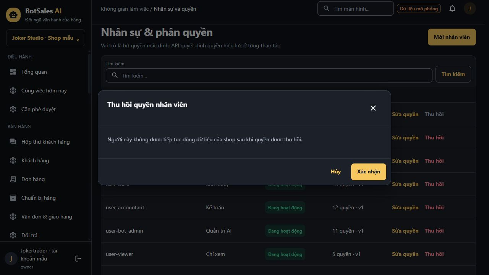

# Rà toàn bộ UI/UX Frontend — 2026-10-09

## Kết luận

**Có phần cần cập nhật. Không thiếu binding của màn nào trong54 route canonical, nhưng chưa thể gọi trải nghiệm hiện tại hoàn thiện toàn diện.** Audit có15 nhóm phát hiện:5 nhóm P1 và10 nhóm P2. Đây là số nhóm vấn đề/cải tiến, không phải15 màn lỗi hay một điểm UX phần trăm.

Nền Graphite Gold, shared compositions, density, form/draft/version guards và cách tách đơn/giao/tiền đã có cơ sở tốt. Khoảng trống chủ yếu nằm ở nghĩa nghiệp vụ, ngữ cảnh hành động, điều hướng, thứ tự nội dung và trợ giúp. Không có căn cứ để đổi theme, giảm toàn bộ spacing một lần nữa hoặc thêm một framework UI mới.

**Hồ sơ:** [Phát hiện và điều kiện nghiệm thu](FINDINGS.md), [ma trận riêng từng54 màn](SCREEN_MATRIX.md), [dữ liệu15 nhóm](findings.json).

## Phạm vi và bằng chứng

- Đối chiếu route manifest, implementation của16 module,18 file chứa các route/helper đã xác định và các shared/app owners liên quan; lưu AST outline từng route.77 source fingerprints của adoption được kiểm lại.
- Mở54 route trên bản demo đang chạy ở `http://127.0.0.1:4173`, đọc DOM/AX, xem54 ảnh **viewport** mặc định1280x720. Nội dung dưới fold được đối chiếu DOM/source; không coi ảnh viewport là toàn bộ page content.
- Tái hiện trực tiếp: CTA góp ý dẫn sai, mất nháp onboarding, mất bộ lọc sản phẩm khi quay lại, menu tìm màn không có kết quả, nhãn DetailLine co, trạng thái tồn kho. Mở3 dialog rủi ro để đọc nội dung; không thực thi thu hồi/ngừng dùng/xóa.
- Kiểm inventory23 `ConfirmDialog` bằng source; không tuyên bố đã mở đủ23.
- Đọc contract hiện hành và DESIGN/UX-CONTRACT. Không thêm endpoint hay suy ra nghiệp vụ từ dữ liệu mẫu.
- S19 spacing evidence cũ được kiểm hash và validator, không có lỗi freshness. Hồ sơ đó ghi140/140 FE checkpoint và full624-case run. **Không chạy lại full verify/E2E/build trong audit này.** Những kết quả cũ không thay thế việc kiểm các phát hiện mới.
- Git HEAD `53c0ba8f413b1f1e0fa16a747ed27f728b861dd6`, runtime identity `1f51252401b94f51c61091fbfbbee8bd50b51ba4e054fa6f28abde0917d16a41` /241 inputs, có thay đổi sẵn trong working tree. Audit chỉ thêm hồ sơ ở thư mục này, không sửa app/contract/plan/tracker.

**Giới hạn:** R14/R36 dùng missing-job vì seed không có job, nên lần này chỉ xác nhận error view và source của nhánh job. Không phải bằng chứng success của import/export. Các conditional states/roles được đọc qua source và hồ sơ cũ có fingerprint đúng; chưa chạy lại mọi tổ hợp. Screen-reader speech, hosted CI, backend/provider, production và nghiệm thu người dùng chưa được xác minh ở đây.

### Kiểm soát sai lệch evidence

Ảnh `live-*.png`/`stable-*.png` dùng full-page có trường hợp làm thay đổi bố cục trong quá trình chụp. Ví dụ R02 co hẹp trong ảnh đầu, nhưng viewport thật và DOM đo main rộng1100px, hiển thị đúng. **Loại các ảnh này khỏi bằng chứng lỗi visual.** Dùng `viewport-*.png` và probe có `screenshotMode=viewport`.

Đã yêu cầu viewport390x844 nhưng DOM/ảnh vẫn1280x720. `mobile-*.png` **không phải bằng chứng mobile**; không tính lần này là kiểm mobile đạt. Override đã reset. Hồ sơ cũ có320/1440 ở hai engines được kiểm freshness; khi sửa cần kiểm lại breakpoint và native zoom trên source mới.

Skill static audit trả exit1 với14 cảnh báo actionless-button. Đã đối chiếu từng vị trí: RouterLink/anchor/file input label hoặc handler cùng dòng đều có semantics hành động. [Adjudication](static-adjudication.json) giải thích giới hạn detector; raw log vẫn FAIL. Điều này không chứng minh đích link đúng: UX01 chính là link có hành động nhưng tới sai tác vụ.

## P1 — cần sửa trước nghiệm thu UX

| Mã | Phát hiện | Vì sao cần ưu tiên | Hướng xử lý |
|---|---|---|---|
| UX01 | Checklist “Duyệt góp ý” đi `/knowledge/feedback`, bị hiểu là knowledgeId và báo không có dữ liệu | Chặn đường vào tác vụ duyệt từ setup | Đích R25 `/knowledge/review`; kiểm CTA theo màn đích, không chỉ match URL |
| UX02 | Tồn dương dưới ngưỡng bị gọi “Bị chặn”; nhập kho `receipt` hiện “Phiếu thu”; kỳ `open` hiện “Đang xử lý” | Người vận hành có thể hiểu sai tồn/kho/tài chính | Nhãn theo domain và cảnh báo tồn đúng ý nghĩa; giữ contract/snapshot |
| UX03 | Thu hồi quyền/ngừng danh mục/xóa AI không nêu đối tượng; nút chung “Xác nhận” | Thiếu thông tin để tránh chọn nhầm ở thao tác rủi ro | Đối tượng + tác động + nhãn động từ cụ thể tại shared/consumer |
| UX04 | Nháp tên cửa hàng mất khi Quay lại, không có cảnh báo | Mất công nhập; route global chưa tham gia guard | Draft guard cho onboarding, clean theo commit thực tế |
| UX05 | Tìm AO-002 → chi tiết → Danh sách làm mất `q` | Đứt luồng thao tác lặp lại trên danh sách lớn | Return context đúng route/shop; fallback cho direct link |

Ảnh chứng minh dialog chưa nêu người bị thu hồi:

UX03 là thiếu sót thiết kế phòng ngừa lỗi; audit không thực thi thao tác để khẳng định máy chủ thu hồi nhầm. UX01/UX04/UX05 đã tái hiện hành vi sai. UX02 đã đối chiếu trực tiếp dữ liệu hiển thị và logic nguồn.

## P2 — thống nhất trải nghiệm và tận dụng không gian

| Mã | Phần cần cập nhật | Ví dụ / phạm vi |
|---|---|---|
| UX06 | Nhãn tiếng Việt theo domain | `completed`, `read`, `supported`, `consumed`, `inspected`, `question`, `in_app` còn hiện ở UI |
| UX07 | Title, breadcrumb, trạng thái tìm màn | Cả54 route cùng title; tìm không khớp làm menu trống; create được ghi như detail |
| UX08 | Thứ tự tác vụ và copy | R38 preview trước approvals; R42 preview trước shipments; tên API/schema và quy tắc lập trình trong trợ giúp |
| UX09 | Identity và định dạng ngày | c1, user-warehouse, address-synthetic, nguồn kỹ thuật; ngày kế toán date-only còn ISO |
| UX10 | Accessible name của bảng |30/38 bảng có tên “Dữ liệu”; R44 và R50 có hai bảng cùng tên |
| UX11 | Phân trang cursor dễ sử dụng | Có đầu/tiếp, chưa có lùi trực tiếp; chỉ thêm lùi qua cursor đã biết, không bịa tổng trang |
| UX12 | Hướng dẫn form và thời điểm báo lỗi | Privacy đỏ ngay khi unconfigured; timezone tự nhập; locale dễ bị hiểu là đổi ngôn ngữ UI; filter mặc định trống |
| UX13 | Phản hồi kết quả lưu | Một số editor có inline success, một số chỉ đóng dialog/invalidate; cần cùng cách thông báo outcome thật |
| UX14 | Empty/error có bước tiếp theo | Phản hồi/đánh giá/đề nghị/sao kê dùng empty chung; missing-job thiếu đường về luồng phù hợp |
| UX15 | Geometry của nhãn/giá trị chi tiết | Caption “Kênh” bị co còn30.484px, cao42px/2 dòng ở Inbox1280px; shared flex-shrink không bảo vệ vùng nhãn |

Title theo tác vụ giúp phân biệt trang và định hướng trong tab; hướng xử lý bám [W3C Page Titled](https://www.w3.org/WAI/WCAG22/Understanding/page-titled.html). Phân loại ưu tiên dùng nguyên tắc ngôn ngữ quen thuộc, ngăn sai thao tác, kiểm soát điều hướng và giảm nội dung không phục vụ nhiệm vụ trong [heuristics của Nielsen Norman Group](https://www.nngroup.com/articles/ten-usability-heuristics/); mức ưu tiên cụ thể dựa bằng chứng của dự án.

### Lựa chọn thiết kế chính

**Giữ hệ thống visual; hoàn thiện lớp trình bày và luồng thao tác ở shared owner.**

1. Nhãn typed theo domain để cùng mã không bị dịch sai nghĩa; consumer không fallback nguyên enum ở UI chính.
2. ConfirmDialog có nhãn hành động và consumer cung cấp đối tượng/tác động; không xây modal engine mới.
3. Route/return context có builder nhỏ và allowlist; không thay router hoặc dùng history lùi mù.
4. DetailLine có vùng caption/value phù hợp; có phương án stack khi thật sự hẹp. Không đặt fix pixel riêng tại từng màn.
5. Tác vụ thực trong scope đứng trước preview. Preview/diagnostics mở theo nhu cầu; mọi giới hạn mô phỏng, quyền và tác động tài chính vẫn phải nhìn thấy khi liên quan quyết định.
6. Chốt copy, label bảng, inline outcome và empty theo consumer có chung tiêu chí; giữ query/error/stale/draft/recovery owners đang có.

Phương án này xử lý các nguyên nhân lan rộng với ít thay đổi kiến trúc. Redesign toàn bộ sẽ tạo thêm rủi ro ở form/draft/version và không giải quyết nhãn sai, link sai hoặc nháp bị mất. Giảm gap/font/target toàn cục cũng không sửa thứ tự nội dung. Giữ target44px của dự án; [WCAG2.2 target-size minimum](https://www.w3.org/WAI/WCAG22/Understanding/target-size-minimum.html) là24px có ngoại lệ, không dùng nó để hạ chuẩn44px hiện hành.

## Các phần chưa có chức năng thật cần quyết định contract

| Màn | Có hiện tại | Cần gì trước khi biến thành chức năng thật |
|---|---|---|
| Inbox R06 | Composer contract chỉ gửi text; có preview media/flow/combo | Contract media/channel capability, upload/send và policy; promotion/combo API nếu cần |
| Đơn/kho R18,R19,R15 | ID kho và lựa chọn địa chỉ tổng hợp | Danh mục kho/địa chỉ thật, read/write permissions, lookup và validation; không thay bằng ô nhập tùy ý |
| Approvals R38 | Xem thử ủy quyền cục bộ | API/policy delegation, thời hạn/phạm vi/thu hồi/audit; UI hiện không cấp quyền hiệu lực |
| Privacy R35 | Policy draft/request; opt-out preview | DTO consent và thao tác opt-out có semantics rõ; step-up thực cho yêu cầu nhạy cảm |
| Journals R48 | Journal workflow và account preview | Danh mục tài khoản canonical; không coi dữ liệu tổng hợp là sơ đồ kế toán thật |
| Marketing R53 | Summary đọc và chart/table từ payload | API nhận period/bucket/attribution nếu cần lọc xu hướng; không lọc giả hoặc cộng dữ liệu trang |
| Login/kết nối/thiết bị/health | Mock rõ ranh giới | Backend/provider/OIDC/push thật và bằng chứng tích hợp; không thuộc kết luận đạt local UX |

Đây không phải lỗi “thiếu route” để sửa bằng thêm trang. Các chi tiết đơn mua, nhận hàng, tài chính, chuẩn bị hàng đã dùng dialog trong route sở hữu. Chỉ thêm màn riêng khi tác vụ, quyền, lượng nội dung và deep link thực sự yêu cầu.

## Rà theo hành trình

| Hành trình | Điểm đạt cần giữ | Khoảng trống lần này |
|---|---|---|
| Đăng nhập→chọn shop→setup | Phân biệt shop/scope, không thu password giả | Draft onboarding, ngữ cảnh locale, link feedback |
| Tìm sản phẩm→xem/sửa→về danh sách | Search URL, editor snapshot/version và ảnh | Return context, confirm ngừng bán, title/identity |
| Hội thoại→tiếp quản→soạn→tạo đơn | Composer/draft/lifecycle và quyền kênh đã có owner | Nhãn trạng thái tin, DetailLine, technical preview, media contract |
| Đơn→kho→vận đơn→đổi trả | Đơn/giao/tiền tách trạng thái; không cộng cách ly | Tồn warning sai, identity, preview ưu tiên quá cao, thuật ngữ kiểm nhận |
| Nhà cung cấp→đề nghị→mua→nhận | Approval/version/unknown và hàng đạt/hỏng riêng | Named tables, empty đề nghị, confirm và feedback |
| Thu chi→journal→đối soát→khóa kỳ | Tổng API, cân bằng và điều kiện kỳ | receipt collision, kỳ open, date-only, identity và empty theo tab |
| AI→knowledge→review→publish→health | Draft/active/revision, chất lượng mock không được coi là thật | Link checklist, capability/tool labels, diagnostics/task hierarchy |

## Thứ tự đề xuất triển khai sau audit

1. **P1:** UX01; UX02; UX04/UX05; UX03 cùng toàn bộ consumer ảnh hưởng. Mỗi nhóm kiểm hành vi liên quan trước khi chuyển nhóm.
2. **P2 shared:** UX06/UX07/UX10/UX15; rà đầy đủ consumers và các enum canonical.
3. **P2 workflow:** UX08/UX09/UX12/UX13/UX14; sau đó UX11 nếu bounded cursor/history đáp ứng semantics.
4. **Kiểm cuối trên source mới:** regression cho đích CTA/return context/draft/semantic labels; keyboard/axe/reflow/native zoom; gates bắt buộc theo owner và evidence không stale. Không hạ assertion để đóng việc.
5. **P3 tùy chọn:** icon điều hướng đúng tác vụ, ưu tiên cột ở bảng rộng, preset khoảng ngày, chia nhóm form dài. Chọn theo đo tác vụ người dùng; chưa có căn cứ để yêu cầu virtualization, chart hoặc bulk API mới.

Đây là đề xuất trong hồ sơ audit. Nếu triển khai, cập nhật `docs/FRONTEND_UI_IMPROVEMENT_PLAN.md` hiện hành, không tạo tracker cạnh tranh và không sửa mẫu số140 tùy ý.

## Bàn giao và trạng thái

Hồ sơ ghi nhận các phát hiện ở source đang có. **Chưa sửa15 nhóm này trong lần audit.** Không tự điền UAT/speech/production PASS. Các hồ sơ source và screenshot có hash trong `MANIFEST.json`; source baseline được kiểm lại ở `freshness-final.json`.

Lệnh tái lập phần kiểm source trong Frontend workspace: `node evidence/frontend-ux-review-20261009/source-review.mjs`, sau đó `summarize-review.mjs`, `adjudicate-static.mjs` và `review-catalog.mjs` trong cùng thư mục. Chụp/live interaction cần trình duyệt và snapshot hiện hành; các script tổng hợp không tự tạo bằng chứng browser mới.
